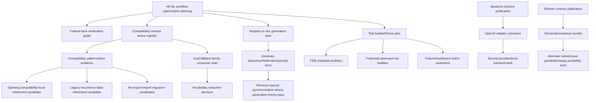

# AR-BK - Coordination Cost Classification and Reduction Opportunity Analysis

## 1. Executive Summary

AR-BJ found a healthy architecture with real coordination cost. AR-BK classifies that cost and ranks future implementation-efficiency work without reopening Campaigns 1-4 ownership doctrine.

Overall coordination profile:

- The highest recurring cost is not "too many owners." It is field and evidence propagation across correct owners: runtime metadata, runtime diagnostic projection, protected replay extraction, tests, manifests, classifier/dashboard evidence, and governance reports.
- Permanent architectural coordination remains necessary around Final Emission, replay/provenance separation, state authority, direct-owner tests, and governance.
- The most valuable implementation opportunities are tool/workflow improvements around protected replay fields, FEM metadata fixtures/builders, split-owner matrix/report automation, compatibility-residue registers, and executable ruleset/backend/version contracts.
- No architectural concern emerged. The architecture still appears stable; remaining cost is primarily implementation, compatibility, documentation, and test-maintenance friction.

Dominant cost categories:

- **Permanent architectural investment:** Final Emission ordering, runtime/protected replay separation, state/API transaction authority, direct-owner test placement.
- **Implementation friction:** missing backend/ruleset/version contracts, manual FEM/protected field threading, large fixtures, doc tables copied from executable registries.
- **Compatibility residue:** opening compatibility-local vocabulary, dual fallback-family projection, legacy recurrence vocabulary, compatibility re-exports.
- **Governance cost:** split-owner matrix, protected replay manifest, test inventory JSON, boundary taxonomy checks.

Highest-value opportunities:

1. Publish executable backend and ruleset/version/provenance contracts before expansion work.
2. Add owner-preserving builders and shared assertions for FEM metadata, protected observed rows, and failure/dashboard evidence.
3. Generate more docs/checks from executable registries, especially final-emission taxonomy, protected field tables, split-owner matrix counts, and prompt projection keys.
4. Create an active compatibility-residue register with caller evidence and retirement criteria.
5. Clarify minimal verification lanes by feature category.

Representative evidence:

- AR-BJ measured recent high-cost traces: CK touched 19 files, CL 30, CN 17, CR 32, and CO 105. The 105-file CO trace is evidence/reporting-heavy, not ordinary feature fan-out.
- `tests/helpers/golden_replay_projection_fields.py` defines the protected observation registry; repository docs identify 41 protected paths.
- `tests/helpers/failure_classification_split_owner.py` defines `SPLIT_OWNER_ACCEPTANCE_MATRIX` plus expected count constants and a report path.
- `AR-BG` and `AR-BH` explicitly identify missing backend, ruleset, version, and provenance contracts as local contract gaps.
- The largest sampled production files and tests are concentrated in expected high-pressure owners (`game/api.py`, `game/gm.py`, `game/prompt_context.py`, `game/final_emission_meta.py`; `tests/test_prompt_context.py`, `tests/test_replay_bug_class_recurrence.py`, `tests/test_final_emission_meta.py`, `tests/test_failure_classifier.py`).

## 2. Coordination Cost Ranking

| Rank | Coordination Cost | Frequency | Impact | Classification | Architectural Portion | Implementation Portion |
|---:|---|---|---|---|---|---|
| 1 | Protected replay field propagation (`CC-04`) | Medium; any protected observation/schema change | Very High; replay acceptance, extraction, manifest, classifier overlap | TEST_MAINTENANCE_FRICTION / GOVERNANCE_OVERHEAD | High: protects replay integrity and runtime/protected separation | High: manual registry/default/extractor/doc synchronization |
| 2 | Final Emission metadata/projection field propagation (`CC-13`, `CC-02`) | High for output/fallback/provenance work | Very High; affects runtime payload, legality, replay, tests | INTENTIONAL_ARCHITECTURAL_COORDINATION / IMPLEMENTATION_FRICTION | High: preserves last-mile legality, provenance, packaging | Medium-high: repeated FEM-shaped fixtures and field wiring |
| 3 | Backend/provider contract absence (`CC-09`, `CC-12`) | Low now; very high before second provider/local inference | Very High for expansion | IMPLEMENTATION_FRICTION / COMPATIBILITY_RESIDUE | Medium: routing/realization boundaries must stay separate | Very High: provider identity and adapter contract absent |
| 4 | Ruleset/version/provenance contract absence (`CC-10`) | Low now; very high before alternate rulesets/save portability | Very High for expansion | IMPLEMENTATION_FRICTION | Medium-high: ruleset identity must not invade CTIR/prompt/replay | Very High: executable contract missing |
| 5 | Split-owner matrix/report/dashboard coordination (`CC-08`) | Medium; attribution/failure-classification changes | High | GOVERNANCE_OVERHEAD | Medium: preserves evidence and owner attribution | High: expected counts/report/dashboard checks are manually coordinated |
| 6 | Compatibility residue register gaps (`CC-06`, `CC-07`, `CC-17`, `CC-19`) | Medium; touched by fallback/replay/gm/prompt changes | High | COMPATIBILITY_RESIDUE | Medium: compatibility protects consumers and historical evidence | High: retirement evidence is scattered across docs/tests |
| 7 | Large direct-owner fixtures and tests (`CC-14`) | High; many feature changes hit large owner tests | High | TEST_MAINTENANCE_FRICTION | Medium: direct-owner tests are correct | High: fixture repetition and hand-built payloads increase cost |
| 8 | Governance docs/inventory synchronization (`CC-15`, `CC-18`) | Medium-high; every test/owner/governance lane change | Medium-high | DOCUMENTATION_SYNCHRONIZATION / GOVERNANCE_OVERHEAD | Medium-high: governance strength is intentional | Medium: generated indexes and clearer refresh workflow could reduce manual steps |
| 9 | Final-emission mutation taxonomy doc/test sync (`CC-03`) | Low-medium; only boundary mutation changes | High | GOVERNANCE_OVERHEAD | High: prevents semantic repair drift | Medium: docs repeat executable taxonomy |
| 10 | API transaction pressure (`CC-11`) | Medium; runtime turn-flow changes | High | INTENTIONAL_ARCHITECTURAL_COORDINATION | Very High: transaction authority must stay coherent | Medium: workflow/delegate clarity can reduce cognitive load |
| 11 | Runtime diagnostic vs protected replay projection distinction (`CC-05`) | Medium; replay/provenance changes | High | INTENTIONAL_ARCHITECTURAL_COORDINATION | Very High: separation is doctrine | Low-medium: diagrams/checklists can reduce memory load |
| 12 | Public prompt projection docs/registry sync (`CC-20`) | Low-medium | Medium | DOCUMENTATION_SYNCHRONIZATION | Medium: prompt adapter contract is real | Medium: docs repeat executable key registry |
| 13 | Validation layer docs/registry/audit triad (`CC-16`) | Low-medium | Medium | GOVERNANCE_OVERHEAD | High: phase boundaries protect ownership | Low: already reasonably published |
| 14 | Generic owner + direct-owner + downstream workflow (`CC-01`) | High | Medium | INTENTIONAL_ARCHITECTURAL_COORDINATION | Very High: core architecture | Low: mostly developer guidance, not simplification |

Ranking rationale:

- Highest rank goes to high-impact costs with repeated manual synchronization and safe implementation-relief paths.
- Backend/ruleset contracts rank high despite low current frequency because they are prerequisites for major future work. AR-BG states the repo is not ready for alternate rulesets or additional AI providers by simple configuration alone.
- Permanent architecture costs rank lower for reduction even when frequent because the correct action is guidance, not removal.

## 3. Opportunity Matrix

| Opportunity | Targets | Cost Category | Expected Benefit | Architectural Risk | Replay Risk | Governance Risk | ROI |
|---|---|---|---|---|---|---|---|
| Publish backend adapter contract before provider expansion | `game/gm.py`, `game/model_routing.py`, future backend module | contract publication / adapter improvement | Prevents provider branching from spreading into GM, prompt, Final Emission, replay | Low if contract-only first | Low-medium if provenance fields added later | Low | Very High |
| Publish ruleset/version/provenance contract before alternate rulesets | Future ruleset/version/provenance modules, CTIR/persistence/replay consumers | contract publication | Prevents scattered ruleset conditionals and ambiguous replay/save provenance | Low if identity-only first | Medium when replay fields added | Low | Very High |
| Add active compatibility-residue register | Opening fallback, dual fallback families, CTIR-absent paths, re-exports, recurrence legacy labels | workflow improvement / developer guidance | Centralizes retirement evidence and prevents repeated archaeology | None | Low | Low | High |
| Add FEM metadata/protected row builders | `tests/test_final_emission_meta.py`, protected replay helpers, failure/dashboard fixtures | builder/fixture improvement | Reduces fixture churn in large tests | Low | Low if builders are test-only | Low | High |
| Generate protected field documentation/checklist from registry | `PROTECTED_OBSERVATION_FIELDS`, manifest/docs | documentation generation / reporting automation | Reduces field-table/doc drift; preserves authority | None | Low | Low | High |
| Generate split-owner expected counts from matrix rows | `tests/helpers/failure_classification_split_owner.py`, tests/report | governance automation / reporting automation | Removes manual count updates while preserving checks | None | Low | Low-medium | High |
| Generate final-emission taxonomy appendix from contract | `game/final_emission_boundary_contract.py`, gate docs | documentation generation | Reduces doc/test taxonomy drift | None | Low | Low | Medium-high |
| Clarify minimal verification lanes by feature type | `tests/README_TESTS.md`, `docs/convergence_ci_inventory.md` | workflow improvement | Reduces cognitive load selecting tests/audits | None | Low | Low | Medium-high |
| Add projection-field change checklist | FEM metadata, runtime projection, protected replay projection, classifier/dashboard | developer guidance / workflow improvement | Reduces missed adapters without collapsing owners | None | Low | Low | Medium |
| Generate prompt projection key docs from `contract_registry` | `game/contract_registry.py`, `docs/planner_convergence.md` | documentation generation | Reduces manual key-list sync | None | Low | Low | Medium |
| Improve test inventory refresh workflow | `tools/test_audit.py`, inventory docs | governance automation | Reduces friction adding/moving tests | None | Low | Low-medium | Medium |
| Compatibility retirement for opening compatibility-local vocabulary | Boundary taxonomy, opening tests/docs | compatibility retirement | Reduces stale vocabulary and negative-test burden | Medium unless consumer proof is complete | Medium | Medium | Medium |
| Compatibility retirement for legacy/unified recurrence labels | Recurrence/dashboard helpers/docs | compatibility retirement | Reduces confusion around health metrics | Low-medium | Medium | Medium | Medium |
| API transaction helper/delegate docs | `game/api.py` workflow guidance | developer guidance / helper API | Lowers cognitive load without splitting transaction ownership | Low | Low | Low | Medium |
| Code generation for runtime/protected fields | FEM/protected schemas | code generation | Could reduce manual field threading | Medium-high unless source and verification are explicit | High | Medium | Uncertain |
| Collapse runtime diagnostic and protected replay projection | `game.final_emission_replay_projection`, `tests.helpers.golden_replay_projection*` | no action recommended | Would reduce files superficially | High | High | High | Rejected |

## 4. Architectural vs Implementation Breakdown

The remaining cost is mostly implementation cost sitting on top of correct architecture.

Architectural portion:

- Final Emission must remain a last-mile legality, sealing, selection, packaging, and traceability owner. Its layer order and boundary taxonomy are real safety constraints.
- Runtime lineage and protected replay observation must remain separate because replay is an acceptance/governance surface, not live runtime behavior.
- Provenance and fallback ownership are multi-axis by design. A single owner field would hide content author, selector, applicator, provenance packager, runtime diagnostic owner, and protected replay owner.
- Direct-owner tests and downstream tests must remain distinct so semantic assertions do not migrate into smoke, transcript, or compatibility suites.
- Governance must continue to block drift in ownership, replay boundaries, validation layers, and split-owner evidence.

Implementation portion:

- Backend/provider identity and ruleset/version/provenance identity are still documented rather than executable. That is friction, not architectural uncertainty.
- Protected replay field changes are safe but manually expensive because field path, drift bucket, default, extraction, manifest, classifier overlap, and tests must stay synchronized.
- FEM metadata changes are safe but manually expensive because defaults, merge helpers, runtime projection, protected extraction, and fixtures are hand-threaded.
- Compatibility retirement criteria are scattered across AR docs, audit docs, tests, and module comments.
- Several docs repeat executable truth that could be generated or checked from canonical registries.
- Large owner tests contain many hand-built payloads and can attract nearby assertions even when the semantic owner is elsewhere.

Conclusion: architecture should remain stable. Implementation-health work should focus on publication, builders, generated docs, verification workflow, and compatibility-retirement evidence.

## 5. Compatibility Opportunity Assessment

| Compatibility Residue | Expected Lifetime | Retirement Evidence | Expected Implementation Savings | Architectural Impact |
|---|---|---|---|---|
| Opening fallback compatibility-local authorship/taxonomy | Transitional | Fresh caller/search evidence proving no production assignment; replay/dashboard/classifier consumers inventoried; negative golden tests updated safely | Medium: fewer stale tokens, fewer negative fixtures/docs | Medium risk if retired without replay and consumer proof |
| Dual diegetic/governed fallback-family projection | Transitional/uncertain | Consumer map showing whether `fallback_family_used` and `realization_fallback_family` can remain distinct while projected differently; replay proof | Medium: less cognitive load; possible fewer projection branches | Medium-high if collapsed prematurely; do not merge now |
| Broad `legacy_diegetic_fallback` | Transitional | Concrete producer inventory and stamps narrowed by true owner; tests prove no lost lineage | Medium | Medium; provenance meaning can be damaged |
| `legacy_unclassified` sink | Indefinite defensive unless all inputs are closed | Evidence unknown family values cannot reach normal paths | Low | Low-medium; safe sink may be worth keeping |
| CTIR-absent prompt fallbacks | Transitional | Proof all normal resolved-turn paths attach CTIR before prompt context; absence tests remain for defensive behavior | Medium | Medium; prompt must not become CTIR co-owner |
| Response policy older-payload accessors | Uncertain | Consumer inventory for old shapes and migration path | Low-medium | Low-medium |
| `game.gm` compatibility re-exports | Transitional | Zero importers for re-exported names or deliberate migration PRs; governance guard update | Medium | Low if import-only; medium if shared helpers move |
| Compat barrels in final-emission text/social exchange | Transitional | Import inventory and focused guard updates | Low-medium | Low |
| Tuple/dataclass fallback round-trip adapters | Transitional/test-only | Test rewrites to dataclass-native; production zero-use proof | Low-medium | Low |
| Legacy/unified recurrence rates | Transitional | Dashboard/doc consumer inventory and explicit protected/session/synthetic replacement fields | Medium | Medium; health interpretation must stay accurate |
| Generated artifact snapshots | Historical/permanent | N/A; should remain evidence | Negligible | None; do not delete for simplification |

Compatibility recommendation:

- Do not retire compatibility in AR-BL by default. First create an active compatibility-residue register and gather caller/runtime evidence.
- Prioritize opening compatibility-local and legacy/unified recurrence labels for evidence gathering because they create the most conceptual confusion.
- Treat dual fallback-family projection as high-risk: reduce documentation confusion before considering any schema change.

## 6. Governance Opportunity Assessment

Governance should be made cheaper, not weaker.

Automation opportunities:

- Generate split-owner expected count constants or check them from `SPLIT_OWNER_ACCEPTANCE_MATRIX` rather than maintaining duplicate expected totals manually. Current evidence: `tests/helpers/failure_classification_split_owner.py` has expected row/count constants, and contract tests assert those counts.
- Generate or check the final-emission taxonomy appendix from `game/final_emission_boundary_contract.py`. Current evidence: docs repeat `PACKAGING_ALLOWED`, `LEGALITY_ALLOWED`, and `SEMANTIC_DISALLOWED`, while tests already enforce taxonomy membership and fail-closed behavior.
- Strengthen protected replay manifest generation/check workflow around `PROTECTED_OBSERVATION_FIELDS`. Current evidence: manifest generation already exists; opportunity is clearer developer workflow and generated checklists.
- Improve `tools/test_audit.py` workflow documentation for adding/moving tests so committed inventory JSON freshness is less surprising.
- Add a governance-lane selection guide keyed by feature category: boundary taxonomy, protected replay field, split-owner matrix, backend contract, ruleset contract, ordinary domain feature.

Preserve:

- Direct-owner suite placement.
- Gate and replay boundary governance.
- Protected replay manifest authority.
- Strict validation/final-emission/coverage audits where already hard-fail.
- Advisory status for noisy realization/provenance audits unless signal quality improves.

Rejected governance reductions:

- Removing test inventory governance because it is inconvenient.
- Treating generated artifacts as non-authoritative without explicit canonicality labels.
- Combining replay governance and runtime diagnostic projection checks.
- Moving governance decisions into runtime code.

## 7. Testing Opportunity Assessment

Highest-value testing improvements:

- **FEM metadata builders:** Reduce repeated hand-built `_final_emission_meta` payloads in `tests/test_final_emission_meta.py`, Final Emission projection tests, and classifier/dashboard fixtures. Keep builders test-only and owner-neutral.
- **Protected observed-row builders:** Generate field-complete defaults from the protected field registry, then allow tests to override only the fields under test. This preserves `PROTECTED_OBSERVATION_FIELDS` authority while lowering fixture cost.
- **Failure/dashboard matrix assertions:** Where possible, derive dashboard expectations from split-owner matrix rows instead of duplicating row counts or literal coverage lists.
- **Layer-order assertion helpers:** Keep final-emission orchestration tests in the owner suite, but reduce monkeypatch boilerplate with small reusable helpers.
- **Backend fake adapter tests:** Once backend contract publication begins, replace ad hoc fake OpenAI recorders with a deterministic fake backend. Do not do this before the contract exists.
- **Compatibility fixture labels:** Make compatibility fixtures explicitly named as compatibility or legacy so new tests do not copy them as normal-case builders.

Test improvements to avoid:

- Moving direct-owner assertions into downstream smoke tests.
- Collapsing large owner tests merely because they are large.
- Snapshotting broad payloads when stable behavioral or boundary fields are enough.
- Expanding protected replay fields for every diagnostic field. Diagnostics can remain optional/unprotected unless promoted.

## 8. Documentation Opportunity Assessment

Suitable for documentation generation or generated checks:

- Final-emission mutation taxonomy from `game/final_emission_boundary_contract.py`.
- Protected replay field path/drift-bucket table from `PROTECTED_OBSERVATION_FIELDS`.
- Split-owner matrix report and counts from `SPLIT_OWNER_ACCEPTANCE_MATRIX`.
- Prompt projection key list from `game/contract_registry.py::PUBLIC_NARRATIVE_PLAN_PROMPT_TOP_KEYS`.
- Realization fallback family table from `game/realization_authority.py::FALLBACK_FAMILIES`.
- Governance command quick-reference if sourced from a single CI/workflow inventory.

Should remain handcrafted:

- `docs/architecture_ownership_ledger.md` rationale and owner doctrine.
- `tests/README_TESTS.md` contributor guidance and interpretation rules.
- `docs/convergence_ci_inventory.md` narrative classification of hard-fail/informational/deferred checks, unless only command snippets are generated.
- `docs/gate_cleanup_inventory.md` judgment-heavy residue/risk analysis.
- AR campaign reports and closeouts.

Should never become generated:

- Historical campaign decision records.
- Architectural doctrine explanations.
- Human risk assessments and retirement rationales.
- External-review file lists and next-cycle recommendations.

Documentation recommendation:

- Generate appendices and tables from executable registries.
- Keep prose doctrine human-authored.
- Add "generated from" and "authority level" labels to reduce canonical/advisory confusion.

## 9. Dependency Graph

Dependency rules:

- Backend contract publication must precede backend expansion.
- Ruleset contract publication must precede alternate rulesets.
- Version/provenance bundle must precede replay portability, public explanations, or multi-provider/multi-ruleset evidence.
- Compatibility evidence must precede compatibility retirement.
- Registry publication must precede code generation.
- Generated documentation must prove parity before manual documentation is removed.
- Fixture builders must preserve owner semantics before test simplification.

## 10. Prioritized Implementation Roadmap

### Immediate

- Plan AR-BL around implementation workflow optimization rather than code changes.
- Create a feature-lane verification guide: protected replay field change, FEM metadata change, split-owner matrix change, backend contract work, ruleset contract work, ordinary domain feature.
- Create active compatibility-residue register with owner, active callers/tests, retirement evidence, and risk.
- Design FEM/protected-row/failure-dashboard builder improvements without implementation yet.
- Identify which docs can safely receive generated appendices.

### Near-Term

- Publish executable backend contract skeleton before any provider expansion.
- Publish executable ruleset/version/provenance contract skeleton before alternate ruleset work.
- Add generated/checkable documentation for final-emission taxonomy, protected field table, split-owner matrix counts, prompt projection keys.
- Add owner-preserving test builders for FEM metadata and protected observed rows.
- Improve split-owner matrix automation so expected counts are not manually duplicated.

### Long-Term

- Extract OpenAI invocation behind backend adapter after backend contract exists.
- Add deterministic fake backend tests.
- Add active ruleset identity into runtime/session/provenance/replay surfaces after ruleset contract exists.
- Add version/provenance bundle fields only after ownership and consumer contracts are clear.
- Use compatibility-residue evidence to schedule small retirement cycles.

### Future Compatibility Retirement

- Opening compatibility-local vocabulary/taxonomy after consumer proof.
- Tuple/dataclass test-only adapters after dataclass-native tests.
- `game.gm` compatibility re-exports after import migration.
- Legacy/unified recurrence labels after dashboard/report consumer inventory.
- CTIR-absent prompt fallbacks only after normal CTIR attachment is proven and defensive absence behavior is preserved.
- Any dual fallback-family projection change only after a consumer map proves no provenance loss.

## 11. Items Explicitly Rejected

| Idea | Why It Appears Attractive | Why Rejected |
|---|---|---|
| Collapse runtime diagnostic projection and protected replay projection | Reduces files and duplicate-looking fields | Violates runtime/replay separation; replay must not become live runtime authority |
| Move Final Emission metadata authority into replay helpers | Reduces projection wiring | Moves runtime metadata ownership into test/protected acceptance layer |
| Collapse Final Emission gate, validators, repairs, and sanitizers | Reduces layer count | Destroys validator/repair/sanitizer distinctions and last-mile legality structure |
| Split `game.api` transaction authority merely because it is large | Reduces file pressure superficially | Risks hiding transaction ordering and weakening runtime spine |
| Remove governance checks to speed feature work | Reduces immediate friction | Weakens recovered doctrine and drift protections |
| Collapse dual fallback-family vocabularies by name similarity | Reduces vocabulary count | Loses distinction between diegetic/template family and governed realization provenance |
| Treat historical AR/audit docs as stale duplication to delete | Reduces docs volume | Loses decision evidence and campaign traceability |
| Generate code for replay/runtime fields before a canonical source and verifier exist | Appears to reduce manual wiring | Could encode wrong ownership and hide adapter decisions |
| Add second provider inside `game.gm.call_gpt` conditionals | Quick path to provider support | AR-BG says provider branching would leak into fallback, route metadata, replay/provenance, and tests |
| Add alternate rulesets by scattering conditionals through mechanics/prompt/CTIR | Quick path to ruleset support | AR-BG/AR-BH require active ruleset identity and contract first |
| Promote every diagnostic field into protected replay | Gives more coverage | Increases replay coupling and protected schema churn without policy need |

## 12. Campaign Assessment

Is Campaign 5 progressing as expected?

Yes. AR-BJ produced the inventory; AR-BK now converts it into ranked implementation-efficiency opportunities. This matches the transition from architecture recovery to implementation workflow improvement.

Have any architectural concerns emerged?

No. The evidence continues to support Campaign 4's conclusion that architecture is stable. Coordination is expected and mostly preserves correct ownership, replay, provenance, and governance.

Are remaining costs primarily implementation concerns?

Yes. The reducible costs are largely contract publication, fixture design, generated documentation, compatibility evidence, and workflow clarity. Permanent architectural coordination remains and should be preserved.

Is roadmap reordering warranted?

Limited reordering is warranted:

- Before second provider work: publish backend contract and adapter boundary.
- Before alternate ruleset work: publish ruleset/version/provenance contracts.
- Before broad field/projection work: improve protected/FEM field workflow and builders.
- Before compatibility cleanup: create residue register and gather caller/runtime evidence.

No reordering is warranted to pursue superficial architecture simplification.

## 13. Recommended Next Cycle

Recommended next cycle: **AR-BL - Implementation Workflow Optimization Planning**.

AR-BL should produce an actionable, owner-preserving plan for:

- feature-lane verification workflows;
- compatibility-residue register format;
- generated documentation candidates and parity checks;
- FEM/protected replay/failure-dashboard builder plan;
- backend/ruleset contract publication sequence;
- governance automation that preserves current protections.

AR-BL should not implement improvements yet unless explicitly instructed. It should prepare scoped implementation blocks with prerequisites, risk controls, and verification commands.

## 14. Files Required for External Review

Required:

- `AR-BK_coordination_cost_classification_and_reduction_opportunities.md`
- `AR-BJ_coordination_cost_inventory_and_workflow_discovery.md`
- `AR-BI_boundary_reconciliation_campaign_closeout.md`
- `AR-BG_ruleset_backend_and_version_provenance_boundary_inventory.md`
- `AR-BH_minimal_extensibility_contract_definition.md`
- `AR-AD_target_architecture_doctrine.md`
- `docs/architecture_ownership_ledger.md`
- `tests/README_TESTS.md`
- `docs/convergence_ci_inventory.md`
- `game/final_emission_boundary_contract.py`
- `game/realization_authority.py`
- `game/realization_provenance.py`
- `game/contract_registry.py`
- `game/model_routing.py`
- `tests/helpers/golden_replay_projection_fields.py`
- `tests/helpers/golden_replay_projection.py`
- `tests/helpers/failure_classification_split_owner.py`
- `tests/test_final_emission_boundary_contract.py`
- `tests/test_split_owner_acceptance_matrix_contract.py`
- `tests/test_contract_registry_static_drift.py`

Optional:

- `game/api.py`
- `game/gm.py`
- `game/final_emission_gate.py`
- `game/final_emission_meta.py`
- `game/final_emission_replay_projection.py`
- `game/persistence_contract.py`
- `tests/test_final_emission_meta.py`
- `tests/test_final_emission_gate_orchestration_order.py`
- `tests/test_replay_bug_class_recurrence.py`
- `tests/test_failure_classifier.py`
- `docs/testing/protected_replay_manifest.md`
- `docs/gate_convergence_closeout.md`
- `docs/gate_cleanup_inventory.md`
- `docs/planner_convergence.md`
- `docs/maintenance/CR_protected_replay_recurrence_separation_discovery.md`
- Representative history evidence: CK, CL, CN, CO, and CR closeout/discovery documents if AR-BL needs deeper quantification.
