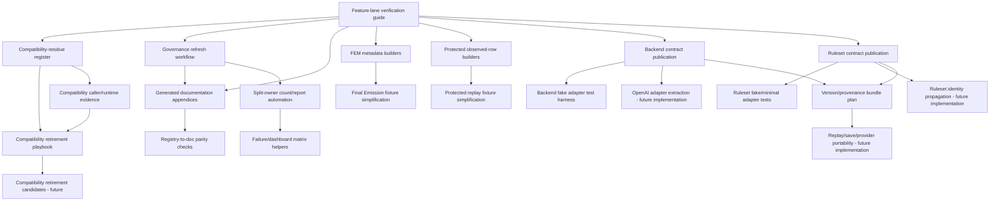

# AR-BM - Infrastructure Initiative Prioritization and Sequencing

## 1. Executive Summary

AR-BM converts the AR-BL implementation strategy into a practical execution roadmap. Campaign 5 is no longer evaluating architecture; it is preparing implementation infrastructure that preserves the recovered doctrine while reducing future coordination cost.

Recommended implementation sequence:

1. **Phase 1 - Workflow foundation:** feature-lane verification guide and compatibility-residue register.
2. **Phase 2 - Low-risk coordination reducers:** governance refresh workflow, generated documentation appendices, split-owner count/report automation, and test-builder designs.
3. **Phase 3 - Test and evidence infrastructure:** FEM metadata builders, protected observed-row builders, and failure/dashboard matrix helpers.
4. **Phase 4 - Expansion prerequisite contracts:** backend contract publication and ruleset contract publication.
5. **Phase 5 - Version/provenance and test harnesses:** version/provenance bundle plan, backend fake adapter test harness, and ruleset fake/minimal adapter tests.
6. **Phase 6 - Compatibility retirement readiness:** compatibility retirement playbook and later retirement candidates, only after evidence exists.

First initiative to build after Campaign 5 planning concludes:

**Feature-lane verification guide.** It has no production-code dependency, low architectural risk, immediate developer benefit, and creates the verification vocabulary needed by later initiatives.

Second initiative:

**Compatibility-residue register.** It should follow immediately because compatibility retirement, fallback vocabulary cleanup, recurrence label cleanup, and re-export migrations all depend on active evidence.

Do not start with backend/ruleset contracts, generated documentation, builders, or compatibility retirement until the workflow foundation is in place. These initiatives are high value, but they depend on shared sequencing, verification lanes, and active compatibility evidence.

No implementation, refactoring, contract publication, governance automation, or compatibility retirement was performed in this cycle.

## 2. Initiative Inventory

| Initiative | Purpose | Dependencies | Priority | Estimated Benefit |
|---|---|---|---|---|
| Feature-lane verification guide | Define minimal verification/documentation paths by change type | AR-BJ, AR-BK, AR-BL | Critical | Very High: reduces test/audit selection uncertainty immediately |
| Compatibility-residue register | Track active compatibility surfaces, callers, tests, evidence, and retirement criteria | Feature-lane guide for format alignment; fresh evidence during implementation | Critical | High: prevents repeated archaeology and unsafe retirement |
| Governance refresh workflow | Clarify when/how to refresh inventory JSON, manifests, matrix reports, and CI docs | Feature-lane guide | High | Medium-high: lowers governance friction without weakening checks |
| Generated documentation appendices | Generate tables from executable registries | Feature-lane guide; stable registry sources; governance refresh workflow | High | Medium-high: reduces manual doc synchronization |
| Split-owner count/report automation | Reduce manual expected-count/report coordination | Feature-lane guide; governance refresh workflow; split-owner matrix source | High | High: removes a known governance friction point |
| FEM metadata builders | Reduce repeated hand-built FEM fixtures | Feature-lane guide; builder design; owner-suite review | High | High: reduces churn in large Final Emission tests |
| Protected observed-row builders | Reduce protected replay fixture churn | Feature-lane guide; protected field registry; replay owner review | High | High: reduces replay field-update burden |
| Failure/dashboard matrix helpers | Reduce dashboard/classifier expectation duplication | Split-owner automation; matrix source; builder conventions | Medium | Medium-high: improves evidence/reporting updates |
| Backend contract publication | Publish provider-neutral backend identity/capability/request/response/error boundary | Feature-lane guide; AR-BG/AR-BH; no second-provider implementation | High | Very High for future backend expansion |
| Ruleset contract publication | Publish ruleset id/version/capability/state/CTIR compatibility boundary | Feature-lane guide; AR-BG/AR-BH; no alternate-ruleset implementation | High | Very High for future ruleset expansion |
| Version/provenance bundle plan | Define how runtime/ruleset/backend/model/prompt/CTIR/persistence/FE/replay identities travel | Backend and ruleset contract shapes | Medium | High: enables replay/save/provider portability later |
| Backend fake adapter test harness | Replace ad hoc provider fakes once backend contract exists | Backend contract publication | Medium | Medium-high: safer backend implementation |
| Ruleset fake/minimal adapter tests | Validate ruleset contract without broad feature expansion | Ruleset contract publication | Medium | Medium-high: safer alternate-ruleset work |
| Compatibility retirement playbook | Standardize retirement block evidence and closeouts | Compatibility register; feature-lane guide | Medium | Medium: enables later cleanup without replay/provenance risk |

Priority definitions:

- **Critical:** should be first implementation package after AR-BM because it unblocks multiple later initiatives and has low risk.
- **High:** should be scheduled in early implementation phases once prerequisites exist.
- **Medium:** valuable, but dependent on earlier infrastructure or future product direction.
- **Low:** no AR-BL initiative currently belongs here; future compatibility candidates may be low after evidence review.

## 3. Dependency Graph

Key sequencing rules:

- Feature-lane verification guide precedes all implementation infrastructure because later packages need standard verification vocabulary.
- Compatibility-residue register precedes compatibility retirement playbook and any retirement candidate.
- Governance refresh workflow precedes generated docs and split-owner automation so generated artifacts remain governed.
- Split-owner automation precedes failure/dashboard matrix helpers.
- Backend contract publication precedes backend fake adapter harness and any provider extraction.
- Ruleset contract publication precedes fake/minimal ruleset tests and any alternate ruleset work.
- Backend and ruleset contracts both precede version/provenance bundle planning.
- Version/provenance bundle planning precedes replay/save/provider portability work.

## 4. Implementation Packages

### 4.1 Feature-Lane Verification Guide

Objectives:

- Define minimal verification lanes for ordinary gameplay, Final Emission, protected replay, provenance, backend, ruleset, compatibility, governance, and documentation changes.
- Reduce expert-memory dependence when choosing tests, audits, and docs.

Expected deliverables:

- A workflow document or section linked from `tests/README_TESTS.md` and `docs/convergence_ci_inventory.md`.
- Per-lane checklist with required owner tests, projection tests, governance checks, generated docs, and stop conditions.

Primary owner:

- Test/workflow governance owner, anchored in `tests/README_TESTS.md` and `docs/convergence_ci_inventory.md`.

Verification lane:

- Documentation review against AR-BL checklists.
- No production tests required unless docs have executable checks.
- If docs include command references, validate command names against existing files.

Success criteria:

- Every AR-BL workflow variant has a named verification lane.
- The guide clearly distinguishes direct-owner, downstream smoke, protected replay, and governance checks.
- No lane recommends weakening governance or merging owners.

Stop condition:

- Stop after publishing the guide and cross-links. Do not change tests or tools in this package.

### 4.2 Compatibility-Residue Register

Objectives:

- Create a current register for compatibility surfaces, active callers/tests, protected behavior, retirement evidence, and risk.

Expected deliverables:

- Register artifact listing opening compatibility-local vocabulary, dual fallback-family projection, CTIR-absent prompt fallbacks, `game.gm` re-exports, compat barrels, tuple/dataclass adapters, and legacy/unified recurrence labels.
- Columns for owner, active callers, tests, replay/provenance effect, retirement evidence, risk, expected lifetime.

Primary owner:

- Architecture/governance documentation owner, with input from affected runtime/test owners.

Verification lane:

- Source search/import evidence for listed surfaces.
- Review against AR-BJ/AR-BK compatibility inventory.

Success criteria:

- No compatibility retirement is implied.
- Each residue has evidence needs and owner.
- Register can be used by future retirement playbook.

Stop condition:

- Stop after register creation. Do not remove aliases, tests, or compatibility behavior.

### 4.3 Governance Refresh Workflow

Objectives:

- Clarify when to refresh `tests/test_inventory_governance.json`, protected replay manifest sections, split-owner reports, and CI inventory docs.

Expected deliverables:

- Workflow guide with commands, authority labels, and hard-fail/advisory distinctions.
- Cross-links from `tests/README_TESTS.md` or `docs/convergence_ci_inventory.md`.

Primary owner:

- Test/governance docs owner.

Verification lane:

- Command/path existence checks.
- Focused governance doc review.

Success criteria:

- Developers can tell whether a change requires inventory refresh, manifest refresh, split-owner report refresh, or no generated artifact update.
- Hard-fail checks remain hard-fail.

Stop condition:

- Stop after documenting workflow. Do not automate tools yet.

### 4.4 Generated Documentation Appendices

Objectives:

- Define and later implement generated appendices from executable registries.

Expected deliverables:

- Generation plan for final-emission taxonomy, protected replay field table, split-owner matrix report/counts, prompt projection key list, realization fallback family table.
- Source-of-truth declaration and parity check plan for each generated appendix.

Primary owner:

- Documentation/governance tooling owner for each generated surface; executable registry owners remain authoritative.

Verification lane:

- Generated output parity checks against executable source.
- Documentation authority labels.

Success criteria:

- Generated docs are clearly subordinate to executable registries.
- Handcrafted doctrine remains untouched except for generated-section markers.

Stop condition:

- Stop after generation plan if this package is definition-only; implementation should be separate per appendix.

### 4.5 Split-Owner Count/Report Automation

Objectives:

- Remove manual expected-count coordination in split-owner matrix/report workflows.

Expected deliverables:

- Implementation plan or later tool change deriving counts from `SPLIT_OWNER_ACCEPTANCE_MATRIX`.
- Updated contract tests that preserve parity without duplicated expected totals where safe.

Primary owner:

- `tests/helpers/failure_classification_split_owner.py` owner and split-owner matrix governance owner.

Verification lane:

- `tests/test_split_owner_acceptance_matrix_contract.py`
- `tests/test_refresh_split_owner_acceptance_matrix.py`
- Existing check script/report parity.

Success criteria:

- Matrix changes no longer require manual count constant updates unless a deliberate policy threshold remains.
- Report/dashboard parity remains enforced.

Stop condition:

- Stop after automation and focused tests. Do not change matrix semantics.

### 4.6 FEM Metadata Builders

Objectives:

- Reduce repeated hand-built FEM metadata fixtures while preserving `game/final_emission_meta.py` ownership.

Expected deliverables:

- Test-only builder helpers for normal FEM, fallback FEM, repair FEM, sanitizer lineage FEM, and compatibility FEM cases.
- Migration plan for highest-churn tests.

Primary owner:

- Final Emission test helper owner, reviewed by `tests/test_final_emission_meta.py` owner.

Verification lane:

- Existing `tests/test_final_emission_meta.py` slice for migrated cases.
- Boundary/projection tests if builder touches those shapes.

Success criteria:

- Builders do not become schema authority.
- Tests become clearer and less repetitive.

Stop condition:

- Stop after builder introduction and a small representative migration. Do not bulk-rewrite all tests in one package.

### 4.7 Protected Observed-Row Builders

Objectives:

- Reduce protected replay fixture churn while preserving protected field registry authority.

Expected deliverables:

- Test-only builder deriving defaults from protected field registry.
- Override API for fields under test.
- Clear naming for protected vs diagnostic fields.

Primary owner:

- Protected replay helper owner.

Verification lane:

- `tests/test_golden_replay_projection_*` focused tests.
- Manifest/protected field parity tests.
- Replay boundary governance if imports change.

Success criteria:

- Builder defaults reflect registry truth.
- No runtime dependency is introduced.

Stop condition:

- Stop after builder and representative test adoption. Do not change protected field set.

### 4.8 Failure/Dashboard Matrix Helpers

Objectives:

- Reduce duplicated dashboard/classifier expectations that mirror split-owner matrix rows.

Expected deliverables:

- Helper functions or assertions deriving safe expectations from matrix rows.
- Clear separation between matrix-derived expectations and dashboard-specific prose.

Primary owner:

- Failure classification/dashboard helper owner.

Verification lane:

- Failure classifier tests.
- Failure dashboard report/control tests.
- Split-owner matrix contract tests.

Success criteria:

- Matrix-derived coverage is not manually restated.
- Dashboard semantics remain visible and tested.

Stop condition:

- Stop after helper introduction and limited migration. Do not alter classification semantics.

### 4.9 Backend Contract Publication

Objectives:

- Publish provider-neutral backend identity/capability/request/response/error contract.

Expected deliverables:

- Contract module or registry skeleton.
- Tests for required fields and normalized error/capability shapes.
- Documentation decision record.

Primary owner:

- Future backend contract owner; adjacent owners are `game/model_routing.py` and `game/gm.py`.

Verification lane:

- New backend contract tests.
- Existing `tests/test_model_routing_runtime.py` to ensure model routing remains distinct.
- Governance guard plan preventing provider logic spread.

Success criteria:

- Backend identity is distinct from selected model route.
- No second provider is implemented.
- `game.gm.call_gpt` behavior is not refactored in the publication package.

Stop condition:

- Stop after contract publication and tests. Adapter extraction is a later package.

### 4.10 Ruleset Contract Publication

Objectives:

- Publish ruleset id/version/family/capability/state compatibility/CTIR compatibility contract.

Expected deliverables:

- Contract module or registry skeleton.
- Tests for required fields and capability declarations.
- Documentation decision record.

Primary owner:

- Future ruleset contract owner; domain mechanics remain owned by domain/ruleset modules.

Verification lane:

- New ruleset contract tests.
- Static/governance check plan preventing ruleset conditionals in prompt/Final Emission/replay.

Success criteria:

- Ruleset identity is publishable without implementing alternate rulesets.
- Prompt, CTIR, Final Emission, and replay remain consumers/observers, not mechanics owners.

Stop condition:

- Stop after contract publication and tests. No alternate ruleset behavior.

### 4.11 Version/Provenance Bundle Plan

Objectives:

- Define how runtime, ruleset, backend, model, prompt, CTIR, persistence, Final Emission, replay, and provenance identities travel.

Expected deliverables:

- Bundle shape proposal after backend and ruleset contract fields are known.
- Owner/producer/consumer matrix.
- Replay/provenance risk assessment.

Primary owner:

- Provenance/version contract planning owner; runtime owners remain authoritative for their identities.

Verification lane:

- Documentation review.
- Later contract tests after implementation is authorized.

Success criteria:

- Bundle observes identities; it does not select behavior.
- Producers and consumers are explicit.

Stop condition:

- Stop at plan/proposal unless implementation is explicitly authorized later.

### 4.12 Backend Fake Adapter Test Harness

Objectives:

- Replace ad hoc provider fakes with deterministic backend-contract tests after backend contract exists.

Expected deliverables:

- Fake backend test harness.
- Tests for normalized success/error/capability paths.

Primary owner:

- Backend contract/test owner.

Verification lane:

- Backend contract tests.
- Existing model routing runtime tests.

Success criteria:

- Fake backend validates contract without live provider calls.
- Harness does not leak provider details into prompt/Final Emission/replay.

Stop condition:

- Stop after test harness. Do not add second provider.

### 4.13 Ruleset Fake/Minimal Adapter Tests

Objectives:

- Validate ruleset contract with a fake/minimal ruleset before alternate-ruleset implementation.

Expected deliverables:

- Minimal test ruleset identity/capability fixture.
- Tests proving CTIR/persistence/replay can observe identity without owning mechanics.

Primary owner:

- Ruleset contract/test owner.

Verification lane:

- Ruleset contract tests.
- Domain/CTIR/persistence identity tests where applicable.

Success criteria:

- Fake ruleset proves contract shape only.
- No production alternate-ruleset behavior is introduced.

Stop condition:

- Stop after fake/minimal tests. Do not implement alternate mechanics.

### 4.14 Compatibility Retirement Playbook

Objectives:

- Standardize future compatibility retirement packages.

Expected deliverables:

- Playbook with required caller evidence, replay/provenance evidence, direct-owner tests, governance checks, closeout format, and stop conditions.

Primary owner:

- Architecture/governance documentation owner with affected compatibility owners.

Verification lane:

- Review against compatibility register.
- No behavior tests unless playbook includes examples only.

Success criteria:

- Every future retirement package has a required evidence set.
- Playbook forbids retirement without consumer/replay/provenance proof.

Stop condition:

- Stop after playbook. Do not retire compatibility in this package.

## 5. Parallelization Matrix

| Category | Initiatives | Parallelization Guidance |
|---|---|---|
| Safe Parallel Work | Feature-lane guide and compatibility-residue register | Can overlap if authors coordinate shared terminology; both are docs/planning surfaces |
| Safe Parallel Work | FEM builders and protected observed-row builders | Can overlap after feature-lane guide; separate test-helper owners, but align naming conventions |
| Safe Parallel Work | Backend contract publication and ruleset contract publication | Can overlap after feature-lane guide because they are independent contracts; coordinate with version/provenance bundle later |
| Safe Parallel Work | Generated docs plan and governance refresh workflow | Can overlap, but governance refresh should settle generated artifact rules before generators are merged |
| Required Sequential Work | Split-owner automation before failure/dashboard matrix helpers | Matrix helper work depends on stable matrix/count/report behavior |
| Required Sequential Work | Compatibility register before retirement playbook | Playbook needs register fields and evidence model |
| Required Sequential Work | Backend contract before fake backend harness | Harness needs contract shape |
| Required Sequential Work | Ruleset contract before fake/minimal ruleset tests | Tests need contract shape |
| Required Sequential Work | Backend and ruleset contracts before version/provenance bundle plan | Bundle field set depends on both identities |
| Required Sequential Work | Compatibility playbook before retirement candidates | Retirement requires evidence and closeout standard |
| Potential Merge Conflicts | Generated docs, governance refresh, split-owner automation | May touch `docs/convergence_ci_inventory.md`, `tests/README_TESTS.md`, split-owner reports/tests |
| Potential Merge Conflicts | FEM builders and Final Emission metadata feature work | Both may touch `tests/test_final_emission_meta.py` and related helpers |
| Potential Merge Conflicts | Protected observed-row builders and protected replay field changes | Both may touch `tests/helpers/golden_replay_projection_*` |
| Should Never Overlap | Compatibility retirement with active compatibility-register definition | Register must exist before removal work starts |
| Should Never Overlap | Backend adapter extraction with backend contract publication | Publish/verify contract first; extract adapter later |
| Should Never Overlap | Alternate-ruleset feature work with ruleset contract publication | Publish/verify contract first; implement mechanics later |
| Should Never Overlap | Protected replay schema expansion with builder migration | Avoid mixing schema policy changes with fixture cleanup |

## 6. Milestone Roadmap

### Phase 1 - Workflow Foundation

Initiatives:

- Feature-lane verification guide.
- Compatibility-residue register.

Reason:

- These are low-risk, documentation/governance-facing, and unblock later packages.
- They reduce immediate coordination uncertainty without touching production code.

Exit criteria:

- Every feature category has a verification lane.
- Active compatibility surfaces have owners, evidence needs, and stop conditions.

### Phase 2 - Governance and Documentation Stabilization

Initiatives:

- Governance refresh workflow.
- Generated documentation appendices plan.
- Split-owner count/report automation.

Reason:

- These reduce manual synchronization in the highest-friction governance/doc surfaces.
- Split-owner automation should happen before failure/dashboard helper work.

Exit criteria:

- Generated sections have source-of-truth and parity rules.
- Split-owner counts/report parity no longer require unnecessary manual duplication where safe.

### Phase 3 - Test Builder and Evidence Helper Infrastructure

Initiatives:

- FEM metadata builders.
- Protected observed-row builders.
- Failure/dashboard matrix helpers.

Reason:

- These reduce repeated fixture creation and evidence update cost.
- They should follow workflow guidance so builders do not become alternate authorities.

Exit criteria:

- Representative owner tests use builders.
- Builders are test-only and source their defaults from canonical registries or explicit fixture definitions.

### Phase 4 - Expansion Prerequisite Contracts

Initiatives:

- Backend contract publication.
- Ruleset contract publication.

Reason:

- AR-BG/AR-BH identify these as required before backend or ruleset expansion.
- They can proceed independently after workflow foundation.

Exit criteria:

- Provider/backend identity and ruleset identity are published as executable contracts.
- No second provider or alternate ruleset behavior is implemented.

### Phase 5 - Portability and Harness Planning

Initiatives:

- Version/provenance bundle plan.
- Backend fake adapter test harness.
- Ruleset fake/minimal adapter tests.

Reason:

- These depend on contract publication.
- They prepare for safe future provider/ruleset/replay portability work.

Exit criteria:

- Bundle producers/consumers are known.
- Fake harnesses validate contracts without expanding runtime behavior.

### Phase 6 - Compatibility Retirement Readiness

Initiatives:

- Compatibility retirement playbook.
- Later candidate retirement packages.

Reason:

- Retirement must follow evidence, not desire to reduce vocabulary.
- Opening compatibility-local, legacy/unified recurrence, and re-export cleanup should wait until register and playbook exist.

Exit criteria:

- Each retirement candidate has caller evidence, replay/provenance proof, governance checks, and closeout format before any behavior is removed.

## 7. Risk Assessment

| Rank | Initiative / Risk Area | Architectural Risk | Replay Risk | Governance Risk | Compatibility Risk | Testing Risk | Developer Experience Risk | Mitigation |
|---:|---|---|---|---|---|---|---|---|
| 1 | Version/provenance bundle plan | Medium | High | Medium | Medium | Medium | Medium | Wait for backend/ruleset contracts; define observe-only semantics |
| 2 | Ruleset contract publication | Medium | Medium | Medium | Medium | Medium | Medium | Identity-only first; no mechanics conditionals; governance guard plan |
| 3 | Backend contract publication | Medium | Medium | Medium | Low-medium | Medium | Medium | Contract-only first; keep model routing distinct; no provider extraction |
| 4 | Compatibility retirement playbook and later retirements | Medium | Medium-high | Medium | High | Medium | Low-medium | Register/caller evidence first; no retirement in playbook package |
| 5 | Protected observed-row builders | Low | Medium | Low-medium | Low | Medium | Low | Derive from registry; no runtime dependency; representative migration |
| 6 | Split-owner automation | Low | Low-medium | Medium | Low | Medium | Low | Preserve hard-fail parity; avoid semantic matrix changes |
| 7 | Failure/dashboard matrix helpers | Low | Low-medium | Medium | Low | Medium | Low | Keep dashboard-specific prose explicit |
| 8 | FEM metadata builders | Low | Low-medium | Low | Low | Medium | Low | Test-only builders; owner review |
| 9 | Generated documentation appendices | Low | Low | Medium | Low | Low | Low | Mark generated sections; source from executable registries |
| 10 | Governance refresh workflow | Low | Low | Low-medium | Low | Low | Low | Documentation-only first; preserve hard-fail status |
| 11 | Compatibility-residue register | Low | Low | Low | Low | Low | Low | Register only; no retirement |
| 12 | Feature-lane verification guide | Low | Low | Low | Low | Low | Low | Review against AR-BL and existing docs |

Highest risks are contract and portability work because they introduce new executable surfaces. Lowest risks are planning/workflow docs because they reduce ambiguity without changing behavior.

## 8. Implementation Readiness

Immediately ready after Campaign 5 planning concludes:

1. **Feature-lane verification guide**
   - Ready because AR-BL already defines variants and checklists.
   - No production-code changes required.
   - Clear owner: test/workflow governance docs.
   - Verification: doc review and path/command existence checks.

2. **Compatibility-residue register**
   - Ready as a register skeleton after the feature-lane guide establishes terminology.
   - Can begin with AR-BJ/AR-BK residue list, then gather fresh caller evidence in implementation.

Conditionally ready:

- Governance refresh workflow is ready after the feature-lane guide, but should not precede it.
- Generated documentation appendices are ready for planning, but implementation should follow governance refresh rules.
- FEM/protected builders are ready for design, but implementation should follow the feature-lane guide and avoid simultaneous schema changes.

Not ready yet:

- Backend fake adapter harness before backend contract.
- Ruleset fake/minimal adapter tests before ruleset contract.
- Version/provenance bundle before backend/ruleset contract field shapes.
- Compatibility retirement before register and playbook.

## 9. Campaign Assessment

Has Campaign 5 completed sufficient planning?

Almost. AR-BJ, AR-BK, AR-BL, and AR-BM together provide inventory, classification, workflow methodology, and infrastructure sequencing. One more cycle is justified to define the first implementation package with exact files, acceptance criteria, and verification commands before execution begins.

Are additional planning cycles justified?

Yes, but only one focused package-definition cycle. Broad discovery or additional architecture analysis is not justified by current evidence.

Should implementation begin after AR-BM?

Implementation should begin after **AR-BN - Implementation Package Definition**, not immediately after AR-BM. AR-BM sequences the initiatives; AR-BN should define the first implementation-ready package in enough detail to execute safely.

Implementation should start with the feature-lane verification guide unless AR-BN finds a blocker.

## 10. Recommended Next Cycle

Recommended next cycle: **AR-BN - Implementation Package Definition**.

AR-BN should:

- Select the first package: feature-lane verification guide.
- Define exact files expected to change.
- Draft acceptance criteria.
- Define verification commands or documentation checks.
- Identify review points and stop conditions.
- Confirm whether the compatibility-residue register can be prepared as a second package or must wait.

Do not implement the package during AR-BN unless the next instruction explicitly changes scope.

## 11. Files Required for External Review

Required:

- `AR-BM_infrastructure_initiative_prioritization_and_sequencing.md`
- `AR-BL_implementation_workflow_optimization_planning.md`
- `AR-BK_coordination_cost_classification_and_reduction_opportunities.md`
- `AR-BJ_coordination_cost_inventory_and_workflow_discovery.md`
- `AR-BI_boundary_reconciliation_campaign_closeout.md`
- `AR-BG_ruleset_backend_and_version_provenance_boundary_inventory.md`
- `AR-BH_minimal_extensibility_contract_definition.md`
- `docs/architecture_ownership_ledger.md`
- `tests/README_TESTS.md`
- `docs/convergence_ci_inventory.md`
- `tests/helpers/failure_classification_split_owner.py`
- `tests/helpers/golden_replay_projection_fields.py`
- `game/final_emission_boundary_contract.py`
- `game/realization_authority.py`
- `game/contract_registry.py`

Optional:

- `AR-AD_target_architecture_doctrine.md`
- `game/realization_provenance.py`
- `game/model_routing.py`
- `game/gm.py`
- `game/api.py`
- `game/final_emission_meta.py`
- `game/final_emission_replay_projection.py`
- `tests/helpers/golden_replay_projection.py`
- `tests/test_final_emission_meta.py`
- `tests/test_final_emission_boundary_contract.py`
- `tests/test_split_owner_acceptance_matrix_contract.py`
- `docs/testing/protected_replay_manifest.md`
- `docs/gate_cleanup_inventory.md`
- `docs/planner_convergence.md`
- `docs/maintenance/CR_protected_replay_recurrence_separation_discovery.md`
