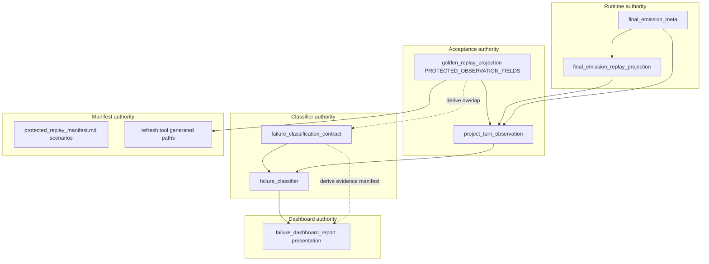

# Cycle AO0 — Replay Authority Boundary Analysis

**Date:** 2026-06-03  
**Scope:** Recon only. Identifies current sources of truth, recommended ownership targets, helper overreach, and test-encoded schema expectations.

---

## 1. What currently appears to be the replay source of truth?

Replay acceptance has **split but documented authority**:

| Domain | Source of truth | Evidence |
|---|---|---|
| **Protected observation schema (41 paths)** | `tests/helpers/golden_replay_projection.py::PROTECTED_OBSERVATION_FIELDS` | Registry drives AK5 locks, manifest generated section, drift buckets |
| **Payload → observed turn projection semantics** | Same module: `project_turn_observation()` | All golden assertions and failure classification consume this adapter |
| **Acceptance governance (which scenarios block CI)** | `docs/testing/protected_replay_manifest.md` (manual PROTECTED table) | Declares 9 PROTECTED scenarios; CI runs `-m golden_replay` |
| **CI enforcement** | `.github/workflows/convergence-checks.yml` | Hard gate on golden_replay marker + manifest `--check` |
| **Runtime FEM keys and owner buckets** | `game/final_emission_meta.py` | Write/read-side; imported by projection and classifier contract |
| **Runtime lineage event derivation** | `game/final_emission_replay_projection.py` | Read-side only; stamped on FEM, consumed by golden projection |
| **Failure row schema** | `tests/failure_classification_contract.py` | 15 required + 47 optional evidence fields |
| **Failure routing logic** | `tests/helpers/failure_classifier.py::classify_replay_failure` | Builds rows from contract taxonomies |
| **Dashboard presentation** | `tests/helpers/failure_dashboard_report.py` | Table columns + evidence manifest |

There is **no single module** owning all replay surfaces. The closest unified authority is the **protected observation registry**, but extraction, classifier evidence, dashboard manifest, and manifest scenario tables remain parallel edit surfaces.

---

## 2. Which files should own projection semantics?

**Should own:**

| File | Owns |
|---|---|
| `tests/helpers/golden_replay_projection.py` | 41 protected paths, drift buckets, `project_turn_observation()`, dual fallback-family precedence, scaffold leakage, path lookup/unavailable rules |
| `game/final_emission_replay_projection.py` | Runtime `fem_runtime_lineage_events` derivation, sealed sub-kinds, lineage selection/content owner split |
| `game/final_emission_meta.py` | FEM field names, owner bucket computation, normalization for observability |

**Should not own projection semantics (consume only):**

| File | Why |
|---|---|
| `tests/helpers/golden_replay.py` | Runner/orchestrator — currently also hosts protected expectation DSL fragments (`protected_route_expectation`, etc.) that encode field semantics outside the registry |
| `tests/helpers/failure_classifier.py` | Should read observed turns, not define observation shape |
| `tests/helpers/failure_dashboard_report.py` | Should render rows, not define observation paths |
| `tests/helpers/golden_replay_fixtures.py` | Should build payloads, not redefine field meaning |

**Ambiguous (flag, do not guess):**

- Whether `raw_signal_presence` / `normalized_signal_presence` inside `project_turn_observation()` are projection semantics or classifier-only diagnostics — they duplicate registry paths manually today.
- Whether `response_delta_*` supporting keys belong in projection module or a separate diagnostic extension — currently in projection output but not protected.

---

## 3. Which files should own manifest semantics?

**Should own:**

| File | Owns |
|---|---|
| `docs/testing/protected_replay_manifest.md` | PROTECTED/SUPPORTING/ADVISORY classification, scenario IDs, metadata ownership rules, dual fallback-family **documentation** |
| `tools/refresh_protected_replay_manifest.py` | Generated 41-path table (derivative of registry) |

**Should not own manifest semantics:**

| File | Why |
|---|---|
| `tests/helpers/golden_replay_projection.py` | Owns field paths, not scenario governance classification |
| `tests/test_golden_replay.py` | Executes scenarios; should not be the only machine-readable scenario registry |

**Gap:** Scenario PROTECTED table is manual markdown. Test function names are the de-facto executable binding but not verified by a dedicated scenario registry module (only field-path parity is CI-gated).

---

## 4. Which files should own classifier semantics?

**Should own:**

| File | Owns |
|---|---|
| `tests/failure_classification_contract.py` | Required/optional evidence fields, taxonomies (categories, owners, severities, tags, source families), investigation targets |
| `tests/helpers/failure_classifier.py` | Classification rules (`CATEGORY_RULES`, owner routing), row construction |

**Should not own classifier semantics:**

| File | Why |
|---|---|
| `tests/helpers/failure_classification_sync.py` | Alignment enforcement only |
| `tests/helpers/failure_dashboard_report.py` | Consumes classified rows |
| `tests/helpers/golden_replay.py` | Should invoke classifier on failure, not define categories |

**Overlap concern:** `PROTECTED_CLASSIFIER_EVIDENCE_FIELDS` in the contract is a **hand-maintained** subset of the projection registry. Should be derived, not duplicated.

---

## 5. Which files should own dashboard/report semantics?

**Should own:**

| File | Owns |
|---|---|
| `tests/helpers/failure_dashboard_report.py` | Table column layout, evidence cell composition, artifact paths, recording API |
| `tests/conftest.py` | Opt-in flags and sessionfinish wiring (not schema) |

**Should not own dashboard semantics:**

| File | Why |
|---|---|
| `tests/helpers/failure_classifier.py` | Produces row data; dashboard should not re-classify |
| `tests/helpers/golden_replay_projection.py` | Supplies protected path list for report headers only |
| `audits/failure_dashboard_latest.md` | Generated output |

**Overlap concern:** `FAILURE_DASHBOARD_EVIDENCE_MANIFEST` (29 keys) is a curated manual list that must stay ⊆ classifier optional fields. Dashboard table columns partially duplicate required classifier fields (`Field`, `Expected`, `Actual`, etc.).

---

## 6. Where are helpers currently making decisions they probably should not own?

| Helper | Decision it makes | Should move to |
|---|---|---|
| `golden_replay.py::protected_route_expectation` | Which route/resolution kinds satisfy protected social scenarios | Projection-owned scenario expectation config or manifest-linked fragments |
| `golden_replay.py::protected_no_scaffold_expectation` | Scaffold term deny-list | `golden_replay_projection.final_text_has_scaffold_leakage` (already owns detector) |
| `golden_replay.py::classify_golden_drift` | Drift bucket assignment | Already delegates to `protected_observation_drift_bucket` — OK, but structural vs semantic policy lives split between runner and registry |
| `project_turn_observation::raw_signal_presence` | Which FEM keys count as "present" for classifier missing-source routing | Registry-driven presence spec or classifier-owned adapter |
| `failure_dashboard_fixtures._observed()` | Synthetic observed-row default shape | Single shared fixture builder (`failure_classification_sync.observed_failure_row`) |
| `failure_classification_sync.observed_failure_row` | Default observed-turn keys for probes | Shared fixture module consumed by dashboard fixtures |
| `failure_dashboard_report._format_dashboard_evidence_value` | Special-case formatting per field | Acceptable presentation logic — but field list should not be hand-curated |

**Not overreach (appropriate helper behavior):**

- `golden_replay.py::run_golden_replay` — orchestration
- `failure_classifier.classify_replay_failure` — routing from observed evidence
- `refresh_protected_replay_manifest.py` — derivative sync
- `runtime_lineage_reporting.py` — markdown formatting

---

## 7. Where are tests directly encoding schema expectations instead of using shared authority?

| Test / location | Encoded expectation | Should use instead |
|---|---|---|
| `test_golden_replay.py::test_ak5_*` | Iterates registry programmatically | ✅ Already uses `protected_observation_field_registry()` |
| `test_golden_replay.py::test_protected_replay_manifest_matches_observation_registry` | Manifest parity | ✅ Uses registry + manifest |
| `test_golden_replay.py::test_golden_replay_dual_family_*` | Hard-coded FEM dicts with specific field values | Acceptable for precedence contract; documents read-side rule |
| `test_golden_replay.py` protected scenario tests | Inline `protected_*_expectation()` dicts | Partially duplicates registry paths; could reference registry paths explicitly |
| `test_failure_classifier.py` | Synthetic rows with inline field keys | Could use `observed_failure_row()` factory more consistently |
| `test_failure_dashboard_controlled_failures.py` | `CONTROLLED_FAILURE_CASES` inline observed shapes | Duplicates `failure_dashboard_fixtures` / `observed_failure_row` |
| `failure_classification_contract.py` | `PROTECTED_CLASSIFIER_EVIDENCE_FIELDS` frozenset | Should derive from projection registry |
| `failure_dashboard_report.py` | `FAILURE_DASHBOARD_EVIDENCE_MANIFEST` tuple | Should derive labels from classifier evidence manifest |

**Tests that correctly act as locks (keep as-is):**

- AK5 coverage tests (registry-driven)
- Contract↔classifier alignment tests
- Manifest `--check` in CI
- `test_runtime_drift_seed_audit.py` nondeterminism guard

---

## 8. Recommended authority diagram (target state)

---

## 9. Ambiguous areas (do not consolidate without explicit decision)

1. **Merging runtime and test projection modules** — Different lifecycles (production read-side vs test acceptance). Consolidation should mean clearer boundary, not file merge.
2. **Promoting `response_delta_*` to protected** — Currently supporting-only; changing would alter acceptance scope.
3. **Machine-readable scenario registry** — Valuable for manifest parity but changes governance workflow.
4. **Lineage events in drift classification** — Explicitly excluded today; making them protected would change behavior.
