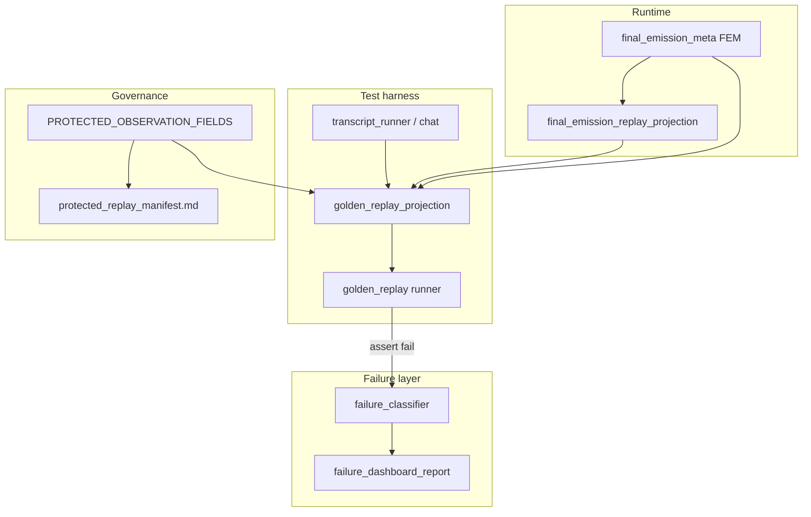

# Cycle AO0 — Replay Ownership Inventory

**Date:** 2026-06-03  
**Scope:** Recon only — no behavioral changes. Maps replay-related modules, tests, fixtures, manifests, scripts, and dashboard/report files for ownership consolidation planning.

**Related prior work:** `audits/cycle_ak_replay_schema_authority_inventory.md`, `audits/cycle_ak_schema_duplication_map.json`

---

## Legend

| Classification | Meaning |
|---|---|
| **authoritative** | Declared or de-facto source of truth for a schema or governance surface |
| **helper-only** | Orchestrates or consumes authority; should not own field definitions |
| **compatibility-only** | Read-side projection, legacy paths, or wrappers kept for stability |
| **test-only** | Acceptance harness, probes, or synthetic rows — not runtime |
| **generated** | Derived from an upstream authority; must not be edited by hand |

**Overlap tags:** `proj` projection, `man` manifest, `cls` classifier, `dash` dashboard, `fem` runtime FEM, `fix` fixture duplication

---

## 1. Runtime projection (read-side, production code)

| Path | Responsibility | Class | Inbound callers | Outbound deps | Overlap |
|---|---|---|---|---|---|
| `game/final_emission_replay_projection.py` | Read-side FEM → `fem_runtime_lineage_events`; sealed sub-kind projection; selection/content owner split on lineage events | **authoritative** (runtime lineage semantics) | `game/final_emission_meta.py` (re-export `build_fem_runtime_lineage_events`), `tests/helpers/golden_replay_projection.py`, `tests/test_final_emission_meta.py`, `tests/test_golden_replay.py`, `tests/test_ownership_registry.py`, `tools/run_scenario_spine_validation.py` | `game/runtime_lineage_telemetry.py`, `game.telemetry_vocab`, `game.final_emission_meta` (bucket helpers) | `proj` + `fem`: golden replay re-derives observed fields from same FEM; lineage owner semantics differ from protected drift policy |
| `game/final_emission_meta.py` | FEM write/read; owner bucket frozensets; `OPENING_FALLBACK_PROJECTION_FIELDS`; stamps lineage via projection | **authoritative** (FEM write/read keys) | Widespread runtime + `golden_replay_projection`, `failure_classification_contract`, FEM tests | `final_emission_replay_projection.build_fem_runtime_lineage_events` | `fem` + `proj`: bucket lists duplicated in classifier contract via import; not golden observation authority |
| `game/runtime_lineage_telemetry.py` | Lineage event vocab, `make_runtime_lineage_event`, normalize/summarize | **authoritative** (lineage event shape) | `final_emission_replay_projection`, `golden_replay.py`, `failure_dashboard_report.py`, `runtime_lineage_reporting.py`, `compare_scenario_spine_reruns.py` | — | `dash`: shared reporting helper layer |
| `game/realization_provenance.py` | Governed `realization_fallback_family` taxonomy | **authoritative** (provenance family) | Runtime FEM writers; referenced by golden dual-family precedence | — | `proj`: collapsed read-side into single `fallback_family` in golden projection |
| `game/fallback_provenance_debug.py` | Upstream fast-fallback provenance trace packaging | **helper-only** (runtime) | FEM/projection paths | — | `proj`: feeds lineage content-owner projection |
| `game/diegetic_fallback_narration.py` | Diegetic `fallback_family_used` taxonomy | **authoritative** (diegetic family) | Runtime FEM writers | — | `proj`: dual-family precedence in golden projection |

---

## 2. Test-side projection & golden replay harness

| Path | Responsibility | Class | Inbound callers | Outbound deps | Overlap |
|---|---|---|---|---|---|
| `tests/helpers/golden_replay_projection.py` | **41 protected observation paths**; `project_turn_observation()`; drift buckets; dual fallback-family precedence; scaffold leakage; path lookup | **authoritative** (acceptance observation schema) | `golden_replay.py`, `golden_replay_fixtures.py`, `failure_classification_sync.py`, `failure_dashboard_report.py`, `test_golden_replay.py`, `test_failure_dashboard_controlled_failures.py`, `test_final_emission_meta.py`, `tools/refresh_protected_replay_manifest.py` | `final_emission_meta`, `final_emission_replay_projection`, `transcript_runner`, `realization_provenance` | `proj` + `cls` + `dash` + `man`: registry is SoT but extraction is hand-wired; `raw_signal_presence` duplicates subset |
| `tests/helpers/golden_replay.py` | Runner (`run_golden_replay`), protected expectation DSL, assertions, drift classification, rerun compare, long-session summaries, scenario-spine bridge, failure recording | **helper-only** (orchestrator) | `test_golden_replay.py` only (direct) | `golden_replay_projection`, `failure_classifier`, `failure_dashboard_report`, `transcript_runner`, `runtime_lineage_reporting`, `game.api.chat` | `cls` + `dash`: invokes classifier on failure; owns protected expectation fragments (route/speaker/scaffold) parallel to registry |
| `tests/helpers/golden_replay_fixtures.py` | World seeds, chat stubs, synthetic FEM payloads, `observed_turn_from_gate_output` direct-seam builder | **test-only** | `test_golden_replay.py` | `golden_replay_projection.project_turn_observation` | `fix`: direct-seam vs E2E split intentional per manifest |
| `tests/helpers/transcript_runner.py` | Clean campaign reset, patched storage, `chat()` turns, snapshots | **helper-only** (harness) | `golden_replay.py`, `golden_replay_projection.py`, gauntlet/transcript tests, manual gauntlet tool | `game` storage/api | Used outside golden replay — not replay authority |
| `tests/helpers/transcript_snapshots.py` | Snapshot extraction from chat payloads | **helper-only** | `transcript_runner.py`, `golden_replay_projection.py` | — | — |
| `tests/helpers/runtime_lineage_reporting.py` | Shared lineage markdown/summary for reports | **helper-only** | `golden_replay.py`, `failure_dashboard_report.py`, `test_runtime_lineage_telemetry.py`, `tools/run_scenario_spine_validation.py` | `runtime_lineage_telemetry` | `dash` + `proj`: reporting layer between projection and dashboard |
| `tests/helpers/opening_fallback_evidence.py` | Direct-seam opening fallback observed-field builders | **test-only** (fixture) | `failure_classification_sync.py`, opening direct-seam tests | FEM-shaped dicts | `fix` + `cls`: parallel to `observed_failure_row` |

---

## 3. Failure classifier & dashboard

| Path | Responsibility | Class | Inbound callers | Outbound deps | Overlap |
|---|---|---|---|---|---|
| `tests/failure_classification_contract.py` | Taxonomy lock: categories, owners, severities, tags; 15 required + 47 optional evidence fields; `PROTECTED_CLASSIFIER_EVIDENCE_FIELDS` overlap set | **authoritative** (classifier row schema) | `failure_classifier.py`, `failure_classification_sync.py`, `failure_dashboard_report.py`, contract tests | `game.final_emission_meta` (bucket frozensets) | `cls` + `proj`: 32-field overlap with protected registry; bucket lists imported from runtime FEM |
| `tests/helpers/failure_classifier.py` | `classify_replay_failure()`, `FailureClassification` TypedDict, routing rules | **authoritative** (classification logic) | `golden_replay.py`, `failure_dashboard_report.py`, `failure_classification_sync.py`, classifier/contract/dashboard tests | `failure_classification_contract`, `final_emission_meta` | `cls`: TypedDict mirrors contract manually |
| `tests/helpers/failure_classification_sync.py` | Contract↔classifier↔dashboard alignment; `observed_failure_row()` synthetic rows; registry overlap checks | **helper-only** (sync enforcement) | Contract tests, classifier tests, `failure_dashboard_report.py` | `failure_classification_contract`, `failure_classifier`, `golden_replay_projection`, `opening_fallback_evidence` | `fix` + `cls` + `proj`: encodes observed-row shape; duplicates dashboard fixtures |
| `tests/helpers/failure_dashboard_report.py` | Markdown artifacts; 17 table columns; 29-key evidence manifest; row recording; CI failure report writer | **authoritative** (dashboard presentation schema) | `golden_replay.py`, `conftest.py`, dashboard/classifier/golden tests | `failure_classifier`, `failure_classification_sync`, `golden_replay_projection`, `runtime_lineage_reporting` | `dash` + `cls` + `proj`: evidence manifest is curated subset of classifier optional fields |
| `tests/helpers/failure_dashboard_fixtures.py` | Known-bad rows (`CONTROLLED_FAILURE_CASES`) for dashboard probes | **test-only** | `test_failure_dashboard_controlled_failures.py`, contract tests | `failure_dashboard_report.build_failure_dashboard_rows` | `fix`: `_observed()` near-duplicate of `observed_failure_row()` |

---

## 4. Tools & scripts

| Path | Responsibility | Class | Inbound callers | Outbound deps | Overlap |
|---|---|---|---|---|---|
| `tools/refresh_protected_replay_manifest.py` | Regenerate/verify generated manifest field-path table from registry | **generated** (tool) | CI (`convergence-checks.yml`), manual maintenance | `golden_replay_projection.protected_observation_field_registry` | `man`: sole automated bridge from projection registry → manifest |
| `tools/compare_scenario_spine_reruns.py` | Advisory comparator for two scenario-spine artifact dirs | **helper-only** (advisory) | Manual / cycle docs | `runtime_lineage_telemetry` | ADVISORY lane — not protected acceptance |
| `tools/run_scenario_spine_validation.py` | Long-session spine runner (ADVISORY) | **helper-only** (advisory) | Manual | `final_emission_meta`, `runtime_lineage_reporting` | Same fixture as protected 25-turn golden; different gate |

---

## 5. Test modules

| Path | Responsibility | Class | Inbound callers | Outbound deps | Overlap |
|---|---|---|---|---|---|
| `tests/test_golden_replay.py` | **Primary acceptance module** — 67 tests, `pytestmark = golden_replay`; AK5 schema locks; 9 PROTECTED scenarios; projection contracts; drift/rerun/scorecard | **test-only** (acceptance) | CI `-m golden_replay` | All golden + projection + dashboard helpers | Encodes some schema expectations inline (AK5, dual-family) — should consume registry |
| `tests/test_failure_classifier.py` | Classifier routing, evidence projection, table alignment — 66 tests | **test-only** | Local / CI (not hard-gated separately) | `failure_classifier`, `failure_classification_sync`, `failure_dashboard_report` | — |
| `tests/test_failure_classification_contract.py` | Contract↔classifier↔dashboard alignment — 32 tests | **test-only** | Local / CI | Contract + sync + dashboard | — |
| `tests/test_failure_dashboard_controlled_failures.py` | Opt-in `failure_dashboard_probe` known-bad rows — 51 tests | **test-only** | Opt-in (`--write-failure-dashboard` or env) | Dashboard fixtures + projection | Uses `project_turn_observation` for one probe |
| `tests/test_runtime_lineage_telemetry.py` | Lineage vocab/normalization — 7 tests | **test-only** | Often run with replay diagnostics | `runtime_lineage_reporting` | Adjacent to replay, not golden authority |
| `tests/test_runtime_drift_seed_audit.py` | AST audit: no nondeterministic imports in replay-sensitive paths — 1 test | **test-only** (guard) | Local / maintenance | Scans `final_emission_replay_projection.py` among others | — |
| `tests/test_final_emission_meta.py` | FEM + lineage projection cross-checks (subset imports golden projection) | **test-only** | FEM maintenance | `final_emission_replay_projection`, `golden_replay_projection` | Bridges runtime FEM tests to golden projection |
| `tests/test_ownership_registry.py` | Ownership registry includes replay projection module | **test-only** | Ownership audits | `final_emission_replay_projection` | Governance adjacent |
| `tests/conftest.py` | `--write-failure-dashboard`, `--write-rerun-drift-scorecard`; sessionfinish failure report hook | **helper-only** | pytest global | `failure_dashboard_report` | `dash`: wires CI artifact on failure |

---

## 6. Fixtures & data

| Path | Responsibility | Class | Inbound callers | Outbound deps | Overlap |
|---|---|---|---|---|---|
| `data/validation/scenario_spines/frontier_gate_long_session.json` | 25-turn protected long-session source (`branch_social_inquiry`) | **authoritative** (fixture metadata for N1/protected lane) | `golden_replay.py` (frontier gate tests), advisory spine runner | — | `man`: scenario IDs in manifest reference tests using this fixture |
| `data/validation/scenario_spines/c1a_opening_convergence_paths.json` | Advisory opening convergence spine | **test-only** (advisory) | Advisory validation | — | Not PROTECTED |
| `codex_pytest_tmp/test_golden_replay_*/data/` | Ephemeral pytest campaign snapshots | **generated** | pytest `--basetemp` runs | — | Untracked; not authority |
| `tests/helpers/final_emission_gate_fixtures.py` | Gate fixtures for FEM tests | **test-only** (adjacent) | FEM tests | — | Adjacent, not golden authority |

---

## 7. Manifest, governance docs & reports

| Path | Responsibility | Class | Inbound callers | Outbound deps | Overlap |
|---|---|---|---|---|---|
| `docs/testing/protected_replay_manifest.md` | **Governance authority** for PROTECTED/SUPPORTING/ADVISORY scenarios; dual fallback-family contract; metadata ownership; generated 41-path table | **authoritative** (governance) + **generated** (field table) | Humans, cycle docs, refresh tool | Registry via refresh tool | `man` + `proj`: scenario table is manual; paths are derived |
| `audits/failure_dashboard_latest.md` | Opt-in dashboard output | **generated** | `--write-failure-dashboard` | — | `dash` |
| `audits/replay_failure_corpus.md` | Manual discovery doc for controlled failure scenarios | **helper-only** (documentation) | Humans | — | — |
| `audits/proposed_failure_classification_schema.md` | Historical design proposal | **compatibility-only** (archival) | — | — | Not executable authority |
| `artifacts/golden_replay/replay_failure_report.md` | CI-uploaded failure report on protected assertion failure | **generated** | pytest sessionfinish | `failure_dashboard_report` | `dash` |
| `artifacts/golden_replay/rerun_drift_scorecard.{json,md}` | Opt-in advisory rerun scorecards | **generated** | `--write-rerun-drift-scorecard` | `golden_replay` | ADVISORY |
| `audits/failure_dashboard_probe_sample.md` | Sample/reference dashboard | **helper-only** | Humans | — | — |

---

## 8. CI & workflow

| Path | Responsibility | Class | Inbound | Outbound |
|---|---|---|---|---|
| `.github/workflows/convergence-checks.yml` | Hard gate: `pytest -m golden_replay -q`; manifest `--check`; uploads failure report artifact | **authoritative** (CI policy) | GitHub Actions | pytest, refresh tool |

---

## 9. Adjacent / non-replay (flagged to avoid scope creep)

| Path | Why listed | Not replay authority because |
|---|---|---|
| `game/planner_input_manifest.py` | Name contains "manifest" | Planner seam, unrelated to golden replay |
| `game/planner_ctir_projection.py` | Name contains "projection" | CTIR/world progression, not golden observation |
| `game/response_policy_enforcement_manifest.py` | Name contains "manifest" | Response policy, not replay |
| `tests/test_transcript_regression.py`, gauntlet tests | Transcript quality | ADVISORY — not `-m golden_replay` |
| `docs/archive/dead_governance/2026-05-31/golden_replay_*.md` | Historical | Superseded by current manifest |

---

## 10. Ownership overlap summary

| Overlap ID | Layers | Risk | AO consolidation target |
|---|---|---|---|
| O1 | Protected registry vs `project_turn_observation()` manual extraction vs `raw_signal_presence` | Adding a field = 3+ edit sites in one file | Registry-driven extraction (AO1) |
| O2 | Protected registry vs classifier optional evidence (32 shared) | Field renames need contract + classifier + sync updates | Derive overlap sets from registry (AO2) |
| O3 | Classifier contract vs `FailureClassification` TypedDict vs `classify_replay_failure()` dict | Parallel schema mirrors | Single manifest consumed by classifier (AO2) |
| O4 | Dashboard evidence manifest vs classifier optional fields | 29-key curation manually maintained | Derive dashboard manifest from contract (AO3) |
| O5 | `observed_failure_row()` vs `failure_dashboard_fixtures._observed()` | Duplicate synthetic row shapes | Unify fixture builder (AO4) |
| O6 | Runtime `final_emission_replay_projection` vs test `golden_replay_projection` | Two projection modules over same FEM | Clarify boundary; avoid merging (AO5) |
| O7 | Manifest scenario table (manual) vs `test_golden_replay.py` test names | Scenario governance not machine-verified except field paths | Scenario registry module (AO6) |
| O8 | `golden_replay.py` protected expectation DSL vs registry drift buckets | Route/speaker/scaffold rules live in helper not registry | Move expectation fragments to projection-owned config (AO1 follow-on) |

---

## 11. Data-flow (current)

