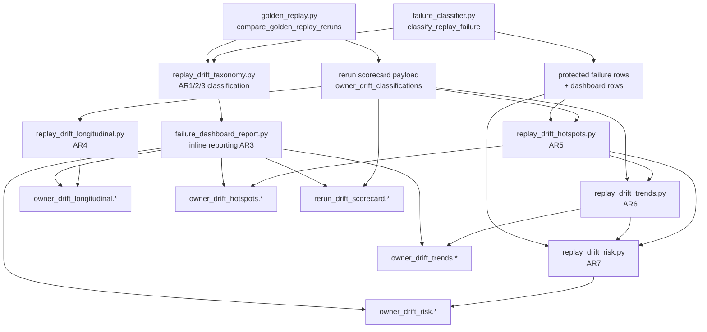

# Cycle AR — Replay Drift Classification Closeout

**Date:** 2026-06-06  
**Block:** AR8 — Drift Governance Consolidation & Closeout  
**Scope:** Documentation and governance verification only. No behavior changes.

---

## 1. Objective review

Cycle AR set out to add a stable **owner-oriented drift vocabulary** and a layered **advisory reporting stack** on top of existing golden replay diagnostics — without expanding protected replay coverage, changing assertions, or promoting advisory signals into acceptance gates.

### What was delivered (AR1–AR7)

| Block | Deliverable | Status |
| --- | --- | --- |
| AR1 | Owner drift bucket taxonomy design | Complete — [`cycle_ar_block_ar1_drift_taxonomy.md`](cycle_ar_block_ar1_drift_taxonomy.md) |
| AR2 | Classification integration (`owner_drift_bucket` on classifier + rerun rows) | Complete — [`cycle_ar_block_ar2_implementation_summary.md`](cycle_ar_block_ar2_implementation_summary.md) |
| AR3 | Inline reporting (protected report, dashboard, scorecard summary) | Complete — [`cycle_ar_block_ar3_reporting_summary.md`](cycle_ar_block_ar3_reporting_summary.md) |
| AR4 | Longitudinal aggregation across scorecard history | Complete — [`cycle_ar_block_ar4_longitudinal_summary.md`](cycle_ar_block_ar4_longitudinal_summary.md) |
| AR5 | Hotspot rankings (fields, owners, investigation targets) | Complete — [`cycle_ar_block_ar5_hotspot_summary.md`](cycle_ar_block_ar5_hotspot_summary.md) |
| AR6 | Trend analysis (latest vs prior scorecard) | Complete — [`cycle_ar_block_ar6_trend_summary.md`](cycle_ar_block_ar6_trend_summary.md) |
| AR7 | Risk prioritization (high/medium/low + investigation order) | Complete — [`cycle_ar_block_ar7_risk_summary.md`](cycle_ar_block_ar7_risk_summary.md) |
| AR8 | Governance consolidation & closeout | Complete — this document |

### Recon baseline

Pre-AR state documented in [`cycle_ar_replay_drift_classification_recon.md`](cycle_ar_replay_drift_classification_recon.md): single-run classification existed; owner-bucket vocabulary and layered advisory artifacts did not.

---

## 2. Metric movement assessment

| Metric | Pre-AR (recon) | Post-AR (verified) | Movement |
| --- | ---: | ---: | --- |
| Protected observation paths | 41 | 41 | **Unchanged** |
| Protected scenarios (manifest) | 9 | 9 | **Unchanged** |
| `tests/test_golden_replay.py` collected tests | 68 | 68 | **Unchanged** |
| Owner drift buckets | 0 | 9 | **+9 advisory vocabulary** |
| Classifier extension fields | 15 → 16 (AR2) | 16 | **+1 optional `owner_drift_bucket`** |
| AR diagnostic test modules | 0 | 5 | **+59 tests** (27+8+8+7+9) |
| Advisory artifact families under `artifacts/golden_replay/` | 1 (failure report on CI fail) | 6 | **+5 opt-in scorecard-derived artifacts** |
| Runtime (`game/**`) changes | — | 0 | **Unchanged** |
| CI golden replay gate | `pytest -m golden_replay` | same | **Unchanged** |

**Interpretation:** Cycle AR added **read-side reporting depth** only. Acceptance surface area (paths, scenarios, pass/fail) is identical to the pre-AR baseline.

---

## 3. AR component inventory

### 3.1 `tests/helpers/replay_drift_taxonomy.py` (AR1/AR2/AR3)

| Attribute | Detail |
| --- | --- |
| **Owner** | Cycle AR taxonomy — canonical bucket vocabulary and single-run / rerun delta classification |
| **Consumers** | `failure_classifier.py`, `golden_replay.py`, `failure_classification_contract.py`, `failure_dashboard_report.py`, all downstream AR modules |
| **Key exports** | `ALLOWED_OWNER_DRIFT_BUCKETS`, `classify_owner_drift_bucket`, `classify_rerun_delta_owner_drift_bucket`, `owner_drift_classifications_from_per_turn_deltas`, `summarize_owner_drift_buckets` |
| **Outputs** | Bucket labels on classification rows; bucket count dicts for inline report sections |
| **Artifact paths** | None directly — feeds scorecard `owner_drift_classifications` and inline Owner Drift Summary/Breakdown sections |

### 3.2 `tests/helpers/replay_drift_longitudinal.py` (AR4)

| Attribute | Detail |
| --- | --- |
| **Owner** | Multi-run bucket aggregation across scorecard history |
| **Consumers** | `failure_dashboard_report.py` (`write_owner_drift_longitudinal_artifacts`, `append_owner_drift_longitudinal_markdown`) |
| **Key exports** | `aggregate_owner_drift_history`, `build_owner_drift_trend_summary`, `render_owner_drift_longitudinal_report` |
| **Outputs** | Run totals, bucket counts/percentages, concentration (most/least common) |
| **Artifact paths** | `artifacts/golden_replay/owner_drift_longitudinal.json`, `.md` |

### 3.3 `tests/helpers/replay_drift_hotspots.py` (AR5)

| Attribute | Detail |
| --- | --- |
| **Owner** | Per-signal hotspot aggregation and ranked top lists |
| **Consumers** | `failure_dashboard_report.py`, `replay_drift_trends.py` (field trend enrichment), `replay_drift_risk.py` (counts + scorecard row expansion) |
| **Key exports** | `classification_rows_from_scorecards`, `aggregate_*` helpers, `build_hotspot_rankings`, `render_owner_drift_hotspot_report` |
| **Outputs** | Field/target/bucket counts; ranked `top_drift_fields`, `top_owner_drift_buckets`, `top_investigation_targets` |
| **Artifact paths** | `artifacts/golden_replay/owner_drift_hotspots.json`, `.md` |

### 3.4 `tests/helpers/replay_drift_trends.py` (AR6)

| Attribute | Detail |
| --- | --- |
| **Owner** | Latest-vs-prior scorecard trend comparison (bucket + field level) |
| **Consumers** | `failure_dashboard_report.py`, `replay_drift_risk.py`, hotspot enrichment |
| **Key exports** | `compute_owner_drift_trends`, `compute_field_drift_trends`, `build_owner_bucket_trend_summary`, `enrich_hotspots_with_field_trends`, `build_trend_payload`, `render_owner_drift_trend_report` |
| **Outputs** | Per-bucket and per-field `{current, previous, delta, direction}` |
| **Artifact paths** | `artifacts/golden_replay/owner_drift_trends.json`, `.md` |

### 3.5 `tests/helpers/replay_drift_risk.py` (AR7)

| Attribute | Detail |
| --- | --- |
| **Owner** | Deterministic risk scoring and investigation prioritization |
| **Consumers** | `failure_dashboard_report.py` (`write_owner_drift_risk_artifacts`) |
| **Key exports** | `score_drift_risk`, `classify_field_source`, `build_risk_rankings`, `build_risk_payload`, `render_owner_drift_risk_report`, `classifications_for_risk_analysis` |
| **Outputs** | `risk_level` (low/medium/high), ranked risk tables, `recommended_investigation_order` |
| **Artifact paths** | `artifacts/golden_replay/owner_drift_risk.json`, `.md` |

### 3.6 Orchestration owner (cross-cutting)

| Module | Role |
| --- | --- |
| `tests/helpers/failure_dashboard_report.py` | **Single artifact I/O orchestrator** — path constants, session recording, `collected_hotspot_classifications`, all `write_owner_drift_*_artifacts`, `write_rerun_drift_scorecard_artifacts` |
| `tests/helpers/failure_classifier.py` | Emits `owner_drift_bucket` on every classification row (AR2) |
| `tests/helpers/golden_replay.py` | Emits `owner_drift_classifications` on rerun scorecards (AR2) |
| `tests/conftest.py` | Opt-in `--write-rerun-drift-scorecard` hook triggers full artifact stack on golden replay pass |

---

## 4. AR dependency graph



**Canonical data flow (operator mental model):**

```
classification (AR2 taxonomy)
  → reporting (AR3 inline sections in failure_dashboard_report)
  → longitudinal (AR4 multi-run bucket history)
  → hotspot (AR5 ranked concentration)
  → trend (AR6 latest-vs-prior delta)
  → risk (AR7 prioritized investigation order)
```

Each layer **reads** prior signals; no layer mutates upstream counts or classification rows.

---

## 5. Dependency review findings

### 5.1 Duplicated aggregation logic

| Pattern | Locations | Assessment |
| --- | --- | --- |
| Owner bucket counting | `summarize_owner_drift_buckets` (taxonomy), `aggregate_owner_drift_bucket_counts` (hotspots), `_bucket_counts_for_scorecard` (trends), `aggregate_owner_drift_history` (longitudinal) | **Intentional specialization** — zeros-included vs non-zero-only vs multi-run vs scorecard-pair. Hotspots re-count from rows rather than calling `summarize_owner_drift_buckets` to preserve field-path filtering semantics. |
| Field-path counting | `aggregate_field_drift_counts` (hotspots), reused by risk | **Shared correctly** — risk imports hotspot aggregator. |
| Scorecard validity filter | `_valid_scorecards` (longitudinal), `_valid_scorecard_history` (trends) | **Duplicate helper** — same `comparison_available is False` skip logic. Safe future extraction target. |
| Classification row filter | `_valid_classification_rows` (hotspots + risk) | **Duplicate helper** — identical field_path non-empty filter. Safe future extraction target. |

### 5.2 Duplicated ranking logic

| Pattern | Locations | Assessment |
| --- | --- | --- |
| Count-based ranking | `_rank_counts` (hotspots) → `{name, count, rank}` | Hotspot-specific |
| Risk-based ranking | `_rank_risk_items` (risk) → `{item, risk, rank}` | Risk-specific sort key includes risk tier |
| Longitudinal rank | inline sort in `build_owner_drift_trend_summary` | All-bucket percentage table — different output shape |

No conflicting rank orders detected; ranking is **not centralized** but each ranker's contract is stable and tested.

### 5.3 Duplicated rendering logic

| Pattern | Locations | Assessment |
| --- | --- | --- |
| Advisory header boilerplate | Each `render_owner_drift_*_report` | Repeated `- Advisory only: true` / `- Report only: true` blocks |
| Markdown tables | Hotspot, trend, risk renderers | Similar table builders (`_risk_table_lines` in risk; inline in others) |
| Owner drift summary table | `_owner_drift_summary_table_lines` in `failure_dashboard_report.py` | **Shared** for protected report + scorecard (AR3 consolidation already done) |

### 5.4 Dead helper functions

| Function | Module | Status |
| --- | --- | --- |
| All public exports | AR modules | **Live** — referenced by tests and/or `failure_dashboard_report.py` |
| `_field_matches`, `_tag_set` | taxonomy | **Live** — internal to classification |
| `append_owner_drift_longitudinal_markdown` | failure_dashboard_report | **Live** — called from `write_rerun_drift_scorecard_artifacts` |

**No dead public helpers identified.** Optional cleanup deferred (see §8).

### 5.5 Dual reporting pathways (documented, not duplicate ownership)

| Trigger | Artifacts written |
| --- | --- |
| `write_rerun_drift_scorecard_artifacts` | scorecard + longitudinal + hotspot + trend + risk (**full stack**) |
| `write_protected_replay_failure_report_if_present` | protected failure report + hotspot + risk only |
| `--write-failure-dashboard` session hook | failure dashboard markdown (inline AR3 sections; no standalone AR4–AR7 JSON) |

Longitudinal and trend artifacts **require scorecard history**; the protected-failure-only path correctly omits them. This is a **scope split**, not a competing owner.

---

## 6. Governance verification

Verified 2026-06-06 via code inspection and runtime count checks:

| Check | Result | Evidence |
| --- | --- | --- |
| No replay expansion | **Pass** | 9 PROTECTED scenarios in manifest; 68 golden replay tests |
| Protected path count unchanged | **Pass** | `len(protected_observation_field_paths()) == 41` |
| Protected scenario count unchanged | **Pass** | 7 E2E + 2 direct-seam PROTECTED rows in manifest |
| No gate promotion | **Pass** | All AR JSON payloads carry `report_only: true` and/or `advisory_only: true`; rerun comparator still non-raising |
| `report_only` semantics preserved | **Pass** | Scorecard payload unchanged; AR layers additive |
| `advisory_only` semantics preserved | **Pass** | longitudinal, hotspot, trend, risk artifacts |
| Runtime unchanged | **Pass** | Zero `game/**` edits across AR cycle |
| Measurement drift buckets unchanged | **Pass** | `exact_drift` / `structural_drift` / `semantic_drift` untouched |
| Classifier routing unchanged | **Pass** | category / primary_owner / severity / investigate_first policy preserved |
| AO5 runtime vs acceptance boundary | **Pass** | `lineage_drift` via rerun adapter only; lineage owner excluded from protected drift |
| Contract locks intact | **Pass** | 9 buckets, 32 protected classifier evidence fields, 16 extension fields |

---

## 7. Artifact audit

### 7.1 Inventory

| Artifact | Path | `schema_version` | `report_only` | `advisory_only` | Producer | Primary consumer |
| --- | --- | ---: | --- | --- | --- | --- |
| Rerun scorecard | `artifacts/golden_replay/rerun_drift_scorecard.json` | 1 | yes | — | `write_rerun_drift_scorecard_artifacts` | Operators; feeds AR4–AR7 |
| Rerun scorecard MD | `artifacts/golden_replay/rerun_drift_scorecard.md` | — | inline | inline | same | Operators; AR3 Owner Drift Summary embedded |
| Longitudinal | `artifacts/golden_replay/owner_drift_longitudinal.json` | 1 | yes | yes | `write_owner_drift_longitudinal_artifacts` | Operators; trend/risk context |
| Longitudinal MD | `artifacts/golden_replay/owner_drift_longitudinal.md` | — | inline | inline | same | Operators |
| Hotspot | `artifacts/golden_replay/owner_drift_hotspots.json` | 1 | yes | yes | `write_owner_drift_hotspot_artifacts` | Operators; AR6 enrichment input |
| Hotspot MD | `artifacts/golden_replay/owner_drift_hotspots.md` | — | inline | inline | same | Operators |
| Trend | `artifacts/golden_replay/owner_drift_trends.json` | 1 | — | yes | `write_owner_drift_trend_artifacts` | Operators; AR7 risk scoring |
| Trend MD | `artifacts/golden_replay/owner_drift_trends.md` | — | inline | inline | same | Operators |
| Risk | `artifacts/golden_replay/owner_drift_risk.json` | 1 | yes | yes | `write_owner_drift_risk_artifacts` | Operators |
| Risk MD | `artifacts/golden_replay/owner_drift_risk.md` | — | inline | inline | same | Operators |
| Protected failure report | `artifacts/golden_replay/replay_failure_report.md` | — | on CI fail | inline AR3 | `write_protected_replay_failure_report_if_present` | CI upload; operators |

**Note:** Committed baseline artifacts may be empty (zero signals) or reflect the last local `--write-rerun-drift-scorecard` run. Empty baselines are valid; schema fields are stable.

### 7.2 Schema versioning policy

All standalone AR JSON artifacts use **`schema_version: 1`**. Future breaking shape changes should increment schema version in the producing module only — consumers are human operators and test assertions on artifact presence/flags, not downstream automation.

### 7.3 Single write entry point

Operators should prefer one command to refresh the full stack:

```powershell
python -m pytest -m golden_replay -q --write-rerun-drift-scorecard
```

This invokes `write_rerun_drift_scorecard_artifacts`, which sequentially writes scorecard → longitudinal → hotspot → trend → risk.

---

## 8. Maintenance findings

### 8.1 Consolidation opportunities (future cycles; no AR8 changes)

| Opportunity | Benefit | Risk if rushed |
| --- | --- | --- |
| Extract `replay_drift_scorecard_utils.py` with shared `_valid_scorecards` / `_valid_classification_rows` | Remove 2 duplicate filters | Low — pure refactor |
| Extract `replay_drift_report_headers.py` for shared advisory markdown preamble | DRY renderers | Low |
| Unify `_rank_counts` and `_rank_risk_items` behind a generic rank helper | Single sort contract | Medium — different output keys |
| Rename `build_owner_drift_trend_summary` (longitudinal) vs `build_owner_bucket_trend_summary` (trends) | Reduce operator confusion | Low — doc/alias only |

### 8.2 Naming inconsistencies

| Name A | Name B | Confusion |
| --- | --- | --- |
| `build_owner_drift_trend_summary` (AR4) | `build_owner_bucket_trend_summary` (AR6) | **High** — "trend" means all-run rank in AR4 but latest-vs-prior delta table in AR6 |
| `top_drift_fields` (hotspots) | `top_risk_fields` (risk) | Low — parallel naming is intentional |
| `field_source` (risk) | manifest `PROTECTED` / `SUPPORTING` / `ADVISORY` | Low — risk maps manifest tiers to snake_case enum |

### 8.3 Redundant calculations (acceptable)

- Hotspot and risk both iterate classification rows independently during artifact write. **Acceptable** — keeps modules decoupled; write cost is negligible for current corpus size.
- Trend module recomputes field counts from scorecards while hotspots already counted from rows. **Acceptable** — trend counts come from scorecard history path, not failure rows; merging would blur data sources.

### 8.4 Optional cleanup (AR8 decision)

**No cleanup applied.** Duplicated private helpers are small, tested, and module-scoped. Consolidating them in a closeout block without a dedicated refactor cycle risks subtle behavior drift with zero operator benefit.

---

## 9. Test inventory

| Module | Tests | Covers |
| --- | ---: | --- |
| `tests/test_replay_drift_taxonomy.py` | 27 | Bucket mapping, classifier integration, rerun rows, AR3 rendering |
| `tests/test_replay_drift_longitudinal.py` | 8 | Aggregation, report, artifact write |
| `tests/test_replay_drift_hotspots.py` | 8 | Counts, rankings, report, artifact write |
| `tests/test_replay_drift_trends.py` | 7 | Bucket/field trends, enrichment, artifact write |
| `tests/test_replay_drift_risk.py` | 9 | Scoring tiers, rankings, report, artifact write |
| **AR diagnostic total** | **59** | |
| `tests/test_golden_replay.py` | 68 | Protected replay acceptance (unchanged count) |
| `tests/test_failure_classifier.py` | (existing) | Classifier regression |
| `tests/test_failure_classification_contract.py` | (existing) | Contract locks incl. +1 extension field |

---

## 10. Future follow-up recommendations

1. **Manifest addendum (optional)** — Add a "Cycle AR Advisory Artifact Stack" section to `docs/testing/protected_replay_manifest.md` mirroring the Cycle S rerun scorecard addendum, listing artifact paths and opt-in command. Governance-only; no executable change required.

2. **Rename pass (low priority)** — Alias or rename AR4 `build_owner_drift_trend_summary` → `build_owner_drift_longitudinal_rank_summary` to disambiguate from AR6 trend deltas.

3. **Shared scorecard utils (low priority)** — Extract `_valid_scorecards` / `_valid_classification_rows` when the next AR-adjacent module is added; avoid standalone refactor PR.

4. **Operator dashboard (future)** — If a single HTML/Canvas view is desired, consume existing JSON artifacts read-only; do not merge layers into one mega-module.

5. **Risk threshold tuning (future)** — AR7 thresholds (`REPEATED_OCCURRENCE_THRESHOLD = 2`) are constants in `replay_drift_risk.py`; adjust only with fixture-backed tests, never via acceptance gates.

6. **Do not promote** — Keep `lineage_drift`, rerun deltas, and risk bands out of protected assertion paths unless manifest explicitly updated in a future governance cycle.

---

## 11. Acceptance (AR8)

| Criterion | Status |
| --- | --- |
| AR architecture documented | **Pass** — §3–§5 |
| Governance verified | **Pass** — §6 |
| Maintenance findings recorded | **Pass** — §8 |
| Closeout report created | **Pass** — this document |
| No replay behavior changes | **Pass** |
| No assertion changes | **Pass** |
| No governance changes in AR8 | **Pass** — documentation only |
| No replay coverage changes | **Pass** |

**Cycle AR closeout: PASS**

---

## 12. Block summary index

| Document |
| --- |
| [`cycle_ar_replay_drift_classification_recon.md`](cycle_ar_replay_drift_classification_recon.md) |
| [`cycle_ar_block_ar1_drift_taxonomy.md`](cycle_ar_block_ar1_drift_taxonomy.md) |
| [`cycle_ar_block_ar2_implementation_summary.md`](cycle_ar_block_ar2_implementation_summary.md) |
| [`cycle_ar_block_ar3_reporting_summary.md`](cycle_ar_block_ar3_reporting_summary.md) |
| [`cycle_ar_block_ar4_longitudinal_summary.md`](cycle_ar_block_ar4_longitudinal_summary.md) |
| [`cycle_ar_block_ar5_hotspot_summary.md`](cycle_ar_block_ar5_hotspot_summary.md) |
| [`cycle_ar_block_ar6_trend_summary.md`](cycle_ar_block_ar6_trend_summary.md) |
| [`cycle_ar_block_ar7_risk_summary.md`](cycle_ar_block_ar7_risk_summary.md) |
| [`cycle_ar_replay_drift_classification_closeout.md`](cycle_ar_replay_drift_classification_closeout.md) *(this file)* |
