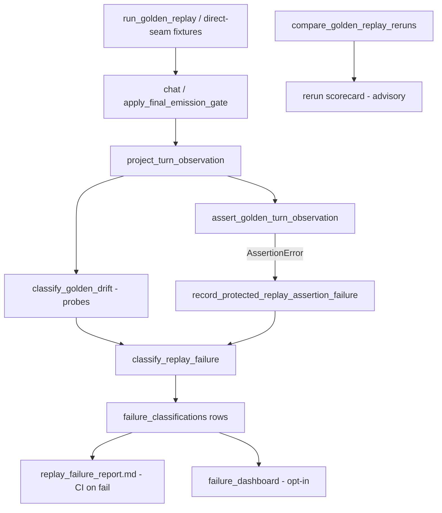

# Cycle AR — Replay Drift Classification Recon

**Date:** 2026-06-06  
**Scope:** Read-only reconnaissance. No implementation or test behavior changes.

---

## 1. Executive summary

The repo already has a **complete single-run replay drift pipeline**: golden replay executes scenarios, projects 41 protected observation paths, buckets measurement drift into `exact_drift` / `structural_drift` / `semantic_drift`, and classifies each failure row into taxonomy categories (`route`, `speaker`, `fallback`, `emission`, …) with **primary/secondary owner**, `investigate_first`, and dashboard-ready evidence fields.

What is **thin** — and what Cycle AR should target — is **owner-bucket drift attribution as a first-class, stable vocabulary** that operators and downstream tooling can consume without reading classifier heuristics. Today:

- **Protected assertion failures** already produce `failure_classifications[]` with owner routing, but there is no dedicated **`drift_bucket`** axis (`route_drift`, `speaker_drift`, …) separate from measurement buckets and taxonomy categories.
- **Rerun scorecards** (`compare_golden_replay_reruns`) detect speaker/route/fallback/text/lineage deltas but emit **no classified rows** — advisory only per Cycle S manifest policy.
- **Lineage event `owner`** is explicitly **excluded** from protected drift classification (diagnostic-only).

**Cycle AR can be done by enriching classification/reporting only** — no new protected replay scenarios, no new protected observation paths, and no CI gate promotion — provided work stays inside:

1. A replay-side drift-bucket classifier (mapping existing fields → owner buckets).
2. Optional enrichment of rerun scorecard output (still `report_only: true`).
3. Contract/sync tests and manifest policy addendum (governance doc only).

**Strongest seam:** add an isolated helper adjacent to `classify_replay_failure` in `tests/helpers/failure_classifier.py` (or a sibling `replay_drift_classifier.py`) that maps existing drift rows / rerun deltas → Cycle AR bucket constants, without touching gate orchestration or protected assertion semantics.

---

## 2. Files inspected

### Core replay / drift / classification

| File | Role |
| --- | --- |
| `tests/helpers/golden_replay.py` | Runner (`run_golden_replay`), assertion (`assert_protected_golden_turn_observation`), drift evaluation (`classify_golden_drift`), rerun comparator (`compare_golden_replay_reruns`), long-session summaries, markdown report renderers |
| `tests/helpers/golden_replay_projection.py` | **Acceptance authority**: 41 protected paths, `project_turn_observation`, `protected_observation_drift_bucket`, fallback-family projection |
| `game/final_emission_replay_projection.py` | **Runtime diagnostic**: FEM lineage events, sealed replacement sub-kinds, selection/content owner on events |
| `tests/helpers/failure_classifier.py` | `classify_replay_failure`, `CATEGORY_RULES`, owner/severity/investigate_first policy |
| `tests/failure_classification_contract.py` | Taxonomy lock: categories, owners, severities, replay tags, evidence field sets |
| `tests/helpers/failure_classification_sync.py` | Contract ↔ classifier ↔ projection registry alignment |
| `tests/helpers/failure_dashboard_report.py` | Dashboard + protected failure report rendering, session recording hooks |
| `tests/helpers/replay_observed_row_fixtures.py` | Synthetic observed rows for classifier probes |
| `tests/helpers/opening_fallback_evidence.py` | Canonical opening fallback FEM/observed fixtures |
| `game/final_emission_meta.py` | Runtime owner-bucket authority (`opening_fallback_owner_bucket_from_meta`, bucket registries) |
| `game/runtime_lineage_telemetry.py` | Lineage event vocabulary + frequency summaries |
| `game/realization_provenance.py` | Governed provenance fallback-family taxonomy (dual with diegetic) |

### Test suites / governance

| File | Role |
| --- | --- |
| `tests/test_golden_replay.py` | 68 collected tests; protected E2E + direct-seam scenarios; projection contracts; drift/rerun/scorecard tests; manifest/registry parity (AK5/AO1) |
| `tests/test_failure_classifier.py` | Classifier locality: category, owners, severity, investigate_first |
| `tests/test_failure_classification_contract.py` | Contract constant locks |
| `tests/test_failure_dashboard_controlled_failures.py` | Opt-in dashboard probes (`failure_dashboard_probe` marker) |
| `tests/test_ownership_registry.py` | Golden replay = gauntlet neighbor; AO5 runtime vs acceptance boundary |
| `tests/test_runtime_drift_seed_audit.py` | AST audit: no process-randomized seeds on replay-sensitive paths |
| `tests/conftest.py` | Session hooks: protected failure report on fail; rerun scorecard on pass (opt-in) |

### Tools / CI / manifest / policy docs

| File | Role |
| --- | --- |
| `docs/testing/protected_replay_manifest.md` | Sole acceptance authority: 9 PROTECTED scenarios, 41 paths, Cycle S drift addendum |
| `tools/refresh_protected_replay_manifest.py` | `--check` / `--write` generated field-path table |
| `tools/compare_scenario_spine_reruns.py` | Advisory artifact-dir comparator (separate from golden rerun scorecard) |
| `.github/workflows/convergence-checks.yml` | CI: `pytest -m golden_replay`; manifest `--check`; uploads failure report on fail |
| `pytest.ini` | Markers: `golden_replay`, `failure_dashboard_probe` |
| `tests/test_inventory_governance.json` | Inventory entry for `tests/test_golden_replay.py` (68 tests, `golden_replay` marker) |
| `docs/cycles/cycle_s_runtime_drift_compression_recon_2026-05-30.md` | Rerun measurement gap analysis (Cycle S) |
| `docs/audits/cycle_k_block_k4_drift_threshold_policy_2026-05-26.md` | Drift taxonomy + enforcement matrix |
| `audits/cycle_ao_replay_authority_boundaries.md` | Lineage owner excluded from protected drift |
| `audits/replay_failure_corpus.md` | Historical failure examples |
| `audits/proposed_failure_classification_schema.md` | Discovery proposal for classification row shape |

---

## 3. Current replay comparison flow



### Stages

1. **Execute** — `run_golden_replay()` drives `chat()` per turn with transcript storage patched; carries `scenario_id`, optional `source_path` / `branch_id` / `turn_id`.
2. **Project (acceptance)** — `project_turn_observation()` flattens FEM, sanitizer trace, trace containers into 41 protected paths + `unavailable[]` for optional fields.
3. **Assert** — `assert_protected_golden_turn_observation()` evaluates `equals` / `one_of` / `not_equals` / text predicates / `scaffold_leakage`; raises formatted `AssertionError` on invariant violation.
4. **Classify** — On drift probe or assertion side-channel, drift rows feed `classify_replay_failure()` → dashboard-ready classification rows.
5. **Report** — `pytest_sessionfinish` writes `artifacts/golden_replay/replay_failure_report.md` when protected replay fails; optional dashboard/rerun artifacts via env flags.
6. **Rerun compare (Cycle S, advisory)** — `compare_golden_replay_reruns()` diffs speaker/route/fallback/text fingerprint/scaffold/response_delta/lineage; **never raises**, **`report_only: true`**.

### Hard boundary (AO5)

| Layer | Module | Owns |
| --- | --- | --- |
| Runtime (diagnostic) | `game/final_emission_replay_projection.py` | FEM lineage events, sealed sub-kinds, event-level owners |
| Acceptance (test-only) | `tests/helpers/golden_replay_projection.py` | 41 protected paths, drift buckets, classifier evidence overlap |

**Lineage event `owner` does not affect drift classification** — verified by `test_golden_drift_classification_ignores_runtime_lineage_diagnostics`.

---

## 4. Current replay failure / diagnostic shape

### 4.1 Per-turn drift output (`classify_golden_drift`)

```python
{
  "exact_drift": [{"field_path", "expected", "actual", "reason"}],
  "structural_drift": [...],
  "semantic_drift": [...],
  "observed_text_hash": str,
  "expected_text_hash": str,   # when exact_text opt-in
  "status": "pass" | "fail",
  "summary": {"exact_drift": int, "structural_drift": int, "semantic_drift": int},
  "failure_classifications": [FailureClassification, ...]
}
```

Measurement buckets (`exact_drift`, `structural_drift`, `semantic_drift`) are assigned via `protected_observation_drift_bucket(field_path)` — 39 structural, 2 semantic (`final_text`, `scaffold_leakage`).

### 4.2 Classification row (`FailureClassification`)

**Required fields:** `scenario_id`, `turn_index`, `category`, `severity`, `primary_owner`, `source_family`, `replay_tags`, `field_path`, `expected`, `actual`, `reason`, `unavailable_fields`, `raw_signal_refs`, `classification_confidence`, `investigate_first`

**Optional evidence (29+ dashboard columns):** route/speaker/FEM fields, fallback owner buckets, sanitizer fields, `emission_sublayer`, `repair_kind`, `mutation_source`, `missing_source_kind`, `secondary_owner`, `final_text_hash`, …

**Protected assertion enrichment:** `test_node_id`, `failed_invariant`, `source_path`, `branch_id`, `turn_id`

**Construction site:** `tests/helpers/failure_classifier.py::classify_replay_failure` (called from `classify_golden_drift` and `record_protected_replay_assertion_failure`).

### 4.3 Taxonomy vs drift distinction

| Axis | Values | Purpose |
| --- | --- | --- |
| Measurement drift bucket | `exact_drift`, `structural_drift`, `semantic_drift` | How the observation diverged |
| Failure category | `route`, `speaker`, `fallback`, `emission`, `sanitizer`, `replay_drift`, `projection`, `normalization`, … | Symptom taxonomy for investigation |
| Replay tags | `route_mismatch`, `speaker_mismatch`, `fallback_family_mismatch`, `scaffold_leakage`, … | Fine-grained tag set (contract-locked) |
| Primary owner | `route`, `speaker`, `fallback`, `emission`, `replay`, `projection`, … | Attribution for triage |

**Route/speaker/fallback/content/schema drift is already distinguishable** at failure time via `category` + `replay_tags` + `field_path`. There is **no** dedicated Cycle AR **`drift_bucket`** enum today.

### 4.4 Output formats

| Artifact | Format | When |
| --- | --- | --- |
| Pytest assertion | Plain-text `AssertionError` | Protected invariant fail |
| `failure_classifications` | JSON-serializable dict rows | Always on drift probe / assertion recording |
| `artifacts/golden_replay/replay_failure_report.md` | Markdown tables | CI on protected replay fail |
| Failure dashboard | Markdown (`failure_dashboard_latest.md`) | Opt-in (`ASHEN_WRITE_FAILURE_DASHBOARD=1`) |
| Rerun scorecard | JSON + markdown | Opt-in (`--write-rerun-drift-scorecard`) |

### 4.5 Rerun scorecard shape (`compare_golden_replay_reruns`)

```python
{
  "schema_version": 1,
  "report_only": True,
  "summary": {
    "speaker_delta_count", "route_delta_count", "fallback_delta_count",
    "text_fingerprint_delta_count", "scaffold_delta_count",
    "runtime_lineage_delta_count", "semantic_delta_frequency_delta_count"
  },
  "frequencies": { speakers, routes, fallback_families, fallback_owners, runtime_lineage, response_delta },
  "per_turn_deltas": [{
    "turn_index", "previous_turn_id", "current_turn_id",
    "deltas": { speaker|route|fallback|text_fingerprint|scaffold|response_delta|runtime_lineage }
  }]
}
```

**No `failure_classifications`**, no owner-bucket attribution — counts and raw deltas only.

### 4.6 Ownership/provenance at failure time

Ownership signals are **already copied onto classification rows** via `_copy_manifest_observed_evidence` and dedicated helpers (`_opening_fallback_owner_bucket`, `_fallback_split_owner`, `_prepared_emission_owner`). Provenance is available on the **observed turn** at classification time; it is not recomputed from runtime modules inside the classifier.

---

## 5. Existing owner / provenance signals

| Signal | Source | Field name(s) | Canonical / derived | In replay diagnostics today? |
| --- | --- | --- | --- | --- |
| Route owner | Classifier policy | `primary_owner="route"`, `category="route"` | Derived from field_path | Yes — category + `investigate_first` → `game/interaction_context.py` |
| Speaker owner | Classifier policy | `primary_owner="speaker"` | Derived | Yes |
| Fallback owner | `game/final_emission_meta.py` + classifier | `opening_fallback_owner_bucket`, `sealed_fallback_owner_bucket`, `visibility_fallback_owner_bucket` | Canonical buckets | Yes — optional evidence on classification row |
| Fallback selection/content split | `game/final_emission_replay_projection.py` + FEM | `fallback_selection_owner`, `fallback_content_owner` | Derived from lineage/FEM | Yes — dashboard evidence; rerun uses lineage fallback events |
| Opening/final emission owner | Classifier + FEM | `opening_fallback_authorship_source`, `final_emitted_source`, `prepared_emission_owner` | Mixed | Yes |
| Repair owner | Classifier inference | `repair_kind`, `response_type_repair_kind`, `emission_sublayer` | Derived | Yes |
| Gate owner | Classifier `investigate_first` | Points to `game/final_emission_gate.py` for fallback/emission | Derived routing | Yes — not a row field named `gate_owner` |
| Upstream/downstream owner | FEM telemetry | `upstream_prepared_emission_*`, `prepared_emission_owner` | Canonical telemetry | Yes — can override `primary_owner` |
| Provenance/authorship | FEM + projection | `opening_fallback_authorship_source`, `realization_fallback_family` (raw FEM; projected as `fallback_family`) | Canonical on FEM; projected read-side | Yes — authorship on row; dual-family preserved on FEM |
| Lineage event owner | `game/final_emission_replay_projection.py` | `runtime_lineage_events[*].owner` | Diagnostic | Recorded separately; **excluded from drift classification** |
| Sanitizer owners | FEM/sanitizer trace | `sanitizer_empty_fallback_owner`, `sanitizer_strict_social_*_owner` | Canonical on observed turn | Yes — sanitizer category |
| Secondary / projection owner | Classifier policy | `secondary_owner`, `missing_source_kind` | Derived | Yes |

---

## 6. Proposed drift bucket taxonomy (Cycle AR)

Cycle AR buckets are **attribution labels** mappable from existing outputs. They sit **above** measurement buckets and **alongside** (not replacing) failure categories unless a consolidation cycle is explicitly scoped.

| Proposed bucket | Trigger evidence | Owner attribution | Supporting existing fields | New fields required? |
| --- | --- | --- | --- | --- |
| `route_drift` | `field_path` ∈ route needles; rerun `deltas.route`; `category=route` | `primary_owner=route` | `route_kind`, `resolution_kind`, `trace.social_contract_trace.route_selected`, `replay_tags` includes `route_mismatch` | **No** — add `drift_bucket` key on output row |
| `speaker_drift` | Speaker field mismatch; rerun `deltas.speaker`; `category=speaker` | `primary_owner=speaker` | `selected_speaker_id`, speaker trace paths, `speaker_mismatch` tag | **No** |
| `fallback_drift` | Fallback family/source/bucket mismatch; rerun `deltas.fallback` | `primary_owner=fallback` | `fallback_family`, `final_emitted_source`, sealed/visibility buckets, `fallback_*_mismatch` tags | **No** |
| `authorship_drift` | Opening authorship or owner-bucket-only mismatch without family change | `primary_owner=fallback` (or dedicated `authorship` if contract extended) | `opening_fallback_authorship_source`, `opening_fallback_owner_bucket`, `investigate_first` overrides | **Maybe** — only if `authorship` added to `ALLOWED_PRIMARY_OWNERS`; otherwise map to `fallback_drift` with tag `authorship_mismatch` |
| `repair_drift` | Response-type or fallback-behavior repair mismatch | `primary_owner=emission` | `response_type_repair_*`, `repair_kind`, `response_type_repair_mismatch` tag | **No** |
| `emission_shape_drift` | Stage diff, post-gate mutation, upstream prepared emission shape | `primary_owner=emission` | `stage_diff`, `post_gate_mutation_detected`, `upstream_prepared_emission_*`, `emission_sublayer` | **No** |
| `metadata_drift` | Missing/unavailable observation, projection gaps | `primary_owner=projection` (or `route` for runtime-missing-route-metadata) | `unavailable`, `missing_observation` tag, `missing_source_kind` | **No** |
| `schema_drift` | Normalization / schema contract mismatch | `primary_owner=normalization` | `category=normalization`, `missing_source_kind=normalized_view_missing_raw_present` | **No** |
| `unclassified_drift` | Unmatched field paths; exact-text opt-in hash drift; rerun text fingerprint delta | `primary_owner=replay` | Default `category=replay_drift`; rerun `deltas.text_fingerprint` | **No** |

### Rerun delta → bucket mapping (advisory lane)

| Rerun delta key | Proposed bucket | Notes |
| --- | --- | --- |
| `speaker` | `speaker_drift` | Legal variance — report-only |
| `route` | `route_drift` | Legal variance — report-only |
| `fallback` | `fallback_drift` | Includes family + owner delta |
| `scaffold` | `metadata_drift` or extend sanitizer path → treat as semantic | Maps to existing sanitizer category today |
| `response_delta` | `emission_shape_drift` | Frequency-only signal |
| `runtime_lineage` | **No protected bucket** unless explicitly promoted | Manifest + AO5 exclude lineage owner from acceptance drift |
| `text_fingerprint` | `unclassified_drift` | Exact prose intentionally report-only (K4/S policy) |

### Classifier coverage gap (explicit)

- **Single-run failures:** fully classified today except rows that fall through to `category=replay_drift` (`unclassified_drift`).
- **Successful rerun variance:** detected but **not classified** — primary Cycle AR extension surface.
- **Lineage owner mismatch:** diagnostic only — do not bucket into protected drift without manifest promotion.

---

## 7. Governance constraints

| Constraint | Enforced by |
| --- | --- |
| Protected replay manifest scope | `docs/testing/protected_replay_manifest.md`; 9 PROTECTED scenarios (7 E2E + 2 direct-seam) |
| Protected observation path count (41) | `protected_observation_field_registry()`; CI `refresh_protected_replay_manifest.py --check`; `test_protected_replay_manifest_matches_observation_registry` |
| Golden replay CI gate | `.github/workflows/convergence-checks.yml`: `pytest -m golden_replay -q` |
| Fail-closed protected assertions | `assert_protected_golden_turn_observation` → hard pytest fail |
| No replay expansion guarantee | Cycle AR must not add scenarios/paths unless manifest explicitly updated; inventory shows 68 tests unchanged |
| Rerun scorecards advisory only | Manifest Cycle S addendum; `report_only: true` on scorecard; `test_rerun_drift_scorecard_*` opt-in tests |
| Runtime vs acceptance boundary | `test_ad3_golden_replay_is_gauntlet_neighbor_not_gate_direct_owner`; `test_ao1_*` registry parity |
| Classifier contract lock | `tests/failure_classification_contract.py` + `failure_classification_sync.py` |
| Seed stability | `tests/test_runtime_drift_seed_audit.py` |
| Failure report artifact | `replay_failure_report.md` uploaded on CI fail only |

**Conclusion:** Cycle AR **can** proceed as classification/reporting enrichment **without** adding replay cases, **without** changing protected pass/fail, and **without** merging runtime/acceptance projection modules — provided new buckets are replay-side only and rerun classification stays advisory.

---

## 8. Recommended implementation seams

| Priority | Seam | Rationale |
| --- | --- | --- |
| **1 (strongest)** | New helper: `classify_replay_drift_bucket(drift_row, observed_turn) -> str` in `tests/helpers/failure_classifier.py` or `tests/helpers/replay_drift_classifier.py` | Pure function; maps existing category/field_path/tags → Cycle AR buckets; no orchestration change |
| **2** | Extend `classify_replay_failure` to attach `drift_bucket` on each row | Single enrichment point already consumed by dashboard + protected report |
| **3** | Adapter: `classify_rerun_delta(per_turn_delta) -> list[dict]` called from `compare_golden_replay_reruns` return value | Keeps comparator non-authoritative; adds parallel `drift_classifications` key |
| **4** | Constants in `tests/failure_classification_contract.py` | `ALLOWED_DRIFT_BUCKETS` frozenset + sync test |
| **5** | Report renderers in `failure_dashboard_report.py` | Add bucket column to existing tables — behavior unchanged except new column |
| **6** | Manifest addendum in `docs/testing/protected_replay_manifest.md` | Cycle AR policy mirror (Cycle S pattern) |

### Avoid

- Merging `golden_replay_projection.py` ↔ `final_emission_replay_projection.py`
- Changing `PROTECTED_OBSERVATION_FIELDS` or protected assertion expectations
- Promoting rerun deltas or lineage owner mismatch into CI hard gates without manifest update
- Importing runtime gate modules inside classifier (keep read-only replay-side policy)

### Registry change flow (if new evidence fields ever needed)

`protected_observation_field_registry()` → `refresh_protected_replay_manifest.py --write` → `failure_classification_contract.py` → `failure_classification_sync.py` tests

---

## 9. Tests to preserve and extend

### Preserve (behavior unchanged)

| Test file / area | Why |
| --- | --- |
| All 9 PROTECTED scenario tests in `tests/test_golden_replay.py` | Acceptance blockers |
| `test_protected_replay_manifest_matches_observation_registry` | 41-path lock |
| `test_ak5_*`, `test_ao1_*` registry/projection parity | Schema authority |
| `test_golden_drift_classification_ignores_runtime_lineage_diagnostics` | AO5 boundary |
| `test_compare_golden_replay_reruns_*` (8 tests) | Rerun comparator semantics |
| `test_protected_golden_assertion_failure_records_canonical_report` | Failure report shape |
| `tests/test_failure_classifier.py` (full suite) | Existing taxonomy |
| `tests/test_failure_classification_contract.py` | Contract locks |
| `tests/test_ownership_registry.py` (golden replay neighbor tests) | Ownership boundaries |
| `tests/test_runtime_drift_seed_audit.py` | Seed stability |

### Add or extend (Cycle AR)

| Test | Purpose |
| --- | --- |
| `test_classify_replay_drift_bucket_route` | Route field → `route_drift` + owner |
| `test_classify_replay_drift_bucket_speaker` | Speaker field → `speaker_drift` |
| `test_classify_replay_drift_bucket_fallback` | Fallback family/source → `fallback_drift` |
| `test_classify_replay_drift_bucket_authorship` | Authorship-only → `authorship_drift` (or tagged fallback) |
| `test_classify_replay_drift_bucket_repair` | Repair fields → `repair_drift` |
| `test_classify_replay_drift_bucket_metadata_schema` | Projection/normalization → `metadata_drift` / `schema_drift` |
| `test_classify_replay_drift_bucket_unclassified` | Unknown field / exact hash → `unclassified_drift` |
| `test_rerun_delta_drift_bucket_classification` | Rerun per-turn deltas get buckets; scorecard still `report_only` |
| `test_drift_bucket_contract_alignment` | `ALLOWED_DRIFT_BUCKETS` ↔ classifier mapping |
| `test_protected_report_includes_drift_bucket_column` | Reporting enrichment only |
| `test_no_new_protected_scenarios_or_paths` | Guardrail: manifest scenario count + path count unchanged |

---

## 10. Risks and guardrails

| Risk | Guardrail |
| --- | --- |
| Accidental CI gate promotion via rerun buckets | Keep `report_only: true`; manifest addendum; no pytest assert on rerun classifications |
| Collapsing measurement buckets with attribution buckets | Name clearly: `measurement_drift_bucket` vs `owner_drift_bucket` (or `drift_bucket` documented as attribution-only) |
| Lineage owner promoted to protected drift | Explicit manifest promotion required; test lineage exclusion stays green |
| Contract drift | Add `ALLOWED_DRIFT_BUCKETS` + sync helper alongside existing contract tests |
| Dual fallback-family collapse at classify time | Classifier must use projected `fallback_family`; do not merge diegetic/provenance at classification |
| Protected assertion paths bypassing classification | K4 noted thin_answer gap — consider routing all protected failures through `record_protected_replay_assertion_failure` in a later block |
| New replay cases creep | Block AR scope to helper + reporting; scenario additions = separate cycle + manifest edit |

---

## 11. Files to pass to ChatGPT next

For implementation block design, pass these **five files first**:

1. `tests/helpers/failure_classifier.py` — existing classification pipeline + owner routing
2. `tests/failure_classification_contract.py` — taxonomy lock surface for new bucket constants
3. `tests/helpers/golden_replay.py` — `classify_golden_drift`, `compare_golden_replay_reruns`
4. `tests/helpers/failure_dashboard_report.py` — report rendering + session hooks
5. `docs/testing/protected_replay_manifest.md` — governance / no-expansion policy

**Strong secondary context:**

- `tests/helpers/golden_replay_projection.py` — protected paths + drift bucket registry
- `tests/helpers/failure_classification_sync.py` — alignment enforcement pattern
- `tests/test_golden_replay.py` — rerun + lineage exclusion tests (reference only)
- `docs/cycles/cycle_s_runtime_drift_compression_recon_2026-05-30.md` — rerun gap rationale
- `docs/audits/cycle_k_block_k4_drift_threshold_policy_2026-05-26.md` — threshold deferrals

---

## 12. Blockers / missing context

| Item | Status |
| --- | --- |
| Whether `authorship_drift` gets its own `primary_owner` or stays under `fallback` | **Undecided** — contract extension vs tag-only |
| Whether rerun classifications attach to scorecard JSON, markdown, or both | **Undecided** — both are low-cost |
| Whether protected failure report gains a bucket column in Cycle AR block 1 | **Recommended yes** — no gate impact |
| Exact-text / text_fingerprint bucket policy | **Constrained** — K4/S keep report-only; bucket = `unclassified_drift` with low severity |
| Longitudinal baseline storage for drift-over-time | **Out of scope** — Cycle K5 deferred; AR classifies per-failure/per-rerun only |
| No Cycle AR prior implementation docs in repo | **Confirmed** — greenfield classification layer on existing stack |
