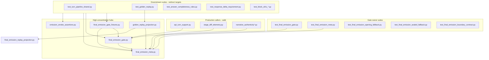

# Cycle AS — Downstream Dependency Reduction Recon

**Date:** 2026-06-04  
**Scope:** Recon only — no refactors, no behavior changes.  
**Goal:** Gather evidence to design Cycle AS implementation blocks that reduce indirect downstream dependence on gate-owned artifacts without changing emitted behavior.

**Ground truth:** `tests/test_ownership_registry.py` (`RESPONSIBILITY_REGISTRY`) — there is no standalone `ownership_registry.py` module; governance lives in that test module and is embedded in `tools/test_audit.py` inventory output.

**Machine-readable artifacts:** `cycle_as_gate_consumer_inventory.json`, `cycle_as_dependency_map.json` (268 direct import edges scanned via AST).

---

## Executive summary

The gate cluster is **highly fan-out**: 268 direct import edges from gate-owned modules across **112 consumer files**. The two largest concentration points are:

1. **`game.final_emission_meta`** — 80 consumers (read-side FEM projection, debug notes, owner-bucket helpers)
2. **`game.final_emission_gate`** — 57 consumers (orchestration entry + many private layer seams accessed from non-owner tests)

A third hub **`tests/helpers/final_emission_gate_fixtures.py`** re-exports gate-owned behavior to **22 downstream suites**, including private gate symbols (`feg._opening_scene_safe_fallback_selection`, `feg._enforce_response_type_contract`).

**Classification snapshot (268 edges):**

| Classification | Count | Meaning |
| --- | ---: | --- |
| KEEP | 103 | Valid owner-boundary or intentional diagnostic dependency |
| REDIRECT | 163 | Should depend on narrower public/boundary helper |
| INVESTIGATE | 2 | Unclear ownership/risk |
| INLINE_TEST_FIXTURE | 0* | *Heuristic folded into REDIRECT/KEEP; see AS blocks |
| RETIRE | 0* | *Private-gate-via-fixture edges flagged REDIRECT with retire notes |

**Primary problem:** Downstream integration smoke, transcript, equivalence, and convergence suites still **import gate modules directly** or **route through shared fixtures** that call private gate seams — restating orchestration/implementation detail instead of boundary wiring assertions.

**Recommended first block:** **AS1 — Fixture hub split and private-gate seam retirement** (lowest behavior risk, highest fan-out reduction).

---

## Current dependency shape



**Indirect chains (representative):**

| Chain | Kind | Risk |
| --- | --- | --- |
| `test_block_s_*` → `final_emission_gate_fixtures.runner_strict_bundle` → `apply_final_emission_gate` + `feg._enforce_response_type_contract` | fixture → gate private | Equivalence harness tied to layer order |
| `test_turn_pipeline_shared` → `emission_smoke_assertions` → `read_debug_notes_from_turn_payload` (meta) | helper → meta read | Acceptable if thinned to smoke facade only |
| `test_golden_replay` → `final_emission_gate_fixtures` + `SEALED_REPLACEMENT_SUBKINDS` (replay_projection) | test → fixture + runtime projection | Mixed: replay locks vs harness coupling |
| `test_narrative_authenticity*` → `_apply_narrative_authenticity_layer` (repairs) | test → repair private | Layer owner is repairs/gate, not NA suite |
| `test_narration_transcript_regressions` → gate + `response_type_contract` fixture + test-to-test import of `_fallback_contract` | test → gate + anti-pattern | High maintenance drag |

---

## Gate-owned artifacts and downstream consumers

### `game/final_emission_gate.py` (57 consumers)

**Production (KEEP):**

| Consumer | Symbols | Behavior |
| --- | --- | --- |
| `game/api_turn_support.py` | `apply_final_emission_gate` | Turn pipeline orchestration entry |
| `game/post_emission_speaker_adoption.py` | `detect_emitted_speaker_signature` | Speaker signature at finalize boundary |

**Fixture hub (REDIRECT / RETIRE):**

| Consumer | Symbols | Behavior |
| --- | --- | --- |
| `tests/helpers/final_emission_gate_fixtures.py` | `apply_final_emission_gate`, `feg._opening_scene_safe_fallback_selection`, `feg._enforce_response_type_contract` | Shared harness; private seam access |
| `tests/helpers/post_speaker_finalize_probe.py` | many `feg._apply_*`, `_finalize_emission_output` | Layer-order probe via monkeypatch |
| `tests/helpers/speaker_relocation_shadow_harness.py` | `feg`, `runner_strict_bundle` | Shadow equivalence wiring |

**Downstream non-owner tests (52 files — all REDIRECT candidates):** Full list in `cycle_as_dependency_map.json` → `gate_owned_modules.game.final_emission_gate.downstream_non_owner_consumers`. Highest fan-out clusters:

- **Equivalence blocks:** `test_block_s_speaker_local_rebind_equivalence.py`, `test_block_t_speaker_relocation_shadow_equivalence.py`, `test_block_u_finalize_stack_divergence.py` — import gate + `runner_strict_bundle`; monkeypatch private layers
- **Convergence / boundary:** `test_final_emission_boundary_convergence.py`, `test_final_emission_boundary_no_semantic_repair.py` — call `feg._enforce_response_type_contract`, `_strip_appended_route_illegal_contamination_sentences`
- **Registered downstream consumers (registry):** `test_turn_pipeline_shared.py` (via meta only), `test_answer_completeness_rules.py`, `test_response_delta_requirement.py`, `test_interaction_continuity_repair.py`, `test_diegetic_fallback_narration.py`
- **Transcript neighbors:** `test_narration_transcript_regressions.py`, `test_anti_railroading_transcript_regressions.py`
- **Replay/diagnostic:** `test_golden_replay.py`, `test_c4_narrative_mode_live_pipeline.py`

**Private symbol leakage (implementation-detail asserts):** 30+ distinct `feg._*` references outside `test_final_emission_gate.py` / `test_final_emission_opening_fallback.py`, including `_apply_narrative_authority_layer`, `_enforce_response_type_contract`, `_finalize_emission_output`, `_global_narrative_fallback_stock_line`, `_apply_response_delta_layer`.

---

### `game/final_emission_meta.py` (80 consumers)

**Production (KEEP — read-side projection consumers):**

| Consumer | Symbols | Behavior |
| --- | --- | --- |
| `game/stage_diff_telemetry.py` | `read_final_emission_meta_dict`, `stage_diff_narrative_authenticity_projection` | Stage-diff observability |
| `game/playability_eval.py` | `normalized_observational_telemetry_bundle`, `summarize_gameplay_validation_for_turn` | Evaluator read path |
| `game/gm_retry.py`, `game/dead_turn_report_visibility.py`, `game/narrative_authenticity*.py` | various read/project helpers | Telemetry threading |

**Compatibility re-export (INVESTIGATE):**

- `game/final_emission_meta.py` re-exports `build_fem_runtime_lineage_events` from `final_emission_replay_projection` (compat surface noted in module docstring ~L1763)
- Consumers: `tests/helpers/golden_replay_projection.py`, `tools/run_scenario_spine_validation.py`, `tests/test_run_scenario_spine_validation.py`

**Downstream test read pattern:** 60+ test files call `read_final_emission_meta_dict` directly instead of `final_emission_meta_from_output` / turn-packet accessors / smoke facade.

---

### `game/final_emission_boundary_contract.py` (4 consumers — tight)

| Consumer | Type | Classification |
| --- | --- | --- |
| `game/final_emission_gate.py` | production | KEEP |
| `game/final_emission_repairs.py` | production | KEEP |
| `game/fallback_provenance_debug.py` | production | KEEP |
| `tests/test_final_emission_boundary_contract.py` | owner test | KEEP |

**Well-contained.** No downstream test leakage.

---

### `game/final_emission_sealed_fallback.py` (3 consumers — tight)

| Consumer | Classification |
| --- | --- |
| `game/final_emission_gate.py` | KEEP |
| `tests/test_final_emission_sealed_fallback.py` | KEEP (owner) |
| `tests/test_final_emission_meta.py` | KEEP (projection owner cross-read) |

**No downstream non-owner consumers.** Good ownership boundary.

---

### `game/final_emission_opening_fallback.py` (4 consumers)

| Consumer | Classification | Notes |
| --- | --- | --- |
| `game/final_emission_gate.py` | KEEP | Orchestration adapter |
| `game/upstream_response_repairs.py` | KEEP | Upstream prepared opening meta |
| `game/opening_deterministic_fallback.py` | KEEP | Lazy import compat path |
| `tests/test_final_emission_opening_fallback.py` | KEEP | Owner suite |

**Downstream tests reach opening behavior via `final_emission_gate_fixtures` + `EXPECTED_FRONTIER_GATE_OPENING_FALLBACK` prose pin**, not via direct opening_fallback imports.

---

### `game/final_emission_repairs.py` (14 consumers)

**Owner:** `tests/test_final_emission_repairs.py`

**Downstream non-owner (REDIRECT):**

| Consumer | Private symbols | Asserted behavior |
| --- | --- | --- |
| `tests/test_narrative_authenticity.py`, `test_narrative_authenticity_aer4.py` | `_apply_narrative_authenticity_layer` | NA layer wiring |
| `tests/test_final_emission_answer_exposition_plan_convergence.py` | `_apply_answer_exposition_plan_layer` | Convergence vs gate |
| `tests/test_final_emission_boundary_convergence.py` | multiple `_apply_*` | Boundary convergence tables |
| `tests/test_n5_boundary_regressions.py`, `test_referent_clarity_clause_consumption.py` | `_apply_referent_clarity_emission_layer` | Referent clarity |
| `tests/test_bounded_partial_quality.py`, `test_social_fallback_leak_containment.py` | `repair_fallback_behavior` | Fallback behavior (validator pair) |

---

### `game/final_emission_replay_projection.py` (5 consumers)

| Consumer | Symbols | Classification |
| --- | --- | --- |
| `game/final_emission_meta.py` | `build_fem_runtime_lineage_events` | KEEP (owner re-export) |
| `tests/test_final_emission_meta.py` | projection surface tests | KEEP |
| `tests/test_ownership_registry.py` | governance import | KEEP |
| `tests/helpers/golden_replay_projection.py` | `is_sealed_replacement_lineage_kind` | KEEP (AO5 intentional) |
| `tests/test_golden_replay.py` | `SEALED_REPLACEMENT_SUBKINDS` | KEEP (replay lock vocabulary) |

**Runtime vs acceptance split is healthy (AO5 test in ownership registry).** Downstream golden replay dependency is intentional diagnostic, not HTTP smoke.

---

## Shared helper / fixture concentration points

### 1. `tests/helpers/final_emission_gate_fixtures.py` — **primary fan-out hub (22 consumers)**

Imports gate + meta + visibility fallback directly. Exposes:

| Export | Gate coupling | Downstream consumers |
| --- | --- | --- |
| `response_type_contract` | low | 6+ suites (fallback behavior, narration transcript, …) |
| `runner_strict_bundle` | medium | block S/T/U equivalence, boundary convergence |
| `opening_gate_attach_then_*` | **high (private `feg._*`)** | opening fallback owner tests, diegetic fallback, upstream repairs |
| `assert_fallback_owner_bucket`, `assert_opening_fallback_source`, `assert_sealed_fallback_owner_bucket`, `assert_visibility_pool` | owner-adjacent legality | opening bucket, visibility fallback, golden replay |
| `EXPECTED_FRONTIER_GATE_OPENING_FALLBACK` | prose pin | golden replay, API narration, scenario spine |
| `run_strict_social_motive_overclaim_gate_case` | full gate path | gauntlet regressions |

**Cycle AD/AL note already in module docstring:** bucket asserts should migrate toward `opening_fallback_evidence.py`; downstream smoke should use `emission_smoke_assertions.py`.

### 2. `tests/helpers/emission_smoke_assertions.py` — **intended downstream facade**

- Single meta import: `read_debug_notes_from_turn_payload` (REDIRECT to turn-packet helper)
- Used by `test_turn_pipeline_shared.py`, answer completeness, response delta, broadcast social
- **Correct direction** for AS work; expand surface rather than new gate imports

### 3. `tests/helpers/golden_replay_projection.py` — **replay diagnostic hub**

- Imports meta + `is_sealed_replacement_lineage_kind` from replay_projection
- 41 protected observation paths; intentionally separate from runtime projection
- Consumers: `test_golden_replay.py`, failure dashboard/classifier — **KEEP**

### 4. `tests/helpers/opening_fallback_evidence.py` — **FEM evidence builders**

- Imports meta bucket helpers
- Underused vs `final_emission_gate_fixtures` for downstream wiring

### 5. Test-to-test import anti-patterns (indirect gate contract dependence)

| Importer | Import source | Classification |
| --- | --- | --- |
| `test_narration_transcript_regressions.py` | `test_fallback_behavior_gate._fallback_contract`, `_answer_contract` | RETIRE |
| `test_final_emission_gate.py`, `test_c4_*`, `test_final_emission_boundary_no_semantic_repair.py` | `test_narrative_mode_output_validator._minimal_ctir_continuation` | INLINE_TEST_FIXTURE |
| `test_answer_completeness_rules.py` | `test_social_escalation._session_with_pressure` | INLINE_TEST_FIXTURE |
| `test_golden_replay.py`, block S/T/U | cross-import equivalence harness modules | INVESTIGATE |

---

## Compatibility pathways still reachable downstream

| Pathway | Location | Downstream reach | AS action |
| --- | --- | --- | --- |
| `OPENING_FALLBACK_AUTHORSHIP_COMPATIBILITY_LOCAL` | `opening_fallback_evidence.py`, gate fixtures | golden replay, opening tests | KEEP; ensure downstream uses evidence module not fixtures |
| `build_fem_runtime_lineage_events` meta re-export | `final_emission_meta.py` L1768 | golden_replay_projection, scenario spine tool | REDIRECT to `final_emission_replay_projection` or narrow read API |
| `compose_opening_fallback_compatibility_local` | gate (closeout test reference) | gate convergence closeout only | KEEP inside gate owner |
| Private gate symbols importable from package | `final_emission_gate.py` docstring L22-24 | 30+ non-owner call sites | RETIRE / REDIRECT — add boundary helpers or tighten imports in audit |
| `VisibilitySelectedFallback` tuple adapter | visibility_fallback + fixtures | opening/sealed fallback tests via fixtures | KEEP in owner suites; REDIRECT fixture consumers to owner helpers |
| Validator "compatibility residue" wrappers | `final_emission_validators.py` | upstream_response_repairs, narrative_mode_contract | INVESTIGATE — may belong in response_policy_contracts |
| `game/anti_reset_emission_guard.py` | mirrors `_opening_scene_preference_active` without import | — | KEEP (intentional decoupling) |

---

## Candidate implementation blocks

### AS1 — Fixture hub split and private-gate seam retirement

**Purpose:** Split `final_emission_gate_fixtures.py` into owner-harness vs downstream-wiring surfaces; eliminate private `feg._*` calls from shared fixtures.

**Files likely touched:**

- `tests/helpers/final_emission_gate_fixtures.py` (shrink / split)
- `tests/helpers/opening_fallback_evidence.py` ( absorb bucket asserts )
- `tests/helpers/emission_smoke_assertions.py` ( absorb `response_type_contract`, FEM read helpers )
- Downstream: block S/T/U, diegetic fallback, upstream repairs, narration transcript (22 consumers)

**Risks:** Low if behavior-preserving; fixture call signature changes ripple widely.

**Validation:**

```bash
pytest tests/test_final_emission_gate.py tests/test_final_emission_opening_fallback.py \
  tests/test_block_s_speaker_local_rebind_equivalence.py tests/test_block_t_speaker_relocation_shadow_equivalence.py \
  tests/test_block_u_finalize_stack_divergence.py -q
```

**Parallel with:** AS4 (meta read redirect) — coordinate on FEM read helper naming.

---

### AS2 — Downstream gate import thinning (registered consumers)

**Purpose:** Replace direct `apply_final_emission_gate` + `read_final_emission_meta_dict` in registry-listed downstream consumers with smoke facade / turn-packet wiring asserts.

**Target suites (from `RESPONSIBILITY_REGISTRY.final_emission_gate_orchestration.downstream_consumer_suites`):**

- `tests/test_turn_pipeline_shared.py`
- `tests/test_answer_completeness_rules.py`
- `tests/test_response_delta_requirement.py`
- `tests/test_interaction_continuity_repair.py`
- `tests/test_diegetic_fallback_narration.py`

**Files likely touched:** above + `tests/helpers/emission_smoke_assertions.py`, `tests/helpers/turn_pipeline_http_fixtures.py`

**Risks:** Medium — must not drop consumer-layer boundary validate-only traces (`assert_response_delta_boundary_validate_only`, etc.).

**Validation:**

```bash
pytest tests/test_turn_pipeline_shared.py tests/test_answer_completeness_rules.py \
  tests/test_response_delta_requirement.py tests/test_interaction_continuity_repair.py \
  tests/test_diegetic_fallback_narration.py -q
```

**Parallel with:** AS1 after fixture split defines public harness API.

---

### AS3 — Repairs-layer downstream decoupling

**Purpose:** Stop non-owner suites from importing `_apply_*` repair layers directly; route through gate owner tests or exported boundary validators.

**Files likely touched:**

- `tests/test_narrative_authenticity.py`, `tests/test_narrative_authenticity_aer4.py`
- `tests/test_final_emission_boundary_convergence.py`
- `tests/test_final_emission_answer_exposition_plan_convergence.py`
- `tests/test_n5_boundary_regressions.py`, `tests/test_referent_clarity_clause_consumption.py`

**Risks:** Medium — convergence tests may intentionally pin layer interaction order.

**Validation:**

```bash
pytest tests/test_final_emission_repairs.py tests/test_final_emission_boundary_convergence.py \
  tests/test_narrative_authenticity.py tests/test_n5_boundary_regressions.py -q
```

**Parallel with:** AS5 (convergence suite consolidation) — sequential recommended.

---

### AS4 — FEM read-path redirect and compat re-export cleanup

**Purpose:** Consolidate downstream FEM reads on `turn_packet` / smoke helpers; migrate `build_fem_runtime_lineage_events` consumers off meta compat re-export.

**Files likely touched:**

- `game/final_emission_meta.py` (re-export policy)
- `tests/helpers/golden_replay_projection.py`, `tools/run_scenario_spine_validation.py`
- High-read suites: social emission, transcript regressions, C4 pipeline

**Risks:** Low–medium — replay/scenario spine sensitive to lineage shape.

**Validation:**

```bash
pytest tests/test_final_emission_meta.py tests/test_golden_replay.py \
  tests/test_run_scenario_spine_validation.py tests/test_turn_packet_stage_diff_integration.py -q
```

**Parallel with:** AS1 (FEM read helper naming).

---

### AS5 — Test-to-test import and convergence assert retirement

**Purpose:** Eliminate test-to-test gate contract imports; move shared contracts to `tests/helpers/` modules with explicit boundary scope.

**Files likely touched:**

- `tests/test_narration_transcript_regressions.py`
- `tests/test_fallback_behavior_gate.py` (extract contracts)
- `tests/test_narrative_mode_output_validator.py`
- `tests/test_answer_completeness_rules.py`

**Risks:** Low — mostly import moves.

**Validation:**

```bash
pytest tests/test_narration_transcript_regressions.py tests/test_fallback_behavior_gate.py \
  tests/test_answer_completeness_rules.py -q
```

**Parallel with:** AS1, AS2.

---

### AS6 — Equivalence harness gate decoupling (block S/T/U)

**Purpose:** Refactor speaker relocation / finalize stack equivalence harnesses to depend on public gate entry + observation probes, not private layer monkeypatch lists.

**Files likely touched:**

- `tests/helpers/speaker_relocation_shadow_harness.py`
- `tests/helpers/post_speaker_finalize_probe.py`
- `tests/test_block_s_speaker_local_rebind_equivalence.py`
- `tests/test_block_t_speaker_relocation_shadow_equivalence.py`
- `tests/test_block_u_finalize_stack_divergence.py`

**Risks:** **High** — equivalence tests are order-sensitive; do last.

**Validation:**

```bash
pytest tests/test_block_s_speaker_local_rebind_equivalence.py \
  tests/test_block_t_speaker_relocation_shadow_equivalence.py \
  tests/test_block_u_finalize_stack_divergence.py tests/test_golden_replay.py -q
```

**Parallel with:** None — run after AS1/AS3.

---

## Recommended first block

**AS1 — Fixture hub split and private-gate seam retirement**

Reasons:

1. **Highest fan-out** — 22 direct consumers of `final_emission_gate_fixtures.py`
2. **Contains RETIRE-class edges** — private `feg._opening_scene_safe_fallback_selection` / `_enforce_response_type_contract` in shared fixture
3. **Aligns with prior cycles** AD-4, AL2–AL4 docstrings already point downstream to `emission_smoke_assertions` and `opening_fallback_evidence`
4. **Low behavior risk** if changes are import/harness-only with existing test coverage

---

## Test commands run and results

| Command | Result |
| --- | --- |
| `pytest tests/test_ownership_registry.py tests/test_final_emission_debt_retirement.py -q` | **PASS** (24 tests) |
| `pytest tests/test_golden_replay.py -q` | **PASS** (68 tests) |
| `pytest tests/test_turn_pipeline_shared.py -q` | **PASS** (69 tests) |
| AST import scan (`game.final_emission_*`, `tests.helpers.final_emission_gate_fixtures`) | 268 direct edges → JSON artifacts |

Full suite not run (recon scope); targeted commands confirm governance and highest-risk replay/smoke paths are green at baseline.

---

## Open questions / files needed

1. **Public boundary API for gate harness:** Should AS1 introduce `tests/helpers/gate_boundary_harness.py` with only `apply_final_emission_gate` + turn-packet FEM reads, or expand `emission_smoke_assertions`?
2. **Private symbol policy:** Should `test_architecture_audit_tool.py` / validation-layer audits enforce no `_apply_*` imports outside owner suites (extend existing leakage checks)?
3. **Convergence suite ownership:** Are `test_final_emission_boundary_convergence.py` and `test_final_emission_boundary_no_semantic_repair.py` gate neighbors or gate owners? Registry lists neither as direct owner — classify before AS3.
4. **Replay projection constants:** Can `SEALED_REPLACEMENT_SUBKINDS` move behind `golden_replay_projection` facade exclusively (golden_replay currently imports both fixture hub and replay_projection)?
5. **Production meta fan-out:** Should `narrative_authenticity*.py` / `playability_eval.py` depend on a narrower observability module instead of full `final_emission_meta`?
6. **Files to read before AS2 implementation:** `tests/helpers/turn_pipeline_http_fixtures.py`, `tests/validation_coverage_registry.py`, Cycle AL closure docs for thinned assertion lists.

---

## Appendix: ownership registry reference

Gate-related `RESPONSIBILITY_REGISTRY` groups (from `tests/test_ownership_registry.py`):

| Group ID | Direct owner | Downstream neighbors (excerpt) |
| --- | --- | --- |
| `final_emission_gate_orchestration` | `tests/test_final_emission_gate.py` | turn_pipeline, answer_completeness, response_delta, interaction_continuity, diegetic_fallback |
| `final_emission_meta_projection` | `tests/test_final_emission_meta.py` | turn_packet_stage_diff, diegetic_fallback |
| `final_emission_visibility_semantics` | `tests/test_final_emission_visibility.py` | turn_pipeline |
| `gauntlet_playability_validation` | (evaluator owner) | `test_golden_replay.py` as gauntlet suite |

Cycle AS work should keep registry downstream lists accurate as imports are redirected.
