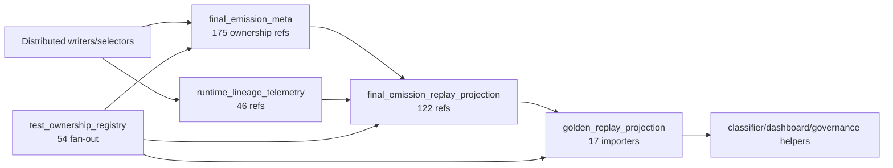

# BU - Post-BJ Fan-In / Fan-Out Validation

Date: 2026-06-20

## Executive summary

BJ genuinely reduced the single-module concentration in `game/final_emission_gate.py`, but it did
not reduce ecosystem coupling to the same degree. The gate fell from 9,316 lines immediately before
BJ to 308 lines at BJ and remains 308 lines now. Its current file-level local import fan-out is 7,
and only one production file imports it directly. That is a real orchestration-boundary improvement.

The coupling was partly redistributed into explicit owners. The clearest BJ-created bidirectional
hubs are:

| Module | Fan-in | Production fan-in | Fan-out | Assessment |
|---|---:|---:|---:|---|
| `game.final_emission_strict_social_stack` | 22 | 1 | 22 | New BJ routing hotspot; most inbound pressure is tests/helpers |
| `game.final_emission_terminal_pipeline` | 25 | 2 | 14 | New BJ convergence hotspot; highest fan-in among BJ-added modules |
| `game.final_emission_non_strict_stack` | 10 | 1 | 19 | New BJ fan-out hotspot |
| `game.final_emission_finalize` | 13 | 4 | 7 | Moderate shared finalizer, not a dominant import router |
| `game.final_emission_response_type` | 12 | 3 | 10 | Moderate extracted policy hub |

Existing or post-BJ-adjacent concentration remains stronger than the finalizer itself:
`game.final_emission_meta` (57/4), `game.social_exchange_emission` (53/12),
`game.final_emission_text` (50/1), and `game.final_emission_visibility_fallback` (18/18).
Test coupling is especially concentrated in `tests.helpers.emission_smoke_assertions` (70 fan-in),
`tests.test_ownership_registry` (54 fan-out), and
`tests.test_final_emission_gate_delegator_regression` (41 fan-out).

Verdict: **BJ reduced the gate hotspot and made ownership more legible, while redistributing a
material amount of coupling into stack/pipeline and test-governance hotspots. Overall concentration
did not worsen, but ecosystem breadth remains high.** Across the 58 production modules in scope,
the top module holds 8.7% of measured fan-in and the top five hold 32.8%; for fan-out the equivalent
shares are 7.9% and 30.6%. This is distributed concentration rather than a replacement monolith.

## Method and scope

`scripts/bu_final_emission_coupling_discovery.py` parses every Python file under `game/`, `tests/`,
and `scripts/` with the standard-library AST. It resolves direct project imports and direct calls
made through `from x import y` and simple module aliases. Counts are unique caller/importer files,
not occurrence counts. Dynamic imports, reflective calls, string references, monkeypatch target
strings, and same-file internal calls are excluded from caller fan-in. Ownership reference counts
are lexical evidence and should be read as dependency concentration, not as runtime call counts.

There is no `src/` directory in this repository. Production code lives under `game/`. The measured
ecosystem contains 208 Python modules: 58 production modules and 150 tests/helpers. No `scripts/`
module met the ecosystem selection rule; the discovery script itself is the relevant script.
The CSV files are the exhaustive machine-readable inventory.

## Final-emission ecosystem inventory

### Production

| Responsibility | Current modules |
|---|---|
| Gate entry and preflight | `final_emission_runtime`, `final_emission_gate`, `final_emission_gate_context`, and the eight `final_emission_gate_preflight_*` modules |
| Branch stacks and exits | `final_emission_strict_social_stack`, `final_emission_non_strict_stack`, `final_emission_generic_exit`, `final_emission_terminal_pipeline` |
| Finalization | `final_emission_finalize`, `final_emission_fem_assembly`, `final_emission_meta` |
| Policy and validation | `final_emission_acceptance_quality`, `answer_shape_primacy`, `anti_railroading`, `boundary_contract`, `context_separation`, `contract`, `narrative_authority`, `narrative_mode_output`, `opening_mode`, `player_facing_narration_purity`, `referential_clarity`, `repairs`, `response_type`, `scene_emit_integrity`, `scene_facts`, `scene_state_anchor`, `text`, `tone_escalation`, `validators` |
| Composition | `final_emission_first_mention_composition`, `final_emission_passive_scene_pressure`, `dialogue_social_plan`, `social_exchange_emission` |
| Fallback selection/projection | `fallback_behavior`, `fallback_provenance_debug`, `diegetic_fallback_narration`, `opening_deterministic_fallback`, `final_emission_fast_fallback_composition`, `final_emission_opening_fallback`, `final_emission_sealed_fallback`, `final_emission_visibility_fallback` |
| Replay projection | `final_emission_replay_projection` |
| Speaker finalization | `emitted_speaker_signature`, `speaker_contract_enforcement`, `post_emission_speaker_adoption` |
| Sanitizer | `output_sanitizer` |
| Attribution/lineage | `opening_scene_realization`, `realization_authority`, `realization_provenance`, `runtime_lineage_telemetry` |

All production paths above are under `game/`.

### Tests and helpers

The 150 measured non-production modules comprise 34 fallback owners/consumers, 16 replay modules,
13 attribution modules, 12 speaker modules, 7 gate modules, 5 ownership modules, one finalization
module, one strict-social module, and 61 supporting contract/integration tests. Important surfaces are:

- Gate: `tests/test_final_emission_gate_*.py`, especially `delegator_regression`,
  `orchestration_order`, `selector_snapshots`, `diagnostics`, and `n4`.
- Replay: `tests/helpers/golden_replay.py`, `golden_replay_projection.py`, the golden replay fixture/API
  helpers, and `tests/test_golden_replay*.py`.
- Ownership: `tests/test_ownership_registry.py`, `tests/failure_classification_contract.py`, and the
  replay governance registry/contract modules.
- Fallback: `tests/test_final_emission_*fallback.py`, `tests/test_opening_fallback_owner_bucket.py`,
  `tests/helpers/opening_fallback_evidence.py`, and `opening_fallback_gate_harness.py`.
- Speaker: `tests/helpers/post_speaker_finalize_probe.py`, `speaker_gate_order.py`,
  `speaker_relocation_shadow_harness.py`, `speaker_contract_risk.py`, and speaker contract tests.
- Attribution: `tests/helpers/replacement_attribution_inventory.py`, `attribution_contract.py`,
  `attribution_completeness_metric.py`, `runtime_lineage_reporting.py`, and their tests.
- Shared gate facade: `tests/helpers/emission_smoke_assertions.py`.

The exact file list, responsibility label, and import edges for every module are in
`docs/audits/BU_import_fan_in_fan_out.csv`.

### Relevant intent and audit records

- BJ source of truth: commit `11ff282` (`BJ: Final Emission Gate Responsibility Extraction`).
- Post-BJ topology baseline: `docs/audits/discovery/BO_dependency_map.md` and
  `docs/audits/discovery/BO_hotspot_inventory.md`.
- Fallback ownership: `docs/audits/discovery/BK_fallback_ownership_map.md` and related BK audits.
- Replay projection: BL closure/recon records and `docs/audits/discovery/BO_dependency_map.md`.
- Semantic attribution: `docs/BS_semantic_replacement_attribution_discovery.md`, `docs/audits/metrics/BS2_attribution_gap_map.md`, and `docs/audits/metrics/BS3_canonical_attribution_contract.md`.
- Speaker finalization: `docs/audits/BT_speaker_finalization_divergence_discovery.md`.

## Import fan-in/fan-out table

Fan-in is the number of files importing the module. Fan-out is the number of distinct local project
modules it imports. Production, test, helper, and script counts are separated in the CSV.

### Top 10 by fan-in (all ecosystem modules)

| Rank | Module | Kind | Fan-in | Prod | Tests | Helpers | Fan-out |
|---:|---|---|---:|---:|---:|---:|---:|
| 1 | `tests.helpers.emission_smoke_assertions` | helper | 70 | 0 | 69 | 1 | 2 |
| 2 | `game.final_emission_meta` | production | 57 | 25 | 26 | 6 | 4 |
| 3 | `game.social_exchange_emission` | production | 53 | 27 | 25 | 1 | 12 |
| 4 | `game.final_emission_text` | production | 50 | 37 | 10 | 3 | 1 |
| 5 | `game.final_emission_gate` | production | 29 | 1 | 27 | 1 | 7 |
| 6 | `game.realization_provenance` | production | 26 | 7 | 17 | 2 | 1 |
| 7 | `game.final_emission_terminal_pipeline` | production | 25 | 2 | 22 | 1 | 14 |
| 8 | `game.final_emission_strict_social_stack` | production | 22 | 1 | 17 | 4 | 22 |
| 9 | `game.final_emission_validators` | production | 21 | 10 | 10 | 1 | 4 |
| 10 | `game.final_emission_repairs` | production | 21 | 6 | 11 | 4 | 7 |

### Top 10 by fan-out (all ecosystem modules)

| Rank | Module | Kind | Fan-out | Fan-in | Note |
|---:|---|---|---:|---:|---|
| 1 | `tests.test_ownership_registry` | test | 54 | 0 | Governance scanner/router |
| 2 | `tests.test_final_emission_gate_delegator_regression` | test | 41 | 0 | BJ static source lock router |
| 3 | `game.final_emission_strict_social_stack` | production | 22 | 22 | BJ-added stack |
| 4 | `tests.test_final_emission_gate_orchestration_order` | test | 21 | 0 | Behavioral orchestration owner |
| 5 | `tests.test_final_emission_opening_fallback` | test | 20 | 0 | Fallback integration owner |
| 6 | `game.final_emission_non_strict_stack` | production | 19 | 10 | BJ-added stack |
| 7 | `game.final_emission_visibility_fallback` | production | 18 | 18 | Existing fallback router |
| 8 | `tests.test_speaker_contract_risk` | test | 15 | 0 | Cross-layer speaker risk audit |
| 9 | `tests.test_final_emission_gate_selector_snapshots` | test | 14 | 0 | Gate/fallback snapshot owner |
| 10 | `tests.test_narration_transcript_regressions` | test | 14 | 1 | Broad integration test |

The next production module is `game.final_emission_terminal_pipeline` at 14 fan-out. The exhaustive
table includes importer and imported-module lists.

## Caller fan-in table

The CSV contains 581 directly resolved public APIs. The table below focuses on public boundaries
that replaced or now sit downstream of old gate re-exports/delegators.

| API | Definition | Callers | P/T/H/S | Caller files (summary) |
|---|---|---:|---|---|
| `apply_final_emission_gate_consumer` | `tests/helpers/emission_smoke_assertions.py` | 35 | 0/34/1/0 | Shared downstream test facade |
| `apply_final_emission_gate` | `game/final_emission_gate.py` | 15 | 1/14/0/0 | Runtime facade plus direct gate owner tests |
| `finalize_player_facing_emission` | `game/final_emission_runtime.py` | 12 | 1/10/1/0 | `api_turn_support`, smoke facade, integration tests |
| `build_fem_runtime_lineage_events` | `game/final_emission_replay_projection.py` | 7 | 1/3/3/0 | FEM packaging, attribution/replay helpers and tests |
| `finalize_emission_output` | `game/final_emission_finalize.py` | 7 | 2/5/0/0 | Generic exit, strict stack, focused tests |
| `enforce_emitted_speaker_with_contract` | `game/speaker_contract_enforcement.py` | 6 | 1/5/0/0 | Strict stack and speaker/social tests |
| `first_mention_composition_meta` | `game/final_emission_visibility_fallback.py` | 6 | 4/2/0/0 | Four production composition/fallback owners |
| `VisibilitySelectedFallback` | same | 6 | 3/3/0/0 | Opening/passive/integrity modules and tests |
| `project_turn_observation` | `tests/helpers/golden_replay_projection.py` | 4 | 0/2/2/0 | Golden replay, fixtures, dashboard/projection tests |
| `apply_post_emission_speaker_adoption` | `game/post_emission_speaker_adoption.py` | 4 | 1/3/0/0 | API plus adoption/transcript tests |
| `stamp_sealed_fallback_realization_family` | `game/final_emission_sealed_fallback.py` | 4 | 3/1/0/0 | Generic exit, strict stack, terminal pipeline |
| `run_gate_terminal_enforcement_pipeline` | `game/final_emission_terminal_pipeline.py` | 2 | 2/0/0/0 | Generic exit and strict stack |
| `apply_visibility_enforcement` | `game/final_emission_visibility_fallback.py` | 2 | 1/1/0/0 | Terminal pipeline plus owner test |

The direct-owner migration is real: production routing now calls stack, terminal, finalize, response
type, speaker, and fallback owners instead of resolving those helpers through the gate namespace.
The residual gate fan-in is mostly test ownership (28 of 29 importers), not production layering.
The counterweight is test amplification: the BJ delegator regression suite imports 41 modules and the
shared smoke facade has 70 importers.

## Ownership dependency map

### Production concentration

| Module | Ownership refs | Owner bucket | Final emission | Gate | Replay | Fallback | Speaker |
|---|---:|---:|---:|---:|---:|---:|---:|
| `game.final_emission_meta` | 175 | 44 | 0 | 15 | 1 | 114 | 0 |
| `game.final_emission_replay_projection` | 122 | 15 | 12 | 15 | 0 | 76 | 4 |
| `game.runtime_lineage_telemetry` | 46 | 12 | 0 | 0 | 0 | 34 | 0 |
| `game.final_emission_visibility_fallback` | 43 | 21 | 0 | 1 | 0 | 21 | 0 |
| `game.output_sanitizer` | 17 | 6 | 2 | 0 | 0 | 9 | 0 |
| `game.final_emission_sealed_fallback` | 13 | 4 | 0 | 1 | 0 | 8 | 0 |
| `game.social_exchange_emission` | 11 | 0 | 0 | 0 | 0 | 10 | 1 |
| `game.fallback_provenance_debug` | 8 | 1 | 1 | 0 | 0 | 5 | 0 |
| `game.final_emission_response_type` | 8 | 3 | 0 | 0 | 0 | 5 | 0 |
| `game.speaker_contract_enforcement` | 4 | 0 | 0 | 0 | 0 | 2 | 2 |
| `game.final_emission_gate` | 3 | 0 | 1 | 1 | 0 | 0 | 1 |

Ownership metadata is **centralized for schema/read-side interpretation** in FEM meta and replay
projection, but **scattered at write/selection boundaries** across visibility, sealed fallback,
sanitizer, social emission, response type, provenance, and runtime lineage. This is a coherent
central-read/distributed-write design, but the two central readers are high-change-risk surfaces.

Test-side concentration is stronger: `tests.test_ownership_registry` has 311 lexical ownership
references, `tests.test_final_emission_meta` 164, `tests.helpers.replacement_attribution_inventory`
99, and `tests.helpers.failure_classifier` 96. The ownership registry is intentionally centralized,
but its 54-module import fan-out makes it a governance meta-router.

### Dependency map



## Hotspot concentration findings

1. **Gate concentration reduced.** BJ removed roughly 9,000 lines from the gate and current fan-out
   is 7. Only `game.final_emission_runtime` imports the gate in production.
2. **Routing concentration redistributed.** The BJ-added strict stack (22/22), terminal pipeline
   (25/14), and non-strict stack (10/19) are the new operational routers. They are explicit owners,
   but changes to their orchestration can still touch many contracts.
3. **Finalization is shared but not dominant.** `final_emission_finalize` is 13/7 with four production
   importers and seven direct API caller files. It did not become the replacement monolith.
4. **Replay projection is bounded on imports, dense on ownership.** Runtime
   `final_emission_replay_projection` is 10/3, while test-side `golden_replay_projection` is 17/7.
   Their 122 runtime ownership references and broad protected-schema APIs make semantic coupling
   larger than import counts alone suggest.
5. **Visibility fallback remains the strongest production two-way hotspot.** At 18/18 it combines
   selection, owner-bucket projection, and cross-family routing. This hotspot predates BJ but remains
   a likely change-cascade source.
6. **Speaker finalization is split, not centralized.** `speaker_contract_enforcement` is 15/4 and
   post-emission adoption is 4/5. The strict stack is the only production caller of enforcement;
   the API is the only production caller of post-emission adoption. This is bounded structurally,
   though BT documents semantic divergence risk between the two phases.
7. **Test helpers are the largest consumer concentration.** The 70-importer smoke facade reduces
   direct gate imports but becomes a test dependency hub. The ownership and BJ regression tests are
   broad static routers (54 and 41 fan-out). This is coupling containment, not coupling elimination.

## Comparison against BJ intent

| Candidate destination | Current evidence | Result |
|---|---|---|
| `final_emission_finalize.py` | 13 fan-in, 7 fan-out, 7 direct caller files | Moderate concentration; not the new monolith |
| `final_emission_replay_projection.py` | 10/3 imports, 122 ownership refs, 7 callers for lineage builder | Import-bounded; schema/ownership dense |
| `golden_replay_projection.py` | 17/7 imports; several protected-registry APIs with 2-7 callers | Test-side projection hotspot |
| Speaker finalization | Enforcement 15/4; post-adoption 4/5 | Split and bounded, with semantic dual-phase risk |
| Fallback modules | Visibility 18/18; sealed 11/8; finalize-related callers cross both | Coupling remains concentrated in visibility routing |
| Ownership registry/enforcement | Registry 54 fan-out and 311 refs; FEM/replay own read-side schema | Centralized governance plus distributed writers |
| Test helpers | Smoke facade 70 fan-in; replay projection 17 fan-in | Significant redistributed test coupling |

BJ achieved its narrow intent: direct owners replaced gate delegators/re-exports, the gate became a
thin orchestration boundary, and production consumers no longer treat it as a utility namespace.
The broader coupling goal is only partially achieved because orchestration, fallback selection,
metadata ownership, and regression locks now form several medium-size hubs.

## Candidate next blocks

### Recommended: BU1 - Stack/Pipeline Contract Surface Reduction Discovery

Measure and classify the 22 imports in `final_emission_strict_social_stack`, 19 in
`final_emission_non_strict_stack`, and 14 in `final_emission_terminal_pipeline` as orchestration,
data/schema, policy, telemetry, or test-only seam dependencies. Identify which imports can become
typed input bundles or calls behind one existing owner without changing ordering. Start as discovery;
do not merge the strict and non-strict paths.

Other candidates:

- **BU2 - Visibility fallback dependency split:** separate selection/routing dependencies from
  owner-bucket projection dependencies; preserve fallback ordering and replay fields.
- **BU3 - Test governance router reduction:** replace per-module imports in the BJ delegator and
  ownership-registry suites with manifest-driven static checks where equivalent. **Completed 2026-06-20:**
  `tests/helpers/gate_delegator_governance.py` centralizes manifest/path/AST source inspection and lazy
  `importlib` owner checks; `tests/test_final_emission_gate_delegator_regression.py` direct `game.*`
  import fan-out **38 → 0**; ownership-registry duplicate locks partially migrated (remaining fan-out ~48).
- **BU4 - Ownership write-path registry:** enumerate every writer of owner buckets/attribution fields
  and verify they consume one schema vocabulary from FEM/replay projection.

## Files likely needed by ChatGPT for follow-up

- `game/final_emission_gate.py`
- `game/final_emission_strict_social_stack.py`
- `game/final_emission_non_strict_stack.py`
- `game/final_emission_terminal_pipeline.py`
- `game/final_emission_finalize.py`
- `game/final_emission_meta.py`
- `game/final_emission_replay_projection.py`
- `game/final_emission_visibility_fallback.py`
- `game/final_emission_sealed_fallback.py`
- `game/speaker_contract_enforcement.py`
- `game/post_emission_speaker_adoption.py`
- `tests/helpers/emission_smoke_assertions.py`
- `tests/helpers/golden_replay_projection.py`
- `tests/helpers/gate_delegator_governance.py`
- `tests/test_gate_delegator_governance.py`
- `scripts/bu_final_emission_coupling_discovery.py`
- The three `docs/audits/BU_*.csv` outputs.

## Validation and exact commands

Static discovery commands:

```powershell
rg --files game tests scripts
rg -l "BJ-[0-9]+|Cycle BJ|Block BJ|\bBJ\b" docs game tests scripts -g "*.md" -g "*.py"
git show --stat --oneline 11ff282
git diff-tree --no-commit-id --name-status -r 11ff282
git show 11ff282^:game/final_emission_gate.py | Measure-Object -Line
git show 11ff282:game/final_emission_gate.py | Measure-Object -Line
& 'C:\Users\Master Mandalcio\.cache\codex-runtimes\codex-primary-runtime\dependencies\python\python.exe' scripts\bu_final_emission_coupling_discovery.py
```

The analyzer reported: `Parsed 608 Python files; ecosystem=208 modules`, `Import rows=208`,
`caller APIs=581`, and `ownership rows=148`.

Behavioral validation is intentionally limited to ownership/delegator guards because BU changes no
runtime code.

```powershell
$env:PYTHONPATH='.\.venv\Lib\site-packages'
& 'C:\Users\Master Mandalcio\.cache\codex-runtimes\codex-primary-runtime\dependencies\python\python.exe' -m pytest tests\test_final_emission_gate_delegator_regression.py -q --tb=short --basetemp=codex_pytest_tmp_bu3
& 'C:\Users\Master Mandalcio\.cache\codex-runtimes\codex-primary-runtime\dependencies\python\python.exe' -m pytest tests\test_ownership_registry.py tests\test_final_emission_gate_delegator_regression.py -q --tb=short --basetemp=codex_pytest_tmp_bu2
```

Results:

- `tests/test_final_emission_gate_delegator_regression.py`: **123 passed**.
- Combined ownership/delegator run: **7 failed, 306 passed**. All seven failures are existing
  governance-state findings outside BU's documentation-only changes: five missing decomposed golden
  replay paths/inventory-layer inconsistencies (reported through several assertions), two
  cross-file duplicate test-name allowlist gaps, direct replay-projection imports introduced by the
  attribution surfaces, one direct gate import in `test_speaker_contract_risk.py`, and BJ-127's
  global string scan matching a negative assertion inside the delegator regression file itself.
  BU intentionally did not repair these findings.
