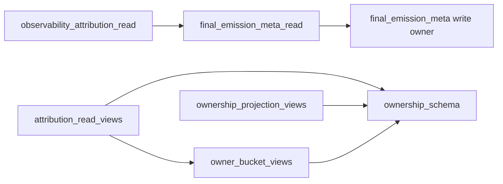

# BV10A — Delegate Verification

**Date:** 2026-06-21  
**Phase:** BV10 Phase 1 (view extraction)  
**Constraint:** No runtime behavior, replay behavior, ownership authority, or consumer migration changes.

---

## Executive summary

Three read-side facades were added. Automated verification confirms each module **delegates only** — no write paths, no mapper logic, no schema authority relocation.

| Facade | Delegates to | Public definitions (non-reexport) |
|---|---|---|
| `game.attribution_read_views` | `owner_bucket_views` + `ownership_schema` | `attribution_read_views_surface()` |
| `game.ownership_projection_views` | `ownership_schema` | `lineage_owner_vocabulary()`, `sanitizer_trace_owner_vocabulary()`, `ownership_projection_views_surface()` |
| `game.observability_attribution_read` | `final_emission_meta_read` | `observability_attribution_read_surface()` |

---

## Verification method

| Check | Mechanism | Result |
|---|---|---|
| Function identity delegation | `tests/test_bv10a_read_facade_delegates.py` — `assert facade_fn is authority_fn` | **Pass** |
| Constant identity delegation | Same test — schema/bucket constants are identical objects | **Pass** |
| No write authority symbols | AST scan — no `ensure_`, `patch_`, `merge_`, `stamp_`, etc. defined in facade modules | **Pass** |
| Limited public function surface | AST scan — only registry/vocabulary helpers defined locally | **Pass** |
| Registry surfaces diagnostic-only | Surfaces return metadata dicts; no payload reads | **Pass** |

---

## Per-facade delegate audit

### `attribution_read_views.py`

| Category | Symbols | Authority |
|---|---|---|
| Bucket mappers (4) | `opening_fallback_owner_bucket_from_*`, `visibility_*`, `sealed_*` | `final_emission_owner_bucket_views` — **same function objects** |
| Bucket vocabulary | frozensets + scalar bucket tokens | Re-exported from `owner_bucket_views` (which re-exports schema) |
| Classifier vocabulary | `ALLOWED_FALLBACK_*`, selection/content owner tokens | `final_emission_ownership_schema` — **same objects** |
| Registry passthrough | `fallback_owner_bucket_registry_surface`, `ownership_schema_registry_surface` | Direct re-export from schema |
| Local helper | `attribution_read_views_surface()` | Filters schema registry keys — **read-only assembly, no authority** |

**Write logic:** None  
**Mapper logic:** None (delegated unchanged)

### `ownership_projection_views.py`

| Category | Symbols | Authority |
|---|---|---|
| Lineage projection constants | `OWNERSHIP_LINEAGE_ATTRIBUTION_FIELDS`, selection/content owners, sanitizer trace fields | `ownership_schema` — **same objects** |
| Normalization | `normalize_sanitizer_trace_owner_to_lineage_owner` | **Same function object** |
| Local helpers | `lineage_owner_vocabulary()`, `sanitizer_trace_owner_vocabulary()` | Subset of `ownership_schema_registry_surface()` — **no new tokens** |
| Registry | `ownership_projection_views_surface()` | Diagnostic only |

**Write logic:** None  
**Schema definitions:** None (schema remains canonical authority)

### `observability_attribution_read.py`

| Category | Symbols | Authority |
|---|---|---|
| Observability bundle reads | `normalized_observational_telemetry_bundle`, `summarize_gameplay_validation_for_turn`, `assemble_unified_observational_telemetry_bundle` | `final_emission_meta_read` — **same function objects** |
| Dead-turn reads | `classify_dead_turn`, `read_dead_turn_from_gm_output` | Same |
| NA / stage-diff projection | `normalize_*`, `stage_diff_narrative_authenticity_projection`, `NARRATIVE_AUTHENTICITY_FEM_KEYS` | Same |
| Local helper | `observability_attribution_read_surface()` | Symbol list only |

**Write logic:** None  
**Bucket/schema authority:** None

---

## Fan-out chain (unchanged semantics)



No consumer imports the new facades yet (Phase 2). Existing consumers unchanged.

---

## Test evidence

```text
pytest tests/test_bv10a_read_facade_delegates.py -q
.......  [7 passed]
```

---

## Registry preparation (Phase 3 — documented, not enforced)

`tests/test_ownership_registry.py` module docstring updated with planned **BV10 read-cluster import routing**:

- Attribution consumers → `attribution_read_views`
- Lineage/sanitizer projection reads → `ownership_projection_views`
- Observability evaluators → `observability_attribution_read`

Future guard: `test_bv10_read_cluster_direct_import_guard_*` (Phase 3 only).

---

## Evidence

| Artifact | Path |
|---|---|
| Facade modules | `game/attribution_read_views.py`, `game/ownership_projection_views.py`, `game/observability_attribution_read.py` |
| Verification tests | `tests/test_bv10a_read_facade_delegates.py` |
| Registry doc (planned guard) | `tests/test_ownership_registry.py` L45–54 |
