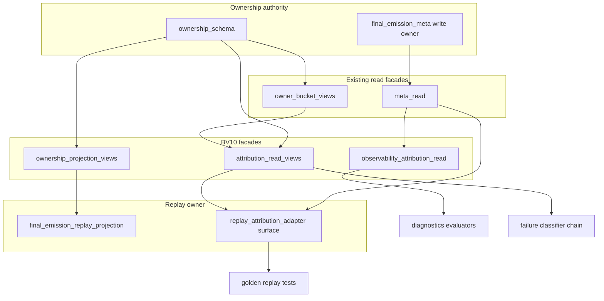

# BV10 — Read-Side Attribution Cluster Consolidation Plan

**Date:** 2026-06-21
**Status:** Plan only — **no implementation**
**Constraint:** Behavior-preserving; ownership authority unchanged; replay manifests byte-stable
**Primary metric:** Combined read-side fan-in (meta_read + bucket_views + ownership_schema)

## Objectives

1. Continue BV2 read-side split without touching `final_emission_meta` write paths
2. Collapse accidental multi-import hubs (attribution sync, replay projection internals)
3. Route diagnostics/replay/attribution through narrow facades
4. Lock owner suites as the only direct schema/views importers outside facades

**Target combined FI:** 70 → **≤30** (−57% vs baseline; comparable to BV2 meta 61 → 22)

---

## Architecture target

---

## Phase 1 — Low-risk view extraction

**Duration:** 1 cycle
**Combined FI target:** 70 → **~58** (−12)

| Step | Action | Verification |
|---|---|---|
| 1.1 | Add `attribution_read_views.py` — re-export bucket mappers + classifier vocabulary from schema/views | `test_failure_classification_contract.py` green |
| 1.2 | Add `ownership_projection_views.py` — lineage + sanitizer trace vocabulary | `test_runtime_lineage_telemetry.py` green |
| 1.3 | Add `observability_attribution_read.py` — delegate observability bundle reads from meta_read | `test_observational_telemetry_confidence.py` green |
| 1.4 | Document registry surfaces; no consumer migration yet | BU scan: new modules appear; cluster FI unchanged |

**Risk:** **Low** — delegate-only modules, zero logic moves

---

## Phase 2 — Consumer migration

**Duration:** 1–2 cycles
**Combined FI target:** ~58 → **~34** (−24 cumulative)

### Wave 2A — Attribution cluster (C1)

Migrate: `failure_classification_sync`, `failure_classifier`, `failure_dashboard_fixtures`, `replacement_attribution_inventory`, `failure_classification_contract`, attribution tests.

**Expected:** bucket_views −6, schema −5 FI.

### Wave 2B — Observability chain (C4)

Migrate: `dead_turn_report_visibility`, `playability_eval`, `narrative_authenticity_eval`, dead-turn / observability tests.

**Expected:** meta_read −7 FI.

### Wave 2C — Replay adapter expansion (C3)

Internalize triple-import in `final_emission_replay_projection`; migrate golden replay fallback/projection tests to adapter surface only.

**Expected:** −8 to −10 combined FI; run protected replay manifest refresh (BV3F).

### Wave 2D — Smoke / gate hardening (C5)

Consolidate gate tests to emission/replay smoke helpers.

**Expected:** meta_read −6 FI.

**Replay risk gate:** Wave 2C requires manifest parity before merge.

---

## Phase 3 — Governance lock

**Duration:** 0.5 cycle
**Combined FI target:** ~34 → **~26–30**

| Step | Action |
|---|---|
| 3.1 | Extend `tests/test_ownership_registry.py` — forbid direct cluster imports outside allowlist |
| 3.2 | Allowlist: owner suites, write owners (meta, fallback modules), facade modules themselves |
| 3.3 | Remove redundant schema re-exports from bucket_views where attribution_read_views owns consumer path |
| 3.4 | BV10 closeout doc + BU scan verification |

---

## Rollback criteria

- Any protected replay manifest drift
- Owner-bucket parity failure in `test_opening_fallback_owner_bucket.py`
- Classifier routing change in failure dashboard controlled failures

## Success criteria

| Criterion | Target |
|---|---|
| Combined cluster FI | **≤30** |
| No write-path import changes | Required |
| Replay manifest stable | Required |
| Owner suite exceptions documented | Required |
