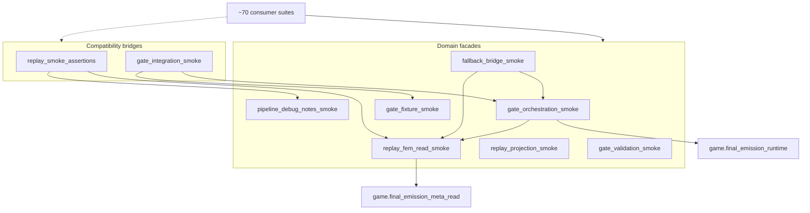

# BV12 — Smoke Bridge Decomposition Plan

**Date:** 2026-06-21  
**Status:** Plan only — **no implementation**  
**Primary metric:** Combined smoke bridge FI (current **95**)  
**Constraint:** Behavior-preserving; BV7C monolith cap + BV10 read-cluster guards remain green  

---

## Architecture target

---

## Phase 1 — Low-risk extraction (1 cycle)

**FI target:** 95 → **~90** (relocate 5 low-FI symbols to named modules)

| Step | Action | Verification |
| --- | --- | --- |
| 1.1 | Create `pipeline_debug_notes_smoke.py`; move `read_turn_debug_notes` | turn_pipeline_shared + scene_transition_authority green |
| 1.2 | Create `gate_fixture_smoke.py`; move `gm_response_stub` | turn_pipeline_http_fixtures green |
| 1.3 | Legacy bridges re-export moved symbols | Zero consumer changes required initially |
| 1.4 | Register new modules in ownership registry | Registry governance tests green |

**Exit criteria:** New modules exist; combined bridge FI unchanged; symbol FI split measurable.

## Phase 2 — Consumer migration (1–2 cycles)

**FI target:** 95 → **~35–45** (−50 to −60 on legacy bridges)

| Wave | Consumers | Target facade | Expected Δ FI |
| --- | --- | --- | --- |
| 2A | ~45 replay acceptance + observability | replay_fem_read_smoke | −45 replay |
| 2B | ~8 transcript/golden-adjacent | replay_projection_smoke | −8 replay |
| 2C | ~30 gate orchestration integration | gate_orchestration_smoke | −30 gate |
| 2D | ~9 gate validation owner suites | gate_validation_smoke | −9 gate |
| 2E | 6 fallback dual-bridge suites | fallback_bridge_smoke | consolidates dual imports |

Migrate dual-bridge fallback suites **last** — they benefit most from `fallback_bridge_smoke` combined surface.

**Exit criteria:** Legacy bridge FI ≤ **15** each; domain facades hold ≥80% of consumer imports.

## Phase 3 — Governance lock (1 cycle)

| Step | Action |
| --- | --- |
| 3.1 | Add `test_bv12_smoke_bridge_direct_import_guard_*` — new consumers must use domain facades |
| 3.2 | Cap legacy bridge FI (replay ≤12, gate ≤10) — delegate-only importers |
| 3.3 | Document domain routing in ownership registry quick reference |

**Exit criteria:** CI guard prevents bridge FI regrowth; BV11 combined cluster FI ≤ **40**.

