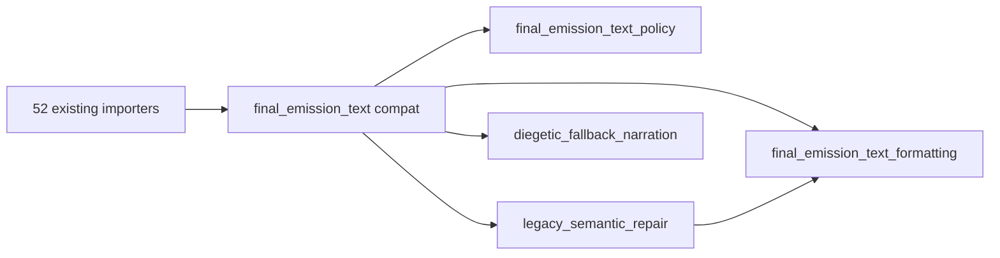

# BV13A — Delegate Verification

**Date:** 2026-06-21  
**Phase:** BV13 Phase 1 (formatting + policy extraction)  
**Constraint:** No runtime, replay, or emission behavior changes.

---

## Executive summary

Three canonical modules were added; the compatibility barrel re-exports extracted symbols without duplicating logic.

| Module | Role | Implementation |
| --- | --- | --- |
| `game.final_emission_text_formatting` | Formatting primitive owner | Canonical whitespace/HTML/punctuation helpers |
| `game.final_emission_text_policy` | Validator policy vocabulary | Canonical pattern tuples + `_RESPONSE_TYPE_VALUES` |
| `game.final_emission_text_legacy_semantic_repair` | Legacy repair (test-only) | Retired C2 semantic repair predicates |
| `game.final_emission_text` | Compatibility barrel | Re-exports formatting + policy + legacy; defines `_global_narrative_fallback_stock_line` only |

---

## Verification method

| Check | Mechanism | Result |
| --- | --- | --- |
| Formatting identity delegation | `tests/test_bv13a_final_emission_text_facade_delegates.py` — `assert compat_sym is formatting_sym` | **Pass** |
| Policy constant identity delegation | Same test module | **Pass** |
| Legacy repair identity delegation | Same test module | **Pass** |
| Formatting module is canonical impl | AST scan — all 6 formatting helpers defined locally | **Pass** |
| Policy module is canonical impl | AST scan — all 6 policy constants assigned locally | **Pass** |
| Compat barrel defines only fallback wrapper | AST scan — single `def _global_narrative_fallback_stock_line` | **Pass** |
| No logic duplication | Canonical modules do not import compat barrel | **Pass** |
| Legacy module isolation | No formatting/policy definitions in legacy module | **Pass** |

---

## Per-module delegate audit

### `final_emission_text_formatting.py`

| Symbol | Type | Authority |
| --- | --- | --- |
| `_normalize_text` | function | **Defined here** |
| `_normalize_text_preserve_paragraphs` | function | **Defined here** |
| `_sanitize_output_text` | function | **Defined here** |
| `_has_terminal_punctuation` | function | **Defined here** |
| `_normalize_terminal_punctuation` | function | **Defined here** |
| `_capitalize_sentence_fragment` | function | **Defined here** |

**Fan-out:** `re` only (stdlib + typing).

### `final_emission_text_policy.py`

| Symbol | Type | Authority |
| --- | --- | --- |
| `_RESPONSE_TYPE_VALUES` | set constant | **Defined here** |
| `_ANSWER_DIRECT_PATTERNS` | tuple[Pattern] | **Defined here** |
| `_ANSWER_FILLER_PATTERNS` | tuple[Pattern] | **Defined here** |
| `_ACTION_RESULT_PATTERNS` | tuple[Pattern] | **Defined here** |
| `_AGENCY_SUBSTITUTE_PATTERNS` | tuple[Pattern] | **Defined here** |
| `_ACTION_STOPWORDS` | frozenset | **Defined here** |

**Fan-out:** `re` only.

### `final_emission_text_legacy_semantic_repair.py`

| Symbol | Type | Authority |
| --- | --- | --- |
| `_decompress_overpacked_sentences` | function | **Defined here** (imports formatting) |
| `_repair_fragmentary_participial_splits` | function | **Defined here** |
| Participial helpers (`_looks_like_*`, etc.) | private | **Defined here** |

**Production importers:** 0 (test-only via compat re-export).

### `final_emission_text.py` (compat)

| Category | Symbols | Delegation |
| --- | --- | --- |
| Formatting re-exports | 6 symbols | **Same objects** as `final_emission_text_formatting` |
| Policy re-exports | 6 symbols | **Same objects** as `final_emission_text_policy` |
| Legacy re-exports | 2 symbols | **Same objects** as `legacy_semantic_repair` |
| Local definition | `_global_narrative_fallback_stock_line` | Uses formatting imports + diegetic delegate |

---

## Fan-out chain (unchanged semantics)

Consumer imports unchanged in Phase 1; object identity preserved through re-export.

---

## Exit criteria

| Criterion | Status |
| --- | --- |
| Extracted modules contain canonical implementations | **Met** |
| Compat barrel only delegates (+ fallback wrapper) | **Met** |
| No logic duplication | **Met** |
| Automated delegate tests green | **Met** |

Phase 2 consumer migration may proceed.
