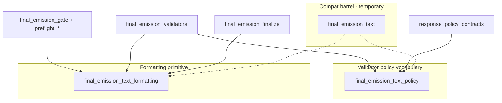

# BV13 — Decomposition Plan

**Date:** 2026-06-21
**Status:** Plan only — **no implementation**
**Primary metric:** `game.final_emission_text` FI (current **52**)
**Constraint:** Behavior-preserving; BN9 pregate-text guards + C2 no-semantic-repair boundary remain green

---

## Architecture target

## Phase 1 — Low-risk extraction (1 cycle)

**FI target:** 52 → **52** (compat re-exports; measurable symbol split)

| Step | Action | Verification |
| --- | --- | --- |
| 1.1 | Create `game/final_emission_text_formatting.py`; move whitespace/HTML/punctuation helpers | All existing tests green; no behavior change |
| 1.2 | Create `game/final_emission_text_policy.py`; move pattern tuples + `_RESPONSE_TYPE_VALUES` | validators + response_policy_contracts green |
| 1.3 | `final_emission_text` re-exports moved symbols (compat barrel) | AST FI unchanged; symbol FI split in artifact |
| 1.4 | Move legacy semantic repair to `tests/helpers/legacy_semantic_repair_fixtures.py` OR `game/_legacy_semantic_repair_archive.py` | boundary_no_semantic_repair + visibility tests green |
| 1.5 | Register modules in ownership registry + gate delegator governance map | ownership registry tests green |

**Exit criteria:** New modules exist; combined symbol FI measurable; zero consumer import changes required.

## Phase 2 — Consumer migration (1–2 cycles)

**FI target:** 52 → **~5–8** on compat barrel

| Wave | Consumers | Target import | Expected Δ FI |
| --- | --- | --- | --- |
| 2A | 24 gate-trunk modules (`final_emission_*`, preflight_*) | `final_emission_text_formatting` | −24 from compat |
| 2B | 6 narrative/social upstream modules | formatting | −6 |
| 2C | 6 validator/policy consumers | policy (+ formatting where needed) | −6 |
| 2D | 3 fallback stock-line consumers | diegetic facade or fast_fallback owner | −3 |
| 2E | 13 test modules | formatting (direct) | −13 |

Migrate **gate preflight modules first** — aligns with existing BN9 extractions and ownership registry guards.

**Exit criteria:** `final_emission_text` compat FI ≤ **8**; formatting module holds ≥45 direct importers.

## Phase 3 — Governance lock (1 cycle)

| Step | Action |
| --- | --- |
| 3.1 | Add `test_bv13_final_emission_text_direct_import_guard_*` — new consumers must import formatting/policy, not compat barrel |
| 3.2 | Cap compat barrel FI ≤ **5** (delegate-only + ownership tests) |
| 3.3 | Extend BN9 gate-context guard: forbid `_normalize_text` from compat in pregate modules (require formatting module) |
| 3.4 | Document routing in ownership registry quick reference |

**Exit criteria:** CI prevents hub FI regrowth; production-core top hotspot drops below **social_exchange_emission** tie line.
