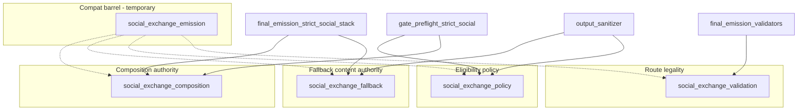

# BV14 — Decomposition Plan

**Date:** 2026-06-21
**Status:** Plan only — **no implementation**
**Primary metric:** `game.social_exchange_emission` FI (current **52**)
**Constraint:** Behavior-preserving; BD-2 legality owner + BN8 preflight boundary remain green

---

## Architecture target

## Phase 1 — Low-risk extraction (1 cycle)

**FI target:** 52 → **52** (compat re-exports; measurable symbol split)

| Step | Action | Verification |
| --- | --- | --- |
| 1.1 | Create `game/social_exchange_fallback.py`; move emergency/deterministic fallback line family | strict_social_stack + visibility + sanitizer tests green |
| 1.2 | Create `game/social_exchange_policy.py`; move will-apply predicates + `merged_player_prompt_for_gate` | API + preflight + narrative authority tests green |
| 1.3 | Create `game/social_exchange_validation.py`; move route-legality predicates | validators + referential_clarity green |
| 1.4 | Create `game/social_exchange_projection.py`; move telemetry + FEM family stamp/project | BJ-115/116 ownership registry green |
| 1.5 | `social_exchange_emission` re-exports moved symbols (compat barrel); composition core stays | AST FI unchanged; symbol FI split in artifact |
| 1.6 | Promote leaked private helpers to public on correct target module OR inline at caller | referential_clarity + speaker_contract green |
| 1.7 | Register modules in ownership registry + gate delegator governance map | ownership registry tests green |

**Exit criteria:** New modules exist; combined symbol FI measurable; zero consumer import changes required.

## Phase 2 — Consumer migration (1–2 cycles)

**FI target:** 52 → **~6–10** on compat barrel

| Wave | Consumers | Target import | Expected Δ FI |
| --- | --- | --- | --- |
| 2A | Fallback sprawl (visibility, sealed, terminal, response_type, gm, continuity, repairs) | `social_exchange_fallback` | −18 from compat |
| 2B | API + preflight + 6 gate policy modules + interaction_context | `social_exchange_policy` | −12 from compat |
| 2C | validators, referential_clarity, gm route checks | `social_exchange_validation` | −6 from compat |
| 2D | generic_exit, strict_social_stack, visibility, fem_assembly | `social_exchange_projection` | −5 from compat |
| 2E | strict_social_stack composition path | `social_exchange_composition` (direct) | −3 from compat |
| 2F | 25 test modules | target modules (direct) | −15 from compat |

Migrate **fallback consumers first** — highest FI symbol (`minimal_social_emergency_fallback_line`) and widest sprawl.

**Exit criteria:** compat FI ≤ **10**; fallback module holds ≥18 direct importers.

## Phase 3 — Governance lock (1 cycle)

| Step | Action |
| --- | --- |
| 3.1 | Add `test_bv14_social_exchange_emission_direct_import_guard_*` — new consumers must import named authorities |
| 3.2 | Cap compat barrel FI ≤ **6** (delegate-only + ownership tests + BD-2 re-exports) |
| 3.3 | Extend BN8 preflight guard: forbid fallback/policy imports via compat in preflight modules |
| 3.4 | Forbid external import of `_`-prefixed symbols from compat barrel (encapsulation lock) |
| 3.5 | Document routing in ownership registry quick reference |

**Exit criteria:** CI prevents hub FI regrowth; production-core top hotspot drops below **final_emission_gate** FI (~30).
