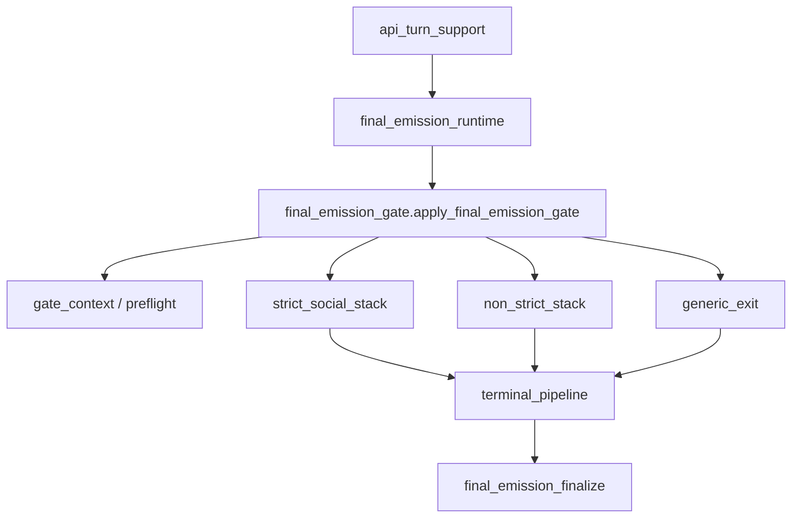

# BV15 — Gate / Terminal Pipeline Boundary Review

**Date:** 2026-06-21

---

## Coupling summary

| Dimension | `final_emission_gate` | `final_emission_terminal_pipeline` |
| --- | --- | --- |
| BU fan-in | **30** | **26** |
| Production importers | **1** | 2 (via stack exit owners) |
| Fan-out | 11 modules | 18 modules |
| Direct import of peer | gate → terminal: **False** | terminal → gate: **False** |
| Dual importers (same file imports both) | **13** test files | — |

## Dependency direction

**Direction:** Gate **orchestrates** stack selection; stacks/exit owners **call** terminal pipeline; gate does **not** import terminal pipeline. No circular dependency.

## Shared dependency surface

**4** shared fan-out modules:

- `__future__`
- `game.final_emission_passive_scene_pressure`
- `game.interaction_continuity`
- `typing`

## Gate-only dependencies

- `game.emitted_speaker_signature`
- `game.final_emission_gate_context`
- `game.final_emission_gate_preflight_pregate_text`
- `game.final_emission_generic_exit`
- `game.final_emission_non_strict_stack`
- `game.final_emission_strict_social_stack`
- `game.speaker_contract_enforcement`

## Terminal-only dependencies

- `collections.abc`
- `game.final_emission_acceptance_quality`
- `game.final_emission_boundary_contract`
- `game.final_emission_meta`
- `game.final_emission_narration_constraint_debug`
- `game.final_emission_narrative_mode_output`
- `game.final_emission_opening_fallback`
- `game.final_emission_referential_clarity`
- `game.final_emission_repairs`
- `game.final_emission_sealed_fallback`
- `game.final_emission_text_formatting`
- `game.final_emission_visibility_fallback`
- `game.social_exchange_fallback_catalog`
- `game.social_exchange_projection`

## Ownership boundaries

| Concern | Owner | Gate role | Terminal role |
| --- | --- | --- | --- |
| Orchestration routing | `final_emission_gate` | strict vs non-strict branch | none |
| Preflight / turn packet | `gate_context` + BN preflight modules | initialize context | none |
| Layer stack execution | `non_strict_stack` / `strict_social_stack` | delegate | none |
| Late enforcement (visibility, N4, IC, opening) | `terminal_pipeline` | none | accept/replace tail |
| Final packaging | `final_emission_finalize` | pop turn-packet cache at exit | invoked after terminal |

## Replay sensitivity

| Change locus | Replay risk | Rationale |
| --- | --- | --- |
| Gate orchestration order | **Medium** | Layer-order tests + transcript regressions pin sequencing |
| Terminal enforcement patches | **High** | Visibility/N4/opening fallback text mutations |
| Namespace re-export retirement | **Low** | Identity-preserving; no behavior change |

## Dual importer files (gate + terminal)

- `tests/test_fallback_behavior_gate.py`
- `tests/test_final_emission_acceptance_quality.py`
- `tests/test_final_emission_boundary_no_semantic_repair.py`
- `tests/test_final_emission_gate_n4.py`
- `tests/test_final_emission_gate_orchestration_order.py`
- `tests/test_final_emission_gate_selector_snapshots.py`
- `tests/test_final_emission_sealed_fallback.py`
- `tests/test_final_emission_visibility_fallback.py`
- `tests/test_ownership_registry.py`
- `tests/test_social_exchange_emission.py`
- `tests/test_speaker_contract_risk.py`
- `tests/test_tone_escalation_rules.py`
- `tests/test_validation_layer_separation_runtime.py`
