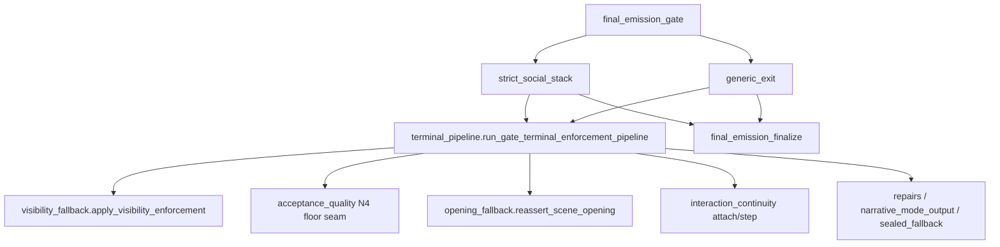

# BV16 — Finalize Boundary Review

**Date:** 2026-06-21

---

## Coupling summary

| Dimension | `final_emission_gate` | `final_emission_terminal_pipeline` | `final_emission_visibility_fallback` | `final_emission_opening_fallback` | `interaction_continuity` |
| --- | --- | --- | --- | --- | --- |
| BU fan-in | **30** | **26** | (owner) | (owner) | (owner) |
| Production importers | 1 | **2** | direct from terminal | via terminal alias | direct from terminal |
| Fan-out | 11 | **18** | 25 | 10 | 13 |
| Imports peer gate | gate → terminal: **False** | terminal → gate: **False** | — | — | — |
| Dual importers (gate + terminal) | **12** test files | — | — | — | — |

## Dependency direction

**Direction:** Acyclic. Gate routes to stacks; stacks call terminal sequencer; terminal calls policy owners. No gate↔terminal import cycle. Opening/visibility/IC modules do **not** import terminal pipeline.

## Terminal direct owner calls

| Concern | Canonical owner | Terminal call site |
| --- | --- | --- |
| Visibility enforcement | `game.final_emission_visibility_fallback.apply_visibility_enforcement` | mid-pipeline, after referential clarity + passive scene |
| N4 floor seam | `game.final_emission_acceptance_quality.apply_acceptance_quality_n4_floor_seam` | post-NMO assessment, pre-IC attach |
| Opening accept reassert | `game.final_emission_opening_fallback.reassert_scene_opening_accepted_candidate` | `generic_accept` profile only |
| IC validation step | `game.interaction_continuity.apply_interaction_continuity_emission_step` | `strict_accept` validate-only path |
| IC attach | `game.interaction_continuity.attach_interaction_continuity_validation` | all profiles; preserve flag on strict_accept |

## Shared gate / terminal dependency surface

**4** shared fan-out modules:

- `__future__`
- `game.final_emission_passive_scene_pressure`
- `game.interaction_continuity`
- `typing`

## Terminal-only dependencies (gate does not share)

- `collections.abc`
- `game.final_emission_acceptance_quality`
- `game.final_emission_boundary_contract`
- `game.final_emission_meta`
- `game.final_emission_narration_constraint_debug`
- `game.final_emission_narrative_mode_output`
- `game.final_emission_opening_fallback`
- `game.final_emission_referential_clarity`
- `game.final_emission_repairs`
- `game.final_emission_sealed_fallback`
- `game.final_emission_text_formatting`
- `game.final_emission_visibility_fallback`
- `game.social_exchange_fallback_catalog`
- `game.social_exchange_projection`

## Ownership boundaries

| Concern | Owner | Terminal role | Peer role |
| --- | --- | --- | --- |
| Orchestration routing | `final_emission_gate` | none | selects stack path |
| Layer stack execution | `strict_social_stack` / `generic_exit` | invoked by exit owners | calls terminal once per exit |
| Visibility policy | `final_emission_visibility_fallback` | delegate call + ordered slot | standalone enforcement API |
| N4 acceptance floor | `final_emission_acceptance_quality` | delegate call | also invoked from gate tests directly |
| Opening accept persistence | `final_emission_opening_fallback` | delegate via module alias | also used from finalize/non_strict_stack |
| IC contracts | `interaction_continuity` | step + attach in strict/generic paths | gate re-exports IC for compat (BV15 retire target) |
| Final packaging | `final_emission_finalize` | none (downstream of terminal) | pop turn-packet after terminal returns |

## Replay sensitivity

| Change locus | Replay risk | Rationale |
| --- | --- | --- |
| Terminal enforcement **order** | **High** | Orchestration-order + selector snapshot tests pin step sequence |
| Visibility/N4/opening **policy** changes | **High** | Text mutations + fallback selection — owner modules, not terminal splits |
| Monkeypatch target migration (terminal → owner) | **Low** | Identity-preserving if hook points unchanged |
| Extract terminal sub-sequencers | **High** | Would fragment single ordered tail; transcript regressions |

## Dual importer files (gate + terminal)

- `tests/test_fallback_behavior_gate.py`
- `tests/test_final_emission_acceptance_quality.py`
- `tests/test_final_emission_boundary_no_semantic_repair.py`
- `tests/test_final_emission_gate_n4.py`
- `tests/test_final_emission_gate_orchestration_order.py`
- `tests/test_final_emission_gate_selector_snapshots.py`
- `tests/test_final_emission_sealed_fallback.py`
- `tests/test_final_emission_visibility_fallback.py`
- `tests/test_ownership_registry.py`
- `tests/test_social_exchange_emission.py`
- `tests/test_speaker_contract_risk.py`
- `tests/test_tone_escalation_rules.py`
