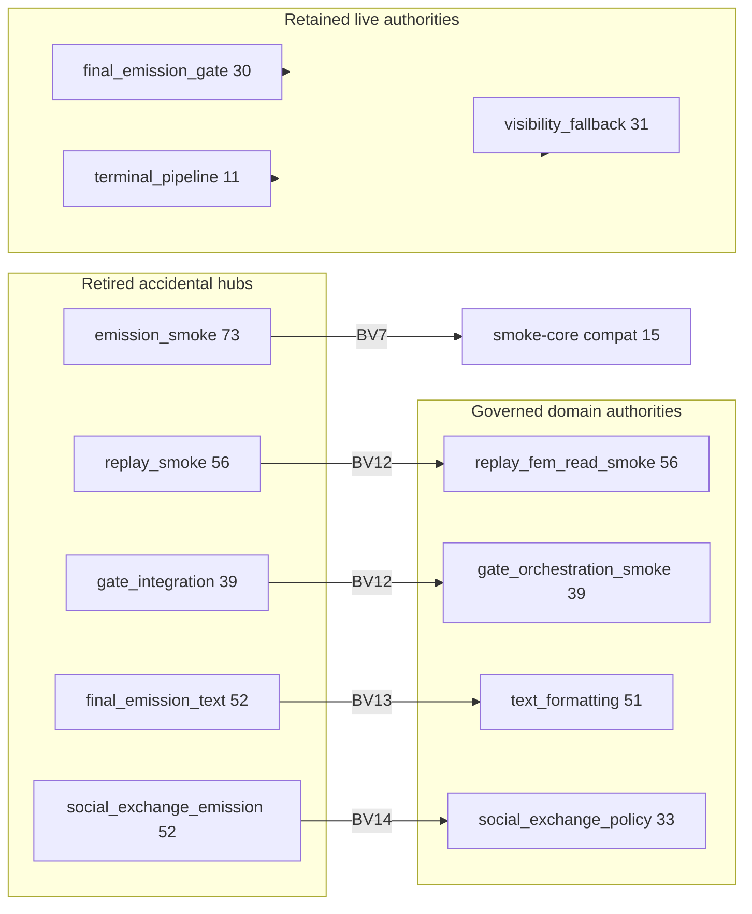

# BV17C — Authority Transition Report

**Date:** 2026-06-21  
**Scope:** BV2–BV17 authority reclassification and governance installation  
**End-state reference:** `docs/audits/BV17_authority_classification.md`

---

## Executive summary

The contraction program **retired accidental routing hubs** and **installed governed domain authorities** without splitting live orchestration sequencers (gate, stacks, terminal). Every former compat monolith now has a **delegate barrel at capped FI** plus **one or more named domain owners** with registry-enforced import guards.

---

## Retired hubs (accidental → shim or absorbed)

| Hub | Peak FI | End state | Cycle |
| --- | ---: | --- | --- |
| `tests.helpers.emission_smoke_assertions` | 73 | **15** — smoke-core compat only | BV7 |
| `tests.helpers.replay_smoke_assertions` | 56 | **1** — delegate to `replay_fem_read_smoke` | BV12 |
| `tests.helpers.gate_integration_smoke` | 39 | **1** — delegate to `gate_orchestration_smoke` | BV12 |
| `game.final_emission_text` | 52 | **4** — delegate to formatting/policy | BV13 |
| `game.social_exchange_emission` | 52 | **12** — delegate to policy/catalog/validation/projection | BV14 |
| Read-side triple cluster (pre-BV10) | 70 combined | **19** — facades + governed meta_read | BV10 |
| Terminal monkeypatch namespace (pre-BV16C) | AST 26 | **11** BU / AST 9 — owner-direct hooks | BV16C |
| Gate re-export namespace (pre-BV15) | governance-inflated | retired — orchestration centralized | BV15 |

**Speaker projection recurrence hub** (8 duplicate rows): **retired** in BV8A deduplication — not a module hub but a maintenance recurrence family.

---

## Retained authorities (legitimate production owners)

| Authority | End FI | Role | Split deferred? |
| --- | ---: | --- | --- |
| `game.final_emission_gate` | 30 | Canonical gate orchestration | **Yes** — BV15 validated |
| `game.final_emission_terminal_pipeline` | 11 | Canonical finalize sequencer | **Yes** — BV16 validated |
| `game.final_emission_strict_social_stack` | 22 | Strict-social routing | **Yes** — BJ boundary |
| `game.final_emission_non_strict_stack` | 11 | Non-strict routing | **Yes** — BJ boundary |
| `game.final_emission_meta` | 24 | Write-side meta packaging | **Yes** — BV2 narrowed |
| `game.final_emission_visibility_fallback` | 31 | Fallback selection owner | Optional test seam cleanup only |
| `game.final_emission_repairs` | 25 | Upstream repair authority | No |
| `game.realization_provenance` | 29 | Attribution / replacement provenance | No |
| `game.speaker_contract_enforcement` | 15 | Speaker finalization | No |
| Fallback family owners | 10–14 each | Opening/sealed/diegetic/passive | No — legitimate fallback graph |

---

## Governed domain authorities (post-decomposition owners)

| Authority | End FI | Domain | Cycle |
| --- | ---: | --- | --- |
| `tests.helpers.replay_fem_read_smoke` | 56 | FEM read smoke | BV12 |
| `tests.helpers.gate_orchestration_smoke` | 39 | Gate orchestration smoke | BV12 |
| `tests.helpers.fallback_bridge_smoke` | 4 | Fallback bridge smoke | BV12 |
| `game.final_emission_text_formatting` | 51 | Text composition/formatting | BV13 |
| `game.final_emission_text_policy` | 8 | Text policy | BV13 |
| `game.social_exchange_policy` | 33 | Social policy | BV14 |
| `game.social_exchange_fallback_catalog` | 26 | Social fallback catalog | BV14 |
| `game.social_exchange_validation` | 12 | Social validation | BV14 |
| `game.social_exchange_projection` | 11 | Social projection | BV14 |
| `game.attribution_read_views` | 21 | Read-side attribution | BV10 |
| `game.observability_attribution_read` | 19 | Observability reads | BV10 |
| `game.final_emission_replay_projection` | 15 | Replay projection | BV2/BV10 |

---

## Governance locks added

| Cycle | Guard / lock | Enforced by |
| --- | --- | --- |
| **BV2C** | Direct `final_emission_meta` import guard | `test_bv2c_final_emission_meta_direct_import_guard_*` |
| **BV7C** | Smoke monolith import guard | `test_bv7c_smoke_monolith_import_guard_*` |
| **BV10C** | Read-cluster direct import guard | `test_bv10_read_cluster_direct_import_guard_*` |
| **BV12C** | Compat barrel import guard (replay + gate smoke) | `collect_bv12c_compat_barrel_import_guard_violations` |
| **BV13C** | Text compat import guard | `collect_bv13c_text_compat_import_guard_violations` |
| **BV14C** | Social-exchange compat import guard | `collect_bv14c_social_exchange_compat_import_guard_violations` |
| **BV15** | Gate thin boundary locks (namespace / orchestration) | `tests/helpers/gate_thin_boundary_locks.py` |
| **BV16C** | Terminal delegate monkeypatch governance | `collect_bv16c_terminal_delegate_monkeypatch_violations` |

**Registry concentration:** 114 `collect_*` collectors; 929 lines in `gate_thin_boundary_locks.py`.

---

## FI caps added

| Cycle | Module | Cap | Test |
| --- | --- | ---: | --- |
| **BV7C** | `emission_smoke_assertions` | ≤18 | `test_bv7c_emission_smoke_assertions_concentration_locked` |
| **BV12C** | `replay_smoke_assertions` | ≤2 | `test_bv12c_compat_barrel_fi_cap_locked` |
| **BV12C** | `gate_integration_smoke` | ≤2 | `test_bv12c_compat_barrel_fi_cap_locked` |
| **BV13C** | `final_emission_text` (compat) | ≤8 | `test_bv13c_text_compat_fi_cap_locked` |
| **BV14C** | `social_exchange_emission` (compat) | ≤12 | `test_bv14c_social_exchange_compat_fi_cap_locked` |

**BV15/BV16:** Gate and terminal caps are **governance + monkeypatch elimination**, not compat-barrel FI caps — production orchestration FI intentionally stable.

---

## Authority transition diagram

---

## Transition verdict

| Question | Answer |
| --- | --- |
| Accidental hubs eliminated? | **Yes** — 0 in top 25 |
| Live sequencers preserved? | **Yes** — gate + terminal centralized |
| Regrowth blocked? | **Yes** — guards + caps on all compat barrels |
| New accidental hubs introduced? | **No** — BV12C/BV13C/BV14C verified |
