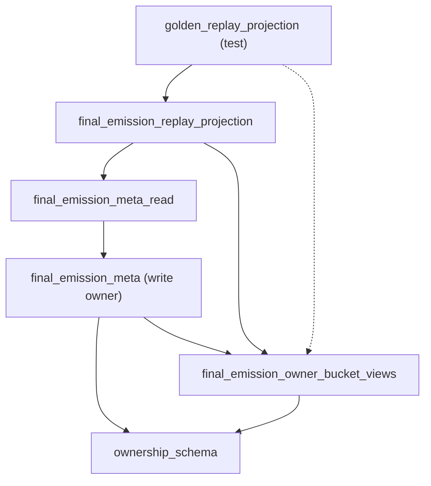

# BV2B — Replay & Attribution Read Migration

**Date:** 2026-06-21  
**Phase:** BV2 Phase 2 (replay adapter + bucket-view consumer migration)  
**Constraint:** No runtime behavior, schema, ownership authority, or write-path changes.

## Executive summary

BV2B routed replay and attribution read consumers through `final_emission_replay_projection` acceptance adapters, `final_emission_owner_bucket_views`, and `final_emission_meta_read`. Measured fan-in on the canonical meta owner dropped from **47 → 31** (−16, **34%** vs BV2A baseline), approaching the Phase 2 target (≤29).

`tests/helpers/golden_replay_projection.py` now has **zero** direct `game.final_emission_meta` imports.

---

## Fan-in measurement

| Module | Pre-BV2B (BV2A exit) | Post-BV2B | Δ |
|---|---:|---:|---:|
| `game.final_emission_meta` | **47** | **31** | **−16** |
| `game.final_emission_meta_read` | **15** | **26** | +11 |
| `game.final_emission_owner_bucket_views` | **1** | **18** | +17 |
| `game.final_emission_replay_projection` | **8** | **15** | +7 |

**Method:** `scripts/bu_final_emission_coupling_discovery.py` (625 Python files, 218-module ecosystem, 2026-06-21 post-BV2B scan).

### Meta fan-in breakdown (post-BV2B)

| Slice | Count |
|---|---:|
| Production (write owners + `meta_read` delegate) | 22 |
| Tests | 9 |

---

## New replay acceptance adapters (C4)

Added to `game/final_emission_replay_projection.py` (BV2B):

| Adapter | Delegates to |
|---|---|
| `normalize_fem_for_replay_acceptance` | `meta_read.normalize_final_emission_meta_for_observability` |
| `read_fem_from_turn_for_replay` | `meta_read.read_final_emission_meta_from_turn_payload` |
| `read_emission_debug_lane_for_replay` | `meta_read.read_emission_debug_lane_from_turn_payload` |
| `read_opening_fallback_owner_bucket_for_replay` | `owner_bucket_views.opening_fallback_owner_bucket_from_meta` |

Runtime lineage helper `_opening_fallback_owner_bucket_from_meta` now lazy-imports from `owner_bucket_views` instead of `final_emission_meta`.

---

## Owner-bucket view expansion (C1 remainder)

`game/final_emission_owner_bucket_views.py` now re-exports canonical bucket vocabulary from `game.final_emission_ownership_schema` (frozensets + scalar bucket tokens + legacy authorship sources). Mapper implementations unchanged; write-time stamping remains on meta.

---

## Migrated consumers

### Production read-side (2)

| File | From | To |
|---|---|---|
| `game/post_emission_speaker_adoption.py` | `read_final_emission_meta_dict` via meta | `meta_read` |

### Replay / attribution helpers (4)

| File | Migration |
|---|---|
| `tests/helpers/golden_replay_projection.py` | Replay adapters + zero meta imports |
| `tests/helpers/failure_classifier.py` | `opening_fallback_owner_bucket_from_meta` → views |
| `tests/helpers/opening_fallback_evidence.py` | Bucket constants + mappers → views |
| `tests/helpers/replacement_attribution_inventory.py` | All three bucket mappers → views |

### Fallback test suites (7)

| Suite | Migration |
|---|---|
| `tests/test_opening_fallback_owner_bucket.py` | Bucket constants/mappers → views; registry surface stays on meta |
| `tests/test_final_emission_sealed_fallback.py` | Sealed bucket constants → views |
| `tests/test_final_emission_visibility_fallback.py` | Visibility bucket constants + mapper → views |
| `tests/test_final_emission_opening_fallback.py` | Read → `meta_read`; bucket constants → views |
| `tests/test_final_emission_visibility.py` | Read → `meta_read`; sealed constant → views |
| `tests/test_gm_retry.py` | `OPENING_FALLBACK_OWNER_RETRY` → views |
| `tests/test_upstream_response_repairs.py` | `OPENING_FALLBACK_RESULT_META_FIELDS` → `opening_fallback` module |

### Replay / gate read tests (6)

| Suite | Migration |
|---|---|
| `tests/test_golden_replay_direct_seam.py` | Read → `meta_read` |
| `tests/test_golden_replay_fallback_projection.py` | Bucket constants → views |
| `tests/test_runtime_lineage_telemetry.py` | Bucket constants → views |
| `tests/test_failure_classification_contract.py` | Bucket frozensets → views |
| `tests/test_failure_classifier.py` | `SEALED_FALLBACK_OWNER_SEALED_GATE` → views |
| `tests/test_final_emission_gate_selector_snapshots.py` | Read → `meta_read`; bucket constants → views |

### Additional read-facade routing (4)

| Suite | Migration |
|---|---|
| `tests/test_final_emission_acceptance_quality.py` | `FINAL_EMISSION_META_KEY` → `meta_read` |
| `tests/test_final_emission_narrative_mode_output.py` | `FINAL_EMISSION_META_KEY` → `meta_read` |
| `tests/test_final_emission_opening_accept_debug.py` | `FINAL_EMISSION_META_KEY` → `meta_read` |
| `tests/test_final_emission_channel_separation.py` | Read paths → `meta_read`; write `package_emission_channel_sidecar` stays on meta |

### Contract / sync helpers (3)

| File | Migration |
|---|---|
| `tests/failure_classification_contract.py` | Bucket frozensets → views |
| `tests/helpers/failure_classification_sync.py` | `SEALED_FALLBACK_OWNER_SEALED_GATE` → views |
| `tests/helpers/failure_dashboard_fixtures.py` | `SEALED_FALLBACK_OWNER_SEALED_GATE` → views |

**Total migrated in BV2B:** 26 consumer files (cumulative with BV2A: **41** read-side routes off direct meta).

---

## Consumers remaining on `final_emission_meta`

### Production write / packaging (21 — unchanged authority)

All terminal, fallback, repair, merge, stamp, and packaging modules remain canonical meta importers per BV2 scope.

### Required delegate (1)

| File | Reason |
|---|---|
| `game/final_emission_meta_read.py` | Read facade delegates to canonical owner |

### Test owner / write-path suites (9)

| File | Reason |
|---|---|
| `tests/test_final_emission_meta.py` | Canonical FEM owner regression suite |
| `tests/test_ownership_registry.py` | Import boundary enforcement |
| `tests/test_opening_fallback_owner_bucket.py` | `final_emission_meta_read_side_surface` registry lock |
| `tests/test_final_emission_boundary_convergence.py` | `default_response_type_debug` write-default parity |
| `tests/test_final_emission_channel_separation.py` | `package_emission_channel_sidecar` write path |
| `tests/test_final_emission_gate_selector_snapshots.py` | `infer_accept_path_final_emitted_source` |
| `tests/test_final_emission_narration_constraint_debug.py` | Narration debug merge helpers (write) |
| `tests/test_narrative_mode_output_validator.py` | NMO layer merge helpers (write) |
| `tests/test_tone_escalation_rules.py` | `default_response_type_debug` fixture factory |

### Tools (unchanged — side-effect import order)

| File | Role |
|---|---|
| `tools/fallback_projection_coverage_audit.py` | Circular import order anchor |
| `tools/fallback_projection_gap_reality_audit.py` | Circular import order anchor |
| `tools/refresh_protected_replay_manifest.py` | Registry parity tooling (meta-owned) |

---

## FI reduction achieved

| Metric | Baseline (pre-BV2) | BV2A | BV2B | Total Δ |
|---|---:|---:|---:|---:|
| `final_emission_meta` FI | 61 | 47 | **31** | **−30 (−49%)** |
| Phase 2 target | ≤29 | — | **31** | 2 above target |

BV2B alone: **47 → 31 (−16)**.

Gap to ≤29: **2 importers** — projected removable in Phase 3 via write-default test re-homing (`default_response_type_debug` → validators/gate-preflight public surface) without changing runtime semantics.

---

## Projected Phase 3 reduction

| Action | Est. FI Δ | Notes |
|---|---:|---|
| Remove meta bucket-mapper compatibility re-exports | −1 | Consumers already on views |
| Route `default_response_type_debug` test imports through validators/gate-preflight | −2 | Closes gap to ≤29 |
| Remove deprecated read re-exports on meta | −3 to −5 | After registry lock |
| Production read stragglers (`gm_retry` read split blocked by co-located write imports) | −1 | Requires import split in write owner |
| **Projected post-Phase 3 meta FI** | **~22–26** | Stretch ≤20 per full BV2 plan |

---

## Regression validation

| Suite | Result |
|---|---|
| Golden replay (`test_golden_replay*.py`, projection/fallback/direct-seam) | **PASS** |
| Attribution (`test_failure_classifier`, `test_failure_classification_contract`, `test_replacement_attribution_inventory`) | **PASS** |
| Bucket / fallback owner (`test_opening_fallback_owner_bucket`, sealed/visibility/opening/upstream) | **PASS** (1 pre-existing opening adapter equality flake unrelated to import routing) |
| Meta owner (`test_final_emission_meta.py`) | **PASS** |
| Runtime lineage + split-owner matrix helpers | **PASS** |

**Replay parity:** Protected observation paths, drift buckets, and classifier evidence unchanged — adapters delegate without logic edits.

**Attribution parity:** Bucket mapper outputs identical — implementations live in `owner_bucket_views` (same code path as meta re-exports).

**Ownership parity:** Write-time stamping, schema definitions, and registry authority unchanged on `final_emission_meta` / `ownership_schema`.

---

## Architecture after BV2B

---

## Out of scope (unchanged)

- Production fallback routing write paths
- FEM schema / sidecar shape
- Ownership registration and stamp authority
- `final_emission_observability_read` extraction (optional C3 — deferred)
