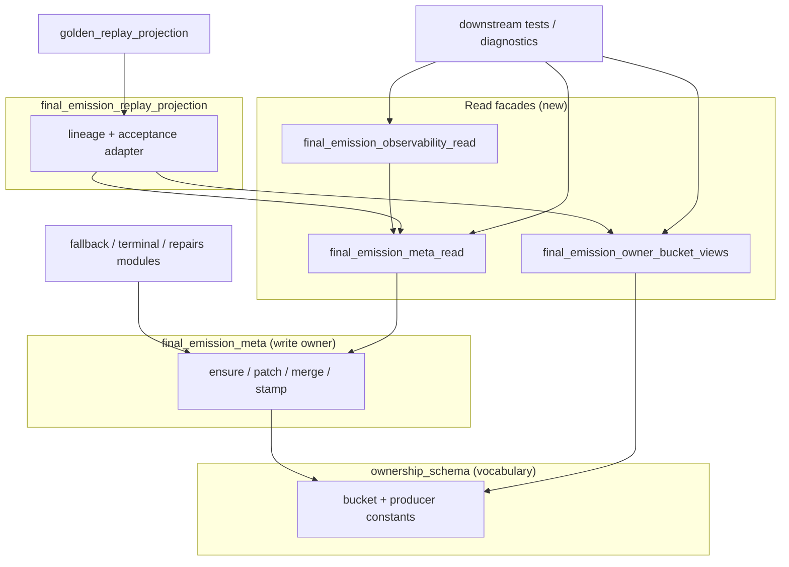

# BV2 — `final_emission_meta` Shadow Refactor Plan

**Date:** 2026-06-21  
**Status:** Plan only — **no implementation**  
**Constraint:** Behavior-preserving; zero runtime semantic change  
**Primary metric:** Fan-in concentration on `game.final_emission_meta`

---

## Objectives

1. Split **read-side** dependency from **write-packaging** ownership
2. Route replay/attribution/diagnostics consumers through narrow contracts
3. Keep `final_emission_meta.py` as canonical **FEM shape + write** owner
4. Reduce FI from **61** to **≤29** (phase 1–2 target) or **~20** (full plan)

---

## Architecture target

---

## Phase 1 — Low-risk helper extraction

**Duration estimate:** 1 cycle  
**FI target:** 61 → **~47** (−14)

### 1.1 Create owner-bucket views (C1)

| Step | Action | Verification |
|---|---|---|
| 1 | Add `game/final_emission_owner_bucket_views.py`; move four `*_owner_bucket_from_*` functions from meta (delegate or cut-paste without logic change) | `test_opening_fallback_owner_bucket.py` green |
| 2 | Re-export bucket frozensets from `ownership_schema` in views module | Registry parity with schema |
| 3 | Meta imports mappers from views (thin re-export for compat) | `test_final_emission_meta.py` green |
| 4 | Migrate 8 test bucket suites + 4 helpers to import views | BU scan: meta FI −14 |
| 5 | Migrate `final_emission_replay_projection` lazy import to views | Replay projection tests green |

### 1.2 Producer constants to schema (C5)

| Step | Action |
|---|---|
| 1 | Move `PRODUCER_REPAIR_KIND_*` strings to `ownership_schema` |
| 2 | Meta + `output_sanitizer` import from schema |
| 3 | Meta FI −1 |

### 1.3 Read-access module skeleton (C2 prep)

| Step | Action |
|---|---|
| 1 | Add `game/final_emission_meta_read.py` with four read functions delegating to meta |
| 2 | Meta re-exports read functions (deprecation docstring only) |
| 3 | No consumer migration yet — establishes module boundary |

**Phase 1 exit criteria:**

- All existing tests pass unchanged
- Meta FI ≤ **47**
- No production write-path import changes

---

## Phase 2 — Consumer migration

**Duration estimate:** 1–2 cycles  
**FI target:** 47 → **~29** (−18)

### 2.1 Diagnostics → observability read (C3)

| Step | Consumers |
|---|---|
| 1 | Extract observability functions to `final_emission_observability_read.py` |
| 2 | Migrate production | `narrative_authenticity_eval`, `playability_eval`, `dead_turn_report_visibility` |
| 3 | Migrate tests | `test_observational_telemetry_confidence`, `test_dead_turn_*`, `behavioral_gauntlet_eval` |
| 4 | Partial `stage_diff_telemetry` — observability projection only |

**Est. FI reduction:** −8

### 2.2 Read facade migration (C2)

| Step | Consumers |
|---|---|
| 1 | `emission_smoke_assertions` → `meta_read.read_fem_dict` |
| 2 | Gate orchestration tests (5) → read facade |
| 3 | `post_emission_speaker_adoption`, `gm_retry` read path, spine tool |
| 4 | Remaining read-only tests |

**Est. FI reduction:** −10 (net after overlap with 2.1)

### 2.3 Replay acceptance adapter (C4)

| Step | Action |
|---|---|
| 1 | Add `normalize_fem_for_replay_acceptance`, `read_fem_from_turn_for_replay` on `final_emission_replay_projection` |
| 2 | Refactor `golden_replay_projection` imports: replay_projection + views + read — **zero meta imports** |
| 3 | `failure_classifier`, `replacement_attribution_inventory` → views only |

**Est. FI reduction:** −3

**Phase 2 exit criteria:**

- Meta FI ≤ **29**
- `golden_replay_projection.py` has no `from game.final_emission_meta import`
- `-m golden_replay` + `-m split_owner_matrix_contract` green

---

## Phase 3 — Dead-access cleanup

**Duration estimate:** 0.5 cycle  
**FI target:** 29 → **~20** (−9)

### 3.1 Remove compatibility re-exports

| Item | Action |
|---|---|
| `build_fem_runtime_lineage_events` on meta L1999 | Remove; update any straggler to `replay_projection` |
| Deprecated read re-exports on meta | Keep thin aliases one release; registry forbids new use |
| Duplicate bucket constants on meta | Re-export from views/schema only |

### 3.2 Registry enforcement (C6)

| Step | Action |
|---|---|
| 1 | Extend `test_ownership_registry` — non-owner files must not add direct meta imports |
| 2 | Document allowed import paths in `docs/architecture_ownership_ledger.md` |
| 3 | CI: BU scan delta check — meta FI must not increase without owner review |

### 3.3 Ownership concentration recheck

| Step | Action |
|---|---|
| 1 | Re-run `bu_final_emission_coupling_discovery.py` |
| 2 | Compare to BV2 baseline artifact |
| 3 | Update BV2 verification section in closeout |

**Phase 3 exit criteria:**

- Meta FI **≤22** (stretch **≤20**)
- Meta FO **≤5**
- Zero non-owner production modules importing meta for read-only access

---

## Rollback strategy

Each phase is independently revertable:

| Phase | Rollback |
|---|---|
| 1 | Views module unused; meta retains inline mappers |
| 2 | Restore consumer imports to meta re-exports |
| 3 | Re-add compatibility re-exports |

No schema migrations, no FEM shape changes, no CI contract tuple changes.

---

## Test plan (per phase)

| Suite | Purpose |
|---|---|
| `tests/test_final_emission_meta.py` | Owner surface regression |
| `tests/test_opening_fallback_owner_bucket.py` | Bucket mapper parity |
| `tests/test_golden_replay*.py` | Replay acceptance |
| `tests/test_ownership_registry.py` | Import boundary locks |
| `pytest -m golden_replay` | Protected replay corpus |
| `python scripts/bu_final_emission_coupling_discovery.py` | FI/FO measurement |

---

## Out of scope (BV2)

- Changing FEM key semantics or owner-bucket priority rules
- Merging write stamps off meta (future cycle)
- Reducing fallback **incidence** (BV3)
- Test smoke facade decomposition (BV4)

---

## Evidence

| Source | Path |
|---|---|
| Candidates | [BV2_meta_consolidation_candidates.md](BV2_meta_consolidation_candidates.md) |
| BV follow-on ROI | [BV_follow_on_candidates.md](BV_follow_on_candidates.md) |
