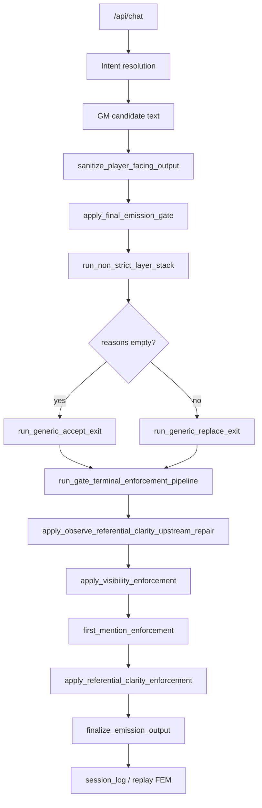

# BV3C — Execution Path Trace

**Date:** 2026-06-21  
**Scope:** Production path from API/chat through BV3A upstream repair to referential-clarity fallback.  
**Goal:** Document stage inputs/outputs and explain where `referential_clarity_upstream_repair_applied` is stamped.

---

## Path overview

Observe turns on the generic (non–strict-social) path always reach step **K** when they exit through `run_generic_accept_exit` or `run_generic_replace_exit`. Strict-social turns bypass upstream repair by design (`strict_social_active=True` early return).

---

## Stage trace

### 1. API / chat

| Field | Typical observe-turn value |
|---|---|
| **Input** | `POST /api/chat` `{ "text": "I look around." }` |
| **Output** | Resolution packet + GM candidate in turn log |
| **route_kind** | `observe` (`resolution.kind`) |
| **Meta** | `resolution.metadata.*`, retry flags when echo/repetition triggers |

**Replay note (BV3B refresh):** `tools/bv3b_replay_corpus_refresh.py` stubs GPT with dialogue containing `"Keep moving," he says`, but live replay also routes through retry/prepared-emission paths. Final gate candidates on refreshed turns are often **prepared scene text** (e.g. guard spear-butt dialogue), not the raw stub string.

---

### 2. Finalization entry

| Field | Value |
|---|---|
| **Owner** | `game.api_turn_support._finalize_player_facing_for_turn` → `game.final_emission_runtime.finalize_player_facing_emission` → `game.final_emission_gate.apply_final_emission_gate` |
| **Input payload** | `gm_output.player_facing_text` (sanitized for non–strict-social) |
| **Output payload** | Finalized `gm_output` with `_final_emission_meta` |
| **route_kind** | Propagated as `res_kind` from gate context |
| **Meta** | Preflight context: `active_interlocutor`, `strict_social_active`, `eff_resolution` |

---

### 3. Non-strict layer stack (pre-terminal)

| Field | Value |
|---|---|
| **Owner** | `game.final_emission_non_strict_stack.run_non_strict_layer_stack` |
| **Input** | Gate candidate text + resolution/session/scene/world |
| **Output** | Mutated `player_facing_text`, layer debug metas, optional `reasons` for replace path |
| **route_kind** | Unchanged (`observe`) |
| **Meta** | `response_type_*`, policy-layer repair flags, IC validate-only |

Upstream repair has **not** run yet. Text may already differ from raw GPT output (opening fallback selection, passive-scene pressure, retry substitution).

---

### 4. Generic accept / replace exit

| Field | Accept path | Replace path |
|---|---|---|
| **Owner** | `game.final_emission_generic_exit.run_generic_accept_exit` | `run_generic_replace_exit` |
| **Input** | Stack output text | Stack output + rejection `reasons` |
| **Output** | FEM base assembled, then terminal pipeline | Same |
| **route_kind** | `observe` | `observe` |
| **Meta** | `build_gate_accept_fem_base`, merged layer metas | Replace-path FEM + sealed fallback traces |

Both paths call `terminal_pipeline.run_gate_terminal_enforcement_pipeline` with profile `generic_accept` or `generic_replace`.

---

### 5. Terminal pipeline — BV3A upstream repair

| Field | Value |
|---|---|
| **Owner** | `game.final_emission_referential_clarity.apply_observe_referential_clarity_upstream_repair` |
| **Call site** | First step inside `run_gate_terminal_enforcement_pipeline` (before visibility) |
| **Input payload** | `out.player_facing_text`, session/scene/world, `res_kind`, `active_interlocutor`, `eff_resolution` |
| **Early exit** | `strict_social_active=True` **or** `res_kind != "observe"` → defaults only, no attempt |
| **Validation pass exit** | `validate_player_facing_referential_clarity` returns `ok=True` → no attempt stamp beyond defaults |

**On violation (observe, non-strict):**

| Meta field | Value |
|---|---|
| `referential_clarity_upstream_repair_attempted` | `true` |
| `referential_clarity_upstream_repair_eligible` | Result of `_violations_eligible_for_non_strict_local_pronoun_repair` |
| `referential_clarity_upstream_repair_applied` | `true` only if local substitution succeeds and re-validates |
| `referential_clarity_unrepaired_violation_count` | Violation count before repair |

**Output payload:** Same `out` dict; `player_facing_text` updated only when repair applied.

---

### 6. Visibility enforcement

| Field | Value |
|---|---|
| **Owner** | `game.final_emission_visibility_fallback.apply_visibility_enforcement` |
| **Input** | Post-upstream text + visibility validators |
| **Output** | Visibility/first-mention stages; may hard-replace before referential stage |
| **route_kind** | `observe` |
| **Meta preservation** | `_referential_clarity_repair_meta_snapshot` / `_restore_referential_clarity_repair_meta` around default resets |

Upstream repair meta **should** survive this stage when snapshot restore works.

---

### 7. Referential clarity enforcement (downstream)

| Field | Value |
|---|---|
| **Owner** | `game.final_emission_visibility_fallback.apply_referential_clarity_enforcement` |
| **Input** | Text after visibility/first-mention |
| **Output** | Local substitution **or** `standard_visibility_safe_fallback` hard replace |
| **route_kind** | `observe` |
| **Meta** | Overwrites `referential_clarity_violation_*` for **current** validation; preserves upstream flags via snapshot when validation passes early |

When hard replace fires: `referential_clarity_replacement_applied=true`, `final_route=replaced`, lineage kind `referential_clarity_hard_replacement`.

---

### 8. Finalize + replay artifacts

| Field | Value |
|---|---|
| **Owner** | `game.final_emission_finalize.finalize_emission_output` |
| **Input** | Gate output + `_final_emission_meta` |
| **Output** | Packaging-only normalization; FEM retained |
| **Replay scan** | `tools/bv3a_referential_clarity_metrics.scan_canonical_fem_turns` walks all FEM-shaped dicts under `DEFAULT_ROOTS` |

---

## Observed production behavior (refreshed corpus)

| Stage signal | Count (65 observe FEM instances) |
|---|---:|
| Upstream field present | 21 |
| `upstream_repair_attempted=true` | 11 |
| `upstream_repair_eligible=true` | **0** |
| `upstream_repair_applied=true` | **0** |
| `referential_clarity_replacement_applied=true` | 50 |

**Conclusion:** The pipeline is **not bypassed** on refreshed observe turns that carry violations. Repair is **reached** but **never eligible/applied** on scanned shapes. A large share of corpus FEM (44/65) lacks upstream fields entirely (pre-BV3A archived snapshots).

---

## Code anchors

| Stage | Module / function |
|---|---|
| API finalize | `game.api_turn_support`, `game.final_emission_runtime` |
| Gate orchestration | `game.final_emission_gate.apply_final_emission_gate` |
| Terminal pipeline | `game.final_emission_terminal_pipeline.run_gate_terminal_enforcement_pipeline` |
| BV3A upstream | `game.final_emission_referential_clarity.apply_observe_referential_clarity_upstream_repair` |
| Downstream RC | `game.final_emission_visibility_fallback.apply_referential_clarity_enforcement` |
