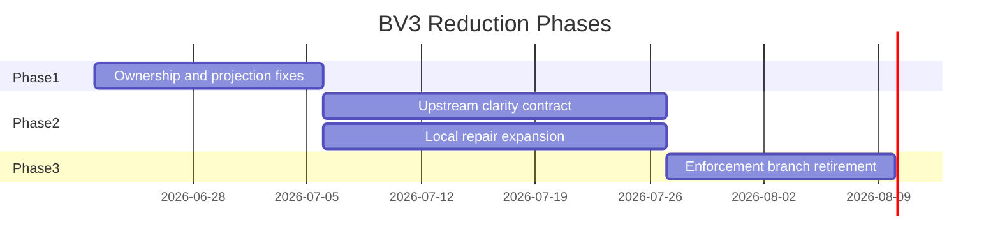

# BV3 — Observe-Route Fallback Reduction Plan

**Date:** 2026-06-21  
**Goal:** Reduce fallback **incidence** on observe route, not merely relocate ownership.  
**Baseline:** Observe route rate **95.45%**; overall fallback incidence **69.16%**; ownerless **13**.  
**Constraint:** Analysis-only cycle — this document is the implementation plan; no production changes in BV3.

---

## Executive strategy

Three-phase plan aligned with elimination candidates ([BV3_fallback_elimination_candidates.md](BV3_fallback_elimination_candidates.md)):

1. **Phase 1 — Low-risk eliminations:** Behavior-neutral ownership, projection, and measurement fixes (EC-03 through EC-06, EC-09, EC-10).
2. **Phase 2 — Contract enforcement:** Upstream referential-clarity and observe realization contracts (EC-01, EC-07) plus expanded local repair (EC-02).
3. **Phase 3 — Fallback removal candidates:** Retire redundant enforcement hard-replace branches after incidence collapse (EC-08).

Success requires Phase 2 — Phase 1 alone reproduces BV1B (legibility without incidence change).

---

## Phase 1 — Low-risk eliminations (behavior-neutral)

**Duration estimate:** 1 cycle  
**Expected incidence movement:** **0 pp** on route rate; ownerless 13 → **5**

### Work items

| ID | Work | Module(s) | Acceptance criteria |
|---|---|---|---|
| P1-1 | Enforce owner bucket stamp on RC hard-replace | `final_emission_visibility_fallback.apply_referential_clarity_enforcement` | 8 observe RC events gain `sealed-gate` bucket; repo ownerless −8 |
| P1-2 | Split prepared-emission accept vs fallback lineage | `final_emission_replay_projection` | 2 observe `accept_candidate` turns no longer count as fallback turns in incidence report |
| P1-3 | Lineage `event_owner` ← selection owner | `final_emission_replay_projection`, `runtime_lineage_telemetry` | Gate event_owner count drops; matches selection owner split |
| P1-4 | Stamp realization family on RC sealed replace | `final_emission_visibility_fallback`, `final_emission_sealed_fallback` | Observe FEM `realization_fallback_family=gate_terminal_repair` on hard replaces |
| P1-5 | Stamp FEM `fallback_kind` on RC replace | `final_emission_visibility_fallback` | FEM ↔ lineage kind parity on observe corpus |
| P1-6 | Gate selection label → visibility (OR-PSP-01) | `final_emission_replay_projection` | 0 observe events with gate selection owner |

### Phase 1 verification gate

```text
pytest tests/test_final_emission_visibility_fallback.py
pytest tests/test_final_emission_meta.py tests/test_runtime_lineage_telemetry.py
pytest tests/test_fallback_incidence_report.py
python tools/bv1b_fallback_incidence_validation.py  # new BV3 snapshot
```

**Expected Phase 1 snapshot:**

| Metric | Baseline | Phase 1 projected |
|---|---:|---:|
| Observe route rate (raw) | 95.45% | 95.45% |
| Observe route rate (incidence-adjusted) | 95.45% | **~90.9%** (accept reclassification) |
| Overall fallback incidence (raw) | 69.16% | 69.16% |
| Overall incidence (adjusted) | 69.16% | **~67.3%** |
| Ownerless (repo) | 13 | **5** |

---

## Phase 2 — Contract enforcement (incidence reduction)

**Duration estimate:** 2–3 cycles  
**Expected incidence movement:** Observe route **−15 to −35 pp**; overall **−6 to −12 pp**

### Work items

| ID | Work | Module(s) | Depends on |
|---|---|---|---|
| P2-1 | Observe referential-clarity upstream contract | `prompt_context`, `upstream_response_repairs`, GM output path | Protected replay baseline |
| P2-2 | Visible-fact-aligned observe realization | `human_adjacent_focus`, `opening_visible_fact_selection`, observe prompt assembly | P2-1 |
| P2-3 | Non-strict local referential repair expansion | `final_emission_referential_clarity`, `final_emission_visibility_fallback` | Violation shape analysis on 39 ambiguous_entity_reference turns |
| P2-4 | Terminal pipeline pre-check seam | `final_emission_terminal_pipeline` | Inject upstream contract assertion before `apply_visibility_enforcement` |
| P2-5 | Registry + governance updates | `final_emission_ownership_schema`, `tests/test_ownership_registry.py`, replay manifest | P1 complete |

### P2-1 contract specification (draft)

For `route_kind=observe` turns entering terminal pipeline:

1. GM/upstream output MUST pass `validate_player_facing_referential_clarity` **or** carry `upstream_referential_clarity_repair_applied=True` with stamped repair token.
2. Observe text MUST anchor at least one checked entity from scene visible facts when `ambiguous_entity_reference` would otherwise fire.
3. Failure at upstream layer → retry/repair loop **before** gate hard replace (reuse GM retry policy where applicable).

### P2-3 local repair expansion criteria

Enable non-strict local substitution when **all** hold:

- Violation kinds ⊆ `{ambiguous_entity_reference, dialogue_attribution_they}` (corpus-shaped).
- `_referential_clarity_violations_have_multi_entity_candidates` is false.
- Repaired text passes referential clarity + narration purity validators.

### Phase 2 verification gate

```text
pytest tests/test_referential_clarity_player_coref.py
pytest tests/test_upstream_response_repairs.py
pytest tests/test_transcript_gauntlet_actor_addressing.py
python tools/run_scenario_spine_validation.py  # protected branches
python tools/bv1b_fallback_incidence_validation.py  # BV3-P2 snapshot
```

**Expected Phase 2 snapshot (conservative):**

| Metric | Baseline | Phase 2 conservative | Phase 2 target |
|---|---:|---:|---:|
| Observe route rate | 95.45% | **70%** | **<85%** |
| Overall fallback incidence | 69.16% | **58%** | **<60%** |
| `referential_clarity_hard_replacement` events | 38 | **≤22** | **≤26** |
| Ownerless (repo) | 13 | **≤5** | **≤5** |

---

## Phase 3 — Fallback removal candidates

**Duration estimate:** 1 cycle (after Phase 2 stable)  
**Precondition:** Observe route rate **<70%** for two consecutive snapshots; protected replay green.

### Work items

| ID | Work | Rationale |
|---|---|---|
| P3-1 | Collapse visibility-hard-replace on observe when upstream contract success rate >95% | OR-VIS-01 already zero — formalize skip |
| P3-2 | Collapse first-mention-hard-replace on observe when FM pass rate =100% on corpus | OR-FM-01 already zero |
| P3-3 | Reduce passive-scene fallback candidate priority when upstream scene pressure satisfier active | Lower sealed sink usage |
| P3-4 | Deprecate gate lineage packaging shims | EC-05 follow-through — gate no longer appears as fallback owner in any report |

### Phase 3 risk controls

- Feature flag: `observe_upstream_clarity_contract_enforced` (default off until Phase 2 validation).
- Rollback: revert upstream contract; gate enforcement chain unchanged.
- **Do not** remove sealed content modules — only reduce ** invocation rate**.

**Expected Phase 3 snapshot (stretch):**

| Metric | Baseline | Phase 3 stretch |
|---|---:|---:|
| Observe route rate | 95.45% | **45–55%** |
| Overall fallback incidence | 69.16% | **45–50%** |
| Referential clarity events (repo) | 38 | **≤15** |

---

## Implementation sequencing



---

## Anti-patterns (explicitly out of scope)

| Anti-pattern | Why excluded |
|---|---|
| Relocate selection to gate or meta without upstream fix | BV1B proved incidence unchanged |
| Remove sealed fallback content modules | Still required safety net |
| Incidence reduction via projection-only reclassification beyond accept/replace split | Must not hide true hard replaces |
| Owner bucket assignment without trigger reduction | Governance-only; Phase 1 support role |

---

## Scorecard linkage

| BV1C metric | Phase 1 | Phase 2 | Phase 3 |
|---|---|---|---|
| Maintenance Economics | +0 (measurement) | **+0.5–1** | **+1** |
| Maintenance Drag | +0 | +0.5 | +1 |
| Ownership Clarity | **+0.5** | +0.5 | +0.5 |
| Operational Simplicity | +0 | +0 | +0.5 |

---

## Deliverables per phase

| Phase | Production deliverables | Governance deliverables |
|---|---|---|
| 1 | Stamp/projection patches | Updated BV3 snapshot; ownerless ≤5 |
| 2 | Upstream contract + local repair | Second longitudinal snapshot showing **improving** trend |
| 3 | Enforcement simplification | Observe route <70%; referential clarity ≤15 events |

---

## Evidence

| Source | Role |
|---|---|
| [BV3_fallback_elimination_candidates.md](BV3_fallback_elimination_candidates.md) | EC-01 … EC-10 |
| [BV1B_fallback_baseline_comparison.md](BV1B_fallback_baseline_comparison.md) | Relocation anti-pattern evidence |
| [BV_follow_on_candidates.md](BV_follow_on_candidates.md) | Success metrics |
| `tools/bv1b_fallback_incidence_validation.py` | Snapshot pipeline |
