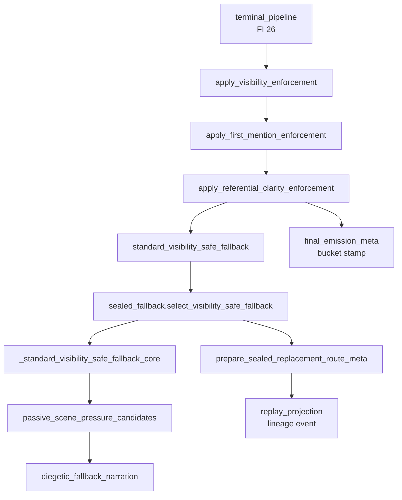

# BV3 — Observe-Route Fallback Concentration Report

**Date:** 2026-06-21  
**Scope:** Route frequency, owner concentration, fan-in, fan-out, and dominant routing hubs on observe-route fallback surface.  
**Baseline:** Observe fallback route rate **95.45%**; overall fallback trigger rate **69.16%**.

---

## Route frequency concentration

### By route kind (turn-scoped)

| Route | Eligible turns | Fallback turns | Trigger rate | Share of all fallback turns |
|---|---:|---:|---:|---:|
| **observe** | 44 | 42 | **95.45%** | 56.8% (42/74) |
| scene_opening | 62 | 31 | 50.00% | 41.9% |
| unknown | 1 | 1 | 100.00% | 1.4% |

**Finding:** Observe is the **highest trigger-rate route** and the **largest single-route fallback volume** in the corpus.

### By lineage fallback kind (observe only)

| Fallback kind | Events | % of observe fallbacks | Cumulative |
|---|---:|---:|---:|
| `referential_clarity_hard_replacement` | 38 | 90.5% | 90.5% |
| `response_type_prepared_emission` | 3 | 7.1% | 97.6% |
| `sealed_passive_scene_pressure_fallback` | 1 | 2.4% | 100% |

**Gini-like concentration:** One kind (`referential_clarity_hard_replacement`) accounts for **>90%** of observe fallback events.

### By content source (FEM `final_emitted_source`, observe fallback turns)

| Source | Turns | Share |
|---|---:|---:|
| `passive_scene_pressure_fallback` | 40 | 95.2% |
| `action_outcome_upstream_prepared_repair` | 2 | 4.8% |

**Finding:** Content concentration exceeds selection concentration — nearly all observe hard replaces emit passive-scene-pressure prose.

---

## Owner concentration

### Selection owner (lineage, observe fallback events)

| Owner | Events | Share |
|---|---:|---:|
| `game.final_emission_visibility_fallback` | 38 | 90.5% |
| `None` (unstamped) | 3 | 7.1% |
| `game.final_emission_gate` | 1 | 2.4% |

### Content owner (lineage, observe fallback events)

| Owner | Events | Share |
|---|---:|---:|
| `game.final_emission_sealed_fallback` | 39 | 92.9% |
| `None` | 3 | 7.1% |

### Owner bucket (lineage, observe fallback events)

| Bucket | Events | Share |
|---|---:|---:|
| `sealed-gate` | 30 | 71.4% |
| `None` (ownerless) | 12 | 28.6% |

**Repo-wide context:** 13/74 ownerless events total (BV1B) — **92%** of observe ownerless events are referential-clarity (8) or response-type (3) gaps.

### Cross-route owner bucket (observe vs scene_opening)

| Route | sealed-gate | upstream-prepared | unknown-ambiguous |
|---|---:|---:|---:|
| observe | 30 | 0 | 0 |
| scene_opening | 0 | 30 | 1 |

Observe fallbacks **never** stamp `upstream-prepared` — attribution/sealed-gate coupling is total on bucketed events.

---

## Fan-in analysis (who calls observe fallback machinery)

Data from `docs/audits/BU_import_fan_in_fan_out.csv` and `BU_caller_fan_in.csv` (BU baseline, stable post-BK).

### Production fan-in to enforcement entry

| Symbol | Fan-in (prod / total) | Role |
|---|---:|---|
| `apply_visibility_enforcement` | **1 / 2** | Terminal pipeline only (production) |
| `run_gate_terminal_enforcement_pipeline` | **2 / 2** | Generic exit + strict social stack |
| `final_emission_terminal_pipeline` (module) | **26 / 26** | Terminal convergence hub |
| `final_emission_visibility_fallback` (module) | **17 / 17** | Selection orchestration hub |
| `final_emission_sealed_fallback` (module) | **10 / 10** | Content + route-meta hub |
| `select_visibility_safe_fallback` | **1 / 2** | Visibility → sealed facade |
| `standard_visibility_safe_fallback` | **0 / 3** | Test-only direct importers |
| `diegetic_fallback_narration` (module) | **13 / 13** | Prose template library |

### Fan-in to terminal pipeline (dominant upstream hub)

| Importer category | Count | Notes |
|---|---:|---|
| Production | 2 | `generic_exit`, `strict_social_stack` |
| Tests | 23 | Orchestration regression suites |
| Helpers | 1 | `post_speaker_finalize_probe` |

**Hub verdict:** `final_emission_terminal_pipeline` is the **dominant fan-in convergence point** (26 total FI) feeding observe enforcement.

---

## Fan-out analysis (where routing disperses)

### `final_emission_visibility_fallback` fan-out (18 modules)

Key downstream imports: `final_emission_sealed_fallback`, `final_emission_referential_clarity`, `narration_visibility`, `diegetic_fallback_narration`, `final_emission_passive_scene_pressure`, `final_emission_scene_emit_integrity`, `anti_reset_emission_guard`, `final_emission_opening_fallback`, `final_emission_meta`, owner-bucket views.

**Pattern:** High **bidirectional** coupling with sealed fallback (17 FI / 17 FO visibility module per BV1C) — selection and content hubs are mutually dependent.

### `final_emission_sealed_fallback` fan-out (14 modules)

Imports visibility_fallback back (facade), plus opening, passive scene pressure, scene emit integrity, scene facts, meta, owner buckets, realization provenance.

**Pattern:** Content hub re-enters selection hub — **routing loop** bounded by ownership rules (sealed must not author prose) but maintains graph density.

---

## Dominant routing hubs (ranked by observe leverage)

| Rank | Hub | FI / FO | Observe-specific role | Concentration risk |
|---:|---|---:|---|---|
| 1 | `final_emission_visibility_fallback` | 17 / 18 | 38/42 selection-owner events; referential clarity orchestration | **Critical** — primary selection concentration |
| 2 | `final_emission_terminal_pipeline` | 26 / 13 | Single entry to enforcement chain | **Critical** — fan-in choke point |
| 3 | `final_emission_sealed_fallback` | 10 / 14 | 39/42 content-owner events | **High** — content concentration |
| 4 | `diegetic_fallback_narration` | 13 / 1 | Passive-scene observe prose | **High** — template concentration |
| 5 | `final_emission_passive_scene_pressure` | 7 / 3 | 40/42 winning candidate branch | **High** — branch selection concentration |
| 6 | `final_emission_replay_projection` | 15 / 4 | Packages all lineage; gate default owner | **Medium** — measurement hub |
| 7 | `final_emission_gate` | 28 / 7 (module); prod FI **1** | Lineage label on 1 observe event; 74/74 event_owner default | **Medium** — legacy packaging |
| 8 | `final_emission_meta` | 22 / 8 | Bucket stamping, producer repair kind | **Medium** — metadata write dispersion |

---

## Route fan-in / fan-out diagram (observe hard-replace path)

---

## Concentration metrics summary

| Metric | Value | Interpretation |
|---|---:|---|
| Top fallback kind share (observe) | 90.5% | Extreme kind concentration |
| Top content source share (observe) | 95.2% | Single branch dominates |
| Top selection owner share | 90.5% | Visibility module owns selection |
| Ownerless share (observe) | 28.6% | Bucket stamping incomplete |
| Observe share of all fallback turns | 56.8% | Route-level dominance |
| Referential clarity share of **all** repo fallbacks | 51.4% | Cross-route attribution hotspot |

---

## Implications

1. **Reduction must target OR-RC-01 upstream triggers** — hub decomposition alone reshuffles the same 38 events across owners (BV1B outcome).
2. **Passive scene pressure branch is the default sink** — upstream clarity improvements should collapse routing through this branch, not remove the branch itself.
3. **Terminal pipeline fan-in** makes it the correct seam for upstream contract injection (pre-enforcement clarity assertions).
4. **Ownerless 28.6% on observe** depresses governance ROI metrics — close before judging reduction phases.

---

## Evidence

| Source | Role |
|---|---|
| `artifacts/golden_replay/bv1b_fallback_incidence_report.json` | Frequencies, cross-tabs |
| `docs/audits/BU_import_fan_in_fan_out.csv` | Module FI/FO |
| `docs/audits/BU_caller_fan_in.csv` | Symbol-level fan-in |
| [BV1C_hub_migration_analysis.md](BV1C_hub_migration_analysis.md) | Hub relocation context |
| [BV3_observe_route_inventory.md](BV3_observe_route_inventory.md) | Route IDs |
