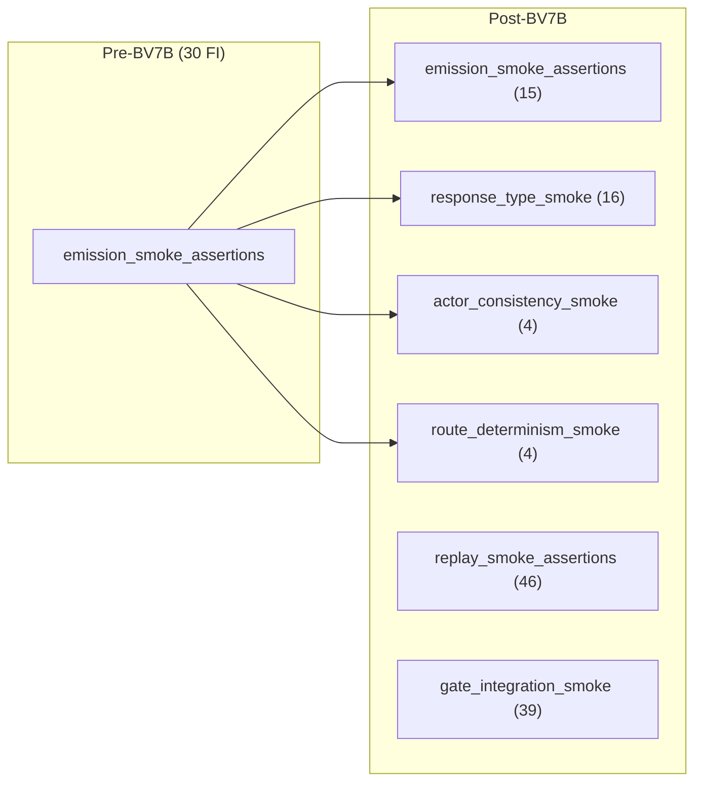

# BV7B — Hub Reclassification

**Date:** 2026-06-21  
**Context:** Post consumer-layer extraction fan-in redistribution

---

## Is `emission_smoke_assertions` still a maintenance hub?

**Partially — role changed from bridge aggregator to smoke-core barrel.**

| Dimension | Pre-BV7 (73 FI) | Post-BV7A (30 FI) | Post-BV7B (15 FI) |
|---|---:|---:|---:|
| Bridge concentration | HIGH (FEM + gate + AC/RD/RT) | MEDIUM (AC/RD/RT + smoke) | **LOW** (phrase/route/speaker only) |
| Accidental coupling risk | HIGH | MEDIUM | **LOW** |
| Intentional aggregation | mixed | partial | **yes** — remaining FI is deliberate smoke |

The monolith is **no longer the largest test-helper fan-in node** and **no longer the #1 ecosystem hub**. Remaining importers are suites that genuinely need phrase hygiene, route wiring smoke, or speaker/open-call checks — not consumer-layer validator seams.

---

## Has concentration moved or actually reduced?

**Both — redistribution plus net reduction.**

- **Net monolith FI:** 30 → 15 (−50%). Target band 12–18 **met**.
- **Concentration moved** to named family modules (RT 16, AC 4, RD 4) without increasing total ecosystem coupling — symbols delegate to the same production owners as before.
- **BV7A bridges unchanged:** replay (46) and gate (39) remain the dominant integration hubs by design.

---

## Largest remaining test concentration points

| Rank | Module | FI | Role |
|---:|---|---:|---|
| 1 | `tests.helpers.replay_smoke_assertions` | **46** | FEM read bridge (BV7A) |
| 2 | `tests.helpers.gate_integration_smoke` | **39** | Full gate orchestration bridge (BV7A) |
| 3 | `tests.helpers.response_type_smoke` | **16** | RT consumer seams (BV7B) |
| 4 | `tests.helpers.emission_smoke_assertions` | **15** | Phrase/route/speaker smoke + compatibility barrel |
| 5 | `tests.helpers.opening_fallback_evidence` | 23 | Opening fallback scaffolds (unchanged) |

**Production-side largest hub:** `game.final_emission_meta_read` (29 FI) — unchanged; smoke bridges fan into it intentionally.

---

## Maintenance implications

1. **RT/AC/RD policy edits** should touch family modules + owner suites, not the monolith.
2. **Phrase/route smoke edits** remain on `emission_smoke_assertions` (BE6 triple-layer lock preserved).
3. **New tests** should import family modules directly; monolith re-export is compatibility-only.
4. **Optional BV7C:** extract phrase/route/speaker into `fallback_smoke_assertions` / `speaker_smoke_assertions` when monolith FI ≤5 is desired; current 15 FI is within target and reflects intentional smoke aggregation.

---

## Verdict

| Question | Answer |
|---|---|
| Still a maintenance hub? | **Smoke-core hub only** — not bridge hub |
| Concentration reduced? | **Yes** — 50% monolith FI drop |
| Concentration moved? | **Yes** — to RT/AC/RD family modules + existing BV7A bridges |
| Largest test concentration? | **`replay_smoke_assertions` (46 FI)** |
