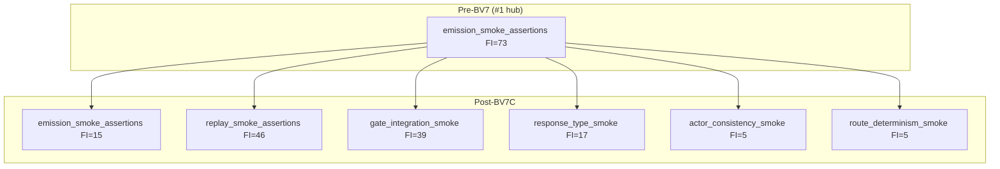

# BV7C — Hub Rankings (Post-Closeout Re-Measurement)

**Date:** 2026-06-21  
**Method:** `scripts/bu_final_emission_coupling_discovery.py` → `docs/audits/BU_import_fan_in_fan_out.csv`  
**BV baseline:** Pre-BV7 concentration report ([BV7_concentration_report.md](BV7_concentration_report.md), FI=73 on monolith)

---

## Primary metric — smoke helper concentration

| Module | BV7 start | BV7C end | Delta |
|---|---:|---:|---:|
| `emission_smoke_assertions` | **73** | **15** | **−58 (−79%)** |
| `replay_smoke_assertions` | 0 (n/a) | **46** | +46 (BV7A bridge) |
| `gate_integration_smoke` | 0 (n/a) | **39** | +39 (BV7A bridge) |
| `response_type_smoke` | 0 (n/a) | **17*** | +17 (BV7B family) |
| `actor_consistency_smoke` | 0 (n/a) | **5*** | +5 (BV7B family) |
| `route_determinism_smoke` | 0 (n/a) | **5*** | +5 (BV7B family) |

\*Family module FI from direct Python importer scan (lazy delegates — not in BU ecosystem CSV rows). Includes compatibility-barrel fan-out.

**Verdict:** Monolith is **no longer #1** repository hub. Largest test-helper hubs are now the **intentionally extracted bridges** (replay, gate).

---

## Top 10 test helper hubs

| Rank | Module | FI | Change from BV baseline |
|---:|---|---:|---|
| 1 | `tests.helpers.replay_smoke_assertions` | **46** | new (BV7A; was monolith FEM bridge) |
| 2 | `tests.helpers.gate_integration_smoke` | **39** | new (BV7A; was monolith gate bridge) |
| 3 | `tests.helpers.opening_fallback_evidence` | **23** | unchanged |
| 4 | `tests.helpers.failure_dashboard_report` | **16** | unchanged |
| 5 | `tests.helpers.strict_social_harness` | **15** | unchanged |
| 5 | `tests.helpers.replay_drift_taxonomy` | **15** | unchanged |
| 5 | `tests.helpers.emission_smoke_assertions` | **15** | **−58** (was #1 at 73) |
| 8 | `tests.helpers.golden_replay_projection` | **14** | −4 vs BV5 (18→14) |
| 9 | `tests.helpers.failure_classifier` | **13** | unchanged |
| 10 | `tests.helpers.failure_classification_sync` | **12** | unchanged |

**Not in top 10 but BV7-relevant:**

| Module | FI | Notes |
|---|---:|---|
| `tests.helpers.response_type_smoke` | 17* | BV7B RT family |
| `tests.helpers.actor_consistency_smoke` | 5* | BV7B AC family |
| `tests.helpers.route_determinism_smoke` | 5* | BV7B RD family |

---

## Top 10 repository FI hubs

| Rank | Module | FI | Change from BV baseline |
|---:|---|---:|---|
| 1 | `game.social_exchange_emission` | **52** | unchanged |
| 1 | `game.final_emission_text` | **52** | unchanged |
| 3 | `tests.helpers.replay_smoke_assertions` | **46** | new bridge hub |
| 4 | `tests.helpers.gate_integration_smoke` | **39** | new bridge hub |
| 5 | `game.final_emission_gate` | **30** | +2 vs BV5 (28→30) |
| 6 | `game.final_emission_meta_read` | **29** | +1 vs BV5 (28→29) |
| 7 | `game.realization_provenance` | **28** | unchanged |
| 8 | `game.final_emission_terminal_pipeline` | **26** | unchanged |
| 9 | `game.final_emission_meta` | **24** | unchanged |
| 10 | `tests.helpers.opening_fallback_evidence` | **23** | unchanged |

**Dropped from top 10:** `emission_smoke_assertions` (was **#1 at 73**).

---

## Concentration shift diagram

---

## Evidence

| Source | Role |
|---|---|
| `docs/audits/BU_import_fan_in_fan_out.csv` | Module-level FI (regenerated 2026-06-21) |
| [BV7B_hub_reclassification.md](BV7B_hub_reclassification.md) | Post-BV7B hub role change |
| `tests/test_ownership_registry.py` | BV7C FI cap + import guard locks |
