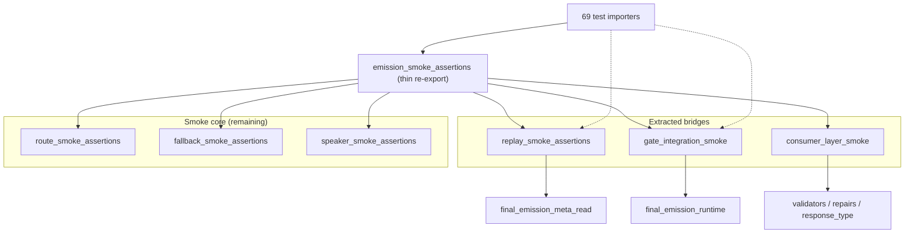

# BV7 — Smoke Facade Decomposition Plan

**Date:** 2026-06-21
**Status:** Plan only — **no implementation**
**Constraint:** Behavior-preserving; registry locks (BE6, BJ-4, AL4) must remain green
**Primary metric:** Module fan-in on `emission_smoke_assertions`

## Objectives

1. Reduce monolith FI from **73** to **≤20** (post-migration target)
2. Preserve intentional downstream smoke phrase/route ownership
3. Relocate read and gate-integration bridges to named modules (mirror BV2 meta read split)
4. Keep thin compatibility facade until consumer migration completes

## Architecture target



---

## Phase 1 — Low-risk extraction (1 cycle)

**FI target:** 73 → **~73** (re-exports only); establishes module boundaries

| Step | Action | Verification |
|---|---|---|
| 1.1 | Create `tests/helpers/replay_smoke_assertions.py`; move `final_emission_meta_from_output`, `read_turn_debug_notes` | `test_emission_smoke_assertions_contract.py` + transcript suites green |
| 1.2 | Create `tests/helpers/gate_integration_smoke.py`; move `apply_final_emission_gate_consumer`, `gm_response_stub` | Gate orchestration order + strict_social_harness green |
| 1.3 | Create `tests/helpers/route_smoke_assertions.py`, `fallback_smoke_assertions.py`, `speaker_smoke_assertions.py` for pure smoke helpers | BE6 registry lock + turn_pipeline_shared green |
| 1.4 | Monolith re-exports all symbols (no consumer changes) | BU scan: FI unchanged; FO +3 helper modules |
| 1.5 | Update `test_ownership_registry.py` AL4 quick reference paths | Registry governance tests green |

**Exit criteria:** Zero test behavior change; new modules appear in ownership registry.

---

## Phase 2 — Consumer migration (1–2 cycles)

**FI target:** 73 → **~18–22** (−51 to −55)

| Wave | Consumers | Target import | Expected Δ FI |
|---|---:|---|---:|
| 2A | 42 FEM-read-only + transcript helpers | `replay_smoke_assertions` | −42 |
| 2B | 37 gate-consumer suites + strict_social_harness | `gate_integration_smoke` | −37 |
| 2C | 18 AC/RD/RT boundary suites | `consumer_layer_smoke` or `repairs_consumer_facade` | −18 |
| 2D | 8 route + 4 phrase + 4 social smoke consumers | dedicated smoke modules | −12 |

Migrate highest-overlap files first (`test_turn_pipeline_shared.py`, `test_anti_railroading.py`, boundary convergence suite).

**Exit criteria:** ≤5 importers remain on monolith re-export; BU scan module FI ≤ **22**.

---

## Phase 3 — Facade governance (1 cycle)

| Step | Action |
|---|---|
| 3.1 | Deprecation docstring on monolith re-exports; direct new imports required for new tests |
| 3.2 | Registry lock: monolith must not grow public exports (existing BJ-4 test) |
| 3.3 | Optional: collapse monolith to `__init__`-style re-export barrel or remove after FI ≤5 |
| 3.4 | BU scan + BV scorecard refresh |

**Exit criteria:** New tests cannot add monolith FI; smoke phrase edits touch ≤2 modules.

## Verification gates

```text
python scripts/bu_final_emission_coupling_discovery.py
pytest tests/test_emission_smoke_assertions_contract.py
pytest tests/test_ownership_registry.py -k smoke
pytest tests/test_turn_pipeline_shared.py
pytest tests/test_final_emission_boundary_convergence.py
```
