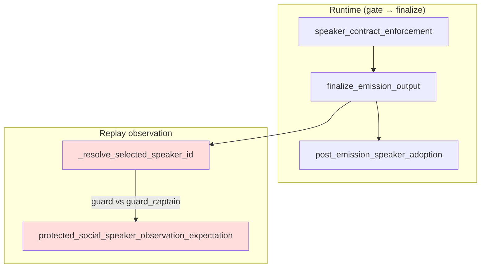

# BV8 — Speaker Recurrence Trace Analysis

**Date:** 2026-06-21  
**Scope:** Trace speaker-family recurrence through projection → relocation → finalize → replay; identify first divergence points.

---

## Trace target

Primary case: **`vocative_override_after_prior_continuity`** (8 recurrence rows)  
Secondary case: **`wrong_speaker_strict_social_emission`** (1 emerging row)

Method: Code-path trace + BT checkpoint model ([BT_speaker_finalization_divergence_discovery.md](BT_speaker_finalization_divergence_discovery.md)).

---

## Pipeline ordering (strict-social / social path)

```text
GPT response → gate preflight → strict_social_stack / non_strict_stack
  → enforce_emitted_speaker_with_contract     [P0/P1 finalize]
  → post-enforcement stack (dialogue strip, visibility, fallback, continuity)
  → finalize_emission_output                  [P2 final emission]
  → API payload + turn snapshot
  → post_emission_speaker_adoption            [adoption — post-GM]
  → project_turn_observation                  [replay projection]
  → protected golden assertion                [replay acceptance]
```

---

## Stage 1 — Projection (`golden_replay_projection.py`)

| Checkpoint | What is observed | Speaker identity source |
|---|---|---|
| `project_turn_observation` | Builds protected observation dict including `selected_speaker_id` | `_resolve_selected_speaker_id(social_contract_trace, snap, social)` |
| Priority chain | 1) trace fields → 2) `latest_target_id` → 3) `resolution.social.npc_id` | **Routing/state**, not emitted prose |
| Source metadata | `selected_speaker_source` records which tier won | e.g. `turn_trace.social_contract_trace` |

**First divergence point (vocative case):**

```text
Test expectation:     selected_speaker_id == "guard"          (short alias)
Projection output:    selected_speaker_id == "guard_captain"  (canonical NPC id)
Divergence location:  tests/helpers/golden_replay_projection.py::_resolve_selected_speaker_id
                      + test assertion vocabulary mismatch
```

**Not a divergence:** Final text attribution may correctly name "Gate Guard" while observation field uses canonical id — BT documents this as **selection-state vs emitted-attribution** ambiguity.

**Recurrence attribution gap:**

| Classifier field | Points to | Actual resolution owner |
|---|---|---|
| `investigate_first` | `tests/helpers/golden_replay.py` | `tests/helpers/golden_replay_projection.py` |
| `primary_owner` | `projection` | Correct category, wrong file in investigate_first |

---

## Stage 2 — Relocation (`speaker_relocation_shadow_harness.py`)

| Checkpoint | What is compared | Speaker captured? |
|---|---|---|
| Block T `SpeakerShadowEquivalence` | Gate vs isolated `enforce_emitted_speaker_with_contract` | Pre/post normalized **text** only |
| `with_finalize_delta` | Boolean: finalize changed post-speaker text | No speaker ID |

**Divergence status for vocative recurrence:** **No evidence** of relocation mismatch in failure report (0 speaker repair lineage events). Block T path is **not** the first diverger for this recurrence family.

**Latent gap:** Relocation harness could pass while `selected_speaker_id` projection still disagrees with expectation — text parity ≠ observation parity.

---

## Stage 3 — Finalize (`speaker_contract_enforcement.py` + terminal stack)

| Checkpoint | Module | Vocative case | Wrong-speaker case |
|---|---|---|---|
| P0 pre-enforcement | `speaker_contract_enforcement` | Contract expects vocative-switched target | Contract expects runner, GPT emits merchant |
| P1 post-enforcement | `speaker_contract_enforcement` | No speaker repair in lineage | **Enforcement repair** — category `speaker` |
| P2 final emission | `final_emission_finalize` | Sanitize/package; may use continuation fallback | Strict-social suppression of wrong attribution |
| Post-speaker probes | `post_speaker_finalize_probe` | Not in recurrence evidence | Not captured in recurrence row |

**First divergence point (wrong_speaker case):**

```text
Location:  game/speaker_contract_enforcement.py (enforce / repair path)
Field:     selected_speaker_id (observed via replay projection after enforcement)
Count:     1 event — emerging, not yet recurring
```

**Vocative case finalize verdict:** Finalize stack produced acceptable player text; recurrence is **downstream of finalize** at projection/expectation boundary.

---

## Stage 4 — Replay acceptance (`golden_replay.py`)

| Checkpoint | Function | Behavior |
|---|---|---|
| Protected expectation | `protected_social_speaker_observation_expectation(id)` | Exact equality on `selected_speaker_id` |
| Drift classification | `classify_golden_turn_drift` / rerun scorecard | Independent speaker vs text drift channels |
| Recurrence derivation | `replay_bug_recurrence.py` → failure dashboard | Keys on `(owner_drift_bucket, category, field_path, investigate_first)` |

**First divergence point (replay layer):**

```text
assert_protected_golden_turn_observation(
    turn,
    protected_social_speaker_observation_expectation("guard"),  # exact match
)
vs
turn["selected_speaker_id"]  # projected canonical id
```

**Recurrence persistence mechanism:**

1. Single failure on 2026-06-04 written to `replay_failure_report.md`
2. Backfill/migration appended **7 duplicate events** (same run_id) — [BQ36_recurrence_write_path_audit.md](BQ36_recurrence_write_path_audit.md)
3. Test subsequently fixed or environment resolved mismatch → test **green**
4. No `retired` status applied → key remains `active` with `occurrence_count=8`
5. `validated_outcome_count: 0` in history JSON — retirement workflow never ran

---

## Unified divergence map



| Case | First divergence | Layer | Recurring? |
|---|---|---|---|
| vocative_override (8 rows) | Alias vs canonical on `selected_speaker_id` | **Projection + expectation contract** | Inflated (1 real + 7 dupes) |
| wrong_speaker (1 row) | Enforcement repair vs projected speaker | **Finalize / enforcement** | Emerging only |

---

## Why BV3/BV4/BV7 did not reduce this recurrence

| Cycle | Target | Impact on speaker projection recurrence |
|---|---|---|
| BV3 | RC fallback observe-route | Reduced fallback incidence; vocative case used continuation fallback but speaker field mismatch unrelated |
| BV4 | PSP upstream satisfier | No speaker projection seam changes |
| BV7 | Smoke monolith decomposition | Test helper FI only; golden replay projection untouched |

Speaker recurrence is **orthogonal** to fallback reduction — it lives in the **replay observation contract**, not gate fallback routing.

---

## Evidence

| Source | Role |
|---|---|
| `tests/helpers/golden_replay_projection.py` | Projection trace owner |
| `tests/helpers/golden_replay.py` | Protected expectation + drift |
| `game/speaker_contract_enforcement.py` | Finalize enforcement |
| `game/post_emission_speaker_adoption.py` | Post-emission adoption (downstream) |
| [BV8_failure_family_map.md](BV8_failure_family_map.md) | Cause classification |
