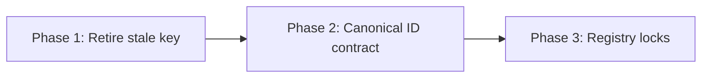

# BV8 — Speaker Recurrence Retirement Plan

**Date:** 2026-06-21  
**Goal:** Retire the dominant speaker projection recurrence family — not repeatedly patch alias mismatches.  
**Primary metric:** Recurrence concentration (target: dominant key share **≤10%**; recurring keys **0**)

---

## Strategy

Recurrence is **stale + inflated** (see [BV8_concentration_report.md](BV8_concentration_report.md)). Retirement is a **two-track** program:

1. **Hygiene track** — dedupe and formally retire resolved keys (immediate ROI, zero runtime change)
2. **Contract track** — prevent alias/canonical mismatch from re-forming recurrence keys

---

## Phase 1 — Highest ROI recurrence removal

**Objective:** Remove false concentration signal; validate green protected replay.

| Step | Action | Owner module | Runtime change? |
|---:|---|---|---|
| 1.1 | Dedupe `bug_recurrence_event_log.json`: collapse 8 projection events → **1** commit-worthy row (or **0** if retired without retention) | `replay_bug_recurrence.py` / backfill tooling | No |
| 1.2 | Mark projection key **`retired`** with evidence: vocative test green, no failure since 2026-06-04 | `failure_dashboard_report.py` | No |
| 1.3 | Regenerate `bug_recurrence_history.json` / `.md` | `write_bug_recurrence_history_artifacts` | No |
| 1.4 | Re-run protected golden replay lane; confirm zero new speaker projection failures | `tests/test_golden_replay*.py` | No |
| 1.5 | Update `validated_outcomes` in history summary (target: ≥1 validated retirement) | recurrence aggregation | No |

**Candidates applied:** R1, R6 ([BV8_retirement_candidates.md](BV8_retirement_candidates.md))

**Exit criteria:**

- [ ] Projection recurrence key status = `retired`
- [ ] Event log contains **no duplicate** rows for same `(recurrence_key, scenario_id, run_id)`
- [ ] `occurrence_count` for projection key = 0 in active keys OR key absent from active watchlist
- [ ] Protected golden replay lane green

---

## Phase 2 — Contract enforcement

**Objective:** Prevent alias/canonical mismatch from creating new recurrence.

| Step | Action | Owner module | Runtime change? |
|---:|---|---|---|
| 2.1 | **Canonical ID contract:** document that `selected_speaker_id` in protected observations is always canonical NPC id (never short alias) | `protected_replay_manifest.md`, `golden_replay_projection.py` docstring | No |
| 2.2 | Audit structural invariant tests: replace alias expectations (`"guard"`) with canonical ids (`"guard_captain"`) where roster defines both | `test_golden_replay_structural_invariants.py` | No |
| 2.3 | Add projection contract test: `_resolve_selected_speaker_id` output matches `canonical_interaction_target_npc_id` when trace provides alias | `test_golden_replay_projection.py` | No |
| 2.4 | Fix **investigate_first** routing: `selected_speaker_id` drift → `tests/helpers/golden_replay_projection.py` | `replay_drift_taxonomy.py`, failure classifier | No |
| 2.5 | Monitor wrong_speaker enforcement key — if occurrence_count ≥ 2, classify before retiring | speaker owner suites | No |

**Candidates applied:** R2, R3, R5

**Optional (medium cost):**

- R4 BT `SpeakerContractObservation` helper on Block S/T/U fixtures — joins finalize checkpoints to projection

**Exit criteria:**

- [ ] No protected test uses short alias in `protected_social_speaker_observation_expectation` where canonical id exists
- [ ] Drift taxonomy investigate_first aligned with projection owner
- [ ] Zero new `speaker_drift|projection|selected_speaker_id` events after 2 protected replay CI cycles

---

## Phase 3 — Registry protection

**Objective:** Lock retirement gains; prevent recurrence inflation regrowth.

| Step | Action | Owner module | Runtime change? |
|---:|---|---|---|
| 3.1 | Add ownership registry test: recurrence keys for `selected_speaker_id` must cite `golden_replay_projection.py` as investigate_first | `test_ownership_registry.py` | No |
| 3.2 | Add dedupe contract test: `append_recurrence_events` rejects duplicate `(key, scenario, run_id)` within same batch | `test_replay_bug_class_recurrence.py` | No |
| 3.3 | Add retirement evidence contract: `retired` status requires `validated_outcome` evidence blob (test node + pass timestamp) | `replay_bug_recurrence.py` | No |
| 3.4 | Wire BV8 closeout audit doc; link from [BV7_closeout.md](BV7_closeout.md) next-target section | docs/audits | No |

**Exit criteria:**

- [ ] Registry governance tests enforce investigate_first + dedupe + retirement evidence
- [ ] `validated_outcome_count ≥ 1` in regenerated history
- [ ] BV8 closeout documents before/after concentration metrics

---

## Phase dependency graph

Phase 1 can ship independently. Phase 2 should follow within same cycle to prevent key re-activation. Phase 3 locks the contract.

---

## Out of scope (explicit deferrals)

| Item | Reason |
|---|---|
| R7 prose-based speaker projection | High replay/speaker risk; conflicts with routing-state observation |
| R8 remove `selected_speaker_id` from protected fields | Weakens vocative override invariant |
| Runtime speaker enforcement changes | wrong_speaker key is emerging only (1 event) |
| Smoke monolith further splits | Addressed by BV7C |

---

## Success definition

BV8 succeeds when:

1. Dominant projection recurrence key is **retired with evidence**, not patched again
2. Recurrence concentration drops below **25%** on any single key
3. Canonical ID contract prevents alias mismatch recurrence regrowth
4. Registry locks prevent event-log duplication inflation

---

## Evidence

| Source | Role |
|---|---|
| [BV8_retirement_candidates.md](BV8_retirement_candidates.md) | Candidate ROI |
| [BV8_verification_projection.md](BV8_verification_projection.md) | Phase 1 metrics |
| [BQ36_recurrence_write_path_audit.md](BQ36_recurrence_write_path_audit.md) | Dedupe rationale |
