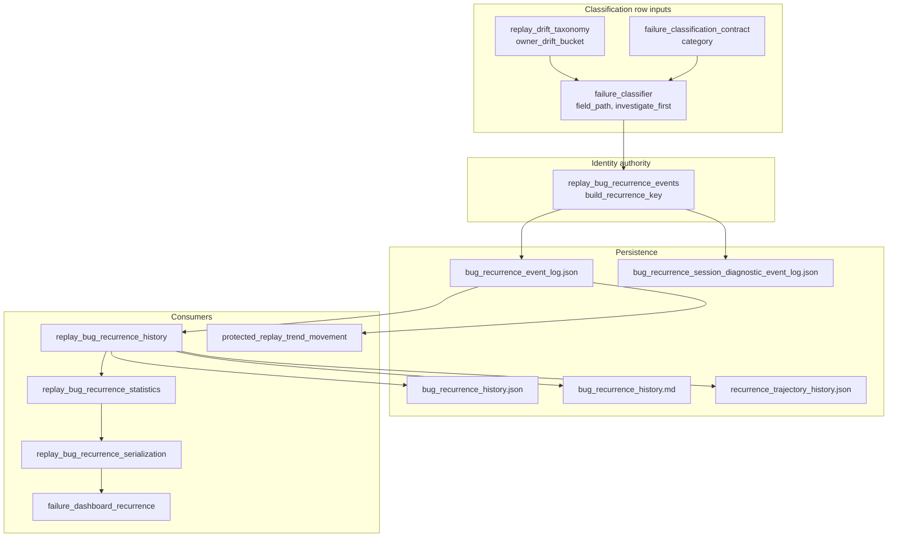

# CG-6 — Recurrence Key Stability Review

**Date:** 2026-06-25  
**Scope:** Design and migration audit only. No recurrence key generation, history, serialization, analytics, dashboard, or artifact changes.

**Related:**

- [`CG_failure_classification_authority_registry.md`](CG_failure_classification_authority_registry.md) (CG-1 recurrence v1 identity section)
- [`CG_recurrence_taxonomy_registry.md`](CG_recurrence_taxonomy_registry.md) (CG-4 taxonomy ownership)
- [`BV8A_retirement_registry.md`](BV8A_retirement_registry.md) (historical key retirement evidence)

## Purpose

Bug-class recurrence identity today uses `recurrence:v1`, embedding four classification-row fields. Two of those fields — `field_path` and `investigate_first` — are implementation-detail strings that can change during refactors without altering the underlying defect class.

This review inventories all producers and consumers, assesses component stability, documents migration options, and records why no change is implemented now.

---

## Current recurrence:v1 structure

**Authoritative builder:** `tests/helpers/replay_bug_recurrence_events.py` → `build_recurrence_key`

**Format:**

```text
recurrence:v1:<owner_bucket>|<category>|<field_path>|<investigate_first>
```

**Normalization applied at build time:**

| Component | Source field | Normalization |
|---|---|---|
| `owner_bucket` | `owner_drift_bucket` | lowercased; invalid → `replay_drift_unclassified` |
| `category` | `category` | lowercased; empty → `unknown` |
| `field_path` | `field_path` | lowercased; empty → `unknown` |
| `investigate_first` | `investigate_first` | lowercased; backslashes → forward slashes; empty → `unknown` |

**Schema constant:** `RECURRENCE_SCHEMA_VERSION = 1` (event-log envelope only; distinct from the `recurrence:v1:` string prefix).

### Separate namespace: runtime lineage keys

`game/runtime_lineage_telemetry.py` defines a **different** `build_recurrence_key` producing:

```text
<event_kind>:<stage>:<owner>:<detail>
```

This is attribution/lineage aggregation identity, **not** bug-recurrence `recurrence:v1`. The attribution contract validates lineage key *shape* (`:` present, length ≥ 5) separately in `tests/helpers/attribution_contract.py`.

---

## Dependency graph



**Aggregation model:** downstream modules treat `recurrence_key` as an **opaque string dict key**. Occurrence counts, timelines, forecasts, portfolios, and governance classifiers index events and summaries by exact string equality.

---

## Consumer inventory

| File | Responsibility | Read / Write | Assumes exact v1 structure? |
|---|---|:---:|:---:|
| `tests/helpers/replay_bug_recurrence_events.py` | **Generates** keys; persists event logs; commit-worthiness filtering | R+W | **Yes** — defines format |
| `tests/helpers/replay_bug_recurrence_history.py` | Aggregates history; **parses** keys for portfolio dimensions | R | **Yes** — `_parse_recurrence_key_parts` splits on `recurrence:v1:` and `\|` |
| `tests/helpers/replay_bug_recurrence_statistics.py` | Program effectiveness, ROI, graduation builders keyed by `recurrence_key` | R | No — opaque key equality only |
| `tests/helpers/replay_bug_recurrence_serialization.py` | Markdown/JSON report rendering; outcome validation keyed by key | R | No — displays/stores opaque strings; synthetic-key filter uses pattern |
| `tests/helpers/replay_bug_recurrence.py` | Compatibility facade re-exporting events/history/statistics/serialization | R | Mirrors authority module |
| `tests/helpers/failure_dashboard_recurrence.py` | Dashboard artifact orchestration and markdown layout | R+W | No — delegates key generation |
| `tests/helpers/replay_drift_reports.py` | Drift report aggregation via `build_recurrence_summary` | R | No |
| `tests/helpers/protected_replay_trend_movement.py` | BZ trend movement reports; **parses** keys for owner/category/field | R | **Yes** — duplicate `_parse_recurrence_key_parts` |
| `tests/helpers/replay_drift_taxonomy.py` | Documents that drift buckets feed `recurrence:v1` | — | Indirect |
| `tests/helpers/failure_classifier.py` | Produces `field_path`, `investigate_first` on classification rows | W (inputs) | No — unaware of key formula |
| `tests/helpers/attribution_contract.py` | Validates **lineage** recurrence key shape only | R | No — not bug-recurrence v1 |
| `game/runtime_lineage_telemetry.py` | Separate lineage key builder (non-v1 namespace) | W | No |
| `tools/migrate_bug_recurrence_event_log.py` | Lane split migration; dedupes by key | R+W | Partial — uses builder fallback |
| `tools/bv8a_recurrence_history_regeneration.py` | BV8A artifact regeneration with known key literals | R+W | **Yes** — hardcoded corpus keys |
| `artifacts/golden_replay/bug_recurrence_event_log.json` | Committed protected event log | Persisted | Stores exact strings |
| `artifacts/golden_replay/bug_recurrence_history.json` | Committed aggregated history | Persisted | Stores exact strings |
| `artifacts/golden_replay/bug_recurrence_history.md` | Committed markdown report | Persisted | Embeds exact strings |
| `artifacts/golden_replay/recurrence_trajectory_history.json` | Longitudinal trajectory snapshots | Persisted | Key counts, not full keys |
| `artifacts/golden_replay/bug_recurrence_event_log.legacy.json` | Archived unified log | Persisted | Historical exact strings |
| `artifacts/bv8a_recurrence_history.json` | Retirement/dedup audit view | Persisted | Hardcoded key references |
| `docs/audits/BV8A_*.md` | Retirement registry and audit evidence | Display | Exact key literals |

---

## Mutable identity components

### `owner_bucket` (from `owner_drift_bucket`)

| Attribute | Value |
|---|---|
| **Authoritative owner** | `tests/helpers/replay_drift_taxonomy.py` (`ALLOWED_OWNER_DRIFT_BUCKETS`, `classify_owner_drift_bucket`) |
| **Expected stability** | Moderate — closed enum, but new drift classes have been added |
| **Historical change frequency** | Low–moderate; major introduction in `6210a5d AR: Replay Drift Classification`; occasional bucket additions |
| **Change semantics** | **Semantic identity change** — different bucket means different bug-class family in recurrence analytics |
| **Risk** | Medium — bucket relabeling splits or merges recurrence histories |

### `category`

| Attribute | Value |
|---|---|
| **Authoritative owner** | `tests/failure_classification_contract.py` (`ALLOWED_FAILURE_CATEGORIES`) |
| **Expected stability** | High — small closed enum |
| **Historical change frequency** | Low; core set from `98bc059 Failure Classification Dashboard` |
| **Change semantics** | **Semantic identity change** — category is intentional taxonomy |
| **Risk** | Low–medium — additions are rare and deliberate |

### `field_path`

| Attribute | Value |
|---|---|
| **Authoritative owner** | Drift observation path on classification row; sourced from golden-replay drift rows and protected observation registry |
| **Upstream** | `tests/helpers/golden_replay_projection.py` (protected paths), drift builders, classifier row builder |
| **Expected stability** | **Low** — observation field names and projection paths change during schema maintenance |
| **Historical change frequency** | Moderate–high across cycles AJ, AR, AO, AK (opening fallback, ownership consolidation, schema compression) |
| **Change semantics** | Often **maintenance-only** (rename/rehome observation path) but produces a **new recurrence key** — history fracture without migration |
| **Risk** | **High** — path refactors silently reset occurrence counts |

**Example:** `selected_speaker_id` is stable as a field name, but composite paths like `missing_source_by_field.*` or protected-path registry changes can alter the stored token.

### `investigate_first`

| Attribute | Value |
|---|---|
| **Authoritative owner** | Split: defaults in `tests/failure_classification_contract.py` (`MAJOR_OWNER_INVESTIGATION_TARGETS`); overrides in `tests/helpers/failure_classifier.py` (`INVESTIGATION_TARGETS`) |
| **Expected stability** | **Low** — repository file paths as routing hints |
| **Historical change frequency** | Moderate; touched in `0ef46f3 T: reduce maintenance locality fanout`, dashboard cycle, classifier override growth |
| **Change semantics** | Usually **maintenance-only** (file move/refactor) but is a **key component** — path rename = new identity |
| **Risk** | **High** — explicitly documented in CG-1 as key migration trigger |

**Observed corpus keys (BV8A, stable since 2026-06):**

- `tests/helpers/golden_replay.py` (projection drift)
- `game/speaker_contract_enforcement.py` (speaker enforcement)
- `game/final_emission_gate.py` (fallback drift)
- `game/output_sanitizer.py` (sanitizer drift)

---

## Risk assessment

| Risk | Severity | Likelihood | Mitigation today |
|---|---|---|---|
| Refactor of `investigate_first` paths splits recurrence history | High | Medium | CG-1 migration checklist; manual retirement docs (BV8A) |
| Protected observation `field_path` rename creates duplicate keys for same bug class | High | Medium | Exact-key tests lock corpus keys; no automatic aliasing |
| `owner_drift_bucket` relabel merges/splits analytics | Medium | Low | Closed enum + contract tests |
| Parser assumes `\|` delimiter with exactly 4 parts | Medium | Low | `_parse_recurrence_key_parts` pads missing parts with `unknown` |
| `investigate_first` or `field_path` containing `\|` would corrupt parse | Medium | Very low | Paths normalized; pipe not used in current corpus |
| Duplicate `_parse_recurrence_key_parts` in two modules drifts | Low | Medium | Identical implementations today |
| Lineage vs bug-recurrence key namespace confusion | Low | Low | Separate builders documented here |

**Overall:** `recurrence:v1` is **fit for purpose as an advisory report-only identity** but **not stable under maintenance refactors** of routing paths and observation field names. The system already treats key changes as new identities (BV8A retirement of projection key while speaker key remains active).

---

## Candidate identity models (design only)

### Option A — Keep recurrence:v1 permanently

| Dimension | Assessment |
|---|---|
| **Migration cost** | None |
| **Compatibility** | Full — all artifacts and tests remain valid |
| **Artifact impact** | None |
| **Dashboard impact** | None |
| **Maintenance cost** | **Ongoing** — every `investigate_first` or `field_path` change requires explicit migration/retirement playbook (BV8A-style) |
| **Implementation complexity** | None |

**Tradeoff:** Accepts identity fracture as a operational cost. Works because recurrence is `report_only` / `advisory_only` and does not gate protected replay.

### Option B — Future recurrence:v2 with canonical identifiers

**Conceptual format (not implemented):**

```text
recurrence:v2:<owner_bucket>|<category>|<bug_class_id>
```

Where `bug_class_id` is a stable slug (e.g. `speaker_projection_selected_speaker_id`) defined in a registry, **not** derived from file paths or observation paths.

| Dimension | Assessment |
|---|---|
| **Migration cost** | **High** — full backfill of event logs, history, trajectory, BV8A views |
| **Compatibility** | Requires dual-read period: accept v1 and v2 keys, or one-time alias map |
| **Artifact impact** | **High** — all `artifacts/golden_replay/bug_recurrence_*` files |
| **Dashboard impact** | Low–medium — display can show canonical ID; historical keys need alias labels |
| **Maintenance cost** | **Lower long-term** — refactors update registry alias, not occurrence identity |
| **Implementation complexity** | **High** — new registry module, builder v2, parsers, migration tool, dual-key aggregation |

**Tradeoff:** Up-front migration pain for long-term stability. Requires governance of `bug_class_id` registry (who owns new IDs).

### Option C — Hybrid identity (compatibility layer)

**Conceptual approach:**

- Continue emitting `recurrence:v1` for backward compatibility.
- Add optional `canonical_recurrence_id` (or v2 key) on new events.
- Aggregation merges v1 and v2 via explicit alias table (`v1_key → canonical_id`).

| Dimension | Assessment |
|---|---|
| **Migration cost** | **Medium** — incremental; old events stay v1 until backfilled |
| **Compatibility** | **Best** — dual-key period without breaking artifacts |
| **Artifact impact** | Medium — new fields in JSON; gradual refresh |
| **Dashboard impact** | Low — can prefer canonical ID when present |
| **Maintenance cost** | Medium — must maintain alias map until v1 retired |
| **Implementation complexity** | **Medium–high** — alias registry, dual-key aggregation, deprecation policy |

**Tradeoff:** Most flexible migration path; highest ongoing complexity during transition.

### Option comparison summary

| Option | Migration cost | Long-term maintenance | Complexity | Best when |
|---|---|---|---|---|
| A — keep v1 | None | Higher (path-sensitive) | Low | Recurrence remains advisory-only; manual retirement acceptable |
| B — v2 canonical | High | Lower | High | Recurrence becomes governance-critical or frequent refactors cause pain |
| C — hybrid | Medium | Medium during transition | Medium–high | Need stability without big-bang migration |

**Evidence today:** Recurrence is explicitly `RECURRENCE_REPORT_ONLY` and `RECURRENCE_ADVISORY_ONLY`. BV8A demonstrates manual retirement when keys go stale. Pain from path mutability is **real but managed operationally**, not yet severe enough to mandate v2 implementation cost.

---

## Migration requirements (if v2 were introduced)

| Surface | Relative effort | Notes |
|---|---|---|
| `artifacts/golden_replay/bug_recurrence_event_log.json` | **High** | Every event carries `recurrence_key`; backfill or alias required |
| `artifacts/golden_replay/bug_recurrence_event_log.legacy.json` | Low | Archive; likely leave unchanged |
| `artifacts/golden_replay/bug_recurrence_history.json` | **High** | Summary rows keyed by v1 strings |
| `artifacts/golden_replay/bug_recurrence_history.md` | Medium | Regenerated from JSON |
| `artifacts/golden_replay/recurrence_trajectory_history.json` | Medium | Counts/snapshots; may not store full keys |
| `artifacts/bv8a_recurrence_history.json` | Medium | Retirement registry references v1 literals |
| `docs/audits/BV8A_*.md` | Low | Historical evidence; annotate, don't rewrite |
| `tests/test_replay_bug_class_recurrence.py` | Medium | ~7 `build_recurrence_key` tests structural; ~10 hardcoded v1 literals |
| `tests/test_expand_protected_replay_observations.py` | Low | 2 exact projection key literals |
| `tests/test_bz_protected_replay_trend_window_2.py` | Low | Formula-constructed keys |
| `tests/test_migrate_bug_recurrence_event_log.py` | Medium | Migration round-trip assumptions |
| `tests/test_failure_dashboard_recurrence.py` | Low | No exact key locks |
| `tests/test_recurrence_trajectory_history.py` | Low | Snapshot metadata, not key literals |
| Dashboard markdown renderers | Low | Opaque display |
| `_parse_recurrence_key_parts` (×2) | **High** | Must accept v2 or delegate to version-aware parser |
| `is_synthetic_drift_recurrence_key` | Medium | Pattern-based; v2 needs parallel rule |
| `tools/migrate_bug_recurrence_event_log.py` | Medium | Lane split logic |
| `tools/bv8a_recurrence_history_regeneration.py` | Medium | Hardcoded key constants |
| Compatibility facade `replay_bug_recurrence.py` | Low | Re-export surface |

**Estimated total:** medium–high engineering effort (multi-cycle), dominated by artifact backfill and dual-key aggregation design.

---

## Test review — exact-key locking

### Tests that lock key **behavior** (appropriate)

| Test | What it locks |
|---|---|
| `test_same_owner_category_field_produces_same_recurrence_key` | Determinism |
| `test_different_field_path_produces_different_recurrence_key` | Field sensitivity |
| `test_missing_owner_bucket_falls_back_to_replay_drift_unclassified` | Prefix fallback only |
| `test_append_recurrence_event_metadata_does_not_alter_recurrence_key` | Metadata isolation |
| `test_replay_bug_recurrence_decomposition` facade parity | Single builder authority |
| `test_migrate_bug_recurrence_event_log` round-trip | Event log schema + builder fallback |

These appropriately enforce **compatibility contracts** without over-specifying corpus content.

### Tests with **hardcoded v1 literals** (corpus-specific)

| Location | Literal purpose | Over-specification? |
|---|---|---|
| `test_replay_bug_class_recurrence.py:1027` | BV8 stability-score fixture | **Acceptable** — numeric fixture input |
| `test_replay_bug_class_recurrence.py:784,790` | Synthetic drift rejection pattern | **Appropriate** — tests `is_synthetic_drift_recurrence_key` |
| `test_replay_bug_class_recurrence.py:2996+` | Graduation/outcome validation fixtures | **Acceptable** — isolated test keys |
| `test_expand_protected_replay_observations.py:79,147` | Protected corpus expansion guard | **Appropriate** — locks known production key |
| `test_bz_protected_replay_trend_window_2.py` | Trend window construction | **Acceptable** — uses same formula as builder |

**Assessment:** Hardcoded literals are **concentrated in corpus-governance tests** (BV8, protected replay expansion, synthetic drift rejection), not in general builder tests. This is intentional compatibility enforcement for committed artifacts, not accidental over-specification. **No tests should be weakened.**

### Duplicate parse implementations

`_parse_recurrence_key_parts` exists identically in:

- `tests/helpers/replay_bug_recurrence_history.py`
- `tests/helpers/protected_replay_trend_movement.py`

Both assume `recurrence:v1:` prefix and pipe-delimited four components. A v2 migration would need a shared version-aware parser — noted as future cleanup, not changed in CG-6.

---

## Governance metrics (CG-6 snapshot)

| Metric | Count |
|---|---:|
| Key producers (`recurrence:v1`) | 1 (`replay_bug_recurrence_events.build_recurrence_key`) |
| Key consumer modules | 9 (+ 2 tools + persisted artifacts) |
| Persistence locations | 5 primary artifact paths under `artifacts/golden_replay/` |
| Modules that parse v1 structure | 2 |
| Exact-key test literals (full v1 strings) | ~15 across 4 test files |
| Structural builder tests (no literal) | ~7 in `test_replay_bug_class_recurrence.py` |
| Mutable identity fields | 2 high-risk (`field_path`, `investigate_first`); 2 moderate (`owner_bucket`, `category`) |
| Estimated migration surfaces (v2) | ~20 files/artifacts (medium–high effort) |

---

## Recommendation

**Defer recurrence:v2 implementation.** Continue operating `recurrence:v1` as the permanent **advisory** identity format until recurrence analytics graduate from report-only to governance-gating, or until refactor-induced key churn exceeds manual retirement tolerance.

### Rationale for no change now

1. **Recurrence is explicitly non-gating** (`RECURRENCE_REPORT_ONLY`, `RECURRENCE_ADVISORY_ONLY`) — identity fracture is an analytics inconvenience, not a correctness bug.
2. **Operational playbook exists** — BV8A retirement registry demonstrates how to retire stale keys without schema migration.
3. **v2 migration cost is disproportionate** — full artifact backfill, dual-key aggregation, and registry governance for benefit that is not yet required.
4. **Current tests appropriately balance** structural contracts vs corpus-specific literals.
5. **CG-1 through CG-5** now document upstream mutability — editors can anticipate key migrations when changing `investigate_first` or protected observation paths.

### When to revisit

- Recurrence outcomes begin gating CI or graduation decisions.
- More than one BV8-scale retirement per quarter from path-only refactors.
- Portfolio analytics require cross-key merging that manual retirement cannot support.

### If v2 is pursued later

Prefer **Option C (hybrid)** first: introduce canonical IDs on new events with a v1→canonical alias table, then deprecate v1 after backfill. Option B big-bang migration should only follow proven alias coverage.

---

## Remaining recurrence risks

1. **`field_path` and `investigate_first` mutability** — highest long-term identity drift risk.
2. **No alias mechanism** — path rename always creates a new key; occurrence history does not merge automatically.
3. **Duplicate parsers** — two copies of `_parse_recurrence_key_parts` can drift on a v2 introduction.
4. **Namespace collision awareness** — lineage `build_recurrence_key` vs bug-recurrence `build_recurrence_key` require import discipline.
5. **Pipe delimiter fragility** — future paths containing `|` would break parsers (latent, not observed).
6. **Synthetic drift keys** — `|unknown|` pattern excluded from protected history; v2 must preserve equivalent filtering semantics.

---

## Authority cross-reference

| Concept | Owner |
|---|---|
| Key formula | `tests/helpers/replay_bug_recurrence_events.py` |
| Key components (upstream) | drift taxonomy, failure contract, failure classifier |
| Parse for portfolio | `replay_bug_recurrence_history.py`, `protected_replay_trend_movement.py` |
| Display | `failure_dashboard_recurrence.py`, serialization module |
| Lineage key (separate) | `game/runtime_lineage_telemetry.py` |
