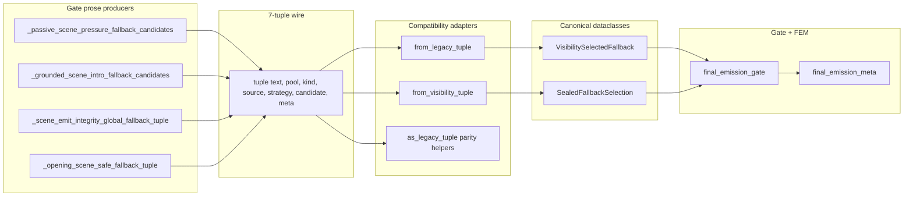
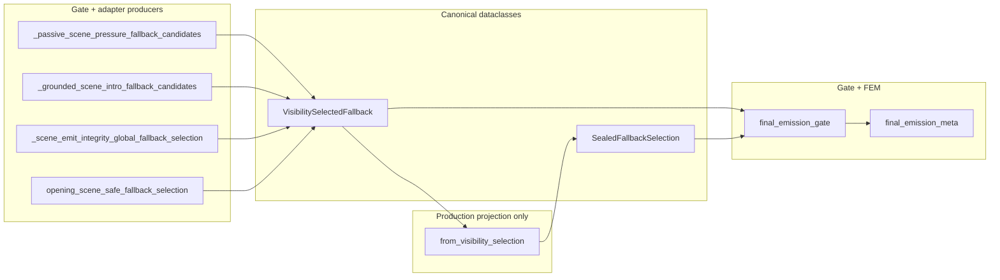

# Cycle AM — Fallback Adapter Retirement Closeout

**Date:** 2026-06-02  
**Scope:** Retire historical fallback tuple topology and gate-local tuple wrappers while keeping FEM/replay observation byte-stable.  
**Prior art:** [Cycle AM recon](cycle_am_fallback_adapter_retirement_recon_2026-06-02.md), [Cycle AB fallback topology collapse](cycle_ab_fallback_topology_collapse_recon_2026-05-31.md), [Cycle AK replay schema inventory](../../audits/cycle_ak_replay_schema_authority_inventory.md).

---

## Executive Summary

Cycle AM completed the migration from **7-tuple / 5-tuple fallback wires** to **canonical dataclass selections** (`VisibilitySelectedFallback`, `SealedFallbackSelection`) across all production gate paths. Tuple-producing gate helpers, tuple parity wrappers, and production `from_legacy_tuple` bridges are gone. Remaining tuple APIs are **test-only dataclass round-trips** or **unrelated tuple utilities**.

**Replay/golden fixtures were not modified.** Protected observation fields and FEM stamping semantics were preserved through dataclass-field parity tests and full golden replay runs after each block.

**Block numbering note:** The [AM recon](cycle_am_fallback_adapter_retirement_recon_2026-06-02.md) planned AM6 as compatibility-local vocabulary cleanup. Execution instead used AM6–AM8 for grounded-scene-intro dataclass migration, test-only tuple helper retirement, and opening tuple boundary retirement. Compatibility-local cleanup remains an optional follow-up (see below).

---

## AM1–AM8 Outcomes

| Block | Goal | Outcome | Status |
|-------|------|---------|--------|
| **AM1** | Remove dead gate tuple wrappers | Deleted `_select_non_strict_replace_path_terminal_sealed_fallback` (5-tuple export) and `_standard_visibility_safe_fallback_tuple`. Zero production callers confirmed. | **Done** |
| **AM2** | Opening dataclass-native entry | Added `opening_scene_safe_fallback_selection` → `VisibilitySelectedFallback` in `final_emission_opening_fallback.py`. Gate `_opening_scene_safe_fallback_selection` delegates with `_first_mention_composition_meta` injection. | **Done** |
| **AM3** | Passive scene pressure dataclass at source | `_passive_scene_pressure_fallback_candidates` returns `list[VisibilitySelectedFallback]`. Sealed passive provider uses `SealedFallbackSelection.from_visibility_selection`. | **Done** |
| **AM4** | Global integrity fallback dataclass | `_scene_emit_integrity_global_fallback_selection` returns `VisibilitySelectedFallback`. Sealed global provider and N4 accept path read `.text` from dataclass. | **Done** |
| **AM5** | Gate sealed provider wrapper collapse | Gate calls `build_non_strict_sealed_fallback_providers` directly (no `_build_non_strict_*` thin wrapper). Mechanical collapse; no topology change. | **Done** |
| **AM6** | Grounded scene intro dataclass | `_grounded_scene_intro_fallback_candidates` returns `list[VisibilitySelectedFallback]`. Removed production `VisibilitySelectedFallback.from_legacy_tuple` at `_standard_visibility_safe_fallback` boundary. | **Done** |
| **AM7** | Retire test-only tuple parity helpers | Removed `_passive_scene_pressure_fallback_candidates_tuple`, `_grounded_scene_intro_fallback_candidates_tuple`, `_scene_emit_integrity_global_fallback_tuple`, and `visibility_selected_fallback_from_tuple`. Tests assert canonical dataclass fields directly. | **Done** |
| **AM8** | Opening tuple boundary retirement | Removed `_opening_scene_safe_fallback_tuple` from gate and opening adapter. Fixture renamed to `opening_gate_attach_then_opening_scene_safe_fallback_selection`. Opening tests dataclass-native. | **Done** |

**Deferred from recon (not in scope):** compatibility-local vocabulary cleanup (`_OPENING_FALLBACK_AUTH_COMPATIBILITY_LOCAL`, boundary-contract registry entry, docstring refresh).

---

## Before / After Topology

### Before (AM recon baseline)



### After (AM closeout)



**Key change:** Production never materializes 7-tuple fallback wires. Sealed branches project visibility dataclasses via `from_visibility_selection`, not `from_visibility_tuple`.

---

## Files Changed Across Cycle AM

| File | Blocks | Nature of change |
|------|--------|------------------|
| `game/final_emission_gate.py` | AM1–AM8 | Dead wrappers removed; passive/global/grounded/opening producers return dataclasses; tuple parity helpers removed |
| `game/final_emission_opening_fallback.py` | AM2, AM8 | `opening_scene_safe_fallback_selection`; opening tuple wrapper removed |
| `game/final_emission_sealed_fallback.py` | AM3–AM4 | Providers typed on `VisibilitySelectedFallback`; `from_visibility_selection` in production paths |
| `game/final_emission_visibility_fallback.py` | AM7 | `visibility_selected_fallback_from_tuple` alias removed |
| `tests/test_final_emission_visibility_fallback.py` | AM6–AM7 | Dataclass producer tests for passive/global/grounded; tuple parity replaced with field assertions |
| `tests/test_final_emission_opening_fallback.py` | AM2, AM8 | Dataclass-native adapter tests; tuple parity removed |
| `tests/helpers/final_emission_gate_fixtures.py` | AM8 | `opening_gate_attach_then_opening_scene_safe_fallback_selection` returns `VisibilitySelectedFallback` |
| `tests/test_final_emission_sealed_fallback.py` | AM8 | Forbidden-symbol checks updated (`_opening_scene_safe_fallback_selection`) |

**Not modified:** golden replay fixtures, `tests/helpers/golden_replay_projection.py` protected field lists, FEM field names/values contract.

---

## Removed Adapters / Wrappers

### Production (gate / adapter)

| Symbol | Module | Removed in |
|--------|--------|------------|
| `_select_non_strict_replace_path_terminal_sealed_fallback` | `final_emission_gate` | AM1 |
| `_standard_visibility_safe_fallback_tuple` | `final_emission_gate` | AM1 |
| `_passive_scene_pressure_fallback_candidates_tuple` | `final_emission_gate` | AM7 |
| `_grounded_scene_intro_fallback_candidates_tuple` | `final_emission_gate` | AM7 |
| `_scene_emit_integrity_global_fallback_tuple` | `final_emission_gate` | AM7 |
| `_opening_scene_safe_fallback_tuple` | `final_emission_gate` | AM8 |
| `_opening_scene_safe_fallback_tuple` | `final_emission_opening_fallback` | AM8 |
| `visibility_selected_fallback_from_tuple` | `final_emission_visibility_fallback` | AM7 |
| Production `VisibilitySelectedFallback.from_legacy_tuple(...)` call sites | `final_emission_gate` | AM6 |

### Test / fixture renames

| Before | After |
|--------|-------|
| `opening_gate_attach_then_opening_scene_safe_fallback_tuple` | `opening_gate_attach_then_opening_scene_safe_fallback_selection` |

---

## Remaining Tuple Surfaces (Post-AM)

### Test-only dataclass round-trip APIs

| Symbol | Module | Used by |
|--------|--------|---------|
| `VisibilitySelectedFallback.from_legacy_tuple` / `as_legacy_tuple` | `final_emission_visibility_fallback` | `tests/test_final_emission_visibility_fallback.py` (`test_visibility_selected_fallback_round_trips_legacy_tuple`) |
| `SealedFallbackSelection.from_legacy_tuple` / `as_legacy_tuple` | `final_emission_sealed_fallback` | `tests/test_final_emission_sealed_fallback.py` (5-tuple round-trip) |
| `SealedFallbackSelection.from_visibility_tuple` | `final_emission_sealed_fallback` | `tests/test_final_emission_sealed_fallback.py` (7→5 projection test only) |

**Production callers:** none for any of the above.

### Unrelated tuple utilities (out of scope)

| Symbol | Module |
|--------|--------|
| `_rumor_clause_signal_tuple` | `narrative_authenticity` |
| `_extracted_social_canonical_tuple` | `clues` |

### Deferred / observability-only (not topology)

| Symbol / concept | Notes |
|------------------|-------|
| `opening_fallback_compatibility_local_disabled` | FEM/debug flag — **kept**; asserted in golden + opening tests |
| `_OPENING_FALLBACK_AUTH_COMPATIBILITY_LOCAL` | Read-side owner-bucket mapping — optional AM9 vocabulary cleanup |
| `compose_opening_fallback_compatibility_local` | Boundary-contract registry entry — audit-only, no `game/` implementation |
| `tests/helpers/opening_fallback_evidence.py` | Negative classifier fixtures referencing compatibility-local authorship |

---

## Production Fallback Tuple Adapter Confirmation

Repo search (`game/**/*.py`) after AM8:

- **Zero** `_opening_scene_safe_fallback_tuple`, `*_fallback_candidates_tuple`, `*_global_fallback_tuple`, or `visibility_selected_fallback_from_tuple` symbols.
- **Zero** production calls to `from_legacy_tuple`, `as_legacy_tuple`, or `from_visibility_tuple`.
- All gate fallback producers return `VisibilitySelectedFallback` or project via `SealedFallbackSelection.from_visibility_selection`.

---

## Replay Protection Notes

Cycle AM explicitly constrained changes to **wire shape only**, not **observed semantics**:

| Protected area | AM handling |
|----------------|-------------|
| `opening_fallback_authorship_source` | Preserved via composition_meta on `opening_scene_safe_fallback_selection`; opening tests assert upstream vs fail-closed authorship |
| `opening_fallback_compatibility_local_disabled` | Unchanged; fail-closed path tests still assert `True` |
| `opening_fallback_failed_closed` | Unchanged; adapter fail-closed tests assert field |
| Owner buckets (`opening_fallback_owner_bucket`, `sealed_fallback_owner_bucket`, `visibility_fallback_owner_bucket`) | Unchanged stamping paths; golden replay owner-bucket scenarios pass |
| `fallback_family_used` / `realization_fallback_family` | Dual taxonomy preserved; diegetic vs realization paths untouched |
| Golden replay fixtures | **Not modified** |
| `PROTECTED_OBSERVATION_FIELDS` (41 paths) | **Not modified** |

Validation method: dataclass-field assertions replacing tuple parity; full `tests/test_golden_replay.py` green after AM6, AM7, and AM8.

---

## Final Tests Run (All Passing)

Executed at AM8 closeout (exit code 0):

```text
pytest tests/test_final_emission_opening_fallback.py
pytest tests/test_final_emission_gate.py -k "opening_fallback or fallback or sealed or visibility"
pytest tests/test_final_emission_visibility_fallback.py
pytest tests/test_final_emission_sealed_fallback.py
pytest tests/test_golden_replay.py
pytest tests/test_ownership_registry.py
```

| Suite | Collected |
|-------|-----------|
| `tests/test_final_emission_opening_fallback.py` | 23 |
| `tests/test_final_emission_gate.py` (filtered) | 22 |
| `tests/test_final_emission_visibility_fallback.py` | 53 |
| `tests/test_final_emission_sealed_fallback.py` | 12 |
| `tests/test_golden_replay.py` | 13 |
| `tests/test_ownership_registry.py` | 19 |
| **Total** | **142** |

Representative AM6 gate filter (also green):

```text
pytest tests/test_final_emission_gate.py -k "grounded or intro or visibility or fallback"
```

---

## Recommended Optional Follow-Up

### 1. Compatibility-local vocabulary cleanup (low priority, observability)

- Quarantine or document `OPENING_FALLBACK_AUTHORSHIP_COMPATIBILITY_LOCAL` in `tests/helpers/opening_fallback_evidence.py`
- Review `_OPENING_FALLBACK_AUTH_COMPATIBILITY_LOCAL` in `final_emission_meta.py` for classifier/dashboard necessity
- Remove `compose_opening_fallback_compatibility_local` boundary-contract registry entry if audit confirms no implementation
- Refresh `opening_deterministic_fallback` module docstring (post–Cycle J accuracy)

**Risk:** medium for negative classifier/golden fixtures; **no production topology impact**.

### 2. Legacy dataclass round-trip test retirement (low priority, test hygiene)

- Rewrite `test_visibility_selected_fallback_round_trips_legacy_tuple` to construct/compare dataclasses directly; then remove `from_legacy_tuple` / `as_legacy_tuple` from `VisibilitySelectedFallback` if unused
- Same pattern for `SealedFallbackSelection.from_legacy_tuple` / `from_visibility_tuple` in sealed fallback tests

**Risk:** low; test-only surface reduction.

---

## Cycle AM Verdict

**CLOSED — success criteria met.**

- Production fallback topology is dataclass-native end-to-end.
- Historical tuple wrappers and parity helpers are removed from `game/`.
- Replay/golden observation contract unchanged.
- Remaining tuple APIs are explicitly classified as test-only or unrelated.

No further AM blocks are required for fallback adapter retirement. Optional follow-ups above may be scheduled as separate small cycles (e.g. AM9 vocabulary, AM10 test round-trip cleanup) or folded into maintenance hygiene.
