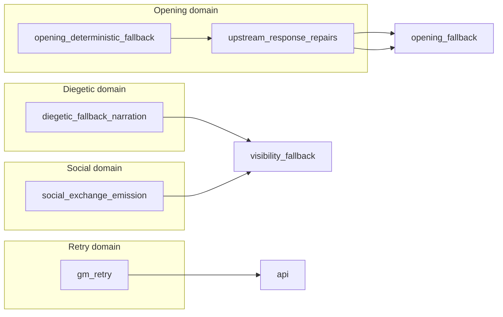

# BK — Fallback Content Audit

**Cycle:** BK — Discovery / Audit  
**Date:** 2026-06-16  

---

## Executive answers

| Question | Answer |
|----------|--------|
| **Single source of truth?** | **Partial.** Diegetic prose/templates: **yes** (`diegetic_fallback_narration`). Opening deterministic prose: **yes** (`opening_deterministic_fallback`). Strict-social emergency: **yes** (`social_exchange_emission`). **No** single SSOT across all fallback families. |
| **Multiple competing sources?** | **Yes** for global/stock lines and social empty-output paths (sanitizer vs visibility vs social_exchange). Governed vs diegetic family taxonomy is **dual by design** (AB contract). |
| **Projection-owned content?** | **No runtime prose.** Test fixtures in `opening_fallback_evidence` hold literal opening golden text. |
| **Selection-owned content?** | **No** — selectors delegate to content modules; visibility module doc explicitly denies prose authorship. |

---

## Content origin map

### Primary content owners (authoritative prose)

| Module | Content types | Key symbols |
|--------|---------------|-------------|
| `game/diegetic_fallback_narration.py` | Template library, render functions, `fallback_template_metadata` | `render_observe_perception_fallback_line`, `render_global_scene_anchor_fallback`, `npc_pursuit_neutral_nonprogress_fallback_line`, `_FALLBACK_TEMPLATE_METADATA` |
| `game/opening_deterministic_fallback.py` | Opening deterministic prose from curated facts | `deterministic_opening_fallback_text_and_meta` |
| `game/social_exchange_emission.py` | Strict-social dialogue, emergency minimal lines | `minimal_social_emergency_fallback_line`, `deterministic_social_fallback_line` |
| `game/gm_retry.py` | Retry terminal lines (observe, travel, social continuation) | `select_deterministic_retry_fallback_line`, `select_terminal_retry_fallback_line` |
| `game/anti_reset_emission_guard.py` | Anti-reset continuation line | `local_exchange_continuation_fallback_line` |
| `game/final_emission_text.py` | Global narrative stock line (delegates to diegetic) | `_global_narrative_fallback_stock_line` |

### Packaging owners (assemble/stamp, minimal new prose)

| Module | Role |
|--------|------|
| `game/upstream_response_repairs.py` | Packages `upstream_prepared_opening_fallback`; stamps `opening_fallback_authorship_source` |
| `game/final_emission_fast_fallback_composition.py` | Neutral composition on existing fast-fallback text (reordering/wrapping, not new templates) |
| `game/response_policy_enforcement.py` | `_contract_fallback_next_step` — policy-shaped addition for scene envelope (adjacent, not gate fallback family) |

### Selection-only (must not author)

| Module | Delegates to |
|--------|--------------|
| `game/final_emission_visibility_fallback.py` | diegetic, opening, social, scene_emit_integrity, passive_pressure, first_mention, anti_reset |
| `game/final_emission_opening_fallback.py` | upstream prepared snapshot or fail-closed marker |
| `game/final_emission_sealed_fallback.py` | visibility selections via providers |
| `game/output_sanitizer.py` | `social_fallback_line_for_sanitizer`, upstream prepared empty text, diegetic helpers |

---

## Content duplication inventory

### Duplication A — Global scene anchor fallback

| Location | Mechanism |
|----------|-----------|
| `diegetic_fallback_narration.render_global_scene_anchor_fallback` | Canonical renderer |
| `final_emission_text._global_narrative_fallback_stock_line` | Re-export / delegate |
| `final_emission_scene_emit_integrity._scene_emit_integrity_global_fallback_selection` | Selects global fallback |
| `final_emission_gate` (historical re-export, fenced by ownership_registry) | Compatibility residue |

**Severity:** Low — delegate pattern; one prose source.

---

### Duplication B — Social emergency line

| Location | Mechanism |
|----------|-----------|
| `social_exchange_emission.minimal_social_emergency_fallback_line` | Content SSOT |
| `final_emission_visibility_fallback` | Selects into candidate list |
| `output_sanitizer.social_fallback_line_for_sanitizer` | Separate sanitizer selection path |
| `anti_reset_emission_guard` | Calls `minimal_social_emergency_fallback_line` |
| `response_policy_enforcement` | Uses `minimal_social_emergency_fallback_line` in policy layer |

**Severity:** Medium — **one content SSOT**, but **three selection surfaces** can apply it.

---

### Duplication C — Opening deterministic prose

| Location | Mechanism |
|----------|-----------|
| `opening_deterministic_fallback` | Composes prose |
| `upstream_response_repairs` | Packages as prepared payload |
| `opening_fallback_evidence.EXPECTED_FRONTIER_GATE_OPENING_FALLBACK` | Test literal (fixed string for golden) |
| `diegetic_fallback_narration` | Template metadata for `opening_deterministic_fallback` ID |

**Severity:** Low for runtime (single composer); test literal is intentional frozen artifact.

---

### Duplication D — Dual family taxonomy (intentional)

| Field | Vocabulary owner | Example values |
|-------|------------------|----------------|
| `fallback_family_used` | `diegetic_fallback_narration` | `scene_opening`, `observe`, `social` |
| `realization_fallback_family` | `realization_provenance` / `realization_authority` | `upstream_prepared_emission`, `gate_terminal_repair` |

Golden replay collapses via `project_replay_fallback_family_from_fem` (diegetic-first).

**Severity:** Not duplication — **documented dual contract** (Cycle AB). Compression should not collapse at write time.

---

### Duplication E — NPC pursuit neutral line

| Location | Notes |
|----------|-------|
| `diegetic_fallback_narration.NPC_PURSUIT_NEUTRAL_NONPROGRESS_FALLBACK_LINE` | Owned literal |
| Selected from visibility + sealed provider paths | Same line, two selector entry points |

**Severity:** Low content duplication; medium selection duplication.

---

## Ownership domains for content

**Cross-domain leakage:** `output_sanitizer` imports social diegetic paths for empty-output — **content OK**, **selection ownership blurred**.

---

## Metadata content (non-prose)

| Artifact | Owner | Duplicated? |
|----------|-------|-------------|
| `build_opening_fallback_result_meta` | `final_emission_opening_fallback` (canonical); called from `opening_deterministic_fallback` | Single factory (AJ1) |
| `build_upstream_prepared_opening_composition_meta` | `final_emission_opening_fallback` | Single |
| `fallback_template_metadata` | `diegetic_fallback_narration` | Single |
| Owner bucket constants | Split: `final_emission_meta`, `final_emission_sealed_fallback`, `final_emission_visibility_fallback` | **Triplicated vocabulary** |
| `OPENING_FALLBACK_AUTHORSHIP_*` | `upstream_response_repairs` (prod); `opening_fallback_evidence` (test compat) | Partial — test compat token retired from prod |

---

## Test-only content

| Location | Content |
|----------|---------|
| `tests/helpers/opening_fallback_evidence.py` | `EXPECTED_FRONTIER_GATE_OPENING_FALLBACK` full opening paragraph |
| `tests/helpers/fallback_behavior_fixtures.py` | Contract-shaped payloads |
| `tests/helpers/synthetic_scenarios.py` | Synthetic session scaffolding |

Test literals are **not** runtime SSOT but appear in golden replay protection — changes require coordinated manifest updates.

---

## Content ownership verdict

| Layer | SSOT status |
|-------|-------------|
| Diegetic templates | **Strong SSOT** (`diegetic_fallback_narration`) |
| Opening prose | **Strong SSOT** (`opening_deterministic_fallback` + upstream packaging) |
| Social emergency | **Strong SSOT** (`social_exchange_emission`) |
| Retry lines | **Strong SSOT** (`gm_retry`) |
| Owner buckets / authorship metadata | **Weak SSOT** — distributed across meta/sealed/visibility |
| Observed replay collapse rules | **Strong SSOT** (`golden_replay_projection`) |
| Policy contract (non-prose) | **Strong SSOT** (`fallback_behavior`) |

**Primary content compression opportunity is not prose deduplication** (mostly clean post-AB/AM). **Metadata vocabulary consolidation** is the higher-value target.
