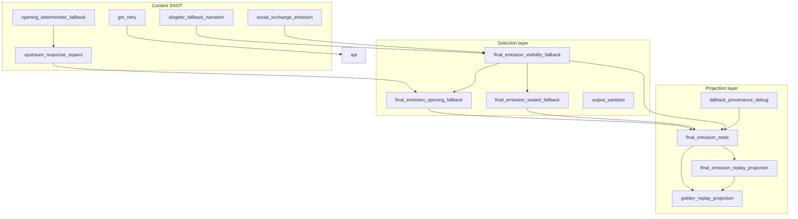

# BK — Fallback Dependency Audit

**Cycle:** BK — Discovery / Audit  
**Date:** 2026-06-16  

Method: static import graph over `game/` and `tests/` Python modules (excluding `.venv`, `artifacts`, `__pycache__`). Counts are **distinct importing modules** (inbound) and **distinct imported modules** (outbound).

---

## Top 10 fallback dependency hubs

Ranked by inbound import count among fallback-related and adjacent metadata modules.

| Rank | Module | Inbound | Outbound | Role |
|------|--------|---------|----------|------|
| 1 | `game.final_emission_meta` | 49 | 15+ | FEM packaging; opening projection fields; owner-bucket mappers; mutation lineage |
| 2 | `game.social_exchange_emission` | 51 | 20+ | Strict-social content + emergency fallback lines |
| 3 | `game.realization_provenance` | 23 | 5 | Governed `realization_fallback_family` stamps |
| 4 | `game.upstream_response_repairs` | 21 | 12 | Upstream prepared opening + response-type fallback packaging |
| 5 | `game.final_emission_validators` | 21 | 18 | `validate_fallback_behavior` + debug mirrors |
| 6 | `game.final_emission_repairs` | 20 | 14 | `repair_fallback_behavior` + layer orchestration |
| 7 | `game.final_emission_gate` | 26 | 22 | Gate orchestration hub |
| 8 | `game.final_emission_visibility_fallback` | 18 | 12+ | Visibility selection coordinator |
| 9 | `tests.helpers.opening_fallback_evidence` | 18 | 6 | Test fixture hub for opening FEM/replay evidence |
| 10 | `tests.helpers.golden_replay_projection` | 17 | 10 | Acceptance projection hub (protected paths) |

**Honorable mention (fallback-specific):**

| Module | Inbound | Notes |
|--------|---------|-------|
| `game.diegetic_fallback_narration` | 15 | Content SSOT; moderate fan-out |
| `game.gm_retry` | 15 | Retry content/selection |
| `game.fallback_provenance_debug` | 11 | Provenance trace; growing inbound |
| `game.final_emission_opening_fallback` | 9 | Opening selector |
| `game.final_emission_sealed_fallback` | 8 | Sealed selector |
| `game.final_emission_replay_projection` | 6 | Runtime lineage (bounded) |
| `game.fallback_behavior` | 1 | Policy contract — **low import fan-out by design** |

---

## Hub detail: inbound / outbound

### 1. `game.final_emission_meta` (largest metadata hub)

**Inbound (representative):** `final_emission_gate`, `final_emission_visibility_fallback`, `final_emission_opening_fallback`, `final_emission_sealed_fallback`, `final_emission_replay_projection`, `golden_replay_projection`, `opening_fallback_evidence`, `failure_classifier`, `stage_diff_telemetry`, `api`, `gm_retry`, 15+ test suites.

**Outbound:** `final_emission_replay_projection`, `realization_provenance`, `runtime_lineage_telemetry`, `telemetry_vocab`, gate-adjacent types.

**Coordinator signals:** Every fallback family eventually stamps or reads FEM fields defined or merged here. Owner-bucket mappers are **read-side** but imported widely for replay/classifier alignment.

---

### 2. `game.final_emission_visibility_fallback` (largest selection hub)

**Inbound:** `final_emission_terminal_pipeline`, `final_emission_opening_fallback`, `final_emission_sealed_fallback`, `final_emission_first_mention_composition`, `final_emission_scene_emit_integrity`, `opening_fallback_gate_harness`, direct-owner tests, `ownership_registry` (import fences).

**Outbound (lazy inside `standard_visibility_safe_fallback`):** `diegetic_fallback_narration`, `final_emission_opening_fallback`, `final_emission_scene_emit_integrity`, `final_emission_passive_scene_pressure`, `final_emission_first_mention_composition`, `anti_reset_emission_guard`, `social_exchange_emission`, `final_emission_opening_mode`, `final_emission_scene_facts`.

**Coordinator signals:** Single function `standard_visibility_safe_fallback` fans out to **8+ sub-selectors** via lazy imports. Acts as fallback **orchestrator** despite module doc claiming routing-only.

---

### 3. `game.diegetic_fallback_narration` (content hub)

**Inbound:** `visibility_fallback`, `opening_fallback`, `sealed_fallback`, `upstream_response_repairs`, `gm_retry`, `final_emission_text`, `output_sanitizer` (indirect), `response_policy_enforcement`, tests.

**Outbound:** minimal (stdlib only).

**Coordinator signals:** Stable leaf content module; high inbound, low outbound — classic **dependency sink**.

---

### 4. `tests.helpers.golden_replay_projection` (acceptance hub)

**Inbound:** `test_golden_replay*`, `failure_classification_contract`, `failure_classification_sync`, `failure_dashboard_report`, `refresh_protected_replay_manifest`, `replay_observed_row_fixtures`.

**Outbound:** `final_emission_meta`, `final_emission_replay_projection`, `realization_provenance`, `output_sanitizer`, transcript helpers.

**Coordinator signals:** Protected field manifest (41 paths) makes this a **change amplifier** for any fallback metadata rename.

---

### 5. `tests.helpers.opening_fallback_evidence` (test fixture hub)

**Inbound:** 18 modules — opening/sealed/visibility/golden-replay tests, owner-bucket tests, classifier fixtures.

**Outbound:** `final_emission_meta`, `upstream_response_repairs`, `emission_smoke_assertions`.

**Coordinator signals:** Parallel vocabulary to production meta (`OPENING_FALLBACK_AUTHORSHIP_COMPATIBILITY_LOCAL`); touches cascade with `test_opening_fallback_owner_bucket.py`.

---

## Frequently modified files (git evidence, since 2025-10-01)

Commits touching `*fallback*` paths:

| File | Commit touches |
|------|----------------|
| `tests/test_fallback_behavior_gate.py` | 11 |
| `tests/test_final_emission_opening_fallback.py` | 11 |
| `tests/test_fallback_behavior_repairs.py` | 11 |
| `tests/helpers/opening_fallback_evidence.py` | 9 |
| `tests/test_opening_fallback_owner_bucket.py` | 9 |
| `game/diegetic_fallback_narration.py` | 7 |
| `game/final_emission_sealed_fallback.py` | 6 |
| `game/fallback_provenance_debug.py` | 6 |
| `game/final_emission_opening_fallback.py` | 5 |
| `game/final_emission_visibility_fallback.py` | 4 |

**Observation:** Test files change **more often** than runtime selection modules — consistent with ownership compression cycles (AU, AS, BB, BD) moving assertions without changing runtime.

---

## Fallback coordinators (files that route, not author)

| Coordinator | Mechanism | Risk |
|-------------|-----------|------|
| `final_emission_visibility_fallback.standard_visibility_safe_fallback` | Ordered candidate list + lazy imports | Selection order changes fan out to 8+ modules |
| `final_emission_sealed_fallback.assemble_non_strict_sealed_fallback_selection` | Provider tuple delegates to visibility sub-selections | Duplicates visibility routing for sealed path |
| `final_emission_gate` | Orchestrates terminal pipeline → visibility | Gate changes pull visibility + meta |
| `final_emission_response_type` | Opening branch delegates to opening_fallback | RT contract changes pull opening + upstream |
| `api._fast_fallback_for_upstream_error` | Attaches provenance + triggers gm_retry content | API + provenance_debug + meta |
| `golden_replay_projection.project_turn_observation` | Flattens FEM → observed dict | Metadata field adds touch manifest + classifier |

---

## Import fence governance

`tests/test_ownership_registry.py` (BA-7) blocks gate direct-owner suites from importing `golden_replay_projection`, failure classifier, and dashboard helpers. This **reduces** gate ↔ replay coupling but **concentrates** replay assertion changes in projection-tier tests.

---

## Dependency graph (simplified)

---

## Key findings

1. **`final_emission_meta` is the widest hub** — not a selector, but every fallback metadata change propagates here first.
2. **`final_emission_visibility_fallback` is the widest selector hub** — lazy import fan-out makes it a hidden coordinator.
3. **Content modules are sinks** (`diegetic_fallback_narration`, `opening_deterministic_fallback`) — good for compression targets downstream, not upstream.
4. **Test fixture hubs** (`opening_fallback_evidence`, `golden_replay_projection`) amplify touch count for authorship/bucket changes.
5. **`fallback_behavior` is intentionally isolated** — 1 inbound import; policy contract is not the maintenance hotspot.
