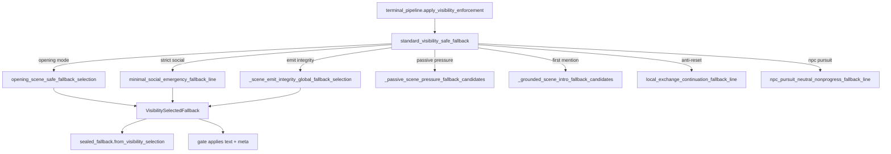

# BK — Fallback Selection Audit

**Cycle:** BK — Discovery / Audit  
**Date:** 2026-06-16  

---

## Executive answers

| Question | Answer |
|----------|--------|
| **How many fallback selectors exist?** | **~15 distinct selection entry points** (see inventory below) |
| **Which selector appears authoritative?** | **`standard_visibility_safe_fallback`** for gate visibility path; **`select_opening_fallback_for_response_type_contract`** for opening RT contract; **`api` + `gm_retry`** for upstream fast path; **`output_sanitizer`** for empty-output path |
| **Which selectors are merely wrappers?** | `visibility_selected_fallback_candidate`, `SealedFallbackSelection.from_visibility_*`, `opening_sealed_fallback_selection` (delegates), `assemble_non_strict_sealed_fallback_selection` (provider assembly over existing selections) |

---

## Selector inventory

### Tier 1 — Authoritative gate-path selectors

| # | Function | Module | Path scope |
|---|----------|--------|------------|
| 1 | `standard_visibility_safe_fallback` | `final_emission_visibility_fallback` | **Master visibility selector** — ordered candidate assembly for gate terminal |
| 2 | `select_opening_fallback_for_response_type_contract` | `final_emission_opening_fallback` | Response-type contract opening branch |
| 3 | `opening_scene_safe_fallback_selection` | `final_emission_opening_fallback` | Opening-mode visibility sub-path |
| 4 | `select_non_strict_replace_path_terminal_sealed_fallback_selection` | `final_emission_sealed_fallback` | Sealed terminal replace path |
| 5 | `select_non_strict_replace_path_terminal_sealed_fallback_branch` | `final_emission_sealed_fallback` | Branching within sealed replace |
| 6 | `apply_visibility_enforcement` | `final_emission_terminal_pipeline` | Pipeline entry → calls visibility module |
| 7 | `_enforce_response_type_contract` (opening branches) | `final_emission_gate` / `final_emission_response_type` | Gate orchestration calling opening selectors |

### Tier 2 — Domain-specific selectors

| # | Function | Module | Path scope |
|---|----------|--------|------------|
| 8 | `select_deterministic_retry_fallback_line` | `gm_retry` | Retry mid-pipeline |
| 9 | `select_terminal_retry_fallback_line` | `gm_retry` | Retry terminal |
| 10 | `_fast_fallback_for_upstream_error` | `api` | Upstream API fast fallback |
| 11 | `apply_strict_social_terminal_dialogue_fallback_if_needed` | `social_exchange_emission` | Strict-social terminal dialogue |
| 12 | `minimal_social_emergency_fallback_line` | `social_exchange_emission` | Called from visibility candidate list |
| 13 | Sanitizer empty-output path (`_diegetic_uncertainty_fallback`, `_prepared_upstream_empty_fallback_text`) | `output_sanitizer` | Post-gate sanitizer |
| 14 | `select_acceptance_quality_n4_sealed_fallback_line` | `final_emission_sealed_fallback` | Acceptance-quality N4 path |
| 15 | `select_opening_narration_visible_facts` | `opening_visible_fact_selection` | Pre-content fact selection |

### Tier 3 — Sub-selectors (called only from visibility coordinator)

| Function | Module |
|----------|--------|
| `_scene_emit_integrity_global_fallback_selection` | `final_emission_scene_emit_integrity` |
| `_passive_scene_pressure_fallback_candidates` | `final_emission_passive_scene_pressure` |
| `_grounded_scene_intro_fallback_candidates` | `final_emission_first_mention_composition` |
| `local_exchange_continuation_fallback_line` | `anti_reset_emission_guard` |
| `npc_pursuit_neutral_nonprogress_fallback_line` | `diegetic_fallback_narration` (content, but chosen by visibility ordering) |

---

## Selection flow (gate visibility path)

---

## Duplication analysis

### Duplication 1 — Visibility vs sealed selection

`final_emission_sealed_fallback` re-wraps `VisibilitySelectedFallback` via:
- `SealedFallbackSelection.from_visibility_selection`
- `assemble_non_strict_sealed_fallback_selection` with provider tuple duplicating visibility sub-paths

**Evidence:** `final_emission_sealed_fallback` lazy-imports the same sub-modules as `standard_visibility_safe_fallback` (`passive_scene_pressure`, `scene_emit_integrity`, `diegetic_fallback_narration`, `opening_fallback`).

**Impact:** Sealed path changes often require parallel updates in visibility and sealed modules (Cluster 1 in touch cascades).

---

### Duplication 2 — Opening selection dual entry

Opening can be selected via:
1. `standard_visibility_safe_fallback` → `opening_scene_safe_fallback_selection` (opening mode)
2. `select_opening_fallback_for_response_type_contract` (response-type contract)

Both produce `VisibilitySelectedFallback` shapes with overlapping meta.

**Impact:** Opening policy changes touch `final_emission_opening_fallback` + visibility tests + response-type tests.

---

### Duplication 3 — Social emergency across boundaries

`minimal_social_emergency_fallback_line` is:
- Selected inside `standard_visibility_safe_fallback` candidate list
- Applied via `apply_strict_social_terminal_dialogue_fallback_if_needed` in terminal pipeline
- Used by `output_sanitizer` via `social_fallback_line_for_sanitizer`

**Impact:** Strict-social fallback wording changes can fan to 3 selection surfaces (visibility, terminal, sanitizer).

---

### Duplication 4 — Retry vs upstream fast

`api._fast_fallback_for_upstream_error` triggers `gm_retry` content while `fallback_provenance_debug` stamps selector/content owners separately.

**Impact:** Provenance/ownership changes require API + gm_retry + provenance_debug alignment.

---

## Wrapper vs authoritative classification

| Symbol | Classification | Reason |
|--------|----------------|--------|
| `visibility_selected_fallback_candidate` | **Wrapper** | Factory for `VisibilitySelectedFallback` dataclass |
| `VisibilitySelectedFallback.from_legacy_tuple` | **Wrapper** | Tuple adapter (Cycle AM retirement target — mostly done) |
| `SealedFallbackSelection.from_visibility_selection` | **Wrapper** | Projects visibility → sealed shape |
| `opening_sealed_fallback_selection` | **Thin delegate** | Calls opening + visibility helpers |
| `assemble_non_strict_sealed_fallback_selection` | **Coordinator** | Orders providers; not prose author |
| `standard_visibility_safe_fallback` | **Authoritative** | Defines canonical candidate order |
| `select_opening_fallback_for_response_type_contract` | **Authoritative** | Opening RT contract path |
| `select_non_strict_replace_path_terminal_sealed_fallback_selection` | **Authoritative** | Sealed terminal path |

---

## Multiple files choosing fallback paths?

**Yes.** At least **four independent selection domains** can choose player-facing fallback text on a single turn (only one should win per path, but ownership is fragmented):

| Domain | When active |
|--------|-------------|
| Gate visibility stack | Visibility validation failure / replacement |
| Response-type opening contract | Opening RT enforcement |
| Sanitizer | Empty/invalid output after gate |
| Retry/API fast path | Upstream error before or around gate |

Containment tests (`test_fallback_overwrite_containment`, `test_upstream_fast_fallback_block_l`) exist because these domains **overlap in metadata** rather than being mutually exclusive by construction.

---

## Selector count summary

| Category | Count |
|----------|-------|
| Authoritative entry points | 7 |
| Domain-specific (retry, sanitizer, social, facts) | 5 |
| Sub-selectors (visibility-internal) | 5+ |
| Wrappers/adapters | 4 |
| **Total distinct selection functions** | **~15–20** |

---

## BK implications

1. **Consolidate sub-selectors behind `standard_visibility_safe_fallback`** — already partially done via lazy imports; sealed module should **consume** visibility outcomes rather than re-assembling providers.
2. **Document authoritative selector per path** in `architecture_ownership_ledger` — retry/sanitizer/opening/visibility are not yet listed as a single selection seam.
3. **Reduce opening dual-entry** — RT contract path vs visibility opening-mode path share `opening_scene_safe_fallback_selection` but diverge in test coverage.
