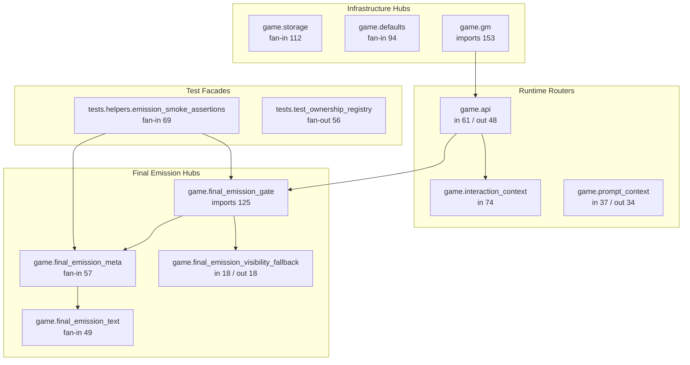
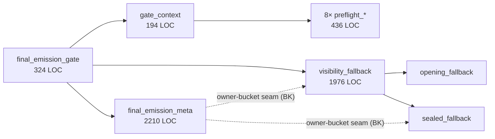
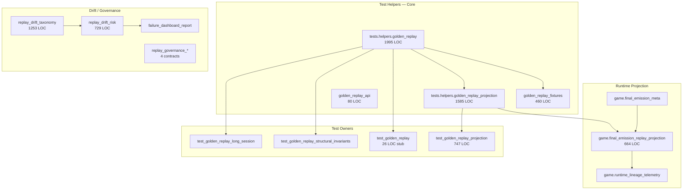
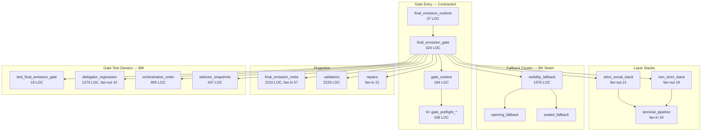

# BO — Dependency Map

**Date:** 2026-06-17  
**Source:** AST import graph (`game.*`, `tests.*` only)  
**Scope:** Post BJ / BK / BL / BN / BM — dependency topology snapshot

---

## 1. Top Dependency Hubs

Hubs ranked by combined influence (fan-in + fan-out, or import-count for mega-hubs).



| Rank | Hub | Fan-In | Fan-Out | Import Count | Role |
|------|-----|-------:|--------:|-------------:|------|
| 1 | `game.storage` | 112 | — | 150 | Persistence / state infrastructure |
| 2 | `game.defaults` | 94 | — | 98 | Configuration defaults |
| 3 | `game.gm` | 60 | 16 | **153** | GM turn orchestration entry |
| 4 | `game.interaction_context` | 74 | 8 | 85 | Interaction state megamodule |
| 5 | `game.api` | 61 | **48** | 76 | HTTP/runtime API router |
| 6 | `tests.helpers.emission_smoke_assertions` | **69** | — | 77 | BD-2/BD-3 smoke facade |
| 7 | `game.final_emission_meta` | **57** | 4 | 73 | FEM projection / bucket metadata |
| 8 | `game.social_exchange_emission` | 53 | 12 | 70 | Strict-social content owner |
| 9 | `game.final_emission_text` | 49 | — | 52 | Gate text utilities |
| 10 | `game.prompt_context` | 37 | **34** | 38 | Prompt assembly router |

---

## 2. Top Routing Layers

Modules that **both consume widely and are consumed widely** — changes here propagate across domains.

| Layer | Fan-In | Fan-Out | Routing Behavior | Leakage Risk |
|-------|-------:|--------:|------------------|--------------|
| `game.api` | 61 | 48 | HTTP entry → game subsystems | **High** — primary runtime router |
| `game.prompt_context` | 37 | 34 | Prompt assembly → narrative/social/FE | **High** — prompt spine |
| `game.final_emission_visibility_fallback` | 18 | 18 | Visibility selection → opening/sealed/diegetic | **High** — BK cascade router |
| `game.final_emission_gate` | 28 | — | Orchestration → layer modules | **Medium** — contracted but 125 import refs |
| `tests.test_ownership_registry` | — | 56 | Guard host → scans 56 modules | **Medium** — governance meta-router |
| `tests.helpers.golden_replay` | 8 | 13 | Scenario setup → assertions + game API | **Medium** — replay scenario router |
| `tests.test_final_emission_gate_delegator_regression` | — | 42 | Static scan → 42 game modules | **Medium** — BJ regression router |

### Routing Layer Diagram (FE fallback cluster)



---

## 3. Replay Ownership Graph

**Island:** 41 files, 13,096 LOC, 93 internal edges



### External Callers into Replay Island

| Replay Module | External Callers | Allowlisted? |
|---------------|-----------------|--------------|
| `tests.helpers.golden_replay` | 15 (`game.api`, `game.final_emission_meta`, integration tests) | Partial — scenario consumers |
| `tests.helpers.golden_replay_projection` | 6 (meta, telemetry, sanitizer) | BD-4 facade — 3 direct sites allowlisted |
| `game.final_emission_replay_projection` | 3 (meta, telemetry vocab) | BD-4 allowlisted |
| `tests.helpers.replay_drift_taxonomy` | 1 (`failure_classifier`) | Drift suite internal |

### Replay Localization Verdict

| Aspect | Status |
|--------|--------|
| Test integration decomposition (BM) | **Localized** — 6 focused owner files |
| Drift/governance suite | **Localized** — coherent 14-file island |
| Helper orchestration | **Not localized** — `golden_replay.py` + `golden_replay_projection.py` = 3,580 LOC hub |
| Runtime projection | **Bounded** — 664 LOC, 3 allowlisted callers |

---

## 4. Final Emission Ownership Graph

**Surface:** 77 files, 32,726 LOC, 332 internal edges



### External Callers into FE Gate (top)

| Caller | Modules Reached | Notes |
|--------|----------------|-------|
| `tests.test_final_emission_gate_delegator_regression` | 14 game modules | BJ static regression scanner |
| `tests.test_final_emission_gate_orchestration_order` | 14 game modules | Behavioral order owner |
| `game.final_emission_gate` | 11 game modules | Orchestration imports (contracted) |
| `tests.test_final_emission_opening_fallback` | 11 game modules | BK cluster test |
| `tests.test_final_emission_visibility` | 10 game modules | BK cluster test |

### FE Localization Verdict

| Aspect | Status |
|--------|--------|
| Gate entry + preflight (BJ/BN) | **Localized** — 555 LOC entry stack vs ~8,968 pre-BJ |
| Gate test ownership (BM) | **Localized** — 5 focused owner files |
| Import guards (BD/BN) | **Held** — 0 BD-6 violations at closeout |
| Fallback visibility cluster | **Not localized** — 18/18 bidirectional hub |
| FEM meta projection | **Centralized** — fan-in 57; intentional hub but high cost |

---

## 5. Largest Dependency Clusters

### Cluster 1 — Runtime API Spine

```
game.gm (153 imports)
  └── game.api (61 fan-in, 48 fan-out)
        ├── game.interaction_context (74 fan-in)
        ├── game.storage (112 fan-in)
        ├── game.prompt_context (37/34)
        └── game.final_emission_gate (28 fan-in)
```

**Impact:** Unrelated feature work touching API or GM still radiates across 60+ modules.

### Cluster 2 — Fallback Visibility Family (BK)

```
final_emission_gate
  └── final_emission_visibility_fallback (18/18)
        ├── final_emission_opening_fallback
        ├── final_emission_sealed_fallback
        └── diegetic_fallback_narration (external)

Tests (co-moving):
  test_final_emission_visibility_fallback (1927 LOC)
  test_final_emission_opening_fallback (1450 LOC)
  test_final_emission_sealed_fallback (516 LOC)
  test_final_emission_visibility (1091 LOC)
```

**Impact:** BK measured 6–9 FTPF; still live per git co-occurrence data.

### Cluster 3 — FEM Meta / Bucket Projection

```
final_emission_meta (57 fan-in)
  ├── final_emission_replay_projection
  ├── final_emission_text (49 fan-in)
  ├── golden_replay_projection (test facade)
  └── owner-bucket classifiers (opening/visibility/sealed split)
```

**Impact:** BK H1 target — bucket consolidation would reduce cross-module projection edits.

### Cluster 4 — Test Governance / Facade

```
test_ownership_registry (56 fan-out)
  ├── BN1–BN11 gate context guards
  ├── BD-6 import compression guard
  └── BM/BA-7 magnet guards

emission_smoke_assertions (69 fan-in)
  ├── apply_final_emission_gate_consumer (BD-2)
  └── final_emission_meta_from_output (BD-3)
```

**Impact:** Guards successfully prevent regression; governance module itself is a dependency hub.

### Cluster 5 — Replay Helper / Drift

```
golden_replay (1995 LOC, 13 fan-out)
  └── golden_replay_projection (1585 LOC)
        └── final_emission_replay_projection (664 LOC)

replay_drift_taxonomy (1253 LOC)
  └── replay_drift_risk (729 LOC)
        └── failure_dashboard_report (1597 LOC)
```

**Impact:** Replay maintenance concentrated in 5 files (~6,200 LOC).

---

## 6. BN Contraction — Dependency Impact

| Edge Class | Pre-BN (AN/BD baseline) | Post-BN (BO) |
|------------|------------------------|--------------|
| Gate module size | ~8,968 LOC monolith | 324 LOC + 630 LOC context/preflight |
| Non-owner runtime → `apply_final_emission_gate` | Multiple paths | **BN1** → `final_emission_runtime` delegate |
| `gate_context` direct layer imports | Unrestricted | **BN11** allowlist — preflight_* only |
| Lazy `feg.*` in stack modules | Present | **BN2** guarded |
| `final_emission_gate` fan-in | 32 files (BD any-symbol) | 28 unique importers |
| `final_emission_meta` fan-in | 49 (BK recon) | **57** (+8 — hub growth) |

**Net:** Gate **entry** dependencies simplified; **FEM meta hub** slightly grew importers during same period.

---

## 7. Quick Reference — Import Compression Status (BD-6)

| Compressed Symbol | Non-Owner Violations | Allowlisted Sites |
|-------------------|---------------------:|------------------:|
| `apply_final_emission_gate` | 0 | 8 owner/equivalence |
| Forbidden FEM reads | 0 | 6 owner/facade |
| `final_emission_replay_projection` | 0 | 3 owner/governance |
| Owner-bucket constants | 0 | via facades only |

Guard host: `tests/test_ownership_registry.py` (`test_bd6_*`, `test_bn1_*`–`test_bn11_*`).
