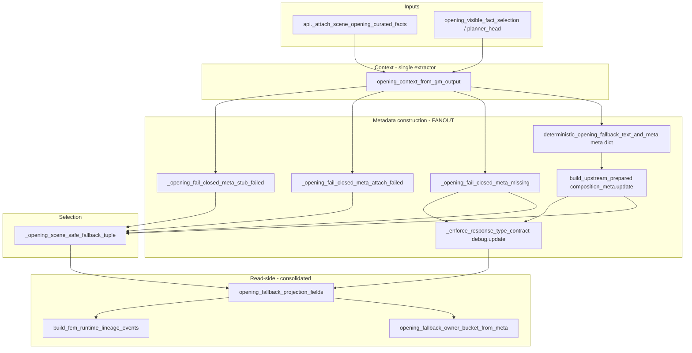

# Cycle AJ — Opening Fallback Metadata Consolidation Recon

Date: 2026-06-02  
Scope: Repository reconnaissance only. No runtime consolidation was performed.

## Executive Summary

Opening fallback **behavior is stable**: prose is composed once in `game.opening_deterministic_fallback`, packaged upstream as `upstream_prepared_opening_fallback`, and selected at the gate via `game.final_emission_opening_fallback` (with a parallel inline selection path in `_enforce_response_type_contract`). **Metadata is not single-source**: the same ~13 opening projection keys are assembled in at least four places (composer, three fail-closed builders, upstream composition merge, gate RT debug merge). Read-side projection is already centralized in `game.final_emission_meta` (`OPENING_FALLBACK_PROJECTION_FIELDS`, `opening_fallback_projection_fields`, owner-bucket mapping). Cycle AJ should consolidate **write-time selection/result metadata** without changing authorship rules, fail-closed text, or deterministic prose.

Prior cycles to align with: [Cycle I fallback authorship recon](cycle_i_fallback_authorship_recon_2026-05-25.md), [Cycle I.A opening owner semantics](cycle_i_a_opening_owner_semantics_contract_2026-05-26.md), [opening fallback surface inventory](../../audits/opening_fallback_surface_inventory_2026-05-11.md).

---

## 1. Files / Functions Involved

### Core composition & context

| File | Symbols |
|------|---------|
| `game/opening_deterministic_fallback.py` | `OPENING_FALLBACK_EMPTY_CURATED_FACTS_MARKER`, `_opening_clean_fact_list`, `opening_context_from_gm_output`, `_actionable_hook_from_opening_context`, `_pick_opening_fallback_fact`, `deterministic_opening_fallback_text_and_meta` |
| `game/opening_visible_fact_selection.py` | `select_opening_narration_visible_facts`, `select_opening_narration_visible_facts_with_telemetry`, eligibility/scoring helpers (`is_opening_eligible_fact`, `opening_fact_score`, …) |
| `game/planner_head_state.py` | Planner head attaches `opening_selector_selected_facts`, caps via `OPENING_NARRATION_VISIBLE_FACT_MAX` |
| `game/prompt_context.py` | `build_narration_context` — copies `opening_selector_*` / `opening_curated_facts` into prompt payload |
| `game/api.py` | `_scene_opening_curated_facts_from_prompt_payload`, `_attach_scene_opening_curated_facts_to_gm` — seeds `opening_curated_facts`, selector fields, `metadata.emission_debug` |

### Upstream packaging

| File | Symbols |
|------|---------|
| `game/upstream_response_repairs.py` | `UPSTREAM_PREPARED_OPENING_FALLBACK_KEY`, `OPENING_FALLBACK_AUTHORSHIP_UPSTREAM_PREPARED`, `UPSTREAM_PREPARED_OPENING_FALLBACK_ORIGIN`, `is_structurally_usable_upstream_prepared_opening_fallback_payload`, `build_upstream_prepared_opening_fallback_payload`, `maybe_attach_upstream_prepared_opening_fallback_payload`, `_patch_scene_opening_upstream_prepare_attach_emission_debug` |
| `game/realization_provenance.py` | `attach_realization_fallback_family`, `UPSTREAM_PREPARED_EMISSION`, `REALIZATION_FALLBACK_FAMILY_FIELD` (stamped on prepared payload) |

### Gate selection & fail-closed

| File | Symbols |
|------|---------|
| `game/final_emission_opening_fallback.py` | `_opening_fallback_classification`, curated-facts prechecks, `_opening_fail_closed_meta_upstream_missing_insufficient_curated_facts`, `_opening_fail_closed_meta_upstream_maybe_attach_prepare_failed`, `_opening_fail_closed_meta_upstream_stub_rebuild_failed`, `_recover_upstream_opening_fallback_stub_payload`, `_opening_scene_safe_fallback_tuple` |
| `game/final_emission_gate.py` | `_opening_mode_active_for_turn`, `validate_opening_output`, `is_valid_opening`, `_opening_scene_safe_fallback_tuple` (wrapper), `_opening_scene_safe_fallback_selection`, `_opening_sealed_fallback_provider`, `_enforce_response_type_contract` (opening branch ~3778–3941), `_merge_opening_upstream_prepare_attach_observability_into_response_type_debug`, `apply_opening_fallback_projection_fields` call sites (~9754, ~9816) |
| `game/diegetic_fallback_narration.py` | `fallback_template_metadata`, `opening_scene_fallback_template_allowed` — `opening_deterministic_fallback` → `scene_opening` / `first_impression` |

### Authorship projection & FEM read-side

| File | Symbols |
|------|---------|
| `game/final_emission_meta.py` | `OPENING_FALLBACK_PROJECTION_FIELDS`, `OPENING_FALLBACK_SELECTOR_DEBUG_FIELDS`, `opening_fallback_projection_fields`, `apply_opening_fallback_projection_fields`, `OPENING_FALLBACK_OWNER_*`, `opening_fallback_owner_bucket_from_fields`, `opening_fallback_owner_bucket_from_meta`, lineage token `opening_fallback_selection` |
| `game/final_emission_replay_projection.py` | `_fem_selected_fallback_projection`, `build_fem_runtime_lineage_events`, `OPENING_FALLBACK_SELECTION_OWNER`, `OPENING_FALLBACK_CONTENT_OWNER`, `OPENING_FAIL_CLOSED_CONTENT_OWNER` |
| `game/runtime_lineage_telemetry.py` | `make_runtime_lineage_event`, `fallback_authorship_source` normalization |
| `game/final_emission_validators.py` | Default/copy of `opening_upstream_prepare_attach_*` debug keys into validator surfaces |
| `game/api_turn_support.py` | `_finalize_player_facing_for_turn` — `opening_upstream_prepared_*` debug on finalize path |

### Boundary / registry (no meta construction, but contract touch)

| File | Symbols |
|------|---------|
| `game/final_emission_boundary_contract.py` | `select_upstream_prepared_opening_fallback` allowed; `compose_opening_fallback_compatibility_local` semantic-disallowed |

### Test & diagnostic helpers

| File | Symbols |
|------|---------|
| `tests/helpers/opening_fallback_evidence.py` | `successful_opening_fem_meta`, `fail_closed_opening_fem_meta`, `successful_opening_observed_fields`, `fail_closed_opening_observed_fields` |
| `tests/helpers/final_emission_gate_fixtures.py` | `EXPECTED_FRONTIER_GATE_OPENING_FALLBACK`, `opening_gm_output`, attach-then-tuple/enforce helpers |
| `tests/helpers/golden_replay.py` | Observed FEM fields for opening authorship/family |
| `tests/helpers/golden_replay_projection.py` | Replay projection helpers |
| `tests/helpers/failure_classifier.py` | Opening field groups, `_opening_fallback_owner_bucket`, investigation targets |
| `tests/failure_classification_contract.py` | Allowed `opening_fallback_owner_bucket` values |

---

## 2. Current Metadata Shapes

### 2.1 Opening selection / context (pre-composer)

Built by `opening_context_from_gm_output` and mirrored partially on `gm_output` / `metadata.emission_debug`:

```python
# game/opening_deterministic_fallback.py — context dict (internal)
{
    "location_anchors": [],
    "visible_facts": [],
    "actionable_labels": [],
    "opening_fallback_context_source": "none" | "opening_curated_facts",
    "opening_fallback_basis_count": int,
    "opening_fallback_context_missing": bool,
    "opening_curated_facts_source": str,      # often "selector" | from emission_debug
    "opening_selector_source_used": str,
    "opening_selector_selected_facts": list[str],
    "opening_curated_facts": list[str],
    "opening_final_fallback_basis": list[str],
    "opening_final_basis_matches_selector": bool,
}
```

API attach (`_attach_scene_opening_curated_facts_to_gm`) also writes top-level `opening_curated_facts`, `opening_selector_selected_facts`, and emission_debug: `opening_curated_facts_present`, `opening_curated_facts_count`, `opening_curated_facts_source`, `opening_selector_source_used`, `opening_selector_selected_facts`, `opening_curated_facts`.

### 2.2 Deterministic composer result meta (`opening_fallback_meta` core)

From `deterministic_opening_fallback_text_and_meta`:

```python
{
    "opening_fallback_context_source": str,
    "opening_fallback_basis_count": int,
    "opening_fallback_context_missing": bool,
    "opening_fallback_failed_closed": bool,
    "opening_curated_facts_present": bool,
    "opening_curated_facts_count": int,
    "opening_curated_facts_source": str,
    "opening_selector_source_used": str,
    "opening_selector_selected_facts": list[str],
    "opening_curated_facts": list[str],
    "opening_final_fallback_basis": list[str],
    "opening_final_basis_matches_selector": bool,
}
```

Empty facts: `opening_fallback_failed_closed=True`, text = `OPENING_FALLBACK_EMPTY_CURATED_FACTS_MARKER` (`"[opening_fallback_failed_closed: empty_curated_facts]"`).

### 2.3 Upstream-prepared opening packaging

`build_upstream_prepared_opening_fallback_payload` returns:

```python
{
    "prepared_opening_fallback_text": str,
    "opening_fallback_meta": dict,              # copy of composer meta
    "opening_fallback_composition_meta": {      # FEM-shaped selection layer
        "first_mention_composition_used": False,
        "first_mention_composition_layers": {"environment": None, "motion": None, "entities": []},
        "fallback_family_used": "scene_opening",
        "fallback_temporal_frame": "first_impression",
        "opening_fallback_authorship_source": "upstream_prepared_opening_fallback",
        # + full composer meta via .update(fallback_meta)
    },
    "upstream_prepared_opening_fallback_origin": str,
    REALIZATION_FALLBACK_FAMILY_FIELD: "upstream_prepared_emission",  # via attach_realization_fallback_family
}
```

Stored on `gm_output["upstream_prepared_opening_fallback"]`.

### 2.4 Gate selection tuple (visibility / sealed paths)

`_opening_scene_safe_fallback_tuple` returns legacy 7-tuple:

`(text, fallback_pool, fallback_kind, final_emitted_source, fallback_strategy, fallback_candidate_source, composition_meta)`

- **Success:** `composition_meta` = upstream `opening_fallback_composition_meta` (+ optional stub_patch).
- **Fail-closed:** `composition_meta` = `fail_closed_composition_meta_factory()` + classification + fail-closed meta + `opening_fallback_authorship_source: None`.

Route constants: `scene_opening_deterministic`, `opening_deterministic_fallback`, `opening_scene_safe_fallback`.

### 2.5 Fail-closed metadata extensions

Shared across three `_opening_fail_closed_meta_*` functions in `final_emission_opening_fallback.py`:

| Variant | Extra keys |
|---------|------------|
| Missing / insufficient upstream | `opening_fallback_compatibility_local_disabled`, `opening_fallback_missing_upstream_prepared_payload`, optionally `opening_fallback_missing_curated_facts` |
| Attach prepare failed | above + `blocked_repair_kind: "opening_upstream_prepare_attach_failed"` |
| Unusable stub | `opening_fallback_upstream_payload_unusable`, `opening_fallback_upstream_payload_recovered: False`, `opening_fallback_missing_upstream_prepared_payload: False` |

Stub recovery patch on selection (not full meta): `opening_fallback_upstream_payload_unusable`, `opening_fallback_upstream_payload_recovered`.

### 2.6 Response-type / FEM debug (gate opening branch)

`_enforce_response_type_contract` merges `fallback_meta` into `debug` and sets:

- `opening_validation_failed`, `opening_failure_reasons`, `opening_recovered_via_fallback`, `opening_fallback_authorship_source` (`upstream_prepared_opening_fallback` or `None`)
- `response_type_repair_kind`: `opening_deterministic_fallback` | `opening_deterministic_fallback_failed_closed`
- `fallback_family_used`, `fallback_temporal_frame`, `realization_fallback_family` (upstream vs legacy diegetic)
- `blocked_repair_kind`, stub_patch keys, upstream attach observability (`opening_upstream_prepare_attach_*`)

FEM replacement path copies projection fields via `apply_opening_fallback_projection_fields(..., coerce_for_fem=True, include_authorship_source=False)` into `fem_replacement_meta`; selector debug fields copied to `metadata.emission_debug`.

### 2.7 Authorship projection (read-side, not rebuilt at write)

- **Token:** `opening_fallback_authorship_source` — canonical success: `upstream_prepared_opening_fallback`; fail-closed: `None`; legacy test-only: `compatibility_local_opening_deterministic`.
- **Bucket:** `opening_fallback_owner_bucket_from_meta` → `upstream-prepared` | `sealed-gate` | `strict-social` | `retry` | `unknown-ambiguous`.
- **Lineage (replay):** `fallback_authorship_source`, `fallback_owner_bucket`, `fallback_selection_owner`, `fallback_content_owner` on projected events (`game.final_emission_replay_projection`).

### 2.8 Canonical projection field registry

`OPENING_FALLBACK_PROJECTION_FIELDS` in `final_emission_meta.py` is the authoritative **FEM/replay field list** (13 keys). Subset `OPENING_FALLBACK_SELECTOR_DEBUG_FIELDS` (5 keys) mirrors selector/basis fields into `emission_debug`.

---

## 3. Duplication / Fanout Map



| Duplication | Locations | Notes |
|-------------|-----------|-------|
| Core 13 projection keys | `deterministic_opening_fallback_text_and_meta`; each `_opening_fail_closed_meta_*` (3×, ~30 lines each); inline gate RT branch copies `opening_fallback_meta` from payload | Same keys, manual dict literals |
| Fail-closed + Block H flags | Three fail-closed builders + gate RT branch | `opening_fallback_compatibility_local_disabled`, stub flags |
| Classification layer | `build_upstream_prepared_opening_fallback_payload`, adapter fail-closed branch, gate RT success branch | `fallback_family_used`, `fallback_temporal_frame`, `first_mention_*` |
| Selection logic | `_opening_scene_safe_fallback_tuple` vs `_enforce_response_type_contract` opening branch | Parallel if/elif chains (upstream → stub → attach-fail → missing facts) |
| `opening_fallback_meta` vs `composition_meta` | Upstream payload stores both; composition_meta duplicates meta via `.update()` | Two dicts on wire; gate often uses composition_meta only |

### Ownership domains (overlapping pieces)

| Domain | Owns today |
|--------|------------|
| `opening_deterministic_fallback` | Context extraction, prose, success/fail-closed **composer** meta |
| `upstream_response_repairs` | Prepared payload shape, authorship stamp, attach idempotency, attach-failure telemetry |
| `final_emission_opening_fallback` | Selection tuple, fail-closed meta variants, stub recovery patch |
| `final_emission_gate` | RT enforcement merge, FEM projection apply, observability merge, visibility/sealed wiring |
| `final_emission_meta` | Projection field registry, owner buckets, FEM copy helpers |
| `final_emission_replay_projection` | Lineage projection (must not change behavior when consolidating write shapes) |
| `api` / `prompt_context` / `planner_head_state` | Curated/selector **inputs** (not fallback result meta) |

### Replay / classifier touch points if shapes change

| Consumer | Sensitivity |
|----------|-------------|
| `tests/helpers/golden_replay.py` | Required/observed FEM fields |
| `tests/test_golden_replay.py` | Authorship, owner bucket, lineage events |
| `tests/helpers/failure_classifier.py` | Field list ~705–714, owner bucket validation |
| `tests/failure_classification_contract.py` | Allowed bucket enum |
| `tests/helpers/opening_fallback_evidence.py` | Canonical evidence dicts |
| `tests/test_failure_classifier.py` | Frequency / routing summaries |
| `tests/test_runtime_lineage_telemetry.py` | `fallback_*_owner` fields |
| Protected replay manifest | Any new required keys need manifest review |

---

## 4. Behavioral Invariants to Preserve

### Authorship (unchanged)

| Invariant | Source of truth |
|-----------|-----------------|
| Successful prose author | `game.opening_deterministic_fallback` |
| Successful packaging | `game.upstream_response_repairs` with `opening_fallback_authorship_source=upstream_prepared_opening_fallback` |
| Selector | `game.final_emission_gate` / adapter — must not re-invoke composer on canonical paths |
| Fail-closed content owner | Gate — marker text only, `authorship_source=None`, bucket `sealed-gate` |
| No `compatibility_local_opening_deterministic` on canonical paths | Gate/opening/golden tests |

### Fail-closed (unchanged)

| Condition | Outcome |
|-----------|---------|
| Empty / non-attachable curated facts | Marker text + `opening_fallback_failed_closed=True` |
| Unusable upstream stub (text-only) | Fail-closed, no gate rebuild of prose |
| `opening_upstream_prepare_attach_build_failed` on emission_debug | `blocked_repair_kind=opening_upstream_prepare_attach_failed` |
| `opening_final_basis_matches_selector` false in composer | `AssertionError` (not a soft fail) |

### Determinism

| Guarantee | Enforcement |
|-----------|-------------|
| Same curated facts → same opening text | `EXPECTED_FRONTIER_GATE_OPENING_FALLBACK` snapshot; `test_deterministic_opening_fallback_helper_exact_text_and_meta_snapshot` |
| Fact order / dedupe | `_opening_clean_fact_list`, selector in `opening_visible_fact_selection` |
| No polluted `public_scene.visible_facts` for opening fallback | Gate/opening tests |

### Gate / boundary

- `compose_opening_fallback_compatibility_local` remains semantic-disallowed.
- `select_upstream_prepared_opening_fallback` remains allowed selector mutation.
- Opening mode must not use generic `prepared_action_fallback_text` repair (`opening_generic_action_repair_blocked`).

---

## 5. Test Coverage Map

| Test module | Focus | Consolidation impact |
|-------------|-------|----------------------|
| `tests/test_final_emission_opening_fallback.py` | Adapter selection, fail-closed shapes, no local composer on canonical paths, gate wrapper pin | **Must stay** behaviorally unchanged; **fixture-only** if meta dict built centrally but keys identical |
| `tests/test_upstream_response_repairs.py` | Payload shape, attach, stub replace, build-failure telemetry | **Must stay**; may need snapshot tweak if only dict construction order changes |
| `tests/test_final_emission_gate.py` (opening tests) | RT path, FEM authorship, mutation fencing, pollution guards | **Must stay**; **assertion update** only if consolidating RT path changes debug key ordering |
| `tests/test_opening_fallback_owner_bucket.py` | Bucket mapping rules | **Must stay** unchanged |
| `tests/test_final_emission_meta.py` (`-k opening`) | Projection coercion, lineage events | **Must stay**; **fixture-only** for projection helper tests |
| `tests/test_golden_replay.py` (opening seams) | Protected replay authorship/owner | **Must stay**; **possible redundant** after AJ if fixtures import canonical builder |
| `tests/test_failure_classifier.py` / `tests/test_failure_classification_contract.py` | Classifier buckets & field validation | **Must stay** bucket rules; **fixture-only** for row builders |
| `tests/test_runtime_lineage_telemetry.py` | Selection/content owner fields | **Must stay** |
| `tests/test_api_narration_path_selection.py` | Finalize carries upstream payload | **Must stay** |
| `tests/test_start_campaign_api.py` | Campaign opening basis | **Must stay** |
| `tests/test_opening_visible_fact_selection.py` | Selector scoring (input side) | **Must stay**; orthogonal to AJ unless keys renamed |
| `tests/test_diegetic_fallback_narration.py` | Template classification | **Must stay** |
| `tests/test_realization_provenance.py` | `realization_fallback_family` stamp | **Must stay** |
| `tests/test_final_emission_visibility_fallback.py` | Opening visibility routing | **Must stay** |
| `tests/test_planner_seam_fencing.py` | Marker scan non-authoritative | **Must stay** |
| `tests/helpers/opening_fallback_evidence.py` | Shared FEM/observed evidence | **Likely fixture-only** update to call canonical builder |
| `tests/helpers/final_emission_gate_fixtures.py` | Harness scaffold | **Fixture-only** |
| `tests/test_ownership_registry.py` | Documents helper ownership | **Possible redundant** touch (doc string only) |

---

## 6. Recommended Consolidation Seam

### Primary seam: `game/opening_deterministic_fallback.py`

Add a single write-time builder, e.g. `build_opening_fallback_projection_meta(context, *, failed_closed=False, fail_closed_reason=None, extra=None)`, that:

1. Takes output of `opening_context_from_gm_output` (or equivalent mapping).
2. Emits exactly the keys in `OPENING_FALLBACK_PROJECTION_FIELDS` (import constant from `final_emission_meta` to avoid drift).
3. Accepts optional fail-closed / upstream-stub / Block-H extensions via a typed `extra` dict or small enum — **not** separate 30-line copies.

**Why here:** Already owns context extraction and composer meta; no import cycle with gate; upstream and adapter can import without pulling `final_emission_gate`.

### Secondary seam (packaging only): `game/upstream_response_repairs.py`

Keep `build_upstream_prepared_opening_fallback_payload` as the **only** place that adds `prepared_opening_fallback_text`, `upstream_prepared_opening_fallback_origin`, authorship stamp, and `first_mention_*` layers — but build `opening_fallback_meta` / merged `opening_fallback_composition_meta` via the canonical builder.

### Read-side stays: `game/final_emission_meta.py`

Do not move owner-bucket logic or `apply_opening_fallback_projection_fields` into the composer module. Consumers continue to project from finalized dicts.

### Gate thinning target

- `_enforce_response_type_contract` opening branch should **delegate** meta + text selection to `final_emission_opening_fallback` (or a shared `select_opening_fallback_for_response_type(gm_output) -> (text, meta, authorship)`) instead of duplicating the if/elif chain.
- `_opening_scene_safe_fallback_tuple` wrapper remains; behavior unchanged.

### After consolidation, consumers

| Consumer | Uses |
|----------|------|
| `upstream_response_repairs` | Canonical meta + packaging wrapper |
| `final_emission_opening_fallback` | Canonical meta + fail-closed extras |
| `final_emission_gate` | Adapter/selector only; `apply_opening_fallback_projection_fields` for FEM |
| `final_emission_meta` | Registry + read-side copy |
| `final_emission_replay_projection` | Unchanged read of FEM |
| Test helpers | Import builder for evidence dicts |

---

## 7. Suggested Implementation Sequence

| Block | Objective | Files likely touched | Tests to run | Risk |
|-------|-----------|----------------------|--------------|------|
| **AJ1** | Introduce `build_opening_fallback_projection_meta`; refactor `deterministic_opening_fallback_text_and_meta` to use it | `opening_deterministic_fallback.py`, `final_emission_meta.py` (import constant only) | `test_final_emission_opening_fallback.py::test_deterministic_opening_fallback_helper_exact_text_and_meta_snapshot`, `test_upstream_response_repairs.py -k opening` | Low |
| **AJ2** | Replace three `_opening_fail_closed_meta_*` bodies with canonical builder + small extra maps | `final_emission_opening_fallback.py` | `test_final_emission_opening_fallback.py` (fail-closed tests) | Low–Med (many assertions on key sets) |
| **AJ3** | Upstream payload: dedupe `opening_fallback_meta` / `composition_meta` construction via AJ1 builder | `upstream_response_repairs.py` | `test_upstream_response_repairs.py`, opening snapshot tests | Low |
| **AJ4** | Gate RT opening branch: delegate selection/meta to adapter helper (remove parallel if/elif) | `final_emission_gate.py`, possibly new function in `final_emission_opening_fallback.py` | `test_final_emission_gate.py -k opening`, `test_final_emission_opening_fallback.py` | Med (orchestration) |
| **AJ5** | Test helpers: `opening_fallback_evidence.py`, `final_emission_gate_fixtures.py` call canonical builder | test helpers only | Full opening pytest slice + spot golden | Low |
| **AJ6** | Docs/registry sync; optional classifier comment if field ordering documented | `tests/failure_classification_contract.py`, `audits/*` | `test_failure_classification_contract.py` | Low |

### Parallelism

| Parallel safe | Depends on |
|---------------|------------|
| AJ1 alone | — |
| AJ5 (test-only draft) after AJ1 API frozen | AJ1 |
| AJ2 ∥ AJ3 after AJ1 merged | AJ1 |
| AJ4 after AJ2 (shared fail-closed extras) | AJ2 |
| AJ6 anytime after AJ1 | — |

**Do not run AJ4 in parallel with AJ2** — both touch selection/fail-closed semantics.

---

## 8. Files to Pass Back to ChatGPT

Smallest set for implementation block generation (source + tests + this report):

### Recon artifact

- `docs/cycles/cycle_aj_opening_fallback_metadata_consolidation_recon_2026-06-02.md` (this file)

### Source (write path)

1. `game/opening_deterministic_fallback.py`
2. `game/final_emission_opening_fallback.py`
3. `game/upstream_response_repairs.py`
4. `game/final_emission_meta.py` (projection registry + apply helpers)
5. `game/final_emission_gate.py` (RT opening branch + projection call sites only — large file; scope sections)
6. `game/final_emission_replay_projection.py` (read-side lineage — do not break)
7. `game/api.py` (`_attach_scene_opening_curated_facts_to_gm` only)

### Tests / helpers

8. `tests/test_final_emission_opening_fallback.py`
9. `tests/test_upstream_response_repairs.py`
10. `tests/test_opening_fallback_owner_bucket.py`
11. `tests/test_final_emission_meta.py` (opening projection tests)
12. `tests/helpers/opening_fallback_evidence.py`
13. `tests/helpers/final_emission_gate_fixtures.py`
14. `tests/helpers/failure_classifier.py` (opening field groups)
15. `tests/failure_classification_contract.py`

### Reference docs (optional, 1–2 pages each)

16. `docs/cycles/cycle_i_a_opening_owner_semantics_contract_2026-05-26.md`
17. `audits/opening_fallback_surface_inventory_2026-05-11.md`

---

## Commands Run (recon validation)

```text
Set-Location "c:\Users\Master Mandalcio\Documents\Tabletop Gaming\AI Dungeon Master\ashen_thrones_ai_gm"
python -m pytest tests/test_final_emission_opening_fallback.py tests/test_upstream_response_repairs.py -k opening tests/test_opening_fallback_owner_bucket.py tests/test_final_emission_meta.py -k opening --tb=no -q
```

**Result:** `39 passed` (exit code 0).
