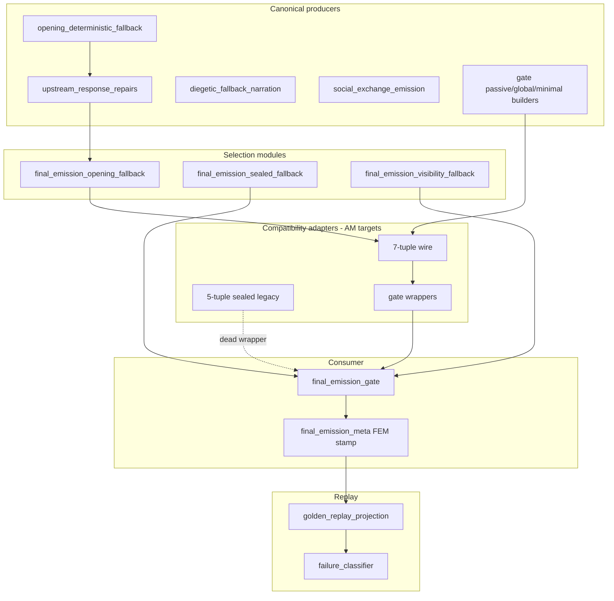

# Cycle AM — Fallback Adapter Retirement Recon

**Date:** 2026-06-02  
**Scope:** Discovery and mapping only. No production code, tests, fixtures, or snapshots were modified.

**Prior art:** [Cycle AB fallback topology collapse recon](cycle_ab_fallback_topology_collapse_recon_2026-05-31.md), [Cycle AA gate authority extraction closure](cycle_aa_gate_authority_extraction_closure_2026-05-31.md), [Cycle AJ opening fallback metadata consolidation recon](cycle_aj_opening_fallback_metadata_consolidation_recon_2026-06-02.md), [Cycle AK replay schema authority inventory](../../audits/cycle_ak_replay_schema_authority_inventory.md).

---

## Executive Summary

Fallback **ownership** has already been extracted into dedicated modules (`final_emission_opening_fallback`, `final_emission_sealed_fallback`, `final_emission_visibility_fallback`), but **historical tuple topology** and **gate-local compatibility wrappers** still shape the call graph. Production hot paths already use dataclass selection (`SealedFallbackSelection`, `VisibilitySelectedFallback`) at terminal replace and visibility enforcement; tuple shapes survive as:

1. **7-field visibility tuples** — opening adapter output, passive-scene-pressure candidates, scene-emit-integrity global fallback.
2. **5-field sealed tuples** — legacy adapter surface on `SealedFallbackSelection` (round-trip tests; one unused gate wrapper).
3. **Gate wrappers** — thin delegators that inject gate-local prose builders into `final_emission_sealed_fallback` and re-export opening tuple selection.

**Cycle AM is viable** if scoped to adapter/wrapper retirement **without** changing FEM/replay field names or values. The highest-confidence first cuts are **dead gate tuple wrappers** with zero call sites. Medium-risk work converts tuple-producing gate helpers to dataclasses at the source, then deletes `from_legacy_tuple` bridges. **Replay-protected** owner buckets, visibility stamps, and `opening_fallback_authorship_source` must remain byte-stable through AM.

---

## Canonical Result Path

### Intended dataclass / result flow

| Stage | Module | Symbol | Role |
|-------|--------|--------|------|
| Opening selection | `game/final_emission_opening_fallback.py` | `select_opening_fallback_for_response_type_contract` | Upstream prepared vs fail-closed marker (no prose authorship) |
| Opening tuple (legacy wire) | `game/final_emission_opening_fallback.py` | `_opening_scene_safe_fallback_tuple` | 7-tuple wire format for gate consumers |
| Gate opening shim | `game/final_emission_gate.py` | `_opening_scene_safe_fallback_tuple` → `_opening_scene_safe_fallback_selection` | Injects `_first_mention_composition_meta`; converts tuple → `VisibilitySelectedFallback` |
| Sealed branch policy | `game/final_emission_sealed_fallback.py` | `select_non_strict_replace_path_terminal_sealed_fallback_branch`, `assemble_non_strict_sealed_fallback_selection` | Branch order only; prose via injected providers |
| Sealed result | `game/final_emission_sealed_fallback.py` | `SealedFallbackSelection` | Canonical sealed selection dataclass |
| Visibility selection | `game/final_emission_gate.py` | `_standard_visibility_safe_fallback` | Returns `VisibilitySelectedFallback` (canonical at visibility enforcement) |
| Visibility plans | `game/final_emission_visibility_fallback.py` | `build_visibility_hard_replacement_plan`, `stamp_visibility_fallback_metadata` | Route/meta assembly (no prose authorship) |
| FEM stamping | `game/final_emission_sealed_fallback.py` | `stamp_sealed_fallback_realization_family`, `prepare_sealed_replacement_route_meta` | `sealed_fallback_owner_bucket`, `realization_fallback_family` |
| FEM read/projection | `game/final_emission_meta.py` | `opening_fallback_projection_fields`, `opening_fallback_owner_bucket_from_meta` | Read-side owner buckets |
| Replay observation | `tests/helpers/golden_replay_projection.py` | `project_turn_observation` | 41 protected paths → observed turn |

### Canonical producers (prose + metadata)

| Producer | Output shape | Notes |
|----------|--------------|-------|
| `game/upstream_response_repairs.py` | `upstream_prepared_opening_fallback` payload + composition meta | Canonical opening prose path |
| `game/opening_deterministic_fallback.py` | Text + context meta | Composes opening prose; packaged upstream only in production |
| `game/diegetic_fallback_narration.py` | `fallback_family_used` / `temporal_frame` classification | Diegetic taxonomy |
| `game/social_exchange_emission.py` | Strict-social deterministic lines | Emergency fallback prose owner |
| `game/final_emission_gate.py` | `_passive_scene_pressure_fallback_candidates`, `_scene_emit_integrity_global_fallback_tuple`, `minimal_social_emergency_fallback_line`, etc. | Gate-injected prose builders (still tuple emitters) |

### Canonical consumers

| Consumer | Reads |
|----------|-------|
| `game/final_emission_gate.py` | Dataclass selections → `player_facing_text`, FEM, `response_type_debug` |
| `game/final_emission_replay_projection.py` | FEM → runtime lineage / fallback_kind projection |
| `tests/helpers/golden_replay_projection.py` | FEM + sanitizer trace → protected observed turn |
| `tests/helpers/failure_classifier.py` | Observed turn → classification row |

---

## Legacy Tuple Adapter Inventory

| File | Symbol | Direction | Consumers | Replay-sensitive? | Notes |
|------|--------|-----------|-----------|---------------------|-------|
| `game/final_emission_opening_fallback.py` | `_opening_scene_safe_fallback_tuple` | dataclass/meta → **7-tuple** | Gate `_opening_scene_safe_fallback_tuple`, tests | **Yes** (text + composition meta fields project to FEM) | Canonical opening wire; upstream path sets `opening_fallback_authorship_source` in composition_meta |
| `game/final_emission_gate.py` | `_opening_scene_safe_fallback_tuple` | delegates → adapter 7-tuple | `_opening_scene_safe_fallback_selection`, `_opening_sealed_fallback_provider` | Yes | Injects `fail_closed_composition_meta_factory` |
| `game/final_emission_gate.py` | `_opening_scene_safe_fallback_selection` | 7-tuple → `VisibilitySelectedFallback` | `_standard_visibility_safe_fallback` (opening mode) | Yes | Avoidable round-trip |
| `game/final_emission_gate.py` | `_opening_sealed_fallback_provider` | 7-tuple → `SealedFallbackSelection` | `build_non_strict_sealed_fallback_providers` opening branch | Yes | `from_visibility_tuple` drops strategy/candidate fields |
| `game/final_emission_gate.py` | `_passive_scene_pressure_fallback_candidates` | prose → **7-tuple** list | `_standard_visibility_safe_fallback`, sealed passive provider | Yes | Tuple list at source |
| `game/final_emission_gate.py` | `_scene_emit_integrity_global_fallback_tuple` | prose → **7-tuple** | Visibility + sealed global provider + N4 line selector | Yes | Matches visibility tuple shape |
| `game/final_emission_gate.py` | `_select_non_strict_replace_path_terminal_sealed_fallback` | `SealedFallbackSelection` → **5-tuple** | **None in repo** (dead) | No (unused) | Docstring: "Backward-compatible tuple adapter for historical private tests/imports" |
| `game/final_emission_gate.py` | `_standard_visibility_safe_fallback_tuple` | `VisibilitySelectedFallback` → **7-tuple** | **None in repo** (dead) | No (unused) | Same pattern as sealed tuple wrapper |
| `game/final_emission_sealed_fallback.py` | `SealedFallbackSelection.from_legacy_tuple` / `as_legacy_tuple` | 5-tuple ↔ dataclass | Tests; dead gate wrapper | Tests lock shape | Safe to keep until callers gone |
| `game/final_emission_sealed_fallback.py` | `SealedFallbackSelection.from_visibility_tuple` | 7-tuple → dataclass | Opening provider, passive loop, global provider | Yes | Boundary adapter |
| `game/final_emission_visibility_fallback.py` | `VisibilitySelectedFallback.from_legacy_tuple` / `as_legacy_tuple` | 7-tuple ↔ dataclass | Gate visibility path, tests | Tests lock shape | Canonical visibility dataclass |
| `game/final_emission_visibility_fallback.py` | `visibility_selected_fallback_from_tuple` | 7-tuple → dataclass | Tests only (`test_final_emission_visibility_fallback.py`) | No | Thin alias |
| `game/final_emission_sealed_fallback.py` | `select_acceptance_quality_n4_sealed_fallback_line` | uses `global_fallback_tuple_builder(...)[0]` | N4 accept path via gate wrapper | Yes (line text only) | Tuple builder injects text-only slice |

---

## Compatibility Wrapper Inventory

| File | Symbol | Purpose | Consumers | Can retire? | Notes |
|------|--------|---------|-----------|-------------|-------|
| `game/final_emission_gate.py` | `_build_non_strict_sealed_fallback_providers` | Inject gate-local tuple builders into `final_emission_sealed_fallback.build_non_strict_sealed_fallback_providers` | `_select_non_strict_replace_path_terminal_sealed_fallback_selection` | **Inline/collapse** | AA3 explicitly kept; could move injection to call site |
| `game/final_emission_gate.py` | `_select_acceptance_quality_n4_sealed_fallback_line` | Delegate to `final_emission_sealed_fallback.select_acceptance_quality_n4_sealed_fallback_line` | N4 replace path | **Inline/collapse** | One-line delegate |
| `game/final_emission_gate.py` | `_opening_scene_safe_fallback_tuple` | Gate-facing opening adapter + first-mention meta | Opening visibility + sealed opening branch | **Partial** | Keep delegation; drop tuple return in later block |
| `game/final_emission_meta.py` | `_OPENING_FALLBACK_AUTH_COMPATIBILITY_LOCAL` mapping | Maps legacy authorship → `unknown-ambiguous` bucket | `opening_fallback_owner_bucket_from_fields` | **After tests** | No production assigns this authorship (AB recon) |
| `game/final_emission_opening_fallback.py` | `opening_fallback_compatibility_local_disabled: True` | FEM/debug flag proving local composer off | Gate + golden + opening tests | **KEEP_REPLAY_PROTECTED** | Asserted widely; not dead |
| `game/final_emission_boundary_contract.py` | `compose_opening_fallback_compatibility_local` | Semantic-disallowed mutation class | Boundary audit only | **SAFE_TO_REMOVE_NOW** (registry entry) | No `game/` implementation located |
| `game/opening_deterministic_fallback.py` | module docstring | Documents gate compatibility re-call | — | **Doc-only** | Misleading post–Cycle J; composer not called from opening adapter fail-closed |
| `game/response_policy_contracts.py` | top-level `fallback_behavior` accessor | Compatibility residue for policy dict | `test_response_policy_contracts.py` | **UNCLEAR** | Not gate fallback topology |
| `game/final_emission_visibility_fallback.py` | `visibility_selected_fallback_from_tuple` | Test/helper alias | Tests | **SAFE_TO_REMOVE_NOW** | Redundant with `from_legacy_tuple` |

---

## Gate / Sealed / Visibility Mediation

### Gate fallback mediation

| File | Symbols | Why it exists | Still needed? |
|------|---------|---------------|---------------|
| `game/final_emission_gate.py` | `_enforce_response_type_contract` (opening branch) | RT repair / opening validation orchestration | **Yes** — orchestration owner |
| `game/final_emission_gate.py` | `_standard_visibility_safe_fallback`, `_apply_first_mention_enforcement`, visibility hard replace | Mediate visibility validation → safe fallback dataclass | **Yes** — core enforcement |
| `game/final_emission_gate.py` | `_select_non_strict_replace_path_terminal_sealed_fallback_selection` | Terminal replace trunk selection | **Yes** — uses dataclass end-to-end |
| `game/final_emission_gate.py` | `_select_non_strict_replace_path_terminal_sealed_fallback` | Tuple export of selection | **No** — zero call sites |
| `game/final_emission_gate.py` | `_standard_visibility_safe_fallback_tuple` | Tuple export of visibility selection | **No** — zero call sites |

Gate **mediates** fallback output by: (1) calling selection helpers, (2) writing `player_facing_text`, (3) stamping FEM via `final_emission_sealed_fallback` / `final_emission_visibility_fallback` helpers, (4) updating `response_type_debug` / provenance debug.

### Sealed fallback adapters

| File | Symbols | Why it exists | Still needed? |
|------|---------|---------------|---------------|
| `game/final_emission_sealed_fallback.py` | `SealedFallbackSelection`, `assemble_non_strict_sealed_fallback_selection` | Policy + dataclass canonical path | **Yes** |
| `game/final_emission_sealed_fallback.py` | `build_non_strict_sealed_fallback_providers` | Wire gate prose builders to branch providers | **Yes** until builders move or return dataclasses |
| `game/final_emission_sealed_fallback.py` | `from_legacy_tuple` / `as_legacy_tuple` | Historical 5-tuple compatibility | **Until AM removes dead wrapper + test migration** |
| `game/final_emission_gate.py` | `_opening_sealed_fallback_provider` | Opening branch for non-strict terminal replace | **Yes** — converts opening 7-tuple → sealed dataclass |

### Visibility fallback adapters

| File | Symbols | Why it exists | Still needed? |
|------|---------|---------------|---------------|
| `game/final_emission_visibility_fallback.py` | `VisibilitySelectedFallback` | Canonical visibility selection dataclass | **Yes** |
| `game/final_emission_visibility_fallback.py` | `build_visibility_hard_replacement_plan`, `stamp_visibility_fallback_metadata` | FEM/route stamping without prose | **Yes** |
| `game/final_emission_visibility_fallback.py` | `from_legacy_tuple` | Bridge tuple producers (passive, global integrity) | **Yes** until tuple producers retired |
| `game/final_emission_gate.py` | `_opening_scene_safe_fallback_selection` | Opening mode entry to visibility selector | **Yes** — could call adapter dataclass API directly in AM2 |

---

## Replay Field Protection

### Protected golden replay paths (fallback-related subset)

Source: `tests/helpers/golden_replay_projection.py::PROTECTED_OBSERVATION_FIELDS` (41 total; see [AK inventory](../../audits/cycle_ak_replay_schema_authority_inventory.md)).

| Observed path | FEM / trace source | Tests asserting |
|---------------|-------------------|-----------------|
| `opening_fallback_authorship_source` | FEM | `tests/test_golden_replay.py` (`test_golden_canonical_opening_fallback_never_reports_compatibility_local_ownership`, direct seam), `tests/test_final_emission_gate.py`, `tests/test_final_emission_opening_fallback.py` |
| `opening_fallback_owner_bucket` | Derived via `opening_fallback_owner_bucket_from_meta` | `tests/test_golden_replay.py`, `tests/test_opening_fallback_owner_bucket.py`, `tests/test_failure_classification_contract.py` |
| `opening_recovered_via_fallback` | FEM | Golden replay structural drift |
| `sealed_fallback_owner_bucket` | FEM | `tests/test_golden_replay.py` (`test_golden_observed_turn_projects_sealed_fallback_owner_bucket`, strict-social variant), `tests/test_final_emission_meta.py`, `tests/test_final_emission_sealed_fallback.py` |
| `visibility_fallback_owner_bucket` | FEM | `tests/test_golden_replay.py` (`test_golden_observed_turn_projects_visibility_fallback_evidence`), `tests/test_final_emission_visibility.py` |
| `visibility_fallback_pool` | FEM | Same |
| `visibility_fallback_kind` | FEM | Same |
| `visibility_replacement_applied` | FEM | Golden + visibility suites |
| `fallback_family` | `project_replay_fallback_family_from_fem` (diegetic preferred) | Golden replay scenarios |
| `fallback_temporal_frame` | FEM | Golden replay |
| `final_emitted_source` | FEM | Gate, golden, classifier |
| `final_emission_mutation_lineage` | FEM | Golden structural drift |

### FEM flags (not all in protected 41 but contract-locked in tests)

| Field | Role |
|-------|------|
| `opening_fallback_compatibility_local_disabled` | Proves gate-local composer disabled |
| `opening_fallback_failed_closed` | Fail-closed path marker |
| `opening_fallback_missing_upstream_prepared_payload` | Upstream attach semantics |
| `realization_fallback_family` / `fallback_family_used` | Dual taxonomy (AB/AK — do not collapse in AM without replay proof) |

**Cycle AM rule:** Adapter retirement must not rename or re-derive these fields; tuple removal may only change internal wiring if projected values are unchanged.

---

## Test Coverage Map

| Test file | What it protects | Relevant assertions | Risk if changed |
|-----------|------------------|---------------------|-----------------|
| `tests/test_final_emission_opening_fallback.py` | Opening adapter selection, fail-closed meta, tuple shape | `opening_fallback_compatibility_local_disabled`, authorship ≠ compatibility_local | High — direct owner |
| `tests/test_final_emission_sealed_fallback.py` | Sealed dataclass round-trip, provider assembly, stamps | `from_legacy_tuple` / `from_visibility_tuple` / `as_legacy_tuple` equality | High — tuple contract tests |
| `tests/test_final_emission_visibility_fallback.py` | Visibility dataclass plans + tuple round-trip | `as_legacy_tuple`, `visibility_selected_fallback_from_tuple` | Medium |
| `tests/test_final_emission_visibility.py` | End-to-end visibility replace + FEM buckets | `visibility_fallback_owner_bucket == sealed-gate` | High |
| `tests/test_final_emission_gate.py` | Gate integration: opening upstream, fail-closed, visibility snapshot, sealed order | FEM authorship, compatibility_local disabled, selector snapshots | High |
| `tests/test_golden_replay.py` | Replay drift + owner bucket projection | Protected paths, opening/sealed/visibility scenarios | **Critical** |
| `tests/test_opening_fallback_owner_bucket.py` | Owner bucket mapping | Compatibility-local → ambiguous | Medium |
| `tests/test_failure_classification_contract.py` | Allowed bucket values | Contract lock on `*_fallback_owner_bucket` | Medium |
| `tests/test_final_emission_meta.py` | FEM lineage, sealed subkinds, bucket registries | Sealed replacement subkind matrix | High |
| `tests/test_fallback_behavior_gate.py` | Fallback behavior layer integration | Policy layer, not tuple adapters | Low for AM1 |
| `tests/test_ownership_registry.py` | Suite ownership metadata | Documents visibility fallback owner suite | Low |
| `tests/helpers/golden_replay_projection.py` | Protected field registry | 41 paths | Critical |
| `tests/helpers/opening_fallback_evidence.py` | Fixture constants for negative compatibility-local tests | `OPENING_FALLBACK_AUTHORSHIP_COMPATIBILITY_LOCAL` | Medium |

### Tests executed this recon (all passed)

```text
pytest tests/test_final_emission_opening_fallback.py \
  tests/test_final_emission_sealed_fallback.py \
  tests/test_final_emission_visibility_fallback.py \
  tests/test_opening_fallback_owner_bucket.py \
  tests/test_failure_classification_contract.py -q

pytest tests/test_final_emission_visibility.py \
  tests/test_golden_replay.py \
  tests/test_fallback_behavior_gate.py \
  tests/test_ownership_registry.py -q

pytest tests/test_final_emission_gate.py -k "fallback or opening_fallback or sealed or visibility_safe" -q
```

Full `tests/test_final_emission_gate.py` (~280+ tests) was **not** run in this pass; keyword subset (19 tests) passed.

---

## Retirement Plan Candidates

### SAFE_TO_REMOVE_NOW

- `game/final_emission_gate.py::_select_non_strict_replace_path_terminal_sealed_fallback` — **no call sites**; production uses `_select_non_strict_replace_path_terminal_sealed_fallback_selection` (L9710).
- `game/final_emission_gate.py::_standard_visibility_safe_fallback_tuple` — **no call sites**; production uses `_standard_visibility_safe_fallback`.
- `game/final_emission_visibility_fallback.py::visibility_selected_fallback_from_tuple` — test-only alias; tests can call `from_legacy_tuple` directly.
- `game/final_emission_boundary_contract.py` entry `compose_opening_fallback_compatibility_local` — semantic-disallowed, no implementation (audit/registry cleanup only).

### SAFE_TO_INLINE_OR_COLLAPSE

- `game/final_emission_gate.py::_build_non_strict_sealed_fallback_providers` — single delegate to `_build_non_strict_sealed_fallback_providers_impl`.
- `game/final_emission_gate.py::_select_acceptance_quality_n4_sealed_fallback_line` — single delegate to `select_acceptance_quality_n4_sealed_fallback_line`.
- Opening gate path `_opening_scene_safe_fallback_tuple` → `_opening_scene_safe_fallback_selection` double conversion — collapse once adapter exposes `VisibilitySelectedFallback` or shared selection API.
- `game/final_emission_sealed_fallback.py::as_legacy_tuple` — after dead gate wrapper removal, only tests may need it.

### KEEP_UNTIL_TESTS_UPDATED

- `SealedFallbackSelection.from_legacy_tuple` / `from_visibility_tuple` — `tests/test_final_emission_sealed_fallback.py` round-trip tests.
- `VisibilitySelectedFallback.from_legacy_tuple` — visibility fallback + gate passive/global bridges.
- `_passive_scene_pressure_fallback_candidates` 7-tuple return — requires producer migration + test updates.
- `_scene_emit_integrity_global_fallback_tuple` — shared between visibility and sealed global branches.
- `tests/helpers/opening_fallback_evidence.py::OPENING_FALLBACK_AUTHORSHIP_COMPATIBILITY_LOCAL` — negative classifier/golden fixtures.

### KEEP_REPLAY_PROTECTED

- All 41 `PROTECTED_OBSERVATION_FIELDS` paths (especially fallback owner buckets and `opening_fallback_authorship_source`).
- `opening_fallback_compatibility_local_disabled` FEM flag and related fail-closed meta keys (`OPENING_FALLBACK_PROJECTION_FIELDS`).
- `stamp_sealed_fallback_realization_family` bucket assignments (`sealed-gate`, `strict-social-sealed`).
- `stamp_visibility_fallback_metadata` pool/kind/owner bucket outputs.
- Dual `fallback_family_used` vs `realization_fallback_family` write paths (read-side merge in golden replay only).

### UNCLEAR_NEEDS_CHATGPT_REVIEW

- Whether AM should add `select_opening_visibility_fallback(gm_output) -> VisibilitySelectedFallback` on `final_emission_opening_fallback` (eliminates gate tuple shim) before touching passive/global tuple producers.
- Order of migration: passive pressure tuples vs opening tuple vs global integrity tuple (dependency: sealed providers consume all three shapes today).
- Shrinking `_OPENING_FALLBACK_AUTH_COMPATIBILITY_LOCAL` read mapping — safe for classification only if dashboards/classifier no longer need negative fixtures.
- `global_fallback_tuple_builder` on N4 path — text-only `[0]` slice hides tuple tail; dataclass-returning builder would clarify contract.

---

## Recommended AM Implementation Blocks

### AM1 — Dead tuple wrapper removal

| | |
|---|---|
| **Files** | `game/final_emission_gate.py` |
| **Goal** | Delete `_select_non_strict_replace_path_terminal_sealed_fallback` and `_standard_visibility_safe_fallback_tuple`. |
| **Expected risk** | **Low** — zero production callers. |
| **Tests** | `pytest tests/test_final_emission_sealed_fallback.py tests/test_final_emission_visibility_fallback.py -q`; grep for removed names. |

### AM2 — Opening gate wire: dataclass-native entry

| | |
|---|---|
| **Files** | `game/final_emission_opening_fallback.py`, `game/final_emission_gate.py` |
| **Goal** | Add `select_opening_visibility_fallback(...) -> VisibilitySelectedFallback` (or sealed variant); gate opening branch calls it without tuple round-trip. Keep tuple function as thin deprecated wrapper one release if needed. |
| **Expected risk** | **Medium** — opening mode visibility + sealed opening provider. |
| **Tests** | `tests/test_final_emission_opening_fallback.py`, `tests/test_final_emission_gate.py -k opening`, `tests/test_golden_replay.py -k opening`. |

### AM3 — Passive pressure tuple → dataclass at source

| | |
|---|---|
| **Files** | `game/final_emission_gate.py` (`_passive_scene_pressure_fallback_candidates`), `game/final_emission_sealed_fallback.py` (provider typing) |
| **Goal** | Return `list[VisibilitySelectedFallback]` from passive helper; delete `from_legacy_tuple` loops in `_standard_visibility_safe_fallback`. |
| **Expected risk** | **Medium-high** — terminal replace + visibility candidate ordering. |
| **Tests** | `tests/test_final_emission_gate.py -k sealed or visibility`, `tests/test_final_emission_sealed_fallback.py`, golden replay if scenarios hit passive pressure. |

### AM4 — Global integrity fallback dataclass

| | |
|---|---|
| **Files** | `game/final_emission_gate.py` (`_scene_emit_integrity_global_fallback_tuple`), `game/final_emission_sealed_fallback.py` (global provider) |
| **Goal** | Replace 7-tuple with `VisibilitySelectedFallback` builder; N4 `select_acceptance_quality_n4_sealed_fallback_line` takes `.text` from dataclass. |
| **Expected risk** | **Medium** — global scene fallback + N4 accept path. |
| **Tests** | `tests/test_final_emission_sealed_fallback.py`, gate N4 tests, `tests/test_final_emission_visibility.py`. |

### AM5 — Gate sealed provider wrapper collapse

| | |
|---|---|
| **Files** | `game/final_emission_gate.py` |
| **Goal** | Inline `_build_non_strict_sealed_fallback_providers` at single call site or move to `final_emission_sealed_fallback` with explicit builder registry. |
| **Expected risk** | **Low** (mechanical) if AM1–AM4 stable. |
| **Tests** | `tests/test_final_emission_sealed_fallback.py`, gate replace-path integration. |

### AM6 — Compatibility vocabulary cleanup (read-side only)

| | |
|---|---|
| **Files** | `game/final_emission_meta.py`, `tests/helpers/opening_fallback_evidence.py`, `game/final_emission_boundary_contract.py`, docs |
| **Goal** | Remove or test-quarantine `compatibility_local` authorship constant mapping; refresh `opening_deterministic_fallback` docstring. |
| **Expected risk** | **Low** for runtime; **medium** for classifier/dashboard negative fixtures. |
| **Tests** | `tests/test_opening_fallback_owner_bucket.py`, `tests/test_failure_classifier.py`, `tests/test_golden_replay.py`. |

---

## Dependency Map (summary)



---

## Files to Pass Back to ChatGPT

Minimum set for the next implementation block (AM1 recommended first):

1. **This report** — `docs/cycles/cycle_am_fallback_adapter_retirement_recon_2026-06-02.md`
2. `game/final_emission_gate.py` — wrappers L306–462, L3691–3730, L6418–6744, L9700+ replace path
3. `game/final_emission_opening_fallback.py` — full adapter
4. `game/final_emission_sealed_fallback.py` — `SealedFallbackSelection` + providers + assembly
5. `game/final_emission_visibility_fallback.py` — `VisibilitySelectedFallback` + `stamp_visibility_fallback_metadata`
6. `game/final_emission_meta.py` — `OPENING_FALLBACK_PROJECTION_FIELDS`, owner bucket mapping L677–840
7. `tests/test_final_emission_sealed_fallback.py` — tuple round-trip owner tests
8. `tests/test_final_emission_opening_fallback.py` — adapter owner tests
9. `tests/helpers/golden_replay_projection.py` — protected fields + `project_turn_observation`
10. `tests/test_golden_replay.py` — fallback projection scenarios (subset)

**Reference only:** `docs/cycles/cycle_ab_fallback_topology_collapse_recon_2026-05-31.md`, `audits/cycle_ak_replay_schema_authority_inventory.md`
