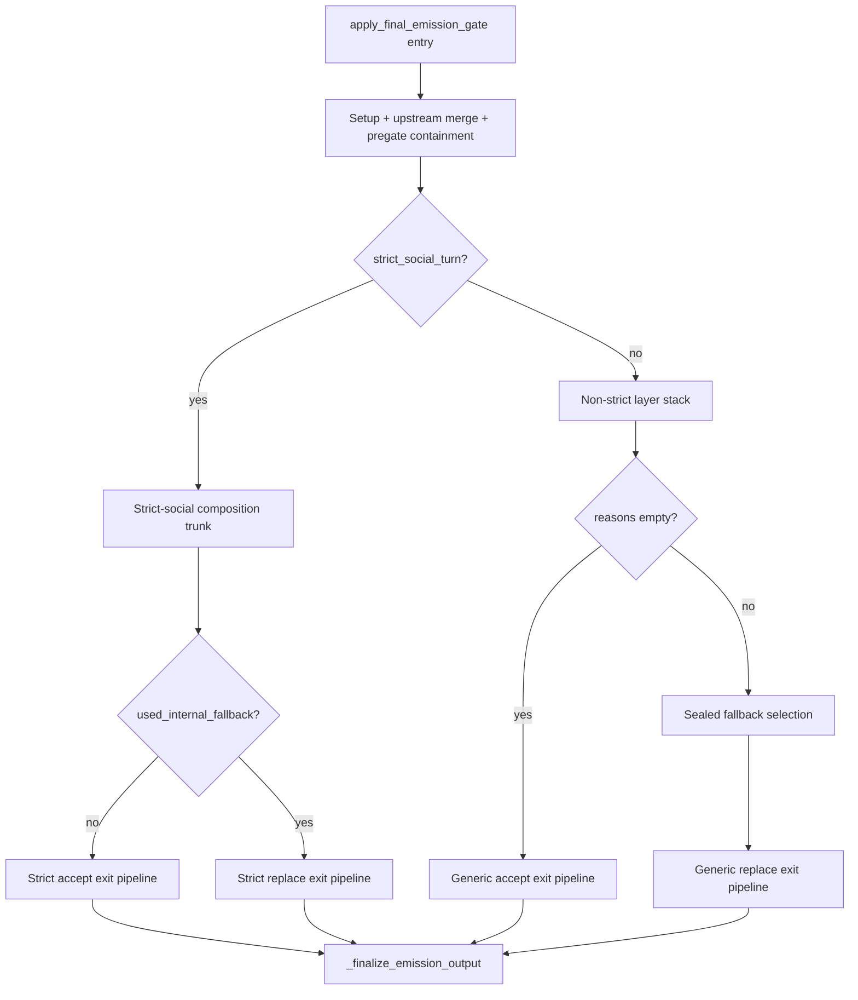

# Cycle AN — Gate Orchestration Decomposition Recon

Date: 2026-06-02

## Executive summary

`apply_final_emission_gate()` in `game/final_emission_gate.py` is the canonical **orchestration owner** for final player-facing emission. It spans **lines 8213–9778** (~**1,566 lines**, ~17.5% of the 8,968-line module). The function is not a thin router: it owns strict-vs-generic branching, four distinct exit pipelines, layer sequencing, FEM assembly, and all `_finalize_emission_output` calls.

Prior cycles (J, O, AA, AF–AI) already extracted validators, repairs, meta projection, sealed selectors, upstream provenance containment, and opening/visibility adapters. **Cycle AN** should shrink **orchestration inside `apply_final_emission_gate` only** — not re-move ownership modules or replay projection.

**Safest first decomposition target (AN1):** extract the **gate entry / preflight block** (lines ~8228–8367) into a private helper such as `_initialize_gate_execution_context(...)`. It is setup-only (no route decisions beyond strict-social suppression), has clear inputs/outputs, and replay risk is **low** if the helper returns a structured context object without reordering side effects.

**Second target (AN2):** extract the **repeated FEM layer-meta merge block** (~8743–8757 and three near-identical copies) into `_merge_gate_layer_metas_into_fem(...)`. Pure packaging, fixed call order, no branch authority.

---

## 1. Locate `apply_final_emission_gate()`

| Attribute | Value |
|-----------|-------|
| **File** | `game/final_emission_gate.py` |
| **Line range** | **8213–9778** (inclusive) |
| **Approx. size** | ~1,566 lines |
| **Public signature** | `(gm_output, *, resolution, session, scene_id, scene=None, world=None) -> Dict[str, Any]` |
| **Module `def` count** | 100 functions in file; ~82 helpers live **outside** the main entry |
| **Finalize delegate** | All four exit paths call `_finalize_emission_output` (defined at **4388–4488**) |

### Documented layer order (module comment, lines 8203–8210)

Non–strict-social trunk:

`response_type → answer_completeness → response_delta → social_response_structure → narrative_authenticity → tone → narrative_authority → anti_railroading → context_separation → narration_purity → answer_shape_primacy → scene_state_anchor → fast_fallback_neutral_composition → interaction_continuity (validate_only) → fallback_behavior → narrative_mode_output → visibility → referent_clarity → acceptance_quality → interaction_continuity validation attach → finalize`

Strict-social path runs a parallel but related stack inside `if strict_social_turn:` before the generic trunk is reached.

### Major internal sections (within `apply_final_emission_gate`)

| Section | Lines (approx.) | Role |
|---------|-----------------|------|
| Early guard + policy materialization | 8228–8234 | Non-dict return; copy `gm_output`; `materialize_response_policy_bundle`; turn-packet cache |
| Upstream prepared merge | 8235–8245 | `merge_upstream_prepared_emission_into_gm_output`; opening fallback attach |
| Pre-gate text + tags | 8246–8248 | `_normalize_text`; tag list |
| Strict-social routing / suppression | 8250–8303 | `effective_strict_social_resolution_for_emission`; suppression branch + sanitizer re-run |
| Interaction / resolution metadata | 8305–8316 | `inspect_interaction_context`; `res_kind`, `social_ic`, `npc_id_for_meta` |
| Telemetry + pregate containment | 8318–8337 | `record_final_emission_gate_entry`; `_apply_upstream_fallback_pregate_containment`; stage diff |
| Layer meta initialization | 8338–8367 | Empty meta dicts; strict-social flags; `retry_output` |
| **Branch A: strict-social trunk** | 8369–9108 | Full strict-social composition + accept/replace sub-branches |
| **Branch B: non-strict trunk** | 9110–9778 | Generic layer stack + accept/replace sub-branches |
| Strict-social accept exit | 8684–8903 | FEM accept assembly + terminal enforcement + finalize |
| Strict-social replace exit | 8905–9108 | FEM replace assembly + terminal enforcement + finalize |
| Generic accept exit | 9402–9563 | FEM accept + terminal enforcement + opening reassert + finalize |
| Generic replace exit | 9565–9778 | Sealed fallback selection + FEM replace + terminal enforcement + finalize |

### Nested / locally scoped logic

No nested `def` inside `apply_final_emission_gate`. All logic uses module-level helpers or imported functions. Local variables with orchestration authority include:

- `strict_social_turn`, `eff_resolution`, `coercion_reason`, `pre_gate_text`
- `reasons` (generic reject accumulator)
- `details` (strict-social builder output)
- `accepted_scene_opening_text` (generic accept replay guard)
- `nmo_fem_trace_override` (generic replace NMO trace carry-forward)
- Layer meta dicts: `ac_layer_meta`, `rd_layer_meta`, … `ffnc_layer_meta`

### Nearby helpers already used by the gate (same file, outside main entry)

| Helper | Lines | Used for |
|--------|-------|----------|
| `_finalize_emission_output` | 4388–4488 | Packaging-only finalize; all exits |
| `_apply_upstream_fallback_pregate_containment` | 4322–4324 | Thin wrapper → `fallback_provenance_debug` |
| `_finalize_upstream_fallback_overwrite_containment` | 4326–4334 | Called from finalize |
| `_final_emission_fast_path_eligible` | 4264+ | Fast-path skip |
| `_enforce_response_type_contract` | 3636+ | RT accept/repair/replace |
| `_select_non_strict_replace_path_terminal_sealed_fallback_selection` | 316+ | Generic replace terminal selection |
| `_apply_visibility_enforcement` | 6969+ | Late visibility hard-replace |
| `_apply_acceptance_quality_n4_floor_seam` | 7942–8035 | N4 floor |
| `_narrative_mode_output_legality_assessment` | 8038+ | C4 NMO |
| `_reassert_scene_opening_accepted_candidate` | 8158–8177 | Opening replay preservation |
| `_merge_opening_upstream_prepare_attach_observability_into_response_type_debug` | 8187–8200 | Opening attach telemetry |
| `_merge_narration_constraint_debug_into_outputs` | 672–715 | Debug projection attach |
| In-module `_apply_*_layer` functions | 1103–~8200 | Tone, NA, AR, CS, purity, ASP, SSA, FFNC |

### Delegated modules (imported, not in main entry body)

- `game.final_emission_repairs` — `_apply_answer_completeness_layer`, `_apply_response_delta_layer`, etc.
- `game.final_emission_meta` — `infer_accept_path_final_emitted_source`, FEM merges, opening projection
- `game.social_exchange_emission` — strict-social build, coercion, emergency lines
- `game.fallback_provenance_debug` — provenance containment (AA1 complete; gate retains thin wrappers)
- `game.final_emission_sealed_fallback` — sealed branch assembly via `_select_non_strict_*`
- `game.acceptance_quality` — N4 seam via `_apply_acceptance_quality_n4_floor_seam`
- `game.turn_packet` — `get_turn_packet` at entry

---

## 2. Orchestration phase map

Phases follow **actual execution order** inside `apply_final_emission_gate`.

### Phase 1 — Setup / normalization (8228–8248)

- Copy input; materialize response policy bundle
- Attach `_gate_turn_packet_cache` (popped in finalize)
- Merge upstream prepared emission; maybe attach opening fallback payload
- Capture `pre_gate_text` and normalized tags

**Side effects:** mutates `out` in place.

### Phase 2 — Policy / authority resolution (8250–8316)

- Resolve effective strict-social resolution and route flags
- Optionally suppress strict-social for non-native narration beat (re-sanitize text)
- Derive `active_interlocutor`, `res_kind`, `social_ic`, `npc_id_for_meta`

**Side effects:** may flip `strict_social_turn`, rewrite `pre_gate_text` and `out["player_facing_text"]`.

### Phase 3 — Fallback handling (pregate) (8318–8337)

- Record gate entry telemetry
- `_apply_upstream_fallback_pregate_containment` — may restore upstream selector text
- Refresh `text` from normalized player-facing field

**Replay sensitivity:** **medium** — Block I containment restores selector snapshots on fingerprint drift.

### Phase 4 — Layer state initialization (8338–8367)

- Initialize `response_type_debug` and all layer meta dicts
- Set strict-social/coercion/retry flags
- Initialize `reasons`, `scene_emit_integrity_bundle`, dialogue-plan trace slots

### Phase 5a — Strict-social composition trunk (8369–8660) *(strict branch only)*

1. Dialogue-plan invariant enforcement
2. `build_final_strict_social_response`
3. Emergency RT fallback if candidate fails
4. `_enforce_response_type_contract`
5. Scene emit integrity assessment
6. Layer stack: AC → AEP → RD → SRS → NAT → TE → NA → **speaker enforcement** → AR → CS → purity → ASP → SSA → FFNC
7. Dialogue-plan subtractive strip guards
8. Emission-debug merges for SSA/TE/NA/AR/CS/purity/ASP/conversational memory
9. `infer_accept_path_final_emitted_source`

### Phase 5b — Non-strict layer stack (9110–9393) *(generic branch only)*

1. Banned stock phrase + passive-scene-pressure pre-checks → `reasons`
2. `_enforce_response_type_contract`
3. Scene-opening accept promotion (`accepted_scene_opening_text`)
4. Scene emit integrity
5. Same layer ordering as documented trunk (AC through FFNC), accumulating `reasons`
6. IC validate-only step
7. Fallback behavior layer
8. NMO pre-assessment → may set `nmo_fem_trace_override`

### Phase 6 — Route decision

| Branch | Condition | Lines |
|--------|-----------|-------|
| Strict accept | `strict_social_turn` and not `details.used_internal_fallback` | 8684 |
| Strict replace | `strict_social_turn` and `details.used_internal_fallback` | 8905 |
| Generic accept | not `strict_social_turn` and not `reasons` | 9402 |
| Generic replace | not `strict_social_turn` and `reasons` | 9565 |

Generic replace selects sealed fallback via `_select_non_strict_replace_path_terminal_sealed_fallback_selection` (**9574**).

### Phase 7 — Metadata construction (per exit path)

Each path builds `out[FINAL_EMISSION_META_KEY]` with route-specific keys:

- **Accept:** `final_route=accept_candidate`, `candidate_validation_passed=True`
- **Replace:** `final_route=replaced`, tags `final_emission_gate_replaced`, rejection samples, sealed-family stamps (strict/generic differ)

Then shared sub-phase:

- `_flag_non_hostile_escalation_from_writer_pregate`
- Second-pass `_apply_answer_exposition_plan_layer` on finalized text
- `_merge_response_type_meta` + 13 layer meta merges into FEM

### Phase 8 — Validation / assertions (terminal pipeline, all exits)

Order is **invariant** across paths (with path-specific skips):

1. `_strict_social_terminal_grounded_speaker_first_mention_exemption_entity_id` (when applicable)
2. `_apply_visibility_enforcement`
3. Strict-only: IC validate-only + optional emergency patch; `_apply_fallback_behavior_layer`
4. `_apply_referent_clarity_pre_finalize`
5. `_narrative_mode_output_legality_assessment` (+ strict emergency replace on fail)
6. `_apply_acceptance_quality_n4_floor_seam`
7. `_attach_interaction_continuity_validation`
8. `_merge_narration_constraint_debug_into_outputs`

**Documented ordering locks:** N4 before IC attach (`test_acceptance_quality_n4_runs_before_interaction_continuity_attachment`); visibility before N4 on accept/replace paths (Block AG snapshots).

### Phase 9 — Replay projection / preservation

- Generic accept: `_reassert_scene_opening_accepted_candidate` before finalize (**9551–9555**)
- Generic accept finalize: passes `accepted_scene_opening_text` to `_finalize_emission_output`
- Finalize: `_reassert_scene_opening_accepted_candidate` again (**4476–4480**)
- Provenance: `realign_fallback_provenance_selector_to_current_text` after FFNC repair (strict **8606**, generic **9296**)

### Phase 10 — Diagnostics / failure handling

- `log_final_emission_decision` at route decision points
- `log_final_emission_trace` before finalize
- `debug_notes` append on replace paths
- Tag mutation on replace paths
- `assert_final_emission_mutation_allowed` at mutation seams

### Phase 11 — Final emission assembly / return

All paths:

```python
return _finalize_emission_output(
    out,
    pre_gate_text=pre_gate_text,
    fast_path=_final_emission_fast_path_eligible(out),
    scene_emit_integrity_bundle=scene_emit_integrity_bundle,
    # accepted_scene_opening_text=...  # generic accept only
)
```

`_finalize_emission_output` performs sanitize, strip-only route-illegal stock removal, upstream overwrite containment re-seal, channel projection (`project_public_payload`), and pops `_gate_turn_packet_cache`.

---

## 3. Decomposition candidates

| # | Proposed helper | Current line range | Inputs | Outputs | Side effects | Ownership boundary | Replay risk if mishandled | Risk |
|---|-----------------|-------------------|--------|---------|--------------|-------------------|---------------------------|------|
| AN1a | `_initialize_gate_execution_context` | 8228–8367 | `gm_output`, `resolution`, `session`, `scene_id`, `world` | Context dataclass/dict: `out`, `pre_gate_text`, `tag_list`, routing flags, layer meta shells, `sid`, etc. | Mutates `out` (expected) | Gate orchestration; delegates upstream merge to `upstream_response_repairs` | **Medium** if suppression/containment order changes | **Low** |
| AN1b | `_apply_strict_social_suppression_if_needed` | 8271–8303 | routing inputs, `pre_gate_text`, `out` | Updated flags, text, `eff_resolution`, `coercion_reason` | Sanitizer rewrite | `social_exchange_emission` policy | **Medium** | **Low–medium** |
| AN2 | `_merge_gate_layer_metas_into_fem` | 8743–8757 (+ copies at 8994–9008, 9473–9487, 9687–9700) | `fem` dict, all layer metas, `response_type_debug` | None | FEM field writes | `final_emission_meta` merge helpers | **Low** (metadata only) | **Low** |
| AN3 | `_build_gate_accept_fem_base` | 8700–8726 (+ generic 9440–9457) | route context, `details`, dialogue trace | FEM dict fragment | None until assigned | Gate FEM assembly | **Medium** | **Low–medium** |
| AN4 | `_build_gate_replace_fem_base` | 8949–8978, 9636–9665 | replace context, `sealed_selection` / `details` | FEM dict fragment | Tag/debug_notes elsewhere | Gate + sealed/opening meta | **Medium** | **Medium** |
| AN5 | `_run_gate_terminal_enforcement_pipeline` | ~8758–8896, ~9009–9101, ~9488–9550, ~9701–9766 | `out`, path profile (`strict_accept` / `strict_replace` / `generic_accept` / `generic_replace`), layer metas | Mutated `out` | Text replace, FEM patches, tags | Gate orchestrates; visibility/N4/IC owned by respective modules | **High** | **Medium–high** |
| AN6 | `_run_strict_social_composition_trunk` | 8369–8660 | pre-gate context | `text`, `details`, layer metas, traces | Extensive text mutation | `social_exchange_emission` + in-gate layers | **High** | **High** |
| AN7 | `_run_non_strict_layer_stack` | 9110–9393 | context, `reasons` list | `text`, layer metas, `reasons`, NMO override | Text mutation | Layer modules via repairs | **High** | **Medium–high** |
| AN8 | `_run_strict_social_accept_exit` / `_run_strict_social_replace_exit` | 8684–8903 / 8905–9108 | composed state | return via finalize | Full exit | Gate | **High** | **High** |
| AN9 | `_run_generic_accept_exit` / `_run_generic_replace_exit` | 9402–9563 / 9565–9778 | layer stack state | return via finalize | Sealed selection on replace | Gate + `final_emission_sealed_fallback` | **High** | **High** |

**Not recommended as first extractions:** AN5–AN9 (terminal pipeline and branch exits) until AN1–AN2 prove byte-stable via tests.

---

## 4. “Do not move” regions

These must remain **visible in `apply_final_emission_gate`** (or as single sequential calls whose order is obvious at the top level):

| Region | Lines | Reason |
|--------|-------|--------|
| Top-level branch fork | 8369 (`if strict_social_turn`) / 9109 (generic trunk) | Owns strict vs generic sequencing authority |
| Accept vs replace decisions | 8684 (`if not details.get("used_internal_fallback")`), 9395 (`candidate_ok = not bool(reasons)`) | Controls public `final_route` contract |
| Non-strict sealed fallback selection call | 9574–9593 | Terminal prose selection order; ties to Block AG/AI snapshots |
| Layer stack call order (both trunks) | 8446–8571, 9157–9293 | Documented canonical ordering; ownership registry cites this file |
| All four `return _finalize_emission_output(...)` | 8898, 9103, 9557, 9773 | Public packaging boundary; channel projection |
| `_apply_upstream_fallback_pregate_containment` call site | 8324 | Must run before layer stack; stage-diff telemetry coupling |
| Opening accept promotion + reassert hooks | 9136–9143, 9551–9555 | Replay determinism for scene-opening |
| `infer_accept_path_final_emitted_source` call sites | 8664, 9404 | Precedence owned by `final_emission_meta`; call **after** layer metas populated |
| Strict-social emergency RT fallback block | 8414–8437 | High-risk fallback authorship |
| NMO strict emergency replace | 8842–8864 | Hard replace policy |

**Already delegated — do not re-home in AN:** validators (`final_emission_validators`), repair wiring (`final_emission_repairs`), replay projection (`final_emission_replay_projection`), provenance containment implementation (`fallback_provenance_debug`).

---

## 5. Existing test map

### Primary direct owner (~100 tests)

**`tests/test_final_emission_gate.py`** — declared direct owner for `final_emission_gate_orchestration` in `tests/test_ownership_registry.py`.

Representative coverage:

| Concern | Example tests |
|---------|---------------|
| Layer ordering | `test_apply_final_emission_gate_runs_response_type_then_continuity_then_fallback`, `test_apply_final_emission_gate_runs_response_delta_before_speaker_enforcement`, `test_non_strict_runs_answer_completeness_and_response_delta_before_scene_state_anchor` |
| Strict-social path | `test_apply_final_emission_gate_strict_social_contract_missing_skips_tightening`, `test_block_d_strict_social_continuity_hard_fallback_applies_sealed_line`, Block B/E/F speaker tests |
| N4 / IC ordering | `test_acceptance_quality_n4_runs_before_interaction_continuity_attachment`, `test_acceptance_quality_n4_replace_path_reruns_seam_on_fallback_and_fem_terminal` |
| Referent pre-finalize (4 exits) | `test_referent_clarity_pre_finalize_four_gate_exit_paths_all_use_same_hook` |
| Sealed selectors / Block AG–AI | `test_sealed_branch_order_*`, `test_block_ai_block_ag_selector_order_snapshots_remain_entrypoints`, selector snapshot tests ~4691–5328 |
| Opening / upstream prepared | `test_canonical_missing_curated_facts_upstream_prepared_payload_still_wins`, `test_fail_closed_sealed_gate_missing_curated_facts_records_fem` |
| Finalize / containment | `test_finalize_emission_output_post_containment_reseals_appended_stock` |
| FEM / metadata | `test_final_gate_plain_valid_candidate_has_source_without_fallback_family`, scene-state-anchor merge tests |

### Fallback / provenance

| File | Focus |
|------|-------|
| `tests/test_fallback_overwrite_containment.py` | Block I pregate/finalize containment via full gate |
| `tests/test_fallback_behavior_gate.py` | Fallback behavior at gate boundary |
| `tests/test_fallback_behavior_repairs.py` | Downstream consumer of gate output |
| `tests/test_final_emission_sealed_fallback.py` | Sealed branch helpers |
| `tests/test_final_emission_opening_fallback.py` | Opening adapter (22 tests) |
| `tests/test_opening_fallback_owner_bucket.py` | Opening ownership buckets |

### Replay / golden

| File | Focus |
|------|-------|
| `tests/test_golden_replay.py` | Full-pipeline and direct-seam invariants; imports `apply_final_emission_gate`; owner-bucket projection |
| `tests/helpers/final_emission_gate_fixtures.py` | Shared gate fixtures for golden/direct seams |
| `tests/helpers/golden_replay.py` | Replay observation / lineage |

Golden cases touching gate behavior (non-exhaustive):

- `test_golden_direct_seam_declared_alias_dialogue_plan_structural_invariants`
- `test_golden_replay_thin_answer_action_outcome_final_emission_structural_invariants`
- `test_golden_replay_sanitizer_scaffold_leakage_structural_invariants`
- `test_golden_direct_seam_canonical_opening_fallback_path_has_no_compatibility_local_ownership`
- `test_golden_replay_wrong_speaker_strict_social_emission_structural_invariants`
- `test_golden_replay_frontier_gate_*` (25-turn stability)

### Downstream / indirect

| File | Relationship |
|------|--------------|
| `tests/test_ownership_registry.py` | Registry locks gate orchestration owner |
| `tests/test_final_emission_meta.py` | FEM projection / lineage (read-side) |
| `tests/test_final_emission_visibility_fallback.py` | Visibility replace payloads |
| `tests/test_acceptance_quality.py` | N4 seam |
| `tests/test_c4_narrative_mode_live_pipeline.py` | NMO through gate |
| `tests/test_answer_completeness_rules.py` | AC via gate |
| `tests/test_api_narration_path_selection.py` | Spies gate in API path |
| `tests/test_social_exchange_emission.py` | Strict-social matrices (adjacent) |
| `tests/test_failure_classification_contract.py` | Observes `final_emitted_source` |

### Fixtures / manifests

- `tests/helpers/final_emission_gate_fixtures.py`
- `tests/helpers/opening_fallback_evidence.py`
- `codex_pytest_tmp/test_golden_replay_*` ( ephemeral; not committed )

---

## 6. Missing guard tests (recommend before decomposition)

Do **not** implement in Cycle AN recon — record for pre-refactor hardening:

1. **Public signature freeze** — `inspect.signature(apply_final_emission_gate)` param names/defaults/kwargs-only (`*`) unchanged across AN passes.
2. **Entry-phase ordering lock** — source-order test that `merge_upstream_prepared_emission_into_gm_output` → `maybe_attach_upstream_prepared_opening_fallback_payload` → `_apply_upstream_fallback_pregate_containment` → strict-social branch precedes any `_enforce_response_type_contract` (both trunks).
3. **Terminal pipeline order snapshot** — extend Block AG style: assert `_apply_visibility_enforcement` → `_apply_referent_clarity_pre_finalize` → `_apply_acceptance_quality_n4_floor_seam` → `_attach_interaction_continuity_validation` source order within each of the four exit blocks (today only N4-vs-IC and visibility-vs-N4 partially covered).
4. **Four-path byte-stable harness** — minimal fixed inputs per exit path (`strict_accept`, `strict_replace`, `generic_accept`, `generic_replace`) asserting exact `player_facing_text`, `final_route`, `final_emitted_source`, and tag set (golden covers some but not as a compact decomposition guard).
5. **FEM merge order lock** — test that `_merge_gate_layer_metas_into_fem` (once extracted) calls child merges in the same order as inline code (response_type before AC before … before FFNC).
6. **Context helper purity** — AN1 helper returns all downstream-needed fields; no hidden reads of closure state after extraction.

---

## 7. Proposed decomposition sequence

| Pass | Scope | Files likely touched | Tests to run | Rollback risk | Depends on |
|------|-------|---------------------|--------------|---------------|------------|
| **AN1** | Extract gate entry + preflight into `_initialize_gate_execution_context` (8228–8367); main entry becomes unpack + branch | `game/final_emission_gate.py` | `pytest tests/test_final_emission_gate.py tests/test_fallback_overwrite_containment.py -q` | Low | — (independent) |
| **AN2** | Extract `_merge_gate_layer_metas_into_fem` (4 duplicate blocks) | `game/final_emission_gate.py` | Same + `tests/test_final_emission_meta.py -q` | Low | — (independent) |
| **AN3** | Extract `_build_gate_accept_fem_base` / `_build_gate_replace_fem_base` (reduce FEM dict duplication) | `game/final_emission_gate.py` | Gate suite + `tests/test_failure_classification_contract.py -q` | Low–medium | AN2 optional |
| **AN4** | Extract `_run_non_strict_layer_stack` (9110–9393) | `game/final_emission_gate.py` | Gate ordering tests + `tests/test_answer_completeness_rules.py -q` | Medium | AN1 |
| **AN5** | Extract `_run_strict_social_composition_trunk` (8369–8660) | `game/final_emission_gate.py`, possibly touch imports only in `social_exchange_emission` | Gate strict-social tests + `tests/test_social_exchange_emission.py -q` + golden strict-social seams | **High** | AN1 |
| **AN6** | Extract `_run_gate_terminal_enforcement_pipeline` with explicit path profile enum | `game/final_emission_gate.py` | Gate suite + referent/visibility/N4 ordering tests + `tests/test_golden_replay.py -k "direct_seam or thin_answer or wrong_speaker" -q` | **Medium–high** | AN2, AN3 |
| **AN7** | Extract four exit wrappers (`_run_*_exit`) leaving main entry as ~80-line router | `game/final_emission_gate.py` | Full gate + golden canonical baseline | **High** | AN4–AN6 |

**Recommended implementation order:** AN1 → AN2 → AN3 → AN6 → AN4 → AN5 → AN7 (defer high-risk strict-social trunk until terminal pipeline extraction pattern is proven).

**Full validation command (post each pass):**

```text
.\.venv\Scripts\python.exe -m pytest tests/test_final_emission_gate.py tests/test_fallback_overwrite_containment.py tests/test_golden_replay.py -q --tb=short
```

---

## 8. Baseline test run (recon)

Executed during recon:

```text
.\.venv\Scripts\python.exe -m pytest tests/test_final_emission_gate.py tests/test_fallback_overwrite_containment.py -q --tb=line
```

**Result:** all tests passed (~169 tests, ~4s).

---

## 9. Files to provide ChatGPT (minimum set)

For implementation block generation in AN1+, provide:

### Core gate

1. `game/final_emission_gate.py` — focus lines **8213–9778** (+ `_finalize_emission_output` 4388–4488 for exit contract)

### Helper modules referenced by orchestration

2. `game/final_emission_repairs.py` — layer `_apply_*` wiring
3. `game/final_emission_meta.py` — FEM merges, `infer_accept_path_final_emitted_source`
4. `game/final_emission_sealed_fallback.py` — non-strict replace selection
5. `game/social_exchange_emission.py` — strict-social build/coercion
6. `game/fallback_provenance_debug.py` — Block I containment
7. `game/final_emission_boundary_contract.py` — mutation assertions
8. `game/upstream_response_repairs.py` — upstream prepared merge hooks

### Tests

9. `tests/test_final_emission_gate.py` — primary orchestration owner
10. `tests/test_fallback_overwrite_containment.py` — provenance containment
11. `tests/test_ownership_registry.py` — registry locks (grep `final_emission_gate_orchestration`)
12. `tests/helpers/final_emission_gate_fixtures.py` — fixtures

### Replay / golden (selective)

13. `tests/test_golden_replay.py` — direct-seam cases only if touching exits
14. `tests/helpers/golden_replay.py` — projection helpers

### Recon / governance artifacts

15. `docs/cycles/cycle_an_gate_orchestration_decomposition_recon.md` (this file)
16. `docs/final_emission_gate_reduction_plan.md` — sealed selector inventory
17. `docs/cycles/cycle_aa_gate_authority_extraction_closure_2026-05-31.md` — prior extraction boundaries

### Optional (AN5+ only)

18. `game/final_emission_opening_fallback.py`
19. `game/final_emission_visibility_fallback.py`
20. `game/acceptance_quality.py`

---

## Appendix A — Main entry structural diagram



## Appendix B — File metrics

| Metric | Value |
|--------|-------|
| `game/final_emission_gate.py` total lines | 8,968 |
| `apply_final_emission_gate` lines | ~1,566 |
| `_finalize_emission_output` lines | ~101 |
| `tests/test_final_emission_gate.py` test functions | ~100 |
| Prior recon references | `cycle_aa_gate_authority_extraction_recon_2026-05-31.md`, `cycle_o_final_emission_gate_contraction_recon_2026-05-28.md` |
