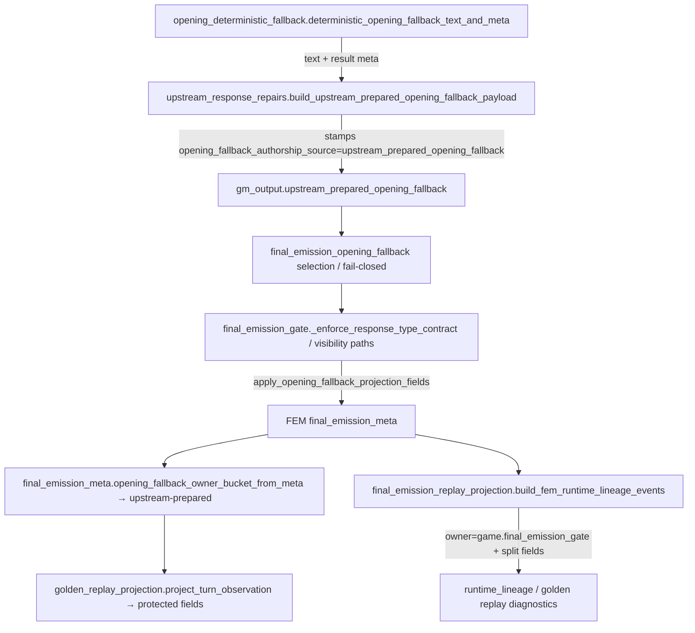

# Cycle AP — Fallback Authorship Resolution Recon

**Date:** 2026-06-03  
**Scope:** Repository reconnaissance only. No runtime behavior, tests, fixtures, or schemas were changed.

**Prior art:** [Cycle I fallback authorship recon](cycle_i_fallback_authorship_recon_2026-05-25.md), [Cycle P fallback family collapse](cycle_p_fallback_family_collapse_recon_2026-05-28.md), [Cycle AB fallback topology collapse recon](cycle_ab_fallback_topology_collapse_recon_2026-05-31.md), [Cycle AJ opening fallback metadata consolidation recon](cycle_aj_opening_fallback_metadata_consolidation_recon_2026-06-02.md), [Cycle AM fallback adapter retirement recon](cycle_am_fallback_adapter_retirement_recon_2026-06-02.md).

---

## A. Executive Summary

- **Fallback authorship is split across three parallel vocabularies:** governed `realization_fallback_family` (9 families in `game/realization_authority.py`), diegetic `fallback_family_used` / `fallback_temporal_frame` (`game/diegetic_fallback_narration.py`), and replay/runtime `fallback_kind` + owner buckets (`game/final_emission_replay_projection.py`, `game/final_emission_meta.py`). Topology contraction (AB/AM) reduced route breadth; authorship ambiguity persists in how these vocabularies relate.
- **Opening fallback has the clearest content vs selection split:** prose is composed in `game/opening_deterministic_fallback`, packaged in `game/upstream_response_repairs`, selected in `game/final_emission_opening_fallback` / gate, with `opening_fallback_authorship_source="upstream_prepared_opening_fallback"` and bucket `upstream-prepared`. Runtime lineage already projects additive `fallback_selection_owner` / `fallback_content_owner` for opening (Cycle P).
- **The highest-rated ambiguity seam is compatibility-local authorship residue:** `compatibility_local_opening_deterministic` is defined in `tests/helpers/opening_fallback_evidence.py`, mapped to `unknown-ambiguous` in `game/final_emission_meta.opening_fallback_owner_bucket_from_fields`, and guarded by negative golden tests — but **never assigned in production `game/` code**. The seam is observational: read-side mappers and test vocabulary still carry a retired path.
- **Owner-bucket assignment is intentionally distributed:** opening buckets in `final_emission_meta`, sealed buckets in `final_emission_sealed_fallback`, visibility buckets in `final_emission_visibility_fallback.classify_visibility_fallback_owner_bucket`. Each is read-side or stamp-time; no single owner-bucket registry.
- **Write-time authorship stamping still spans multiple sites:** upstream composition meta (`build_upstream_prepared_opening_composition_meta`), gate RT debug merge (`final_emission_gate._enforce_response_type_contract`), fail-closed meta factories (`final_emission_opening_fallback._opening_fail_closed_meta_*`), and sanitizer trace split fields (`output_sanitizer`). AJ1 centralized `build_opening_fallback_result_meta` but authorship is stamped separately at packaging/selection boundaries.
- **Runtime lineage `owner` means selector/application owner** (documented in `game/runtime_lineage_telemetry.py` and `game/final_emission_replay_projection.py`). Content provenance rides on `fallback_authorship_source`, `fallback_owner_bucket`, and split-owner fields. This is intentional post–Cycle P but not uniform across all fallback families (sanitizer strict-social still lacks split fields on lineage events).
- **Upstream fast fallback provenance lives in a temporary debug module** (`game/fallback_provenance_debug.py`) that fingerprints text and projects `fallback_provenance_trace` into FEM; ownership is API/GM selector with gate containment — weak permanent authorship anchor.
- **Replay metadata is heavily protected:** 41 protected observation paths in `tests/helpers/golden_replay_projection.py` include `opening_fallback_authorship_source`, `opening_fallback_owner_bucket`, `sealed_fallback_owner_bucket`, `visibility_fallback_owner_bucket`, `fallback_family`, `final_emitted_source`. Golden replay treats runtime lineage as diagnostic-only (no drift classification from lineage owner mismatch).
- **Most likely ambiguity seam for AP:** reconciliation of **compatibility-local read-side inference**, **dual family stamps** (`realization_fallback_family` vs `fallback_family_used`), and **incomplete split-owner projection** for sealed/visibility/retry/fast-fallback families — not opening prose selection (already contracted in Cycles I/AJ).
- **Cycle AP appears safe as metadata/provenance-only contraction** when scoped to: authorship field normalization, compatibility residue retirement, owner-bucket mapper consolidation, and extended split-owner projection — **not** tuple/dataclass topology (AM), route merging (AB), or prose changes. Behavior-affecting risk rises only if authorship stamping sites are moved without byte-stable FEM output.

---

## B. File Inventory

| Path | Role | Constructs / Adapts / Emits / Asserts / Tests | Key symbols | Safe to modify in AP? |
|------|------|-----------------------------------------------|-------------|----------------------|
| `game/opening_deterministic_fallback.py` | Opening prose composer | **Constructs** result meta (via `build_opening_fallback_result_meta`); does not stamp authorship | `deterministic_opening_fallback_text_and_meta`, `OPENING_FALLBACK_EMPTY_CURATED_FACTS_MARKER` | **Medium** — meta shape only; prose frozen |
| `game/upstream_response_repairs.py` | Upstream prepared payload packager | **Constructs** authorship + composition meta | `build_upstream_prepared_opening_fallback_payload`, `OPENING_FALLBACK_AUTHORSHIP_UPSTREAM_PREPARED`, `UPSTREAM_PREPARED_OPENING_FALLBACK_KEY` | **Medium** — canonical authorship stamp site |
| `game/final_emission_opening_fallback.py` | Opening selection / fail-closed policy | **Constructs** fail-closed meta; **adapts** upstream composition meta; sets `opening_fallback_compatibility_local_disabled` | `build_opening_fallback_result_meta`, `build_upstream_prepared_opening_composition_meta`, `_opening_fail_closed_meta_*`, `select_opening_fallback_for_response_type_contract` | **Medium** — selection meta, not prose |
| `game/final_emission_gate.py` | Gate orchestration | **Mutates** RT debug authorship on opening branch; **emits** FEM via projection helpers | `_enforce_response_type_contract`, `_opening_scene_safe_fallback_selection`, `apply_opening_fallback_projection_fields` call sites | **Low–medium** — hot path; metadata merges only |
| `game/final_emission_meta.py` | FEM read-side packaging | **Assigns** owner buckets (read-side); **projects** opening fields; re-exports lineage builder | `opening_fallback_owner_bucket_from_*`, `OPENING_FALLBACK_PROJECTION_FIELDS`, `apply_opening_fallback_projection_fields`, `_OPENING_FALLBACK_AUTH_COMPATIBILITY_LOCAL` | **High value / medium risk** — bucket mapper central |
| `game/final_emission_replay_projection.py` | Read-side lineage/fallback projection | **Emits** runtime lineage events with split owners | `_fem_selected_fallback_projection`, `build_fem_runtime_lineage_events`, `OPENING_FALLBACK_*_OWNER` constants | **High value / medium risk** — projection-only |
| `game/runtime_lineage_telemetry.py` | Lineage event envelope | **Defines** attribution field vocabulary | `RUNTIME_LINEAGE_FALLBACK_ATTRIBUTION_FIELDS`, `make_runtime_lineage_event` | **Low** — vocabulary/docs |
| `game/final_emission_sealed_fallback.py` | Sealed terminal selection | **Assigns** `sealed_fallback_owner_bucket`; stamps realization family | `stamp_sealed_fallback_realization_family`, `SEALED_FALLBACK_OWNER_*` | **Medium** |
| `game/final_emission_visibility_fallback.py` | Visibility fallback routing | **Assigns** `visibility_fallback_owner_bucket` via classifier | `classify_visibility_fallback_owner_bucket`, `stamp_visibility_fallback_metadata` | **Medium** |
| `game/final_emission_validators.py` | Validator debug defaults | **Copies** opening authorship/debug keys into validator surfaces | opening fallback debug key defaults | **Low** — mirror only |
| `game/diegetic_fallback_narration.py` | Diegetic taxonomy | **Classifies** template → `fallback_family_used` | `fallback_template_metadata`, `_FALLBACK_TEMPLATE_METADATA` | **Low** — not authorship owner |
| `game/realization_authority.py` | Governed family registry | **Defines** family owner profiles | `FALLBACK_FAMILIES`, `FallbackFamily` | **Low** — registry only |
| `game/realization_provenance.py` | Family stamp normalizer | **Stamps** `realization_fallback_family` | `attach_realization_fallback_family`, family constants | **Low–medium** |
| `game/social_exchange_emission.py` | Strict-social prose owner | **Constructs** social fallback lines + family stamps | `deterministic_social_fallback_line`, `minimal_social_emergency_fallback_line` | **Low** — content owner, not AP target |
| `game/output_sanitizer.py` | Sanitizer fallback selection | **Emits** split-owner trace fields | `sanitizer_empty_fallback_owner`, `sanitizer_strict_social_selection_owner`, `sanitizer_strict_social_prose_owner` | **Medium** — model pattern for AP |
| `game/fallback_provenance_debug.py` | Upstream fast fallback debug | **Constructs** `fallback_provenance` metadata; **emits** `fallback_provenance_trace` to FEM | `attach_upstream_fast_fallback_provenance`, `record_final_emission_gate_entry/exit` | **Medium** — temporary ownership seam |
| `game/fallback_behavior.py` | Policy contract | Not authorship; repair classification | validators consumed by gate | **No** |
| `game/gm_retry.py` | Retry terminal selector | **Selects** retry fallback; family metadata | `select_deterministic_retry_fallback_line`, `force_terminal_retry_fallback` | **Low** |
| `game/api.py` | Fast fallback attachment | **Triggers** upstream fast fallback provenance | `_fast_fallback_for_upstream_error` | **Low** |
| `game/final_emission_boundary_contract.py` | Mutation taxonomy | **Registers** `compose_opening_fallback_compatibility_local` as semantic-disallowed | boundary registry | **Safe** — doc/registry cleanup |
| `tests/helpers/opening_fallback_evidence.py` | Test fixtures | **Constructs** canonical FEM/observed evidence | `OPENING_FALLBACK_AUTHORSHIP_COMPATIBILITY_LOCAL`, `successful_opening_fem_meta` | **High** — AP1 target |
| `tests/helpers/golden_replay_projection.py` | Replay observation | **Projects** protected authorship/bucket fields | `PROTECTED_OBSERVATION_FIELDS`, `project_turn_observation` | **Replay-protected** — values must stay stable |
| `tests/helpers/golden_replay.py` | Golden replay harness | **Asserts** authorship invariants | observed turn assembly | **Replay-protected** |
| `tests/test_opening_fallback_owner_bucket.py` | Owner bucket contract | **Asserts** read-side mapping | bucket mapping tests | **Must remain stable** for bucket values |
| `tests/test_final_emission_meta.py` | FEM + lineage projection | **Asserts** split-owner lineage shape | `test_build_fem_runtime_lineage_events_projects_opening_*` | **Shape assertions** — bucket values protected |
| `tests/test_golden_replay.py` | Protected replay scenarios | **Asserts** authorship + buckets + negative compatibility-local | opening/sealed/visibility golden tests | **Must remain stable** for protected field values |
| `tests/test_final_emission_opening_fallback.py` | Opening adapter contract | **Asserts** meta composition, fail-closed, no local compose | adapter unit tests | **Behavior + meta** |
| `tests/test_upstream_response_repairs.py` | Prepared payload contract | **Asserts** authorship source on packaging | upstream prepared opening tests | **Authorship stamp** |
| `tests/test_realization_provenance.py` | Family stamp contract | **Asserts** normalization | family attach tests | **Low** |
| `tests/test_fallback_overwrite_containment.py` | Fast fallback containment | **Asserts** provenance trace behavior | Block I containment | **Behavior** |
| `tests/test_runtime_lineage_telemetry.py` | Lineage vocabulary | **Asserts** event normalization + attribution fields | schema tests | **Shape** |
| `tests/test_ownership_registry.py` | Test governance registry | **Documents** direct owners for legality vs projection | responsibility records | **Governance only** |
| `tests/failure_classification_contract.py` | Classifier allowlists | **Asserts** allowed bucket values | `opening_fallback_owner_bucket` enum | **Bucket values protected** |
| `tools/realization_provenance_audit.py` | Static audit | **Reports** provenance gaps | audit tool | **Safe** |
| `tools/final_emission_ownership_audit.py` | Ownership audit | **Reports** ownership hotspots | audit tool | **Safe** |

---

## C. Current Authorship Flow

### End-to-end path (successful opening fallback)

### Where ownership first appears

| Stage | Field / signal | Owner meaning |
|-------|----------------|---------------|
| Composer | `build_opening_fallback_result_meta` (no authorship key) | Context/selection meta only |
| Upstream packaging | `opening_fallback_authorship_source="upstream_prepared_opening_fallback"` | **First explicit content authorship stamp** |
| Realization stamp | `realization_fallback_family="upstream_prepared_emission"` | Governed family (broader than diegetic) |
| Diegetic stamp | `fallback_family_used="scene_opening"` | Template classification |
| Gate selection | `opening_recovered_via_fallback=True`, `final_emitted_source="opening_deterministic_fallback"` | Selection evidence |
| Fail-closed guard | `opening_fallback_compatibility_local_disabled=True` | Proves gate-local composer off |

### Where provenance is attached

- **Upstream prepared opening:** `opening_fallback_composition_meta` merges result meta + authorship + diegetic family/frame.
- **Gate RT debug:** `_enforce_response_type_contract` sets/clears `opening_fallback_authorship_source` on debug lane.
- **Fast fallback:** `fallback_provenance_debug.attach_upstream_fast_fallback_provenance` → `metadata.fallback_provenance` → FEM `fallback_provenance_trace`.
- **Sanitizer:** trace dict with explicit selection vs prose owners (best split-owner model).
- **Sealed/visibility:** route buckets via `stamp_*_metadata` helpers; underlying prose owner varies by branch.

### Where owner_bucket is assigned

| Bucket type | Assigner | When |
|-------------|----------|------|
| `opening_fallback_owner_bucket` | `opening_fallback_owner_bucket_from_meta` (read-side) | Replay projection, classifier, golden replay |
| `sealed_fallback_owner_bucket` | `final_emission_sealed_fallback.stamp_sealed_fallback_realization_family` | Terminal replace paths |
| `visibility_fallback_owner_bucket` | `classify_visibility_fallback_owner_bucket` / `stamp_visibility_fallback_metadata` | Visibility hard replace |

### Compatibility layers

- **`_OPENING_FALLBACK_AUTH_COMPATIBILITY_LOCAL`** in `final_emission_meta` maps legacy tokens → `unknown-ambiguous`; no production writer.
- **`opening_fallback_compatibility_local_disabled: True`** stamped on all active opening paths (asserted in tests).
- **`compose_opening_fallback_compatibility_local`** in boundary contract — semantic-disallowed, no implementation.
- **Legacy tuple adapters** (AM scope) convert dataclass ↔ tuple; authorship fields pass through composition_meta unchanged.

### Final metadata emission

- FEM keys written via gate finalize path + `patch_final_emission_meta` / projection field helpers.
- Runtime lineage emitted read-side only via `build_fem_runtime_lineage_events` (import-stable from `final_emission_meta`).

### Replay metadata assertion (unchanged proof)

- **Protected field values:** golden replay scenarios lock `opening_fallback_authorship_source`, owner buckets, `fallback_family`, `final_emitted_source`.
- **Diagnostic-only lineage:** `test_golden_drift_classification_ignores_runtime_lineage_diagnostics` — lineage owner vs bucket mismatch does not fail replay.
- **Negative invariant:** canonical opening never reports `compatibility_local_opening_deterministic`.

---

## D. Ambiguity Seams

| File / symbol | Why ambiguous | Likely fix type | Risk |
|---------------|---------------|-----------------|------|
| `final_emission_meta._OPENING_FALLBACK_AUTH_COMPATIBILITY_LOCAL` | Maps tokens never emitted in production; preserves retired path in read-side | Remove compatibility authorship inference; test-only fixture token | Low |
| `tests/helpers/opening_fallback_evidence.OPENING_FALLBACK_AUTHORSHIP_COMPATIBILITY_LOCAL` vs upstream constant location | Constant lives in test helper; AB noted upstream constant unused — duplicated vocabulary | Consolidate to single test-only module; remove dead upstream constant if any | Low |
| Dual stamps: `realization_fallback_family` + `fallback_family_used` on opening | Same turn carries `upstream_prepared_emission` and `scene_opening`; frequency reads disagree | Normalize metadata shape (document precedence); do not merge without replay proof | Medium |
| `final_emission_replay_projection._fem_selected_fallback_projection` | Infers selection from FEM; `owner` always gate for opening/strict-social | Already has split fields; extend to sanitizer/sealed lineage events | Medium |
| `build_fem_runtime_lineage_events` sanitizer branch | Sanitizer events omit `fallback_selection_owner` / `fallback_content_owner` | Make ownership explicit on lineage events | Low–medium |
| `fallback_provenance_debug.py` | Module self-describes as temporary; authorship for fast fallback is fingerprint-based not family-based | Consolidate provenance shape or document as canonical fast-fallback owner | Medium |
| `final_emission_gate._enforce_response_type_contract` | Re-stamps/clears authorship on debug lane separately from upstream payload | Move ownership earlier / single write boundary | Medium |
| `classify_visibility_fallback_owner_bucket` | Routing bucket; underlying prose owner (opening/social/global) not on bucket | Consolidate owner_bucket assignment or add content_owner projection | Medium |
| `final_emission_sealed_fallback` branch assembly | All branches share `gate_terminal_repair` family; distinct `final_emitted_source` | Explicit content_owner per branch in projection | Medium |
| `gm_retry` + `diegetic_fallback_narration` | Multiple prose providers behind `retry_terminal_fallback` family | Explicit authorship on retry selection metadata | Medium |
| `runtime_lineage_telemetry` recurrence key | Uses `owner` (selector) not `fallback_content_owner` | Document only / no-op unless aggregation semantics change | Low |
| `opening_deterministic_fallback` module docstring | Still mentions gate compatibility re-call (stale post–Cycle J) | Doc-only cleanup | Low |
| `final_emission_validators` debug defaults | `opening_fallback_compatibility_local_disabled: False` default vs True on active paths | Normalize metadata shape | Low |

---

## E. Test Inventory

### Core authorship / provenance / bucket tests

| Path | Protects | Metadata shape vs behavior | Replay stability tests |
|------|----------|---------------------------|------------------------|
| `tests/test_opening_fallback_owner_bucket.py` (10) | Read-side bucket mapping | **Shape + values** | Bucket value strings must stay stable |
| `tests/test_final_emission_meta.py` (~60 total; ~15 fallback/lineage) | FEM projection, lineage split owners, opening field helpers | **Shape** for lineage; bucket via meta | Lineage split-owner constants |
| `tests/test_golden_replay.py` (65) | Protected replay scenarios, authorship negatives, bucket projection | **Values** on protected paths | `test_golden_canonical_opening_fallback_never_reports_compatibility_local_ownership`, bucket projection tests, drift ignores lineage |
| `tests/test_final_emission_opening_fallback.py` (23) | Adapter meta, fail-closed, no local compose | **Behavior + meta** | Composition meta authorship |
| `tests/test_upstream_response_repairs.py` | Prepared payload authorship stamp | **Values** | Authorship source on packaging |
| `tests/test_final_emission_gate.py` | Gate opening selection, owner bucket through output | **Behavior + meta** | Opening path integration |
| `tests/test_final_emission_sealed_fallback.py` (12) | Sealed bucket stamping | **Values** | `sealed_fallback_owner_bucket` |
| `tests/test_final_emission_visibility_fallback.py` (53) | Visibility bucket + routing | **Values** | `visibility_fallback_owner_bucket` |
| `tests/test_realization_provenance.py` (7) | Family normalization | **Shape** | Family IDs |
| `tests/test_realization_provenance_audit.py` (6) | Audit tool | Tool | — |
| `tests/test_fallback_overwrite_containment.py` (5) | Fast fallback provenance containment | **Behavior** | Provenance trace |
| `tests/test_runtime_lineage_telemetry.py` | Event normalization, attribution fields | **Shape** | Field vocabulary |
| `tests/test_fallback_behavior_gate.py` (8) | Fallback behavior repair (not authorship family) | Behavior | — |
| `tests/test_fallback_shipped_contract_propagation.py` (6) | Contract propagation | Behavior | — |
| `tests/test_upstream_fast_fallback_block_l.py` (9) | Fast fallback lineage | Meta + behavior | — |
| `tests/test_diegetic_fallback_narration.py` (6) | Diegetic classification on opening repair | **Shape** | `fallback_family_used` |
| `tests/test_failure_classification_contract.py` | Allowed bucket enum | **Values** | Bucket allowlist |
| `tests/test_failure_classifier.py` | Classifier routing with opening evidence | Diagnostic projection | — |
| `tests/failure_classification_contract.py` | Same | Values | — |
| `tests/test_ownership_registry.py` (19) | Test governance (direct owners) | Governance | — |
| `tests/test_emergency_fallback_registry_static_drift.py` (1) | Registry ↔ emission literals | Shape | — |
| `tests/test_golden_replay.py` + helpers | Full replay surface | Values | All `PROTECTED_OBSERVATION_FIELDS` |

### Tests that must remain unchanged to prove replay metadata stability

- `test_golden_canonical_opening_fallback_never_reports_compatibility_local_ownership`
- `test_golden_observed_turn_projects_canonical_upstream_prepared_opening_owner_bucket`
- `test_golden_observed_turn_projects_fail_closed_sealed_gate_opening_owner_bucket`
- `test_golden_observed_turn_projects_sealed_fallback_owner_bucket`
- `test_golden_observed_turn_projects_strict_social_sealed_fallback_owner_bucket`
- `test_golden_observed_turn_projects_visibility_fallback_evidence`
- `test_golden_drift_classification_ignores_runtime_lineage_diagnostics`
- `tests/test_opening_fallback_owner_bucket.py` (all bucket value assertions)
- `tests/failure_classification_contract.py` allowed bucket values

---

## F. Recommended AP Implementation Blocks

### AP1 — Retire compatibility-local authorship residue

**Goal:** Remove production read-side inference for authorship tokens that are never emitted; consolidate test-only constant.

**Files:** `game/final_emission_meta.py`, `tests/helpers/opening_fallback_evidence.py`, `tests/test_opening_fallback_owner_bucket.py`, `tests/test_golden_replay.py`, `game/final_emission_boundary_contract.py`

**Tests:** Opening bucket negative test (keep behavior: unknown-ambiguous for injected fixture token); golden negative tests unchanged in outcome.

**Risk:** Low  
**Parallel safe with:** AP4, AP6  
**Acceptance:**
- No `game/` code assigns `compatibility_local_opening_deterministic`
- Read-side mapper documents test-only token or moves mapping to test helper
- Protected replay field values unchanged for canonical scenarios

---

### AP2 — Single write-time authorship stamp boundary (opening)

**Goal:** Ensure `opening_fallback_authorship_source` is stamped exactly once on the success path (upstream packaging) and cleared/null on fail-closed; gate debug lane mirrors without re-authoring.

**Files:** `game/upstream_response_repairs.py`, `game/final_emission_opening_fallback.py`, `game/final_emission_gate.py`

**Tests:** `tests/test_upstream_response_repairs.py`, `tests/test_final_emission_opening_fallback.py`, `tests/test_final_emission_gate.py`

**Risk:** Medium  
**Parallel safe with:** None (touches gate hot path)  
**Acceptance:**
- Canonical opening FEM byte-stable on golden fixtures
- Fail-closed paths retain `authorship_source=None` / absent
- No new authorship stamp sites in gate

---

### AP3 — Extend split-owner lineage projection (sanitizer + sealed)

**Goal:** Project `fallback_selection_owner` / `fallback_content_owner` on sanitizer and sealed lineage events matching opening/strict-social pattern.

**Files:** `game/final_emission_replay_projection.py`, `game/runtime_lineage_telemetry.py`

**Tests:** `tests/test_final_emission_meta.py`, `tests/test_runtime_lineage_telemetry.py`

**Risk:** Low–medium (additive fields only)  
**Parallel safe with:** AP1, AP4  
**Acceptance:**
- Additive lineage fields only; `owner` field unchanged
- Golden replay drift classification still ignores lineage
- Sanitizer split matches trace owners

---

### AP4 — Owner-bucket assignment consolidation (read-side)

**Goal:** Single registry or re-export surface for bucket constants and classifiers; no bucket string changes.

**Files:** `game/final_emission_meta.py`, `game/final_emission_sealed_fallback.py`, `game/final_emission_visibility_fallback.py`

**Tests:** `tests/test_opening_fallback_owner_bucket.py`, `tests/test_final_emission_sealed_fallback.py`, `tests/test_final_emission_visibility_fallback.py`, `tests/failure_classification_contract.py`

**Risk:** Low  
**Parallel safe with:** AP1, AP3, AP6  
**Acceptance:**
- Bucket string values unchanged
- Classifier allowlists unchanged
- One documented entry point for bucket vocab

---

### AP5 — Fast-fallback provenance ownership clarification

**Goal:** Either promote `fallback_provenance_debug` fields to canonical authorship shape or document explicit owner (`game.api` selector, gate containment) and simplify duplicate trace keys.

**Files:** `game/fallback_provenance_debug.py`, `game/final_emission_replay_projection.py`, `game/api.py`

**Tests:** `tests/test_fallback_overwrite_containment.py`, `tests/test_upstream_fast_fallback_block_l.py`

**Risk:** Medium  
**Parallel safe with:** AP1  
**Acceptance:**
- Containment behavior unchanged
- `fallback_provenance_trace` FEM shape stable or versioned with replay proof

---

### AP6 — Dual family stamp precedence documentation + projection helper

**Goal:** Read-side helper documents/pre Applies precedence: diegetic `fallback_family_used` for replay `fallback_family`; `realization_fallback_family` for governed audits — without merging stamps in FEM.

**Files:** `tests/helpers/golden_replay_projection.py`, `game/final_emission_replay_projection.py`, `game/realization_provenance.py`

**Tests:** `tests/test_golden_replay.py`, `tests/test_diegetic_fallback_narration.py`, `tests/test_realization_provenance.py`

**Risk:** Low  
**Parallel safe with:** AP1, AP4  
**Acceptance:**
- Protected `fallback_family` observed values unchanged on golden scenarios
- Precedence documented in one module docstring

---

## G. Files to Pass Back to ChatGPT

Attach these for the next planning step (priority order):

### Source — construct/emit fallback authorship
1. `game/final_emission_meta.py`
2. `game/final_emission_replay_projection.py`
3. `game/upstream_response_repairs.py`
4. `game/final_emission_opening_fallback.py`
5. `game/final_emission_gate.py` (opening branch / RT debug merge sections)
6. `game/fallback_provenance_debug.py`
7. `game/runtime_lineage_telemetry.py`
8. `game/final_emission_sealed_fallback.py`
9. `game/final_emission_visibility_fallback.py`
10. `game/opening_deterministic_fallback.py`
11. `game/output_sanitizer.py` (sanitizer split-owner trace)
12. `game/realization_provenance.py`

### Tests — assert fallback metadata/provenance
13. `tests/test_opening_fallback_owner_bucket.py`
14. `tests/test_final_emission_meta.py`
15. `tests/test_golden_replay.py`
16. `tests/helpers/golden_replay_projection.py`
17. `tests/helpers/opening_fallback_evidence.py`
18. `tests/test_final_emission_opening_fallback.py`
19. `tests/test_upstream_response_repairs.py`
20. `tests/test_fallback_overwrite_containment.py`

### Recon / prior cycles
21. `docs/cycles/cycle_ap_fallback_authorship_resolution_recon.md` (this file)
22. `docs/cycles/cycle_ap_fallback_authorship_resolution_inventory.json`
23. `docs/cycles/cycle_ab_fallback_topology_collapse_recon_2026-05-31.md`
24. `docs/cycles/cycle_aj_opening_fallback_metadata_consolidation_recon_2026-06-02.md`
25. `docs/cycles/cycle_i_fallback_authorship_recon_2026-05-25.md`
